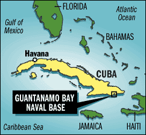
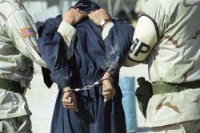
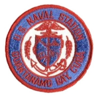

Title: Í stríði gegn öfgum?
Slug: i-stridi-gegn-ofgum
Date: 2006-10-12 15:12:00
UID: 101
Lang: is
Author: Ólöf Embla Eyjólfsdóttir
Author URL: 
Category: Í umræðunni
Tags: 

Allir þeir sem að einhverju leyti fylgjast með fréttum vita að í Guantánamo-flóa á Kúbu rekur bandaríski herinn fangabúðir sem hýsa meinta hryðjuverkamenn og „óvinveitta bardagamenn.“ Síðarnefnda hugtakið var fundið upp af lævísum haukum Pentagonsins í þeim tilgangi að sniðganga Genfarsáttmálann og aðra mannúðarsáttmála sem kveða á um meðferða stríðsfanga. Í dag eru fangarnir í Guantánamo yfir 400 talsins, þar af hefur meirihlutinn þurft að dúsa í búrum sínum í fjögur ár og níu mánuði, eða síðan Bandaríkin og Bretland gerðu innrás í Afghanistan undir árslok 2001. Markaði innrás þessi fyrsta bardagann í hinu mótsagnakennda „stríði gegn hryðjuverkum“. Ég segi „mótsagnakennda“ vegna þess að yfirlýst markmið stríðsins eru að standa vörð um frelsi, öryggi og mannréttindi, en leitast er við að ná þeim markmiðum með því að svipta aðra frelsi, grafa undan öryggi þeirra og brjóta á mannréttindum þeirra. 

Leyniþjónusta Bandaríkjanna (CIA) hefur sjálf viðurkennt að „stríðið gegn hryðjuverkum“ hafi aukið til muna hættuna á hryðjuverkastarfsemi. Þetta ætti engum að koma á óvart, enda hefur stríðið fyrst og fremst (ef ekki alfarið) beinst gegn skýrt afmörkuðum hópi: öfgasinnuðum múslimum. Þó hefur það bitnað á flestöllum venjulegum múslimum með einhverju móti. En í hverju, nákvæmlega, felast öfgarnar sem um ræðir? Hvað er venjulegur múslimi og hvað er öfgasinnaður múslimi? Sumir standa jafnvel í þeirri trú að allir múslimar séu öfgakenndir, þ.e. að Íslam hljóti að vera öfgatrú, fyrst „venjulegir“ múslimar ganga í síauknum mæli til liðs við „hryðjuverkamenn“. 

Að einhverju leyti stafar þetta viðhorf af þeirri einföldu ástæðu að við Vesturlandabúar eigum auðvelt (eða a.m.k. teljum okkur eiga auðvelt) með að greina hverjir af nágrönnum okkar séu múslimar. Trúnni fylgja siðir sem eru ólíkir okkar eigin og við tengjum Íslam jafnframt við fólk frá ákveðnum heimshluta, Mið-Austurlöndum (þrátt fyrir að mun fleiri múslima sé í raun að finna bæði í Afríku og Austurlöndum-fjær). Þessa staðreynd—að múslimar séu áberandi í okkar augum—notum við svo til að réttlæta þá ályktun að trú múslima einkennist af öfgum. Við gerum okkur sjaldnast grein fyrir því að við værum engu síður áberandi ef við værum stödd í arabaríki (eða þess vegna í Afríkulandi eða í Asíu—þ.e. hvar sem meirihluti fólks er ekki hvítur og/eða kristinn). Ekki væri það aðeins húðliturinn sem skæri sig úr, heldur klæðaburðurinn, framkoman og margt fleira.

Í „stríðinu gegn hryðjuverkum“ er „óvinurinn“ skilgreindur sem öfgasinnaðir múslimar, en vegna takmarkaðs skilnings á menningu sem er okkur framandi eigum við oft bágt með að skilja á milli þess sem er öðruvísi og þess sem er öfgakennt. Af þessu leiðir að margir verða tortryggnir í garð allra múslima—því trúaðri sem þeir eru, því hættulegri virðast þeir. Skyldi nokkurn furða að sanntrúuðu fólki kunni að sárna og gremjast slík afstaða? Þannig verða allir múslimar fyrir barðinu á „stríðinu gegn hryðjuverkum“. Líkt og botnvörpuveiðar eyðileggja hafsbotninn og vistkerfi hans til þess að næla í brotabrot af því sem fyrir vörpunni verður, þá skaðar herferð Bandaríkjanna gegn öfgasinnuðum múslimum allt það umhverfi sem hún nær til. Í sinni grófustu mynd eru hópar manna handteknir í „von og óvon“ um að þar leynist hryðjuverkamenn. Hefur það reynst mörgum dýrkeypt að vera á vitlausum stað á vitlausum tíma, sekir um það eitt að vera af röngum kynþætti. Þetta er það sem kom fyrir Tipton þremenningana. 

Rhuhel, Asif og Shafiq, þrír Bretar af pakistönskum ættum, voru staddir í Pakistan vegna væntanlegs brúðkaups Asifs. Þar sem þeir höfðu nægan lausan tíma fyrir brúðkaupið ákváðu þeir að bregða sér yfir landamærin til Afghanistan. Örfáum dögum síðar hófst innrásin og Rhuhel, Asif og Shafiq neyddust til að leggja á flótta undan sprengjuregni Bandaríkjamanna. Fengu þeir far með pallbíl fullum af mönnum sem einnig voru á flótta. Pallbíllinn var stöðvaður og allir sem á honum voru færðir í varðhald. Þar hófst [leiðin til Guantánamo](http://www.roadtoguantanamomovie.com/). Í Guantánamo máttu þeir dúsa í rúmlega tvö ár án ákæru og þola pyntingar og ómannúðlega meðferð. Þeir hafa nú gengið í lið með Amnesty International og öðrum þeim sem vinna að því að fangabúðunum í Guantánamo verði lokað. 

Á meðan Bandaríkjamenn halda áfram að brjóta á mannréttindum fólks í stríði sínu gegn hryðjuverkum, mun saklausum fórnarlömbum á borð við Tipton þremenningana aðeins fjölga, og tala þeirra sem sjá „stríðið“ sem herför gegn Íslam mun margfaldast. Það er undir okkur komið að gera það sem við getum til að stemma stigu við fordómum og ótta og þrýsta á Bandaríkjastjórn að lúta alþjóðlegum mannúðar og mannréttindasáttmálum í einu og öllu. Fyrsta skrefið er að ráðast að tákngervingi óréttlætis og illrar meðferðar í „stríðinu gegn hryðjuverkum“ með því að krefjast þess að [fangabúðunum í Guantánamo-flóa verði lokað](http://web.amnesty.org/pages/usa-100106-action-eng).

