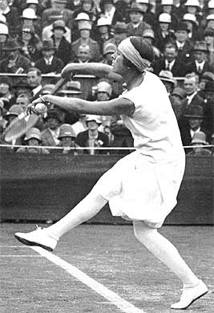

Title: Í tilefni af 4:0 sigri íslenska kvennalandsliðsins í knattspyrnu á Serbíu og 1:0 tapi íslenska karlalandsliðsins gegn Wales
Slug: i-tilefni-af-4-0-sigri
Date: 2008-05-29 10:07:45
UID: 311
Lang: is
Author: Hafdís Hafsteinsdóttir
Author URL: 
Category: Íþróttir, Kynjafræði, Sagnfræði
Tags: Íþróttir, knattspyrna, frjálsar íþróttir, skíði, Fram, KSÍ, Valur, Víkingur, femínismi, íþróttasaga, sund, Árbækur íþróttamanna, Friðrik Friðriksson, Arobe Clausen, Sigurður Sigurðsson, handbolti, Sigríður Jónsdóttir

Eitt af helstu baráttumálum femínista hefur löngum verið skortur á sýnileika kvenna. Á sjónvarpsskjánum, bæði sem viðmælendur og stjórnendur, í pólitík, í fjölmiðlum, í söguritun og svo mætti lengi telja. Fyrir ekki svo löngu fóru spjótin að berast að íþróttahreyfingunni og umfjöllun um íþróttir, enda leiddu kannanir í ljós að kynjahlutfall í birtu efni var í engu samræmi við iðkendafjölda né árangur.[^1]

### „Bara leikur“

Það eru algeng hversdagssannindi að íþróttir séu bara leikur og áhugamál sem séu ónæm fyrir utanaðkomandi áhrifum í samfélaginu. Þetta viðhorf endurspeglast hvað best ef litið er á skrif um íþróttir. Megnið af því efni sem birtist um íþróttir og íþróttasögu mætti flokka sem lýsandi sagnfræði.[^2] Upptalningar á ártölum, atburðum og persónum, t.d. árið sem skíðaskálinn var reistur, árið sem hann brann og árið sem hann var svo endurreistur og þar fram eftir götunum.

Slíkt viðhorf er firra, enda er fráleitt að halda að einhver einn þáttur mannlegs samfélags sé þannig úr garði gerður að hann standi fyrir utan það og lúti öðrum lögmálum. Íþróttir geta verið hápólitískar, þær geta verið áróður og afhjúpað mismunun svo dæmi séu nefnd. Frægustu tilvikin má finna á Ólympíuleikunum, stærstu íþróttahátíð sem haldin er í heimi. Hitler notaði leikana í Berlín 1936 sem áróðurtæki fyrir nasismann. Bandarískir blökkumenn notuðu fjölmiðlaathyglina til að vekja athygli á mismunun í þeirra garð 1968 og Kóreumenn stóðu saman og marséruðu inn á leikvanginn sem sameinuð Kórea árið 2000. Í raun má segja að íþróttir geti verið ákveðinn samfélagsspegill á hverjum tíma fyrir sig.

Eins og kom fram hér að ofan var hlut kvenna í íþróttum ekki gert hátt undir höfði þegar rannsóknin sem vitnað var til var framkvæmd. Þegar litið er yfir sögu íþróttaiðkunar kvenna verður slíkt viðhorf ennþá meira áberandi.

Sýnileiki kvenna í söguritun er eilíft bitbein femínískra sagnfræðinga. Þá er sérstaklega verið að glíma við spurningar eins og af hverju eru konur ekki með í hinni hefðbundnu sögu og hvernig/hvort eigi að skrifa þær inn í hana.[^3] Ég fullyrti áðan að íþróttasagan sé mest megins lýsandi sagnfræði sem byggir á empirískum aðferðum. Því gæti einhver sagt sem svo þar væri á ferðinni rit sem segðu söguna eins og hún var. Teldi upp mót, greindi frá úrslitum o.s.frv. og gæti þar af leiðandi formsins vegna ekki gert öðru kyninu hærra undir höfði en hinu.

Það er þó fjarri lagi, því jafnvel frumheimildirnar geta falið í sér hin ýmsu misvísandi skilaboð. Gott dæmi um slíkt eru _Árbækur íþróttamanna_ sem voru einskonar árskýrslur um íþróttir á Íslandi. Þær komu út á árunum 1945-1955. Þar er greint ítarlega frá úrslitum móta, birt metaskrá auk örlítils pistils um hverja íþróttagrein fyrir sig. Fyrsta bókin kom að vísu út 1944 en hún var eingöngu um frjálsíþróttir, en þó svo að aðrar íþróttagreinar hafi bæst við eru frjálsar íþróttir þó alltaf uppistaðan í þeim. Samkvæmt þessum heimildum hafa konur lítið hafst við frjálsíþróttaiðkun. Upp úr 1945 fara þær að taka þátt í einstöku spretthlaupum. Árið 1946 er í fyrsta skipti keppt í spretthlaupi kvenna á landsmóti[^4] og á landsmótinu 1952 er keppt í flestum greinum frjálsra íþrótta í kvennaflokki.[^5] Eftir sem áður er birt metaskrá í _Árbókunum_ og þar kemur fram Íslandsmet langstökki kvenna frá 1926. Samt er hvergi getið um keppni í langstökki í árbókunum, hvorki fyrr né síðar. Höfundur bókanna, sem einnig tekur saman litla pistla um frjálsar nefnir hvergi þetta met í pistlum sínum. Né heldur telur hann að það sé kominn tími til að bæta það, nokkuð sem hann brýndi oftsinnis í greinarskrifum sínum.

### Minni karla, kvenna og bolta

Dæmið af ofan sýnir að frumheimildir eiga það til að ýta konum út á kantinn. Slíkt vindur upp á sig þegar kemur að ritun stórra safnrita eins og afmælisrita íþróttafélaga og sérsambanda. Í safnritum sem þessum er oftar en ekki reynt að glæða söguna lífi með myndum, liprum texta og skondnum staðreyndum sem settar eru í textabox og skotið inn í meginmál bókarinnar.

Knattspyrnusamband Íslands gaf út eitt slíkt í tilefni af 100 ára afmæli knattspyrnunnar árið 1994. Þar er reynt að endurskapa andrúmsloft liðinna ára í máli og myndum. Það er gert með sögum úr hversdagslífinu, lifandi lýsingum á staðarháttum, atburðum og persónum. Einkennum fyrstu Reykjavíkurliðanna er lýst nákvæmlega í tilraun til að draga fram einhverslags persónueinkenni þeirra. T.d var presturinn Síra Friðrik Friðriksson Völsurum innan handar við félagsstofnunina en Víkingur var stofnað af nokkrum götustrákum í kringum peningasamskot um fótboltakaup. Einnig er einstökum leikjum lýst nákvæmlega og jafnvel birtar fréttatilkynningar erlendis frá þegar um landsleiki er að ræða til að víkka sjónarhornið. Dregnar eru upp myndir af leikmönnum; útliti þeirra, leikstíl og hátterni innan vallar sem utan. Allt miðar þetta að því að gera frásögnina sem skemmtilegasta fyrir lesandann sem getur hæglega lifað sig inn í tíðarandann þegar strákunum á Njálsgötunni var smalað saman á völlinn eða séð fyrir sér hin ægilegu þrumuskot Arobe Clausen.[^6]

Þegar fjallað er um endurreisn knattspyrnuiðkunar kvenna er tóninn annar.[^7] Ekki er gerð nein tilraun til að skapa upprunasögur eða stemningu í kringum leikinn. Tekið er fram að fyrstu iðkendurnir hafi komið úr handboltanum, en annars er fátt um fína drætti. Úrslit eru talin upp, markahæstu leikmanna getið, en það er lítið í frásögninni gerir hana lifandi í hugum lesenda. Lýsingar á leikjum og leikmönnum eru fáar og hráar. Orðaforði höfundar skreppur skyndilega saman, því fæst lýsingarorðanna sem notuð eru ná dýpra en „góður“. Dramatíkin sem umlykur umfjöllunina um karlana er víðsfjarri, engin þrumuskot, engar hetjur og engir skúrkar. Myndefnið er í takt við frásagnarmátann. Uppstilltar myndir af sigurliðum hvers árs. Aðeins ein mynd í öllu ritinu sýnir konur _leika_ knattspyrnu.[^8]

Því virðist sem svo að konur eigi það til að gleymast í íþróttasögunni, jafnvel þó að um sé að ræða opinbert rit sérsambands. Þegar kemur að endurminningum manna úr bransanum verður fjarvera kvenna jafnvel ennþá meira sláandi. Einn af fyrstu íþróttafréttariturum Íslands, Sigurður Sigurðsson, einnig þekktur sem „æsti maðurinn“, gaf út endurminningaritið _Komiði sæl_ árið 1983. Sigurður var íþróttafréttaritari Ríkisútvarpsins frá 1943 og fram á áttunda áratuginn. Í bókinni segir hann frá árum sínum sem íþróttafréttamaður og rifjar upp atvik í íþróttahreyfingunni hér heima og erlendis. Skemmst er frá því að segja að í bók Sigurðar er kemur ekki ein einasta íþróttakona við sögu, nema að tekið er fram að á skíðalandsmóti einu á sjötta áratugnum hafi landsþekkt skíðahetja skriðið upp í koju til einnar af skíðadrottningunum.[^9] Svo mörg voru þau orð. Sigurður var samt sem áður íþróttafréttaritari íslensku ólympíufaranna í London 1948, en þar kepptu þrjár sundkonur fyrir Íslands hönd, fyrstar allra íslenskra kvenna. Einnig varð kvennalandsliðið í handbolta Norðurlandameistari á tímabili Sigurðar sem fréttaritara.

Ofantalin dæmi eru vissulega sérvalin, en sýna samt hvernig hægt er að taka einn hóp fram yfir annan þegar gera á einhverju tilteknu fyrirbæri, í þessu tilviki íþróttum, skil. Í ritinu _Writing Woman’s History_ er tekið fram í formála að hefðbundnar heimildir þjóni ekki endilega kynjafræðilegu sjónarmiði og því verði að fara aðrar leiðir að efninu en gert er í „venjulegri“ sagnaritun þó svo að útkoman eigi að vera sú sama.[^10]

Íþróttasöguritun hefur vissulega líka tekið þennan pól í hæðina. Höfundur 80 ára afmælisrits Frammara nálgaðist efni sitt á annan hátt en kollegar hans höfðu áður gert. Allt frá því að handbolti náði fótfestu á Íslandi á þriðja áratugnum hefur hann verið leikinn jafnt af konum og körlum.[^11] Frammarar hafa löngum verið sigursælir í kvennahandboltanum og því hefur varla komið annað til greina en að gera honum skil í afmælisritinu. Höfundur bókarinnar var svo sem ekki að finna upp hjólið þegar hann ákvað að byggja frásöguna á munnlegum heimildum en himinn og haf skilur á milli frásagnar Frammara og KSÍ af kvennabolta.

Í sögu Frammara fer lesandinn skyndilega aftur til fortíðar og fær að upplifa damatíkina og tíðarandann kvennaboltanum í gegnum söguna. Við heyrum af hverfa ríg milli Framstúlkna og Ármenninga á fimmta áratugnum, kynnumst einstaklega skotfastri skyttu og fylgjumst með leik á Íslandsmótinu 1953 þegar Sigríður Jónsdóttir fótbrotnaði en kláraði samt leikinn.[^12]

Nú þegar Íþróttamaður ársins 2007 var knattspyrnukona væri hægt að segja að það hrikti í stoðum karlaveldisins í íþróttum á Íslandi. Því er ekki úr vegi að líta um öxl og athuga hvort ekki væri hægt að sjá íþróttasöguna í víðara samhengi en hefur tíðkast. Það er allavega nokkuð ljóst að það er ekki nóg að skora mörkin, heldur verður líka að sjá til þess að þau gleymist ekki.

[^1]: Viðar Halldórsson: _Íþróttaefni í dagblöðum: Könnun gerð um fyrir nefnd um stefnumótun í íþróttum stúlkna_. Reykjavík 1997.
[^2]: Hargreaves, Jennifer: _Sporting Females: Critical issues in the history and sociology of women’s sport_. London 1994, bls. 16.
[^3]: Perrot, Michelle: _Writing Woman’s History_. Cambridge 1992, bls 4-5.
[^4]: Viðar Hreinsson: _Saga landsmóta UMFÍ_. Reykjavík 1992, bls 105.
[^5]: Viðar Hreinsson: _Saga landsmóta UMFÍ_, bls 105.
[^6]: Sjá fystu kaflana í _Knattspyrna í heila öld_ eftir Víði Sigurðsson, Reykjavík, 1997.
[^7]:  Fyrstu dæmin um kvennaknattspyrnu eru frá 1915-1918 en þá voru stofnuð félög stúlkna sem æfðu knattspyrnu á Ísafirði og í Reykjavík. Ekkert varð þó úr keppni og félögin lögðust fljótlega af.
[^8]: Sjá þriðja hluta bókarinnar _Knattspyrna í heila öld_ eftir Víði Sigurðsson. Myndin er á síðu 278.
[^9]: Vilhelm G. Kristinsson: _Komiði sæl. Vilhelm G.Kristinsson ræðir við Sigurð Sigurðsson útvapsmann um lífshlaup hans og ævintýri_. Reykjavík 1983, bls 146.
[^10]: Perrot, Michelle: _Writing Woman’s History_. Cambridge 1992, bls 6.
[^11]: Monika Magnúsdóttir: _Ártöl og áfangar í sögu íslenskra kvenna_. Reykjavík 1998, bls 90.
[^12]: Víðir Sigurðsson: _Fram í 80 ár_. Reykjavík 1989, bls 160-176.
