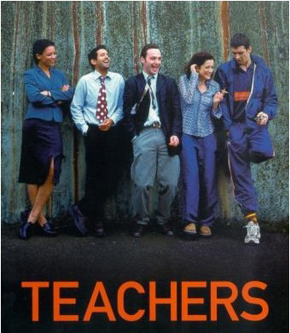
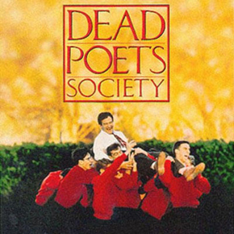

Title: Ímynd kennara hér og þar (og örlítið um raunveruleikann)
Slug: imynd-kennara-her-og-thar-og-oerlitid-um-raunveruleikann
Date: 2007-09-25 14:13:00
UID: 181
Lang: is
Author: Karl Jóhann Garðarsson
Author URL: 
Category: Kennslufræði
Tags: kennari, skóli, Teachers, ímynd, Félag grunnskólakennara, Dead Poets Society, Mona Lisa Smile, Dangerous Minds, To Sir With Love, Sommerdown Comprehensive, Bristol, Hollywood, nemendi, Kvikmyndir, sjónvarp

Öll höfum við mikla og langa reynslu af kennslu og kennurum, enda óalgengt að fullorðið fólk hafi minna en 10 ára skólagöngu að baki. Það kemur því ekki á óvart að sterkar skoðanir séu á starfi kennara og oft eru þær fullmótaðar, þrátt fyrir að reynsla af kennslu sé bara frá skólabekknum. Við vitum hvað okkur finnst einkenna góða og slæma kennara, hvað eigi að kenna og hvernig, hvert gildi starfs þeirra sé og þar fram eftir götunum.

Kennarar eru dáðir. Þeir koma nemendum sínum til manns, kynna þeim heiminn, breyta sýn þeirra á veruleikann. Kennarar eru fyrsta flokks hetjur. Margir geta enda nefnt  uppáhalds kennarann sinn og eftirminnileg atvik úr skólastofunni áratugum eftir að skólagöngu lýkur. Ætli kennarar stundi ekki mikilvægasta starf samfélagsins? Geta ekki allir verið sammála þessu?

Pistlahöfundur er kennari og getur ekki sagst sammála staðhæfingum hér að fram. Líklega fá líka fleiri hálfgerðan kjánahroll við slíka upphafna lýsingu á flauelsklæddu strompunum sem lifa í minningunni. En hver er ímynd kennara? Síðasta vetur gerðu grunnskólakennarar sér grein fyrir að fleira mótar skoðanir almennings á kennurum heldur en reynsla af skólabekkjum og frásagnir barnanna. Gerði því Félag grunnskólakennara árás á almenningsálitið með auglýsingaherferð. Þar kom þjóðþekkt fólk fram og fór með hástemmda lofrullu um fyrrum kennara sína. Mikið var gert úr því hvernig kennarar breyttu lífssýn viðkomandi til frambúðar. Dýrðarljóma kennarastarfsins sem þar birtist má líka sjá í ýmsum kvikmyndum. Kennarabíó er fín afþreying sem skiptist aðallega í tvennt: annars vegar söguþráður þar sem nýr kennari umbyltir stöðnuðu lífi forréttindapúka (_Dead Poets Society_ og _Mona Lisa Smile_ sem dæmi) og hins vegar þegar nýjum kennara tekst að fá harðnaða vandræðaseggi til að læra eitthvað (_Dangerous Minds_ og _To Sir, With Love_ sem dæmi).

_Teachers_ er breskt gamandrama sem sýnt var á Channel 4 á árunum 2001-2004 og var ein sería endugerð fyrir bandarískan markað. Þættirnir fjalla um unga unglingakennara í Sommerdown Comprehensive í Bristol sem flestir hafa meiri áhuga á sjálfum sér og hinu kyninu heldur en nemendum og kennslu. Hér er með öðrum orðum á ferðinni allt önnur sýn á kennara en birtist í auglýsingum íslenskra kennara og hugarheimi Hollywood og því rétt að gefa þáttunum gaum.

Kennarnir fara í fyrsta lagi alltaf á barinn og þar er talað illa um samkennara og nemendur, þeir brjótast inn í skólann sinn að næturlagi og koma þar fyrir kind, reykja úti með krökkunum á reyklausu lóðinni, gefa nemendum hræðileg kynlífs-og sambandsráð og gera í raun lítið sem greinir þá frá nemendum. Kennarnir reyna að sjá sig sem eitthvað annað en yfirvald — að þeir og nemendur standi saman gegn valdinu en ekki að kennarnir séu valdið sjálft fyrir nemendum.

Aðalpersónur leggja enga áherslu á að þjálfa nemendur fyrir samræmd próf, fara seint og illa yfir verkefni og próf, er illa við yfirmenn sína og mynda klíkur sín á milli. Þrátt fyrir allt eru þó hér á ferð góðar kennarar — ýtt er undir sjálfstæða og gagnrýna hugsun, ekki er talað niður til nemenda heldur komið fram við þá af virðingu.

Höfundar þáttanna virðast vera mjög meðvitaðir um að þeir séu að skrifa gegn hefðinni um hinn fullkomna kennara og að varpa fram nýrri ímynd kennara. Kennarnir í Summerdown lenda þannig í að mæla raunveruleika sinn við ímynd samfélagsins og skemmtanaiðnaðarins af kennurum. Í sjálfsháðs þætti reynir líffræðikennarinn Lindsay að verða betri kennari með hjálp kvikmynda um fullkomna kennara.

Eftir viðvörun um ósæmilega hegðun utan skóla tekur Lindsay sig á, hættir að drekka og fær ráð til að bæta sig frá Bob, fagstjóra ensku. Hann lætur hana fá þrjár uppáhaldsmyndirnar sínar (_Dangerous Minds, To Sir With Love og Dead Poets Society_) ásamt stuttum lista með ráðum og reglum. Áður en Lindsay fékk viðvörunina sagði hún um þessar myndir: „A bunch of sentimental nonsense which totally ignores the fact that kids hate teachers and teachers hate kids.“ Þessu viðhorfi voru hinir ungu kennarnir sammála. Þeim bregður því skiljanlega þegar Lindsay mætir skælbrosandi og hress í skólann eftir að hafa horft á myndirnar. Hún lýsir því ennfremur yfir að „its about waking up in the morning and thinking I can’t wait to get in the classroom. It’s about finding potential and just letting it fly.“ Hin hafa ekki hugmynd um hvað hún er að tala og verða pirruð á hinni nýju Lindsay. Hún færir kennslustundir út í garð, lætur nemendur standa á borðum, stofnar líffræðiklúbb sem frelsar froskana úr líffræðistofunni og leikur tré sem blæs í vindinum með nemendum. Bob fyllist við þetta lífi og eldmóði og reynir að vera nemendum sínum innblástur með því að lesa frumsamin ljóð og láta nemendur flytja sín ljóð. Í stuttu máli verða Lindsay og Bob allt í einu að útópískum fyrirmyndarkennurum, eins og klippt beint úr bíómynd þar sem óhefðbundnum aðferðum er beitt til að veita nemendum innblástur og von. Lindsay tekur meira að segja að sér verstu nemendur samkennara sinna til að veita þeim betri menntun og nær góðu sambandi við þau. Lindsay fer að lokum með allan hópinn út að dansa en rekst á skólastjórann sem er ekki lengi að koma sér að efninu: „stop fucking around and get these students to their proper classes, now!“ Á meðan er Bob kýldur af föður nemenda fyrir að leggja hann í einelti, þó að „eineltið“ hafi einungis verið innblásnar aðferðir Bobs. Glansinn er fljótur að fara eftir að Lindsay og Bob gera sér grein fyrir að þau hafa hvorki stuðning stjórnenda né foreldra.

Þessi skondni þáttur sýnir áhorfendum hversu ólíklegt er að uppblásnar ímyndir kennara í kvikmyndum nái yfir í veruleikann. Til þess er hið raunverulega skólakerfi og foreldrar ekki tilbúnir — þó að nemendur séu á stundum móttækilegir fyrir nýjum áherslum og aðferðum. Ytra umhverfi menntunar er íhaldsamt og því líklegast að kennarar samsami sig þeim aðstæðum. Þegar Bob kemst í ofanálag að svindli nemenda (popptextum skilað sem frumsömdum ljóðum) dettur allt í sama gamla farið. „If you’re waiting to be carried shoulder high by greatful students, you’ll wait a fucking lifetime! It doesn’t happen, never has. Fuck’em!“ spýtir Bob út úr sér og vísar til frægs atriðis í _Dead Poets Society_. Viðhorf Bobs segir okkur að hætta að láta okkur dreyma um útópíska nemendur og kennara og horfast í staðinn í augu við raunveruleikann.

Veruleikinn er ekki jafn ýktur og látið er með í _Teachers_, andstæðurnar ekki jafn miklar eða mótlætið jafn afgerandi og afmarkað, en vakinn er athygli á mikilvægu atriði fyrir umræðu um menntun og kennara: háleitar hugsjónir mæta raunveruleikanum á endanum og hvað á þá til bragðs að taka? Margþáttuð ímynd kennara er flóknari en svo að henni verði gerð full skil hér.

Engum er þó greiði gerður með einföldunum og klisjum — nauðsynlegt hlýtur að vera að skoða raunveruleikann og bregðast við honum. Samningar framhaldsskólakennara losna á vormánuðum, er það ekki kjörið tækifæri til þess að líta raunhæft á kennarastarfið, líta fram hjá staðalímyndunum og á raunveruleikann?

---

#### Heimildir

* Apprahamian, Sallie: _Teachers_ [sería 1, þættir 7-8], 2001.
* Cruickshank, Donald R. & Donald Haefele: „Good Teachers, Plural“ í _Educational Leadership_, febrúar 2001, bls. 26-30.
* Dale, Richard: _Teachers_ [sería 1, þættir 1-3], 2001.
* Lovering, Jeremy: _Teachers_ [sería 1, þættir 4-6], 2001.
* Moradi, Reza: _Teachers_ [sería 2, þættir 9-10], 2002.
* White, Susanna: _Teachers_ [sería 3, þættir 10-11], 2001.
