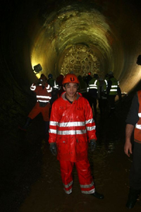
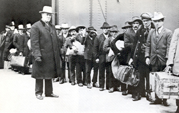

Title: Innflytjendur til bjargar
Slug: innflytjendur-til-bjargar
Date: 2007-02-01 11:00:00
UID: 129
Lang: is
Author: Jóhanna Helgadóttir
Author URL: 
Category: Félagsfræði, Í umræðunni
Tags: 

Á 10. áratugnum urðu ákveðin umskipti á Íslandi sem Evrópubúar höfðu upplifað um það bil 30 árum áður. Hagvöxtur jókst og sá tími kom að sum störf, helst þau lægst launuðu í fiskvinnslu, var ekki lengur hægt að manna Íslendingum. Farið var að „flytja inn“ fólk, aðallega frá Póllandi, til að vinna tímabundið á Íslandi. Síðan hefur þörfin fyrir erlent vinnuafl ekki minnkað og hefur dreifst á fleiri greinar atvinnulífsins svo sem byggingarvinnu, aðhlynningu á sjúkrastofnunum og ræstingar að ógleymdum störfum við virkjana- og stóriðjuframkvæmdir nú á allra síðustu árum.

Vinnuaflið reyndist vera fólk eins og við hin og sumir hafa vel getað hugsað sér að setjast að í landinu til langframa, meðal annars vegna betri skilyrða til að framfleyta sér og fjölskyldu sinni. Það er ein helsta ástæða fólksflutninga í heiminum. Frá 1956 hefur einnig verið tekið á móti um 450 flóttamönnum,[^1] en hluti þeirra hefur snúið aftur til heimalands síns. Ísland er því ekki lengur jafn einsleitt eins og það var í árhundruð, enda var það kannski ekki spennandi hlutskipti.

Atvinnuleysi hefur ekki verið mikið síðustu 10 árin og hefur samanlagt ekki farið yfir 4% samkvæmt tölum Hagstofunnar. Í samanburði við lönd Evrópusambandsins er það nokkuð gott því á sama tíma hefur atvinnuleysi þar verið að meðaltali á bilinu 8-10%, en mismunurinn er þó stundum mjög mikil milli landa, t.d. ef miðað er við árið 2005 allt frá 4,4 % á Írlandi til 17,7% í Póllandi.[^2] Lítið atvinnuleysi á Íslandi og mikið framboð á atvinnu þýðir stöðuga þörf á erlendu vinnuafli því mannfjöldin á Íslandi stendur ekki undir eftirspurninni. Það vantar fólk.

Til að viðhalda mannfjölda þarf hver kona að eignast 2,1 barn. Tilgangur þess að halda mannfjöldanum við er meðal annars að koma nógu mörgu duglegu og vinnusömu fólki á legg sem getur haldið uppi velferðar- og menntakerfi. Það þarf ekki bara peninga til þess að halda velferðarkerfinu uppi heldur þarf einnig fólk til vinnu innan þess, við aðhlynningu ýmiskonar í heilbrigðiskerfinu og félagslega kerfinu. Og það vantar ekki endilega bara fólk í lægst launuðustu störfin. 

Hér á landi hefur „frjósemishlutfall“ hverrar konu verið um 1,9 sem er þó mun hærra en hlutfallið í Evrópusambandsríkjunum sem er um 1,5.[^3] En þótt við stöndum okkur betur í að fjölga mannkyninu en flestar aðrar Evrópuþjóðir er það samt ekki nóg til að viðhalda mannfjöldanum og afleiðingarnar eru þær að unga fólkinu fækkar hlutfallslega en eldra fólkinu fjölgar.

<table cite="Heimild: Hagstofa Íslands, www.hagstofa.is">
<caption>Mannfjöldi árið 2005 og mann&shy;fjölda&shy;spá 2020 og 2045 skv. tölum Hag&shy;stofunar</caption>
<thead><tr>
<th></th>
<th>2005</th>
<th>2020</th>
<th>2045</th>
</tr></thead>
<tbody>
<tr>
<td>25-64 ára</td>
<td class="num">155.616</td>
<td class="num">167.870</td>
<td class="num">170.407</td>
</tr>
<tr>
<td>65 ára og eldri</td>
<td class="num">35.039</td>
<td class="num">48.395</td>
<td class="num">75.154</td>
</tr>
</tbody>
</table>

Eins og sést á þessari töflu er því spáð að aukning mannfjöldans verði nokkuð jöfn til að byrja með en eftir 2020 og fram til 2045 verður mikil breyting þar á, ef spá Hagstofunnar gengur eftir. Á meðan vinnandi fólki fjölgar lítillega á 25 árum, eða um 3500, fjölgar eldri borgurum um rúm 26 þúsund. Með öðrum orðum, eftirlaunaþegum á eftir að fjölga mikið en þeim fjölgar mun minna sem eru vinnandi og halda uppi kerfinu, bæði með skattgreiðslum sínum og vinnuframlagi úti í atvinnulífinu og innan opinbera geirans, t.d. í heilbrigðis- og félagslega kerfinu.

Það skýtur því skökku við að verkalýðshreyfingin vilji stytta vinnutíma,[^4] í átt að því sem tíðkast á hinum Norðurlöndunum. Það verður vart gerlegt. Í raun þyrfti fólk að vinna ennþá fleiri vinnustundir til að halda uppi sömu lífsgæðum, því það hlýtur að vera markmið að viðhalda, og helst styrkja menntakerfið og velferðarkerfið, sérstaklega á sviði öldrunarþjónustu og félagslegrar þjónustu.

Lausnin er einföld: það þarf að fjölga íbúum. Til þess eru tvær leiðir, að konur eignist fleiri börn og að stjórnvöld leyfi innflytjendum að koma hér til vinnu og setjast hér að ef það óskar þess. Í sjálfu sér eru núgildandi útlendingalög ekki mikil hindrun hvað það varðar. Reyndar er „24 ára reglan“ ákaflega skrýtin í íslensku samhengi en hún segir að dvalarleyfi sé aðeins hægt að veita maka Íslendings eða útlendings sem dvelur löglega í landinu ef makinn er orðin 24 ára.[^5] Hægt er að finna samsvarandi reglur á hinum Norðurlöndunum þar sem með reglunni var meðal annars verið að reyna að sporna gegn nauðungargiftingum mjög ungra stúlkna frá Mið-Austurlöndum. Íslenskur veruleiki er bara allt annar, er á meðan er. Þess í stað virkar „24 ára reglan“ sem hindrun fyrir unga og drífandi innflytjendur að leggja sitt af mörkum á Íslandi. 

Önnur algeng vandamál Evrópuþjóða tengd innflytjendum er varla hægt að merkja á Íslandi. Ólöglegir innflytjendur eru stórt vandamál í löndum Suður-Evrópu og sömuleiðis fjöldi hælisleitenda í Evrópulöndum. Það er þó síður en svo vandamál hér á landi. Meðan Útlendingastofnun fékk 63 hælisumsóknir árið 2004[^6] fékk danska útlendingastofnunin 3235 umsóknir til úrvinnslu.[^7] Ólöglegir innflytjendur þekkjast vart á Íslandi sem skýrist að mestu af landfræðilegri legu landsins. Þvert á móti hefur hingað til komið fólk sem fer í gegnum það lögformlega ferli sem fylgir því að flytja til landsins, vinnur fyrir sér og skilar sínu til samfélagsins. Í skýrslu Félagsmálaráðuneytisins um aðlögun innflytjenda frá 2005 segir ennfremur að atvinnuþátttaka innflytjenda á Íslandi sé um 93% sem er um 40% hærra en á hinum Norðurlöndunum og er auk þess hlutfallslega hærri en atvinnuþátttaka Íslendinga sjálfra.[^8] Þannig leggja þeir ekki aðeins sitt af mörkum til fjölbreytilegra mannlífs heldur einnig mikið til samtryggingarinnar sem velferðarkerfið byggir á. Hræðsla við að útlendingar verði dragbítur á þjóðfélaginu ætti því að vera óþörf.

Samkvæmt tölum frá Flóttamannastofnun Sameinuðu þjóðanna er talið að um 20,8 milljónir manna séu nú á flótta víðs vegar í heiminum[^9] og ógrynni fólks, sem erfitt er að festa tölu á, flyst stað úr stað í von um að bæta líf sitt og flýja fátækt. Það er fullt af fólki sem á erfitt með að uppfylla grunnþarfir sem við teljum sjálfsagðar, eins og að nærast, sjá fyrir sér og fjölskyldu sinni og öðlast menntun. Það er fullt af fólki sem þráir öruggan og góðan stað til að búa á. Og það vantar fólk á Íslandi. Íslendingar leysa ekki flóttamanna- og fólksflutningsvandamál heimsins, en það væri kannski ekki úr vegi að reyna að leggja aðeins meira af mörkum. Móttaka flóttamanna hingað til hefur að mörgu leiti gengið vel þar sem flóttamennirnir hafa fengið stuðning við að aðlagast íslensku samfélagi. Það mætti því kannski stækka hópana svolítið og fjölga þeim.

Takmarkanir Íslendinga til að standa undir velferðarkerfinu í framtíðinni sýnir fram á að það þarf að hugsa innflytjendamál í samhengi við marga þætti til lengri tíma litið en ekki aðeins þegar þarf að „henda upp einni virkjun“. Það er öllum í hag að taka vel á móti innflytjendum og veita þeim aðstoð sem þurfa, líka þeim sem í upphafi koma aðeins til landsins til að vinna tímabundið, því þeir gætu verið framtíðarþegnar landsins. Svo þarf að tala um innflytjendamál en ekki þegja þau í hel. Það á að ræða málin af virðingu fyrir fólki en ekki missa sig í rökræðu sem einkennist af pólitískum rétttrúnaði eða útlendingaandúð sem skilar engu því innflytjendamál fjalla fyrst og fremst um líf fólks.

----

#### Bækur til hliðsjónar

* Jensen, Bent, _Indvandringen til Europa. Velfærdsstat og integration_. Gyldendal, [Kaupmannahöfn] 2005.

* Rasmussen, Hans Kornø, _Dem og os. Det multi-etniske Danmark_. Tiderne skifter, [Kaupmannahöfn] 2000.

* Rasmussen, Hans Kornø, _Mellem kontrol og afmagt: EU’s asyl- og indvandrerpolitik_. Dansk Institut for Internationale Studier, København 2006. 

----

#### Heimildir

* Alþýðusamband Íslands: Stefna ASÍ í jafnréttis og fjölskyldumálum, [ http://www.asi.is/displayer.asp?cat_id=396](http://www.asi.is/displayer.asp?cat_id=396).
* EUROSTAT: Population statistics [Tölur um fólksfjölda], bls. 40, [epp.eurostat.ec.europa.eu](http://epp.eurostat.ec.europa.eu/cache/ITY_OFFPUB/KS-EH-06-001/EN/KS-EH-06-001-EN.PDF) Unemployment rate [Atvinnuleysi], [epp.eurostat.ec.europa.eu](http://epp.eurostat.ec.europa.eu/portal/page?_pageid=1996,39140985&_dad=portal&_schema=PORTAL&screen=detailref&language=en&product=STRIND_EMPLOI&root=STRIND_EMPLOI/emploi/em071).
* Félagsmálaráðuneytið: Koma flóttamanna frá 1956, [ http://www.felagsmalaraduneyti.is/malaflokkar/flottafolk/mottaka/nr/1228](http://www.felagsmalaraduneyti.is/malaflokkar/flottafolk/mottaka/nr/1228).
* Skýrsla nefndar um aðlögun innflytjenda að íslensku samfélagi, [ http://www.felagsmalaraduneyti.is/media/acrobat-skjol/Skyrsla_nefndar_um_adlogun_utlendinga.pdf](http://www.felagsmalaraduneyti.is/media/acrobat-skjol/Skyrsla_nefndar_um_adlogun_utlendinga.pdf).
* Lög um útlendinga 96/2002, [http://www.althingi.is/lagas/nuna/2002096.html](http://www.althingi.is/lagas/nuna/2002096.html).
* Tal og fakta på udlændingeområdet [Tölfræði varðandi innflytjendur í Danmörku], [ http://www.nyidanmark.dk/resources.ashx/Resources/Statistik/tal_og_fakta/2005/tal_og_fakta_2005final.pdf](http://www.nyidanmark.dk/resources.ashx/Resources/Statistik/tal_og_fakta/2005/tal_og_fakta_2005final.pdf).
* UNHCR [Flóttamannastofnun sameinuðu þjóðanna], [http://www.unhcr.org](http://www.unhcr.org).
* Útlendingastofnun: Ársskýrsla 2004, [http://www.utl.is/media/arsskyrslur/UTL_arsskyrsla2004.pdf](http://www.utl.is/media/arsskyrslur/UTL_arsskyrsla2004.pdf).

[^1]: [http://www.felagsmalaraduneyti.is/malaflokkar/flottafolk/mottaka/nr/1228](http://www.felagsmalaraduneyti.is/malaflokkar/flottafolk/mottaka/nr/1228).
[^2]: EUROSTAT, <http://epp.eurostat.ec.europa.eu/portal/page?_pageid=1996,39140985&_dad=portal&_schema=PORTAL&screen=detailref&language=en&product=STRIND_EMPLOI&root=STRIND_EMPLOI/emploi/em071>
[^3]: Population statistics bls. 40, [http://epp.eurostat.ec.europa.eu/cache/ITY_OFFPUB/KS-EH-06-001/EN/KS-EH-06-001-EN.PDF](http://epp.eurostat.ec.europa.eu/cache/ITY_OFFPUB/KS-EH-06-001/EN/KS-EH-06-001-EN.PDF).
[^4]: Sjá t.d. á vef ASÍ, [ http://www.asi.is/displayer.asp?cat_id=396](http://www.asi.is/displayer.asp?cat_id=396).
[^5]: Lög um útlendinga 96/2002 2. mgr. 13. gr.
[^6]: Ársskýrsla 2004, [http://www.utl.is/media/arsskyrslur/UTL_arsskyrsla2004.pdf](http://www.utl.is/media/arsskyrslur/UTL_arsskyrsla2004.pdf) - Nýjasta útgefna ársskýrsla útlendingastofnunar er frá 2004.
[^7]: Tal og fakta på udlændingeområdet, [ http://www.nyidanmark.dk/resources.ashx/Resources/Statistik/tal_og_fakta/2005/tal_og_fakta_2005final.pdf](http://www.nyidanmark.dk/resources.ashx/Resources/Statistik/tal_og_fakta/2005/tal_og_fakta_2005final.pdf).
[^8]: Skýrsla nefndar um aðlögun innflytjenda að íslensku samfélagi, bls. 12, [ http://www.felagsmalaraduneyti.is/media/acrobat-skjol/Skyrsla_nefndar_um_adlogun_utlendinga.pdf](http://www.felagsmalaraduneyti.is/media/acrobat-skjol/Skyrsla_nefndar_um_adlogun_utlendinga.pdf).
[^9]: Vefsíða Flóttamannastofnunar Sameinuðu Þjóðanna, [ http://www.unhcr.org](http://www.unhcr.org).

