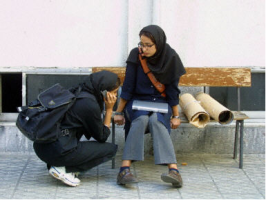

Title: Írönsk bloggmenning
Slug: iroensk-bloggmenning
Date: 2006-08-24 11:19:00
UID: 89
Lang: is
Author: Valdís Björt Guðmundsdóttir
Author URL: 
Category: Samfélag
Tags: 

Þegar ég las bókina _We Are Iran: The Persian Blogs_[^1] eftir íranska verkfræðinginn Nasrin Alavi kom mér á óvart að samkvæmt henni er persneska fjórða mest notaða tungumálið í svokölluðum bloggheimi internetsins. En eftir að hafa lokið lestri þeirrar bókar kom í ljós að það er ekkert svo skrítið í ljósi félagslegra aðstæðna í Íran nútímans. Bókin er sett upp á nokkuð skemmtilegan hátt þar sem fræðimennsku er blandað saman við bloggfærslur og pælingar almennra íranskra borgara sem höfundur hefur þýtt yfir á ensku. 

Hossein nokkur Derakhshan er ungur, íranskur blaðamaður, sem stuttu eftir að hann flutti til Kanada setti upp fyrstu persnesku bloggsíðuna. Einn af lesendum síðunnar bað hann um að hjálpa sér að setja upp eina slíka fyrir sjálfan sig. Hossein varð við beiðni lesandans og setti á netið leiðbeiningar um bloggsíðugerð á persnesku. Alavi telur að með þessu hafi Hossein ekki aðeins hjálpað þessum einstaklingi heldur veitt heilu samfélagi vettvang fyrir frjáls skoðanaskipti! Árið 2004 voru írönsk blogg um 64,000, samkvæmt bloggyfirliti NITLE, sem er mun meira en í nágrannaríki eins og Írak, sem samkvæmt sama yfirliti státar einungis af um 50 þekktum bloggurum. 

Í Íran er málfrelsi ekki til staðar og eftir byltinguna eru blöð sem á einhvern hátt gagnrýna yfirvöld ekki langlíf. Alavi bendir á að ímyndin sem klerkaveldið reynir að viðhalda út á við sé önnur en sú mynd sem við blasi þegar í landið er komið en með því að halda niðri innlendum fjölmiðlum reynist yfirvöldum auðveldara að viðhalda sinni útgáfu. Alavi telur að á seinustu 6 árum hafi allt að 100 prentuðum fjölmiðlum, þar af 41 dagblaði, verið lokað af yfirvöldum. Það má því segja að ástæður vinsældanna sem bloggið hafi sem tjáningarform byggist fyrst og fremst á því að það mæti þörfum sem prentfjölmiðlar mæta ekki lengur. Bloggið veiti öruggt rými þar sem fólk getur skrifað “frjálst“ um víðfeðmt efni. 

Það varði þó ekki lengi þar sem Íran varð í apríl árið 2003 fyrsta ríkið til að grípa til beinna aðgerða gegn bloggurum. Þá var þekktur íranskur bloggari, Sina Metallebi, fangelsaður fyrir skrif sín, sem þóttu gagnrýnin á yfirvöld. Morgunblaðið fjallar um handtökur íranskra bloggara í grein eftir Bryndísi Sveinsdóttur sem var birt á mánudaginn[^2] og telur að um 50 bloggarar hafi verið handteknir á árinu. Einnig er fjallað um þann ótta sem bloggarar lifa við varðandi skrif sín á netinu og þeim hættum sem þeim geta fylgt.

Yfirvöld í Íran virðast með þessum aðgerðum sínum ákveðin í því að koma í veg fyrir málfrelsi á internetinu en bloggunum hefur þó ekki fækkað, þvert á móti. Bloggmenningin hefur þó færst mikið “neðanjarðar“ og fjölmargir bloggarar hafa kosið að gerast nafnlausir í skrifum sínum.

Skrifin snúast um allt á milli himins og jarðar, frá beinskeyttri pólitík til stefnumóta og ástarmála, sem er að vissu leyti líka svolítil pólitík þar sem klerkaveldið styður skipulögð hjónabönd og aðskilnað kynjanna á opinberum stöðum. Stúdentar og stúdentasamtök hafa, til dæmis, verið dugleg að skipuleggja mótmæli sín og mótmælafundi í gegnum netið og bloggsíður. Meðal þeirra er stúdentahreyfingin Tahkom Vahdat sem var stofnuð og fjármögnuð af Ayatollah Khomeini sem áróðurstæki til að styrkja hugmyndafræði hans meðal stúdenta. Hreyfingin hefur þó að miklu leyti snúist gegn stofnendum sínum og margir af stuðningsmönnum hennar annaðhvort sitja í fangelsi fyrir skoðanir sínar eða hafa á einhverjum tímapunkti setið inni. Einn af þeim er Akbar Mohammadi sem lést í upphafi ágústmánaðar eftir að hafa verið í hungurverkfalli í um 9 daga til að mótmæla meðferð á sér við yfirheyrslur. Mohammadi hafði verið inn og út úr fangelsum síðan um 1999 þegar hann tók þátt í mótmælum til stuðnings málfrelsi í Íran og gegn lokun hinna ýmsu blaða og tímarita sem ekki voru stjórninni þóknanleg.[^3] Óttinn er því ekki úr lausu lofti gripinn!

Afhelgunarsinnar og baráttumenn fyrir lýðræði hafa einnig nýtt sér þennan vettvang til skoðana- og tjáskipta. Alavi heldur því einmitt fram að eftir að stofnanavæðing Íslamstrúar hófst í framhaldi af byltingunni 1979 hafi margir orðið afhuga trúnni og nefnir, máli sínu til stuðnings, opinberar rannsóknir sem sýna fram á dræma aðsókn í moskur og opinberar trúarsamkomur tengdar þeim, samanber föstudagsbænir.[^4] En meirihlutinn sé þó aðeins mótfallinn túlkun klerkanna en ekki trúnni í sjálfri sér. Þessum sömu aðilum finnst því brýnt að koma á aðskilnaði ríkis og trúar.

Mér sjálfri finnst bókin líka draga upp góða mynd að því andófi sem á sér stað í landinu í dag. Allt frá því að ganga um með augnskugga og varalit til stórra opinbera mótmæla. Við heyrum nefnilega ekkert oft frásagnir af því hvernig Íranir standa upp í hárinu á klerkastjórninni sem gerir það að verkum að margir halda að meirihluti þjóðarinnar styðji hana. Samkvæmt bókinni er það ekki raunin. Hún lýsir fólki sem er haldið nauðugum í skjóli laga þess efnis að æðsta vald landsins, Ayatollah Khameini, sé óhrekjanlegt og því næstum allt leyfilegt. 

Lýðveldið Íran (The Islamic Republic of Iran) hefur ýmsa lýðræðislega stimpla eins og kosningar, forseta og þing, en með því að meina stórum hluta frambjóðenda að taka þátt í kosningum og með að því er virðist eilífu neitunarvaldi æðsta leiðtoga landsins sem hefur vald sitt frá Guði hafa þessir stimplar afar lítið að segja.

En bloggin fjalla ekki bara um pólitík heldur, eins og áður segir, er þar líka að finna umræðu um hversdaginn og hvernig “venjulegir“ Íranar takast á við hann dags daglega. Ég er Alavi innilega sammála þegar hún segir að þessi hluti sé mikilvægur sérstaklega í ljósi þess hve neikvæð mynd er oftar en ekki dregin upp af múslimum í fjölmiðlum í dag. Bloggin veiti annað sjónarhorn á þessa þjóð með því að draga upp drauma þeirra og væntingar, vonbrigði og óöryggi sem og að gefa utanaðkomandi fólki tækifæri á að lesa um það sem blundar í samfélaginu.

Masserat Amir-Ebrahimi,[^5] félagsfræðingur í Tehran, hefur skoðað bloggheiminn út frá sjálfsmyndarsköpun og vitnar í allnokkra bloggara þegar hún segir að bloggið gefi Írönum tækifæri til að uppgötva og koma á framfæri ákveðnu “sjálfi“ sem hefur verið haldið niðri af þarlendum yfirvöldum vegna þess að það þykir ekki falla vel undir hugmyndir um íslamska sjálfsmynd. Í hennar huga hefur bloggheimurinn víðtækari merkingu í augum Írana en hann hefur fyrir íbúa lýðræðisríkja. Þeir síðarnefndu líti oft á netið sem einhverskonar heim sem er raunveruleikanum hliðstæður en í hugum Írana er hann líka verkfæri til andófs. “Opinber staður“ þar sem ólíkir einstaklingar geta hist og ögrað lögum og reglum varðandi opinbera hegðun og samskipti og þar með mótmælt raunverulegum aðstæðum. 

---

Að lokum bendi ég hér á nokkra íranska bloggara:

* [alireza04.blogspot.com](http://alireza04.blogspot.com): Írani sem bloggar á ensku
* [www.badjens.com](http://www.badjens.com): íranskir feministar blogga

Auk þess má finna blogg um málfrelsi: [stop.censoring.us](http://stop.censoring.us) og blogg konu sem er bandarísk en búsett í Íran: [viewfromiran.blogspot.com](http://viewfromiran.blogspot.com).

[^1]: Alavi, Nasrin. 2005. We Are Iran: The Persian Blogs. Soft Skull Press: Brooklyn.
[^2]: Morgunblaðið, 21. ágúst 2006
[^3]: Tekið af síðunni: http://www.amnestyusa.org/news/document.do?id=ENGMDE130862006
[^4]: Friday Prayer
[^5]: Grein eftir hana birt á www.badjens.com/rediscovery.html

