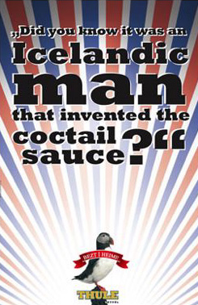
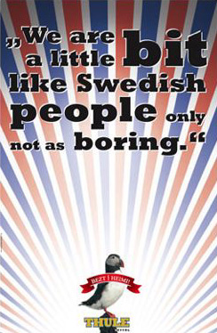

Title: Ísland, Bezt í heimi
Slug: island-bezt-i-heimi
Date: 2008-05-13 08:31:50
UID: 296
Lang: is
Author: Ása Baldursdóttir
Author URL: 
Category: Menningarfræði
Tags: 

Myndlæsi er sameinaður lestur mynda og texta. Tungumálið er myndmenningunni jafnmikilvægt og sjónrænt ímyndunarafl er þeim sem lesa bókmenntatexta.[^1]  Í þessari grein er myndlæsi skoðað útfrá lestri á Thule auglýsingunum sem birst hafa í prentmiðlum. 

Thule auglýsingarnar stíla inn á þjóðerniskennd en það sést best á lundanum sem fremstur trónir á auglýsingunum og er táknmynd fyrir sérkenni og gæði okkar Íslendinga. Auk þess er texti yfir auglýsinguna miðja, þar sem stendur _Bezt í heimi_, skrifað með z. Sá ritháttur er tilvísun til góðra og kjarnyrtra  tíma þegar íslenska tungumálið notaði z í stað s. Textinn er á íslensku og er því bundinn íslenskri tungu. Brandarinn í auglýsingunni er hinsvegar á ensku og og lofar á háðslegan hátt okkar eigið þjóðerni. Eins er ljós á fuglinum, sem skýtur geislum sínum í allar áttir; verið er að minna á eitthvað eftirsóknarvert og er þessi aðferð oft notuð til að auglýsa hluti sem eiga að virka eins og kraftaverk. Einnig sést þetta stílbragð oft á auglýsingarspjöldum sem auglýsa einhver fræg nöfn, t.d. á tónlistarmönnum. Geislarnir eru ýmist rauðir, hvítir og bláir sem enn geta minnt á þjóðerni okkar og _litina_ í fána okkar Íslendinga. 

Við þurfum að vinna úr því efni sem við horfum á. Það er því mikilvægt að lesa úr menningu þar sem almenningur er þáttakandi í að lesa og leggja merkingu í það sem horft er á.[^2]  Það er mikilvægt að að þekkja lundann, því fólk sem ekki veit að þessi fugl er tengdur Íslandi og t.d. Vestmanneyjum getur ekki sett myndina í samhengi við  þá merkingu sem auglýsandinn vill ná fram. 

Sjónmenningarleg fræði eru uppfull af mótsagnarkenndum greiningaraðferðum og mótast m.a. af fræðilegri orðræðu. Fræðin hafna algjörlega því viðhorfi að myndefni sé ekki jafnmikilvægt orðinu í vestrænu samfélagi. Lestur á myndum getur verið ólíkur innan menningarsamfélaga og jafnvel á milli einstaklinga. Hinsvegar er myndmál kannski oft alþjóðlegra heldur en hið ritaða orð. Því er mikilvægt að horfa á menningarlegt samhengi við lestur auglýsinga og er það nokkuð ljóst að auglýsingar Thule, eru miðaðar við íslenskt samfélag, íslenskan húmor. Kaldhæðinn húmorinn gæti komið útlendingum spánskt fyrir sjónir og jafnvel verið móðgandi.

Í grein sem fræðimaðurinn Richard Simon gaf út talar hann um auglýsinguna sem sjónræna afurð. Hann segir hana endurspegla hugmyndafræði neyslusamfélagsins og að gildismat í nútímasamfélagi sé auglýsingamiðað. Hann telur einnig að auglýsingaheimurinn sé útópía vestræns samfélags, að hann sameini annars vegar það sem þú átt að gera (þ.e. neyslu)  og hins vegar gullaldarsamfélagið ( það sem þú vilt). Kapítalisminn er því orðin að dyggð og ánægjan er allsráðandi. Auglýsingar miða því að sjálfsögðu að því að selja einhverja vöru, hugmynd eða neyslu.[^3]  Í nútímasamfélögum er hin sjónræna hlið aðalatriðið og merkingu er miðlað gegnum sjónræna tækni. Allar þessar ólíku tæknigreinar breyta heiminum í sjónrænt form og birta ákveðna sýn á heiminn. 

Roland Barthes, franskur bókmenntarýnir og heimspekingur, sagði að heimurinn væri ekki orðin algjörlega sjónrænn á 20. öldinni því að samfélagið væri enn algjörlega ritmiðað því texti fylgi nánast alltaf myndum. Barthes taldi textann leiðbeina okkur að hinni fyrirfram ákveðnu merkingu og krefjast þess að lesandinn beini athygli sinni að ákveðnum atriðum táknsins en _ekki_ að heildinni.[^4]  Þetta væri ekki hægt að segja um nútímaauglýsingagerð, sem nýtir sér margmiðlun og gengur ekki alltaf út á textamiðaða stýringu.  

Thule auglýsingarnar falla að hinu áhyggjulausa og fullkomna neyslusamfélagi, þar sem drykkja er viðurkennd og talin eðlileg; því í heimi neyslusamfélagsins er _enginn_ alkóhólisti. Eins er farið er í kringum lög og reglur eins og mögulegt er, því það má ekki auglýsa áfengi á Íslandi og því er tekið fram með afar óeftirtektarverðu smáletri að það sé ekki verið að auglýsa bjór heldur léttöl. Það er áhugavert að það er engin bjór í sjálfum auglýsingunum, heldur einungis Thule merkið sem verður að táknmynd áfengisins. Textinn spilar því enn veigameira hlutverk. Til að undurstrika frekar þjóðrembukenndan húmor Íslendinga er textinn vísun í leiknar auglýsingar á vegum Thule. Í auglýsingunum sitja tveir Íslendingar á bar og eru að tala við útlending þar sem þeir skjóta allskonar fyndnum „staðreyndum” um Ísland inn í samtalið, eins og t.d.  því að _við_ höfum hreinasta vatnið, að Jón Baldvin Hannibalsson hafi farið til Litháen og „þekkt þá” og fleira í þeim dúr. Húmorinn spilar inn á að drukkin sé Thule bjór á meðan Íslendingarnir segja brandara á ensku, með hreiminn í lagi. Prentauglýsingarnar verða þannig að áminningu um sjónvarpsauglýsingarnar og taka okkur á hærra flug í minningunni um Íslendingana á barnum. Sjónvarpsauglýsingarnar gefa þeim prentuðu, _ákveðinn merkingarauka_. 

Auglýsingarnar stíla inn á íslenskan húmor, fræða útlendinga um mikilvægi Íslendinga og sýna fram á afrek „okkar”. Textinn er í gæsalöppum, misjafn að stærð og fær maður því á tilfinninguna að einhver sé að mæla þessi orð eftir að hafa fengið sér nokkra Thule öllara.

Auglýsingar geta bæði verið skemmtiefni og til fagurfræðilegrar upplifunar en eru einnig upplýsingar um hugmyndafræði okkar heims. Þessar auglýsingar spila inn á þá tilfinningu að útskýra Ísland fyrir útlendingum, sem sökum smæðar okkar, könnumst örugglega öll við. Í fyrri prentauglýsingunni segir að íslenskur maður hafi fundið upp kokteilsósuna, sem er einmitt mjög fyndið, því að hún er afar sjaldgæf utan Íslands og hefur í raun orðið hluti af þjóðlegri matarmenningu, rétt eins og ein með öllu. Í þeirri seinni er rakið að við (þ.e. Íslendingar) séum kannski svipuð Svíum, fyrir utan það að við séum ekki eins leiðinleg. 

Öll skynjun er alltaf spurning um miðlun. Slík miðlun er alltaf bundin túlkun. Engin miðlun er hlutlaus og eru þessar auglýsingar síður en svo hlutlausar. Túlkunin er einstaklingsbundin, en er bundin því menningarsamfélagi sem hún birtist í þ.e. Íslandi.
Roland Barthes talar um að táknmyndin þ.e. orðið, sé eins og tómt ílát sem við hellum síðan merkingunni ofan í. Hann talar um að textinn sé alltaf menningarlega kóðaður og er textinn í auglýsingunum greinilegt dæmi um það, því mjög þröngur hópur nær húmornum, hann gæti ekki virkað eins erlendis. Enda þótt textinn sé á ensku, hella Íslendinga annarri merkingu í orðin heldur en aðrir.

Thule auglýsingarnar þykja mjög fyndnar, leitast er við að tengja húmorinn skemmtun og því er greinilega verið að segja að það sé skemmtilegt að fá sér Thule bjór. Þær miða á þjóðarsálina og nýta sér það að við lifum í litlu samfélagi og ekki þykir óeðlilegt að tala um Ísland við aðra því nú eiga mörg okkar í alþjóðlegum samskiptum. Textinn verður lykilatriðið í myndlæsinu, því án hans myndi húmorinn missa alla merkingu. Textinn stýrir merkingunni á þann hátt að minna okkur á það, að varan, sé eins og við íslendingar, _bezt í heimi_.

[^1]: Ástráður Eysteinsson.. „Hin kvika menning. Um menningarfræði og lifandi myndir.” _Heimur kvikmyndanna_.
[^2]: Ástráður Eysteinsson.. „Hin kvika menning. Um menningarfræði og lifandi myndir.” _Heimur kvikmyndanna_. 
[^3]: Richard Keller Simon, _Trash culture, popular culture and the great tradition_. 1999.
[^4]:  Roland Barthes, _Image, music, text_. New York, 1977. 

