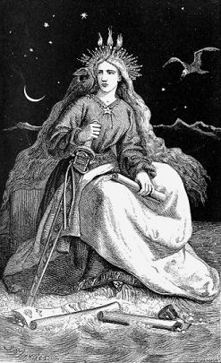

Title: Ísland fullvalda frón?
Slug: island-fullvalda-fron
Date: 2008-06-19 12:23:27
UID: 336
Lang: is
Author: Hilmar Magnússon
Author URL: 
Category: Alþjóðasamskipti, Stjórnmálafræði
Tags: lýðveldi, fullveldi, 17. júní, fjallkonan, forsætisráðherra, forseti Íslands, Evrópusambandið, Evra, Stephen D. Krasner, alþjóðakerfi, Úlfar Hauksson, Westphalen, March og Olsen, skipulögð hræsni, Schengen

Hið íslenska lýðveldi átti 64 ára afmæli á dögunum. Þrátt fyrir að bjart hafi verið yfir landinu á þessum tímamótum má með nokkurri vissu halda því fram að oft hafi verið bjartara yfir íbúum þess. Þann 17. júní 2008 voru landsmenn nefnilega nýlega búnir að skjálfa á beinunum, bæði í efnahagslegum sem og jarðfræðilegum skilningi og því ekki laust við að hálfgerður svartsýnishrollur færi um þá í íslensku sumargjólunni. Fjallkonan steig á stokk, lánsfjár- og lausafjárkreppt og forsætisráðherrann minntist á mikilvægi þess að þerra verðbólgin augun. Landinn ætti að hætta að sýta dýra bensíndropa og reyna þess í stað að notast við eigið vélarafl og um leið spara þessar fáu og fallandi krónur sem þó mætti enn finna í vösum og veskjum, ef gaumgæfilega væri leitað. Í sömu andrá renndi forseti lýðveldisins Íslands í hlaðið á 60 ára gamalli en glænýrri gljáfægðri drossíu. Líklega ekki þeirri sparneytnustu.

17\. júní 2008 verður líka minnst fyrir annað. Hann var nefnilega haldinn í töluvert öðru pólitísku andrúmslofti en oftast hefur áður ríkt á landinu. Aldrei fyrr hefur til dæmis umræðan um hugsanlega umsókn og jafnvel aðild Íslands að Evrópusambandinu verið jafn fjörug og aldrei virðist stuðningurinn við aðild að sambandinu og um leið upptöku Evru sem gjaldmiðils hafa verið meiri. Hvort hér sé um tímabundna fylgissveiflu í ljósi efnahagslegra sviptivinda mun tíminn leiða í ljós. Á hinn bóginn er umræðan svo frjó að það virðist kjörið að brydda upp á ýmsum vangaveltum um þessi mál. Hér verður tækifærið nýtt og fjallað um málefni sem hefur brunnið á mörgum, jafnt fylgjendum sem andstæðingum aðildar, nefnilega fullveldið. Í greininni verður rætt um hvaða áhrif hugmyndir eins og fullveldi hafi á hugmyndir um alþjóðleg kerfi eða ríkjasamfélög eins og ESB, en áður en lengra er haldið er ekki úr vegi að hafa á hreinu hvað felst í þessum tveimur hugtökum og í hvaða samhengi á að setja þau.

### Óvissan um fullveldið

Í bók sinni _Sovereignty: Organized Hypocrisy_ eða _Fullveldi: Skipulögð hræsni_ frá árinu 1999 bendir Stephen D. Krasner, prófessor í alþjóðasamskiptum við Stanford háskóla og yfirmaður stefnumótunar í bandaríska utanríkisráðuneytinu 2005-2007, á að óvissan í kringum hugtakið _fullveldi_ sé sérstaklega mikil í okkar hnattvædda nútímasamfélagi. Ástæða óvissunnar segir hann vera þá að fólk noti hugtakið á ólíkan hátt, en að þessi ólíka notkun svipti um leið hulunni af þeirri staðreynd að við höfum látið undir höfuð leggjast að viðurkenna takmarkanir alþjóðlegra kerfa.

Alþjóðleg kerfi, þar á meðal kerfið um hin fullvalda ríki, hafi nefnilega takmörkuð áhrif og verði sífellt að takast á við nýjar áskoranir. Hér sé um að ræða hluti eins og eðlilega árekstra (s.s. hvað varðar gagnkvæmt afskiptaleysi ríkja andspænis útbreiðslu lýðræðis), skilgreiningar á alþjóðakerfi, röskun á valdajafnvægi ríkja og þá staðreynd að leiðtogar þurfi, með ólíkum aðferðum, að bregðast við hvötum af ýmsu tagi. Þá bendir Krasner á að í alþjóðakerfinu muni aðgerðir heldur ekki alltaf fylgja viðteknum venjum, óháð því hvaða leikreglur séu notaðar. Að auki geti réttlætingin fyrir því að skora ákveðin norm á hólm breyst með tímanum, þótt áskorunin verði áfram sú sama.[^1]

Samkvæmt Krasner ríkir sem sagt bæði óvissa um fullveldið sem og hin alþjóðlegu kerfi og er það skoðun sem Úlfar Hauksson tekur undir í ritgerð sinni S_taða og merking lýðræðis, fullveldis og þjóðríkisins á nýrri öld_.[^2] Þar segir hann fullveldishugtakið lengi hafa vafist fyrir mönnum. En hver er þá skilgreiningin á fullveldishugtakinu?

### Fullvalda þjóðríki - gerendur í alþjóðakerfi

Hin hefðbundna skilgreining rekur rætur sínar til Westphalen í lok 30 ára stríðsins 1648, en þar er fullveldi skilgreint sem full og óskoruð yfirráð ríkisins á eigin landsvæði. Ríkisvaldið sé æðsta valdið innan ríkismarkanna og þar af leiðandi verði allt annað vald að lúta fullveldi ríkisins. Þar sem ríkið er í þeirri einstöku aðstöðu að geta notað þvinganir í formi hers eða lögreglu til að fullnægja vilja sínum takmarkast það heldur ekki af öðru valdi.[^3]

Með fullveldisskilgreiningunni í Westphalen má segja að jarðvegurinn hafi verið unninn fyrir þjóðríkið, þó svo að hugmyndin um þjóð komi ef til vill ekki fyrr en seinna. Grunnurinn fyrir þjóðríkið sem geranda í alþjóðakerfinu er alltént lagður.[^4] En hvernig nýtist sá grunnur? Hefur þessi skilgreining tryggt ríkjunum og þjóðunum einhvern óbifanlegan sess í sögu alþjóðakerfisins? Og geta ríkin farið sínu fram, óháð öllu öðru? En sjálft alþjóðakerfið? Til að átta sig betur á því þarf að kryfja skilgreininguna á fullveldi örlítið betur og til þess eru notuð nokkur verkfæri og birtingarmyndir.

### Tvær víddir

Fyrst er horft á hugtakið í tveimur mismunandi víddum. Annars vegar er um að ræða svokallaða innri vídd, en þar er gægst inn fyrir mærin og litið á hvernig rétti lögmætra stjórnvalda til að setja lög og framfylgja þeim innan ríkisins er háttað. Hins vegar er um að ræða ytri vídd þar sem litið er til þess hvort og þá hvernig lögsagnarumdæmi ríkisins sé viðurkennt.

Fullveldið felst í báðum víddunum - að ríkið sé viðurkennt sem fullvalda gerandi í alþjóðakerfinu og hafi _þar með_ öðlast rétt til að taka eigin ákvarðanir innan sinna landamæra. Til að teljast fullvalda þurfa ríki sem sagt á viðurkenningu alþjóðakerfisins að halda. Gagnkvæm viðurkenning ríkja er því forsenda fyrir fullveldinu sem aftur er undirstaða alþjóðalaga, þar sem formlega er ekkert vald æðra valdi fullvalda ríkja í alþjóðakerfinu.[^5] Niðurstaðan hér hlýtur því að vera sú að hvort haldi þetta í annars skott, að fullveldið og hið alþjóðlega kerfi séu nánast órjúfanlega háð hvort öðru.

### Lagaleg og pólitísk gleraugu

Til að komast betur að því hvernig hið fullvalda ríki hefur áhrif á alþjóðakerfið, og á móti, hversu háð það er alþjóðlega kerfinu, þarf að setja upp önnur gleraugu og skoða fullveldið frá lagalegu og pólitísku sjónarhorni. Lagalega skilgreiningin (_de jure_) er þröng og tekst á við það hvernig hlutirnir eru _formlega_. Pólitíska skilgreiningin (_de facto_) er hins vegar betur fallin til þess að segja til um hvernig hlutirnir eru _í raun_.[^6]

Auk þessara verkfæra hefur Krasner skilgreint fjögur mismunandi sjónarhorn á fullveldið, allt eftir því hvernig það er notað. Um er að ræða _alþjóðlegt löglegt_ fullveldi sem snýr að gagnkvæmri viðurkenningu, oftast á milli lögformlega sjálfstæðra landfræðilegra eininga. Þá er það hið klassíska _Westphalíska fullveldi_, sem snýst um pólitískar skipulagsheildir án utanaðkomandi áhrifavalda, eins og áður hefur verið lýst. Næst er það _fullveldi innan ríkisins_, sem snýr að því hvernig yfirvöld hátta völdum og stjórnsýslu innan ríkisins og að lokum er um að ræða hið _gagn-háða_ [sbr. hið ó-háða] fullveldi sem snýr að straumi upplýsinga, hugmynda, fólks, varnings, mengunar eða fjármagns í gegnum mæri ríkisins.[^7]

### Raunveruleikinn

Þegar fullveldið er svo skilgreint eftir þessum sjónarhornum þurfa allir þættirnir ekki endilega að fara saman. Krasner tekur dæmi um Evrópusambandið. Þar fullnægi ríkin alþjóðlegu löglegu fullveldi en gangi gegn hinu Westphalíska, þar sem leiðtogar þeirra gera með sér samkomulag um að beygja sig undir og viðurkenna _utanaðkomandi_ valdakerfi.[^8]

Krasner heldur áfram og beitir næst pólitískum og lagalegum skilgreiningum March og Olsen um eðli ákvarðana. Hlutunum er nú annars vegar upp stillt upp sem afleiðingamiðuðum ákvörðunum, byggðum á köldu pólitísku mati og hámörkun afrakstursins (sbr. klassíska leikjafræði og nýklassíska hagfræði). Hins vegar eru _boðlegar_ ákvarðanir, þær sem _þykja við hæfi_ og taka mið af reglum, hlutverkum og einkennum sem hvetja til boðlegrar hegðunar við gefnar aðstæður.[^9]

Krasner kemst að þeirri niðurstöðu að í hinu alþjóðlega kerfi sé í ríkara mæli stuðst við afleiðingamiðaðar ákvarðanir á kostnað þeirra boðlegu. Þetta þýðir í reynd að þótt ekki sé endilega _við hæfi_ að brjóta á fullveldinu, sem hvíli á lögum og regluverkum, sé það engu að síður gert. Leiðtogar, og þá sérstaklega stjórnendur voldugri ríkja, sjái sér nefnilega hag í því að brjóta reglurnar. Þar sem það séu svo þeir, en ekki ríkin sjálf eða alþjóðakerfið sem taki ákvarðanirnar, sé það undir þeim komið hvort fullveldið sé virt. Sökum ásóknar í völdin breyti þeir þó oftast umbjóðendum sínum í hag, þótt aðferðirnar geti verið mismunandi.

Eftir stendur sú staðreynd að þeir brjóta iðulega bæði hið lagalega fullveldi sem og hið Westphalíska. Hið lagalega brjóta þeir með gagnkvæmum samningum þar sem viðurkenning veltur á sjálfviljugu samþykki annarra ríkja. Hið Westphalíska fullveldi er brotið bæði með sjálfviljugum samningum, sem og þvingunum (innrásum og hernaðaraðgerðum).

Krasner bendir svo á að flest ríkin í hinu alþjóðlega kerfi hafi notið alþjóðlegrar viðurkenningar og þar með notið alþjóðlegs lagalegs fullveldis. Þau séu hins vegar mun færri sem hafi notið hins Westphalíska. Leiðtogar hafi nefnilega í sífellu vikið frá grundvallarsjónarmiðunum og boðið sjálfum sér eða verið boðið af þarlendum valdhöfum, inn í erlend ríki. Þetta hafi til dæmis gerst á forsendum mannréttinda, alþjóðlegs stöðugleika eða efnahagslegs.

Krasner telur því orð og gerðir varðandi fullveldi og alþjóðakerfi ekki hafa farið saman í gegnum tíðina. Þá segir hann mál í alþjóðakerfinu oftast til lykta leidd af þeim leiðtogum sem takist að hámarka afrakstur sinn hverju sinni. Niðurstaða hans er því sú að á grundvelli raunverulegrar afstöðu ríkja til fullveldis einkennist alþjóðakerfið af „skipulagðri hræsni“.[^10]

### Ísland og hin skipulagða hræsni

Í ljósi ofangreindra atriða verða spurningar eins og um hugsanlega inngöngu Íslands í ESB afar margbrotnar og forvitnilegar. Væru Íslendingar að taka þátt í skipulagðri hræsni með því að ganga í sambandið? Væru þeir ef til vill að selja lánsfjár- og lausafjárkreppta fjallkonuna í ánauð? Í skiptum fyrir glóandi Evrur, nothæfar til að borga dýru dropana á glæsikerrur landans? Eða væri hér kannski frekar um að ræða afsal á hluta _lagalegs_ fullveldis í stað _raunverulegri_ áhrifa við ákvarðanaborðið í Brussel? Hvað með EES og Schengen? Hafa þeir samningar ekkert að segja? Skiptir ESB kannski einfaldlega engu máli í þessu samhengi, þar sem fullveldishugtakið er hvort eð er marklaust í nútímanum? Hvað með meira en hálfrar aldar hersetu Bandaríkjamanna á Íslandi í boði íslenskra stjórnvalda? Má ekki líta á hana sem hálfrar aldar hræsni gagnvart fullveldishugtakinu, eða hvað? Já þú farsældar frón! Hvar er þín fullvalda frægð, frelsið og manndáðin best?

[^1]: Krasner, Stephen D., _Sovereignty - Organized Hypocrisy_. Princeton University Press, Princeton 1999, 3.
[^2]: Úlfar Hauksson. „Staða og merking lýðræðis, fullveldis og þjóðríkisins á nýrri öld“, _Rannsóknir í félagsvísindum_ VI. Úlfar Hauksson ritstjóri. Félagsvísindastofnun Háskóla Íslands, Reykjavík 2005, 3.
[^3]: Sama heimild, 3.
[^4]: Sama heimild, 3-4.
[^5]: Sama heimild, 4.
[^6]: Sama heimild, 4.
[^7]: Krasner, _Sovereignty_, 3-4.
[^8]: Sama heimild, 4.
[^9]: Sama heimild, 5.
[^10]: Sama heimild, 6-9.
