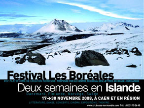

Title: Íslendingar undir hæl ímyndarinnar?
Subtitle: Íslensk menning á hátíðinni Les Boréales í Frakklandi
Slug: islendingar-undir-hael-imyndarinnar
Date: 2008-12-18 11:21:26
UID: 907
Lang: is
Author: Íris Ellenberger
Author URL: 
Category: Bókmenntir, Í útlöndum, Íslendingar, Listir
Tags: Caen, Normandí, Frakkland, Les Boréales, Háskólinn í Caen, íslensk fræði, Sjón, Steinunn Sigurðardóttir, Guðrún Eva Mínervudóttir, Kristín Marja Baldursdóttir, Árni Þórarinsson, Arnaldur Indriðason, Sigurður Pálsson, Jón Hallur Stefánsson, Friðrik Þór Friðriksson, Sólveig Anspach, Dagur Kári, Baltasar Kormákur, Stúdíó Caoz, Hamrahlíðarkórinn, Mr. Silla & Mongoose, Ghostdigital, Biogen, Barði Jóhannesson, Häxan, Íslenski dansflokkurinn, útrás, útrásarvíkingur, Anna and the Moods, Gunnar Karlsson, Hilmar Sigurðsson, Pixar, Adeline Keil, Pascal Felonneau, Paysages urbains d'Islande, Jón Yngvi Jóhannesson, Hanna Steinunn Þorleifsdóttir, Éric Boury, Martine Laval, Télérama

Í nóvember ár hvert snýst lífið í borginni Caen í Normandí um Norðurlöndin. Héraðið er enda það svæði í Frakklandi sem tengist Norðurlöndum hvað sterkustum böndum. Norrænir menn settust þar að á miðöldum og Normannar leggja í dag þónokkra rækt við þá sögu, m.a. með gríðarstórri menningarhátíð sem fer fram í 2-3 vikur á hverju ári. Hátíðin _Les Boréales_ á uppruna sinn að rekja til ársins 1992 en þá var hún haldin fyrst af norrænudeild háskólans í Caen. Norrænudeildin hefur verið starfrækt frá árinu 1956 og er þar nú eina fasta lektorsstaðan í íslenskum fræðum í gjörvöllu Frakklandi. Þetta framtak deildarinnar hefur síðan öðlast sjálfstætt líf eftir því sem hátíðin hefur vaxið í áranna rás. Nú vinna þrír starfsmenn í fullu starfi að hátíðinni árið um kring auk annarra starfsmanna og starfsnema yfir mesta annatímann. Fjöldi félagasamtaka, stofnana, skóla og einstaklinga koma að hátíðinni sem hefur verið sótt í hvert sinn af rúmlega 40 þúsund gestum á síðustu árum. Í gegnum tíðina hefur ýmist ákveðið þema verið valið til umfjöllunar eða eitt Norðurlandanna öðru fremur og í ár varð Ísland fyrir valinu.[^1]

17.-30. nóvember sl. var Ísland á allra vörum í Caen og nágrenni. Margir helstu rithöfunda íslensku þjóðarinnar lögðu leið sína til borgarinnar og tóku þátt í pallborðsumræðum og viðtölum auk þess sem þeir hittu grunn- og framhaldsskólanemendur út um borg og bæi í syðri hluta héraðsins. Meðal þeirra voru Sjón, Steinunn Sigurðardóttir, Guðrún Eva Mínervudóttir, Kristín Marja Baldursdóttir, Árni Þórarinsson, Arnaldur Indriðason, Sigurður Pálsson og Jón Hallur Stefánsson. Efnt var til kvikmyndaveislu þar sem Frökkum var boðið að grandskoða og ræða kvikmyndir Friðriks Þórs Friðrikssonar, Sólveigar Anspach, Dags Kára, Baltasars Kormáks og Stúdíó Caoz. Tónlist lék einnig stórt hlutverk og ber þar helst að nefna tónleika Hamrahlíðarkórsins, Mr. Silla & Mongoose, Ghostdigital og Biogen auk kvikmyndatónleika Barða Jóhannssonar við sænsku kvikmyndina _Häxan_. Íslenski dansflokkurinn var einnig í öndvegi og hélt Frakklandsfrumsýningar á fimm dansverkum. Norrænudeild háskólans í Caen skipulagði málþingið _L’Islande dans l’imaginaire_ um ímyndað Ísland með þátttöku 12 fræðimanna frá Frakklandi, Bretlandi, Bandaríkjunum og auðvitað Íslandi. Þá eru ótaldir margs konar listviðburðir, pallborðsumræður og sýningar. Það þarf því enginn að velkjast í vafa um að hátíðin er gríðarstór og gegnir þar af leiðandi mikilvægu hlutverki í að miðla og móta ákveðna ímynd af Íslandi. En hver skyldi sú ímynd vera þetta árið, svo stuttu eftir skipbrot íslenska efnahagskerfisins sem hefur svert orðspor Íslands í mörgum heimsins löndum?

Í stuttu máli sagt má vart merkja að Frakkar séu eitthvað minna hrifnir af Íslandi á krepputímum frekar en þegar allt virtist leika í lyndi. Fyrir Íslending sem fylgist með hátíðinni er það dálítið eins og að ferðast nokkra mánuði aftur í tímann og lenda fyrir tíma efnahagshrunsins þegar Íslendingar voru enn þvílíkir snillingar. Eða ferðast jafnvel enn lengra aftur til þess tíma þegar kreppa var ekki einu sinni í augsýn fróðra manna  og Íslendingar voru „einstakir sérvitringar“ sem voru við það að sigra heiminn. Þó má greina að sumt hefur breyst, t.a.m. virðist orð eins og „útrás“ og „útrásarvíkingar“ hafi horfið skyndilega úr hátíðarræðum íslenskra embættismanna. Önnur hugtök eins og „aðlögun“ og „sveigjanleiki“ eru að festa sig í sessi og veita e.t.v. vísbendingar um inntak þeirrar orðræðu sem verður ofan á í kjölfar bankahrunsins.

Efnahagshrunið virtist ekki hafa haft nein áhrif á aðalþemað í ræðu og riti um Ísland í Frakklandi. Það var enn og aftur hið framandi Ísland sem endurspeglaðist ekki aðeins í þeim menningarviðburðum sem valdir voru á sýninguna heldur fundu kynnar, ræðumenn og fundarstjórar sig knúna til að tönnlast á orðum eins og „particulière“, jafnvel „extrêmement particulière“, „atypique“ og „étrange“. Eitt furðulegasta dæmið um slíka orðanotkun var á einum áhugaverðasta viðburði hátíðarinnar, á sýningu á Caoz-teiknimyndinni _Anna and the Moods_. Sýningargestir voru hópur kennara á kvikmyndanámskeiði og teiknimyndin hugsuð sem kennslutæki. Að sýningu lokinni fengu kennarar eintak af myndinni að gjöf ásamt frönskum kennsluleiðbeiningum. Þeim gafst að auki kostur á að beina athugasemdum og spurningum til leikstjórans Gunnars Karlssonar, handritshöfundarins Sjóns og framleiðandans Hilmars Sigurðssonar. Ungur maður stjórnaði gjörningnum en sá var bersýnilega svo hrifinn af landi og þjóð að hann gat vart stillt sig um að finna vísbendingar um áhrif hins „furðulega“ Íslands á mismunandi þætti teiknimyndarinnar um Önnu. Hann gekk svo langt að kalla Sjón „tákn fyrir Ísland“, þar sem hann samþætti brjálæði og snilligáfu Íslendinga. Það þrátt fyrir að teiknimyndin sé sérstaklega gerð fyrir erlendan markað og hugsuð sem samkeppni við stóru bandarísku kvikmyndastúdíóin, um leið og hún sækir innblástur sinn til Pixar-mynda ef marka má ummæli aðstandendanna.

Svipaðar áherslur fann hátíðargesturinn við hvert fótmál í Caen-borg seint í nóvember. Á ljósmyndasýningu Adeline Keil bar annars vegar að líta náttúru og afskekktar byggðir og hins vegar fangaði hún þann sið sem flestum ferðamönnum er framandi, nakta líkama í sturtuklefum almenningssundlauganna. Samtímis var vakin sérstök athygli á ljósmyndasýningu Pascal Felonneau, _Paysages urbains d’Islande_ vegna þess að þar var lögð áhersla á borgarlandslag, sjónarhorn sem hátíðargestir áttu greinilega ekki að venjast frá Íslandi.

Það væri hægðarleikur að eyða drjúgum tíma í að telja upp fleiri dæmi um klisjukennda ímynd og orðræðu á Boréales-menningarhátíðinni í Caen. Hér verður lesandanum þó hlíft við því enda kemur það út á eitt: ímyndaráróðursmaskína íslenska lýðveldisins þarf ekki að óttast að orðspor landsins hafi beðið neina hnekki í Frakklandi. Þvert á móti virðast Frakkar sækja í klisjurnar. Þeir elska furðuútgáfuna af Íslandi sem er í ímynduninni gert eins ólíkt Frakklandi og hægt er að komast upp með. Þannig verður það heillandi, spennandi og dularfullt en um leið verða íslenskir listamenn, sem í Reykjavík leika borgarbúann og heimsborgarann, að sætta sig við að verða eins konar álfar út úr hól, geðsjúklingar og snillingar í senn. Það eru ekki bara hæfileikar þeirra sem gera þá áhugaverða heldur og ekki síður landið sem er talið valdur að þessum hæfileikum. Þó fer mann að gruna að viðtökurnar væru e.t.v. ekki eins góðar væru þeir frá nálægara landi, Þýskalandi, Danmörku eða Spáni.

Gegndarlaus áhersla á raunveruleg og ímynduð áhrif náttúrunnar á íslenskar menningarafurðir í upphafi 20. aldar leiðir óneitanlega hugann að greiningu Jóns Yngva Jóhannessonar á viðtökum danskra gagnrýnenda á verkum íslenskra rithöfunda og leikskálda um og eftir aldamótin 1900. Þar kemur fram að Íslendingar þjónuðu ákveðnu hlutverki sem „hinir“ eða „counter-identity“ í mótun danskrar sjálfsmyndar. Því lögðu gagnrýnendur sífellda áherslu á að finna í verkunum vísbendingar um áhrif íslenskrar náttúru og einfalds lifnaðarháttar.[^2] Ætli svipað sé uppi á teningunum enn í dag?

Málþing norrænudeildar háskólans í Caen var mikilvægasta undantekningin en samkvæmt einum skipuleggjendanna, Hönnu Steinunni Þorleifsdóttur, var málþingið „tilraun til að víkka sviðið og afbyggja klisjurnar um Ísland með fræðilegum erindum og um leið opna það fyrir almenning en slíkt er alla jafna ekki gert.“ Þar voru ímyndir Íslands í nútíð og fortíð sérstaklega til umræðu og þar fengu gestir ágætt yfirlit yfir sögu þeirrar orðræðu sem ríkti á öðrum viðburðum hátíðarinnar.[^3] Ekki var laust við að þeir hinir sömu ættu í kjölfarið erfitt með að þola verstu dæmin um dýrkun og sjálfsdýrkun eins og hún birtist í hugmyndum um snilligáfu, hreinleika, náttúrubörn og náttúrulegan kraft lands og þjóðar.

Önnur mikilvæg undantekning var Arnaldur Indriðason. Aðdáendum gafst kostur á að eyða klukkustund í návist hans og þeir troðfylltu fyrirlestrarsal af stærri gerðinni og rúmlega það í kastalavirki borgarinnar, öryggisverðinum til mikils hrellis. Íslendingunum komu vinsældir hans mjög á óvart og varð undirrituð að svara Éric Boury, þýðanda Arnalds, neitandi þegar hann spurði hvort Íslendingar gerðu sér grein fyrir því hversu gífurlega vinsæll Arnaldur væri í Frakklandi. Ef til vill voru það einmitt þessar vinsældir hans sem gerðu það að verkum að allt annar bragur var á þessari klukkustund með Arnaldi en öðrum viðburðum hátíðarinnar. Þjóðerni hans og eiginleikar heimalandsins bar ekki á góma heldur sat hann fyrir svörum eins og hver annar virtur listamaður sem hefur náð góðu valdi á sínum miðli. Ekki sakaði að spyrjandinn var fagmaður fram í fingurgóma, Martine Laval hjá tímaritinu _Télérama_ sem á einmitt heiðurinn af því í Frakklandi að hafa uppgötvað Arnald. Annaðhvort var það hróðri Arnaldar fyrir að þakka eða frábærum spyrli sem andstætt flestum öðrum spyrlum og fundarstjórum hátíðarinnar var hreint ekki dolfallinn yfir Íslandi. Arnaldur reyndist vera eini íslenski listamaður hátíðarinnar sem tókst að stíga undan skugga Íslands, ef svo má að orði komast, og verða metinn á eigin forsendum en ekki forsendum þeirrar ímyndar sem ríkir af Íslandi og Íslendingum í Frakklandi.

[^1]: Meiri upplýsingar um hátíðina er að finna á heimasíðu Centre Regional des Lettres de Basse-Normandie: http://www.crl.basse-normandie.com/
[^2]: Jón Yngvi Jóhannsson, „„Jøklens Storm svalede den kulturtrætte Danmarks Pande“. Um fyrstu viðtökur dansk-íslenskra bókmennta í Danmörku“, Skírnir. Tímarit Hins íslenska bókmenntafélags 175 (vor 2001), bls. 33-66.
[^3]: http://www.unicaen.fr/recherche/mrsh/erlis/807

