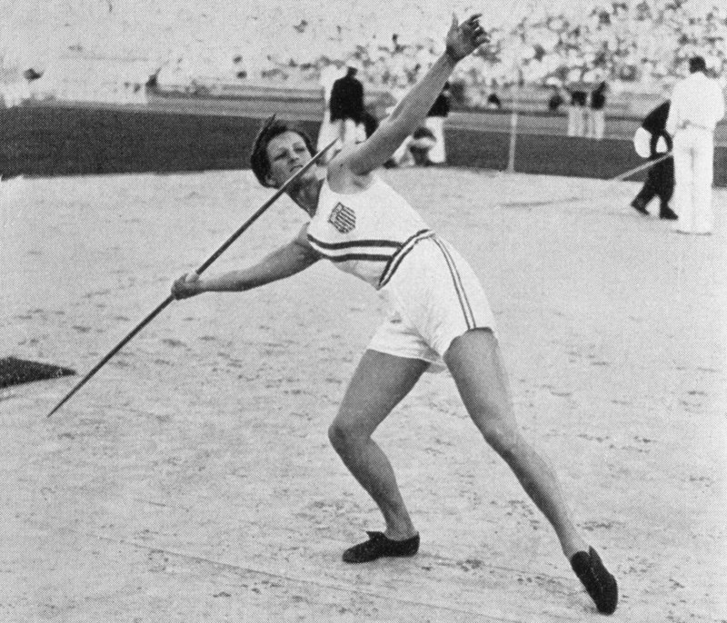

Title: Íþróttir fyrir alla. Sigur fyrir suma
Slug: ithrottir-fyrir-alla-sigur-fyrir-suma
Date: 2008-12-12 18:51:29
Part: 2/2
UID: 883
Lang: is
Author: Hafdís Hafsteinsdóttir
Author URL: 
Category: Íþróttir, Kynjafræði, Sagnfræði
Tags: Íþróttir, konur, ólympíuleikar, IOC, Pierre De Coubertin, frjálsar íþróttir, sund, fótbolti, karate, júdó, tae kwon do, Kynferði, kynjapróf, erfðarfræði, litningar, London, Helsinki, Sovétríkin, Bandaríkin

 

Eins og áður kom fram hafði aðalhvatamaður nútíma ólympíuleika, franski baróninn Pierre De Coubertin skýrar hugmyndir um íþróttaiðkun og konur. Konur mættu stunda hóflega hreyfingu, en útiloka ætti konur frá keppnum. Í augum De Coubertins var keppnisandinn og sú upphafning mannsandans sem honum fylgdu, heilagur og algerlega forboðinn konum. 

Þessi háfleygi þankagangur átti sér líka efnislega hliðstæðu. Þrátt fyrir að kvenkynskeppendum hefði tekist að komast að sem ólympískir keppendur eftir krókaleiðum í t.d tennis og bogfimi á frá og með leikunum 1900 var þeim meinaður aðgangur að altari ólympíuandans, eða ólympíuleikvanginum sjálfum þar til árið 1928. „Konur eiga ekkert erindi inn á ólympíuleikvangin nema þá til að krýna sigurvegarana, sviti kvenna saurgar ólympíuleikvanginn“ voru orð De Coubertins og Alþjóðlega ólympíunefndin (IOC) var honum furðu leiðitöm í þessu málefni.

Það var annars engin nýlunda að meina konum aðgang að íþróttaleikvöngum, slíkt hafði tíðkast t.d á Bretlandi á fyrstu áratugum tuttugustu aldar, en lagðist af á árunum eftir fyrra stríð, enda stóðu leikvangarnir svo gott sem tómir yfir stríðsárin sem íþróttakonur færðu sér í nyt.

Árið 1920 voru fyrstu heimsleikar kvenna haldnir í Monte Carlo, Í kjölfar þeirra stofnuðu íþróttakonur með sér alþjóðleg samtök Fédération Sportive Féminine Internationale (FSFI) sem voru einskonar regnhlífasamntök íþróttakvenna.Á þriðja áratugnum beitti FSFI sér fyrir aukinni íþróttaiðkun og keppni kvenna og stóð fyrir alþjóðlegum kvennamótum í fjölmörgum íþróttagreinum. Þar með var fyrsta fræinu að alþjóðavæðingu kvennaíþrótta sáð. Þrátt fyrir ágætan árangur á ýmsum sviðum voru íþróttakonur þó ekki einhuga um stefnumál sín.

Hvað afstöðuna til ólympíuleikanna varðar skiptust þær, að segja má, í tvær fylkingar, annars vegar var hópur sem taldi að konur ættu að  halda eigin ólympíuleika en hins vegar þær sem töldu að konur ættu að fá að keppa til jafns við karlmenn á þeim Ólympíuleikum sem De Coubertin hleypti úr vör. Auk þess kváðu svo íhaldsamari raddir sér hljóðs og tóku undir stefnu IOC um að konur ættu ekki að keppa í íþróttum yfirhöfuð. Þær vildu draga úr áherslunni á keppni eða gera keppnisíþróttir að einskonar leikjum (play-meets) þar sem konur myndu reyna með sér án þess þó að um eiginlega keppni væri að ræða. Þessi klofningur varð að lokum til þess að FSFI lagðist á hliðna á fimta áratugnum.

Það varð þó úr að heimsleikar kvenna voru haldnir  1921 til 1944. Markmiðið með þeim var fyrst og fremst að gefa konum þáttöku á að keppa í greinum sem þeim var meinaður eða takmarkaður aðgangur að. Það voru fyrst og fremst þær íþróttir þar sem glímt er við metra og sekúndur (að sundi undanskildu), líkamlega snertingu milli keppenda og hópíþróttir. Hópíþróttir og þá sérstaklega hópíþróttir sem innhéldu snertingu við andstæðinginn þóttu of grófar fyrir konur og þá var sérstaklega rætt um að samstuð milli keppenda gæti skaðað æxlunarfæri þeirra. Íþróttir þar sem keppt var um metra og sekúndur t.d frjálsar þóttu of krefjandi fyrir viðkvæma líkama kvenna að mati IOC sem sýndi staðfasta tregðu við að leyfa konum ekki að keppa í frjálsum íþróttum. Þessar íþróttagreinar þóttu líka yfirhöfuð ekki dömulegar og því var ekki keppt í þeim á mótum. Að lokum þótti það fyrir neðan virðingu karlmanna að skipuleggja slík mót og dæma kvenkyns keppendur í slíkum greinum en viðurkennd dómararéttindi voru alfarið í höndum karla á þessum árum.

Á heimsleikum kvenna var einmitt keppt í þessum forboðnu íþróttagreinum s.s frjálsum og fótbolta. FSFI stóð líka fyrir fyrstu kvennakeppnum í bardagaíþróttum t.d grísk rómverskri glímu. Þess má síðan geta að fótbolti kvenna varð ekki keppnisgrein fyrir konur á ólympíuleikum fyrr en 1996 og bardagaíþróttir s.s tae kwon do, júdó og karate urðu ekki keppnisíþróttir á ólympíuleikum fyrr en á leikunum 2000 og 2004.

Þessi seinagangur IOC við að viðurkenna þessar íþróttir sem gildar keppnisíþróttir meðal kvenna hefur verið útskýrður þannig að konur hafi einfaldlega ekki haft áhuga á slíkum íþróttum fyrr en á allra síðustu árum tuttugustu aldar. Slíkt er þó fjarri lagi, fótbolti var t.d mikið stundaður af konum í bæði Bretlandi og Frakklandi frá 1920 og jafnvel hér á Íslandi, sem sjaldnast hefur verið talið mjög nýjungagjarnt. Til eru heimildir um að konur hafi stundað fótbolta bæði í Reykjavík og á Ísafirði fyrir 1920 sem og iðkað júdó í Reykjavík árið 1964. Þó svo að þessar tilraunir hérna á Íslandi hafi fjarað út í sandinn sýna dæmin þó að áhugi og framkvæmdavilji var til staðar. 

Ólympíuleikarnir féllu niður stríðsárin 1940 og 1044, en þegar þeir hófust á ný í London árið 1948 og í Helsinki árið 1952 kvað við nýjan tón í kvennaíþróttum. Keppnisgreinum fór sí fjölgandi t.d í sundi og frjálsum og hlutfall kvenna af þátttakendum jókst á nánast hverjum leikum. Þessi þróun hófst á leikunum árið 1952 þar sem Sovétríkin mættu til leiks með firna sterkt kvenna lið í nánast  öllum íþróttagreinum og sópuðu til sín verðlaunum. Á næstu leikum svöruðu Bandaríkjamenn fyrir sig og á næsta áratug varð kvennalið Austur Þýskalands áberandi.

Á tímum kalda stríðsins þegar spennan milli austurs og vesturs var í hámarki urðu Ólympíuleikarnir há pólitískir. Sem dæmi má nefna að Bandaríkjamenn og Sovétríkin sniðgengu þá Ólympíuleika sem haldnir voru í sitthvoru ríkinu  og árangur á leikunum varð einskonar stöðutákn til að sýna fram á yfirburði heimsveldanna. Heildarfjöldi verðlauna var ókyngreindur með öllu þannig að með því að efla kvennaíþróttir opnuðust miklir möguleikar fyrir stórveldin að sýna hvort öðru fram á eigin yfirburði.

Pólitísk heimsvaldastefna réð því öðru fremur að konum opnuðust sífellt fleiri möguleikar á kepnisíþróttum á ólympíuleikunum eftir stríð. Þó svo að konum opnuðust sífellt fleiri möguleikar til afreka á sviði íþrótta á kaldastríðsárunum fór því fjarri að afreksíþróttir kvenna öðluðust félagslega viðurkenningu. Andrúmsloft og umgjörð afreksíþrótta var ennþá helgidómur karlmennskunnar og þær konur sem voguðu sér inná það svæði þurftu að láta ýmislegt yfir sig ganga. Eitt öfgafyllsta dæmið um slíkt eru hin svo kölluðu kynjapróf sem voru við lýði frá 5. áratugnum fram til aldaloka.

Eftir Ólympíuleikanna í Berlín árið 1936 vöknuðu grunsemdir um að nokkrir þýskir karlkynskeppendur hefðu laumað sér í raðir kvennana til að auka möguleikana á sigri. Þetta var síðar staðfest seint á fimmta áratugnum og þeir sviptir verðlaunum í kjölfarið. Orðróminn um að slíkt liðist ennþá var þó erfiðara að kveða í kútinn og árið 1948 fór fyrsta kynprófið fram á breskum frjálsíþróttakonum. Prófið þótti ónauðsynlegt og niðurlægjandi og því var það ekki endurtekið. En hugmyndin var þó komin til að vera. Á Evrópumótinu í frjálsum íþróttum árið 1966 var kvenkyns keppendum gert að afklæðast fyrir framan nefnd af læknum til að staðfesta kyn þeirra. Þetta þótti ákaflega niðurlægjandi fyrir keppendur og reyndist gersamlega ónauðsynlegt þar sem þær stóðust allar „prófið“ með glans. Engu að síður var slíkt kynjapróf endurtekið á Samveldisleikunum 1966 með ytri kynfæraskoðun og þá þótti keppendum niðurlægingin vera alger, enda er það mismunum á grundvelli kynferðis af verstu gerð þegar kynfæraþukl er orðið venjubundinn þáttur af afreksíþróttum.

Keppendur mótmæltu harðlega þessari botnlausu niðurlægingu og kynfæraskoðun lagðist af á næstu árum. Það gerðu kynprófin hinsvegar ekki, á Evrópumótinu í frjálsum íþróttum árið 1967 var í fyrsta skipti beitt svokölluðu litningaprófi, þar sem keppendur voru skikkaðir til að skila frumusýnum sem nefnd lækna rannsakaði til að ganga úr skugga um að innihéldu tvo X  kvennlitninga. Þessi aðferð þótti mun mannúðlegri og auk þess hávísindaleg. Hún var hinsvegar langt því frá gallalaus. Frávik í erfðamengi manskeppnunar eru fjölmörg og nú í dag er vel þekkt að einstaklingar af báðum kynjum geta verið með þrjá litninga t.d XXY, það er að segja tvo kvennlitninga og einn karlitning. Í slíkum tilvikum er þó einn litningurinn óvirkur með öllu og eru það þá hinir virku litningar sem ráða líkamlegu kyni.

Þó nokkar íþróttakonur greindust með óvirkan Y litning og voru þar með sviptar verðlaunum og misstu keppnisréttindi. Þar má nefna spænsku hlaupakonuna Mariu José Martinez semféll á litningaprófi fyrir Ólympíuleikana í Barcelona árið 1992. Martinez hafði þó áður staðist slíkt próf, sem sýnir að tæknin sem notuð var við prófin var ekki óskeikul. Pólskur spretthlaupari sem greindist með Y litning á 8.áratugnum var svipt verðlaunum á stórmótum sem hún hafði unnið til ári áður en kynprófið fór fram. Íþróttaferill kvennana sem greindust með Y litning var umsvifalaust fyrir bí og þær stimplaðar sem svikarar. Blaðaumfjöllun um slík tilvik var harðorð og fordómafull, en oftar en ekki var fallað um þessar konur sem karlmenn í dulargerfi eða einskonar ómannlegar kynleysur. Íþróttakonur mótmæltu þessum prófum þó lítið sem ekkert, enda virðist það partur af heiðarlegri og drengilegri keppni að allir keppi á jafnréttisgrundvelli.

Rökin sem slík, að sporna gegn því að karlkyns þátttakendur laumi sér inní raðir eru góð og gild sem slík, en standast ekki raunsæja skoðun. Til að byrja með má nefna að kynprófin, sem liðust í meira en 30 ár afhjúpuðu aldrei karlmann í röðum íþróttakvenna, en lögðu hinsvegar feril nokkurra kvenna í rúst. Kynprófin eru líka, við nánari athugun gersamlega ónauðsynleg, því allir sem hafa eitthvað með íþróttaiðkun að gera sjá strax í hendi sér að það er nánast ómögulegt fyrir karlmenn (eða konur ef því er að skipta) að troða upp sem hið gagnstæða kyn. Það þyrfti allavega heljarinnar samsæri keppenda, þjálfara og stjórnar ef slíkt ætti að takast. Það sem er kannski alvarlegast við kynprófin var að þau ýttu enn undir þá ímynd af íþróttum að kvennkynið sé einskonar óæðra kyn þegar kemur að afreksíþróttum.

Hugmyndin um að það þurfi að ganga sérstaklega úr skugga um að konur séu raunverulega konur áður en þær spreyta sig á á heimsmeistaramótum, álfumótum og Ólympíuleikum er nánast eins og staðfesting á því  að íþróttakonur séu á einhvern hátt ekki „alvöru konur“ heldur stelpur í strákaleik og íþróttaiðkun sé raunverulega helgaðar karllægum gildum og því séu kvenkyns þáttakendur einhverskonar frávik. Kynjaprófin voru lögð niður á Ólympíuleikunum í Syndney árið 2000, enda þótti þá útséð um að þau þjónuðu ekki tilgangi sínum og höfðu neikvæð félagsleg áhrif eins og IOC orðaði það svo pent. 

Þó svo að vangaveltur um æxlunarfæri og kynferði séu ekki lengur í umræðunni um kvennaíþróttir, eru konur þó ennþá „the second sex“ þegar kemur að íþróttum og áherslan á líkama kvenna frekar en afrek  áberandi. Íþróttakonur sem veita viðtal í íþróttatímaritum á borð við _Sports Illustrated_ þurfa iðulega að svara þó nokkrum spurningum um hvernig í ósköpunum þær haldi sér svona grönnum og flottum og hvað þær borði og hvað ekki. Í kjöri á íslenskra íþróttafréttaritara á íþróttamanni ársins 2007 voru þrjár íþróttakonur á meðal hinna tíu útvöldu. Blaðamaður frá _24 Stundum_ tók viðtal við þær og eftir að hann hafði spurt þær um hugsanleg afrek á Ólympíuleikum eða möguleika á að komast í úrslit Evrópukeppninar í fótbolta vatt hann sér beint í mataræðið. „Borði þið franskar kartöflur?“

---

#### Heimildir

* Beinar tilvitnanir í De Coubertin eru úr Sport Sussie þann 4 júlí 1934 og Le Journal 27 ágúst 1936 en fengnar úr enskri þýðingu á verkum De Coubertins. Olympism: selected writings. Müller, Norbert ritstýrði. útgáfustaðar ekki getið. 2000.
* Boulongene, Yves-Pirre. „ Pierre De Coubertin and woman’s sport“ Olympic Review. http://www.olympic.org/upload/news/olympic_review/review_2002191352_UK.pdf
* Costa, D. Margaret og Guthrie Sharon R. Women and Sport. útgáfustaðar ekki getið. 1994
* Genel, Myron: „Gender Verification no more?“ Medscape Women's Health 5:3, 2000.
* Griffin, Pat. Strong Women, Deep Closets. Lesbians and Homophobia in Sport. útgáfustaðar ekki getið. 1998
* Scraton, Sheila og Flintoff, Anne. Gender and Sport: A Reader. New York. 2002
* Women in sport. Volume VII of the encyclopaedia of sports medicine, an IOC medical committiee publication. Barbara L. Drinkwater ritstýrði. Oxford 2000.
