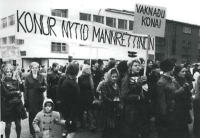
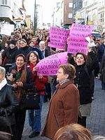

Title: Jafnrétti er ekki nóg
Slug: jafnretti-er-ekki-nog
Date: 2007-06-21 15:03:00
UID: 165
Lang: is
Author: Ólöf Embla Eyjólfsdóttir
Author URL: 
Category: Heimspeki, Kynjafræði
Tags: 

Á öldinni sem leið áttu sér stað stórfelldar og löngu tímabærar breytingar á stöðu kynjanna, a.m.k. hér á Vesturlöndum. Hugmyndir um sjálfsagt og náttúrulegt misrétti lutu í lægra haldi fyrir þeirri skoðun að rangt væri að mismuna helmingi mannkyns á þeirri forsendu einni að þær væru konur. Undir lok sjötta áratugarins höfðu flestar konur í heiminum öðlast kosningarrétt og í dag eru aðeins fáein ríki sem ekki hafa fært Kvennasáttmála Sameinuðu þjóðanna[^1] í lög, en hann bannar alla gerræðislega mismunun á grundvelli kyns. Hér á eftir verða reifaðar tvær kenningar um jafnrétti kynjanna, og þær að lokum bornar saman við misréttiskenningu Þorsteins Gylfasonar um almennt jafnrétti.

Viðteknar hugmyndir vestrænna þjóða um kynjajafnrétti byggir einkum á svokallaðri _kynjamunarhugmynd um jöfnuð kynjanna_. Hún felst í því að einungis sé leyfilegt að mismuna fólki á grundvelli kyns ef raunverulegur munur er á kynjunum og að sá munur skipti máli (sé marktækur). Samkvæmt kenningunni telst ólík meðferð aðeins misrétti að hana megi ekki rökstyðja með tilvísun í slíkan mun. Samkvæmt þessari kenningu er atvinnurekanda því leyfilegt að hafna hæfum kvenkyns umsækjanda á þeim grundvelli að hún sé einstætt foreldri (og því líklegri til að missa úr vinnu en t.d. karlkyns umsækjandi sem þarf ekki að sjá fyrir börnum sínum dag frá degi). Honum er hins vegar óheimilt að hafna henni á þeirri forsendu einni að hún sé kona. 

Vart má deila um að kynjamunarhugmyndin hafi haft víðtæk áhrif á stöðu kvenna í heiminum, enda hefur hún gert þeim kleift að keppa við karlmenn um flest ef ekki öll veraldleg gæði. En njóta konur raunverulegs jafnréttis? Enn skortir t.d. á að hlutur kvenna í stjórnunarstöðum, og þar með áhrif þeirra á mótun samfélagsins, sé jafn hlut karla, hvort sem litið er til atvinnulífsins eða stjórnmála. Vandamálið felst í því að þeir vegir sem konum hafa verið gerðir færir liggja um reynsluheima karlmanna. „Kynjamunarhugmyndin skoðar kynjajafnrétti út frá möguleikum kvenna til að keppa, við kynhlutlausar aðstæður, um hlutverk sem karlmenn hafa skilgreint.“[^2] Þetta er raunin hvort sem litið er til „smávægilegra“ atriða, eins og þess að allir titlar á stjórnunar- og áhrifastöðum gefa í skyn karlkynshandhafa (skóla_stjóri_, ráð_herra_, alþingis_maður_, og svo mætti lengi telja), eða til duldari og jafnframt djúpstæðari áhrifa, svo sem þeirra að atvinnulífinu er háttað eftir þörfum fólks sem ekki þurfa að hugsa um lítil börn. Sú staðreynd, að uppeldishlutverk koma mestmegnis í hlut kvenna, gerir konur berskjaldaðri fyrir mismunun. Þær eiga erfiðara með að sinna ábyrgðarstörfum á karlmiðuðum vinnumarkaði og geta síður sinnt fullu starfi, þetta gerir þær svo aftur fjárhagslega háðari mökum sínum sem hefur bein áhrif á valdajafnvægið í hjónabandinu. Það má einnig almennt vænta þess að flestar konur verði mæður fyrir fertugt. Er atvinnurekanda leyfilegt að hafa það til hliðsjónar þegar hann ræður starfskraft? Það er einnig staðreynd að kona sem skilur við mann sinn verður oft einstæður uppalandi (þ.e.a.s. það er hún sem mun taka að sér að búa börnunum heimili, ekki hann), er atvinnurekanda leyfilegt að taka það inn í dæmið? Slíkar afleiðingar eru hins vegar aðeins tilfallandi vegna samfélagslegrar stöðu kvenna en ekki eitthvað sem háir þeim _vegna þess eins að þær eru konur_, þar af leiðandi er ekki um misrétti að ræða samkvæmt kynjamunarhugmyndinni. Ennfremur má benda á að því kynbundnari sem hin ýmsu hlutverk eru, því verr gagnast kynjamunarhugmyndin til að greina undirliggjandi misrétti. „Því meira sem kynjamisrétti er í samfélagi, því frekar endurspegla félagslegar stofnanir hagsmuni karlmanna, og því minna er um gerræðislegt misrétti.“[^3]

Gagnrýni sem þessi hefur leitt til þess að margir femínistar hafa gefið kynjamunarhugmyndina endanlega upp á bátinn og tekið í stað hennar upp svonefnda _valdahugmynd um jöfnuð kynjanna_ (e. the dominance approach). Samkvæmt henni þurfa konur að öðlast vald til að skapa og endurskilgreina hin ýmsu hlutverk í samfélaginu með hliðsjón af hagsmunum og þörfum kvenna. „[K]ynjamun (raunverulegan eða ímyndaðan) má aldrei nota sem grundvöll fyrir, eða réttlætingu á, misrétti eða yfirráðum karlmanna.“[^4] Femínistinn Elizabeth Gross gengur svo langt að hafna alfarið hugmyndinni um jafnrétti sem grundvelli fyrir jöfnuð kynjanna. Jafnrétti hefur verið reynt og það hefur reynst ófullnægjandi, valdahugmyndin snýst um að heyja þurfi baráttuna á grundvelli sjálfræðis. Kymlicka vill þó ekki taka undir þessa tvískiptingu Gross, hann telur að valdahugmyndin sé ekki andstæð jafnréttishugsjónum, heldur feli hún í sér dýpri sýn á hvað felist í raunverulegu jafnrétti.[^5]

Fleira má nefna til sögunnar hér, t.d. hvað varðar mat samfélagsins á því hvað telst til verðleika. „Karllegir“ eiginleikar, eins og harka, áræði og samkeppni, eru upphafnir (sérstaklega í atvinnulífinu og stjórnmálum) á meðan „kvenlegir“ eiginleikar, eins og mýkt, nægjusemi og samningsvilji, eru oft taldir vera merki um veikleika. Vissulega er ekkert einfalt í þessum efnum, hvorki hvað varðar slíka skiptingu á eiginleikum í karllega og kvenlega, né hvað varðar verðleikamat þeirra. Hitt er þó varla hægt að deila um, að slíkar staðalmyndir tíðkast í samfélaginu, og í þeirri mynd sem hér var nefnd. En ef það er rétt á annað borð að til séu eiginleikar sem hægt er að eigna öðru kyninu sérstaklega (þó augljóst sé að slík flokkun gæti aldrei verið algild), ætti ekki að meta þá á eigin forsendum, ef svo má að orði komast, fremur en að bera þá saman? Hvaða hlutlausa mælikvarða mætti svo sem nota til slíks samanburðar? Ég ætla ekki að leggja í það hér að sýna fram á gildi hinna svokölluðu „kvenlegu“ eiginleika, enda hlýtur hver hugsandi manneskja að vera fær um að sjá gildi þeirra sjálf.

Í fyrirlestri einum um „Jöfnuð og jafnrétti“ lagði Þorsteinn Gylfason til misréttishugmynd um jafnrétti, en hún felst í því að skilgreina jafnrétti út frá misrétti, en ekki öfugt: _jafnrétti í ákveðnu samhengi er afnám misréttis í því samhengi_. Misrétti er hins vegar _misskipting sem ræðist af ranglátum forsendum_. Markmiðið hér er að líta á kjarna misréttishugmyndarinnar og spyrja hvernig henni vegnar þegar hún er yfirfærð á jafnréttisbaráttu kynjanna.

Við fyrstu sýn hljómar kenning Þorsteins afar sannfærandi. En þá ber að spyrja, hvernig skilgreinir maður ranglátar forsendur? Þorsteinn tekur einfalt dæmi um læknisþjónustu, þar sem misskipting getur talist réttlát ef hún ræðst af heilsufari sjúklings, en ranglát ef hún ræðst t.d. af fjárhag. Ég sé því ekki betur en að Þorsteinn telji þær forsendur réttlátar sem lúta beint að því sem skiptir máli í samhenginu, þ.e. þær sem eru _marktækar_. Með strangri túlkun má því segja að misréttiskenningin, þegar henni er beitt á jafnréttisbaráttuna, sallist niður í kynjamunarhugmyndina og falli þar af leiðandi einnig á gagnrýni valdasinna. Með öðrum orðum, hafi kynjamunur raunveruleg áhrif í einhverju samhengi, þá geti hann verið réttlát forsenda misskiptingar í því samhengi.

En málið þarf þó ekki að vera svo einfalt. Sitt hvað getur hverjum fundist um hvað teljist til _ranglátra forsenda_. Kynjamunarhugmyndin byggir á því að marktækar forsendur _séu_ réttlátar forsendur misskiptingar. Valdahugmyndin telur hins vegar sjálfræði og jöfn áhrif kynjanna grundvöll jafnréttisins, og að _öll tilvísun_ til kynjamunar sé ranglát forsenda misskiptingar. Það er því ekki nóg að leggja áherslu á greinargerð fyrir jafnrétti á grundvelli misréttis, það sem skortir er greinargerð fyrir réttlátum forsendum í ljósi þess kynhalla veruleika sem við búum við.

[^1]: Fullt heiti sáttmálans er Samningur um afnám allrar mismununar gagnvart konum (Convention on the Elimination of All Forms of Discrimination against Women). Til fróðleiks má þess geta að Bandaríkin eru eina vestræna ríkið sem ekki hefur lögfest samninginn.

[^2]: Will Kymlicka, Contemporary Political Philosophy, Oxford: Oxford University Press, 2002, bls. 378.

[^3]: Kymlicka, bls. 383.

[^4]: Sama heimild, bls. 383.

[^5]: Sama heimild, bls. 384.

