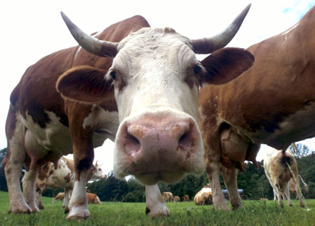

Title: Jórtrað á hugsunum
Slug: jortrad-a-hugsunum
Date: 2008-05-01 11:25:06
UID: 279
Lang: is
Author: Sólveig Hlín Kristjánsdóttir
Author URL: 
Category: Sálfræði
Tags: jórtrun, Sálfræði, þunglyndi, kvíði, neikvæðar hugsanir, jákvæðar hugsanir

Að jórtra er hugtak sem á ekki einungis við um meltingu jórturdýra heldur getur líka átt við ákveðið hugarástand. Dýrin jórtra á fæðunni, velta henni aftur upp í munninn til að tyggja betur og melta fæðuna þannig. Sama tuggan kemur upp aftur og aftur þar til búið er að mala hana nægilega. Þetta hugtak lýsir ágætlega því hugarástandi þegar fólk veltir vandamálum sínum fyrir sér í sífellu. Vandamálum er velt upp og þau könnuð í þaula í þeim meinta tilgangi að finna lausn á þeim. Jórtrun hjálpar jórturdýrum við að melta fæðuna en hjálpar að sama skapi ekki fólki til að fá úrlausn sinna mála. Það má líka segja að þegar fólk jórtrar er það eins og hamstur í hlaupagrind, fer alltaf í hringi og kemst ekkert áfram. Tilfinningar eru óhóflega íhugaðar og farið er fram og aftur og eigið hugarástand skoðað. Reynt er að skilja þá tilfinningu sem verið er að upplifa, orsök þeirra og afleiðingu. En jórtrun felur ekki í sér lausnir því verið er að hringla í upplifuðu tilfinningaástand.

Algengt er að jórtrarar hugsi í þaula um vanda eins og missi, bakslag, ákvarðanatökur og höfnun en allt leiðir þetta til neikvæðra tilfinninga. Að vera sífellt að velta sér upp úr nýliðnum atburðum og tilfinningaástandi tengdu þeim er dæmigerð jórtrun. Fólk spyr sig spurninga eins og „Af hverju líður mér svona?“, „Af hverju gerðist þetta?“, „Hvað var að gerast?“, „Hvað gerði ég rangt?“, og „Hvað sagði ég vitlaust?“. En það er líklegra að jórtrurum fallist hendur þegar taka á ákvarðanir sem gætu leyst vandamálin því jórtrunin veldur því að tillagan er vefengd og mikið spáð í kosti og galla og tækifærið getur jafnvel runnið þeim úr greipum. Þannig verður lítil framþróun og sífellt hjakkað í sama farinu. Að reyna í sífellu að finna útskýringu á tilfinningum sínum með því að hugsa um þær leiðir sjaldnast til svara.

Jórtrun getur líka haft áhrif á félagsleg samskipti því fæstum finnst gaman að hlusta á sama japlið endalaust. Þó svo að jórtrarar leiti eftir aðstoð annarra með vandamál sín þá er ólíklegra að þeir fái stuðning bæði vegna þess að fólki leiðist að hlusta endalaust á sama nöldrið og af því að jórtrarar finna alla meinbugi á tillögum til lausnar. Í fyrstu fá jórtrarar mikla samúð sem síðan minnkar smám saman þegar jórtrunin heldur áfram. Jórtrun fælir annað fólk frekar frá og þá fær jórtrarinn auðvitað enn meira til að jórtra á „Af hverju fara þau?“, „Af hverju eru þau svona gagnrýnin?“ og svo framvegis.

Fólk sem jórtrar mikið telur það gagnast og að með því öðlist það innsýn inn í eigið hugarástand, öðlist útskýringar á tilfinningum sínum og að þannig muni þær leysast upp og breytast úr neikvæðum í jákvæðar. Jórtrarar telja að þessi iðja leiði til þess að þeir finni lausnir á vandamálum sínum og að álag minnki. Fólk jórtrar til þess að finna svar við sínum vanda og vegna þess að því finnst eins og nauðsynlegt sé að vita orsök vandans til að hann leysist. Einnig er algengt að fólk telji að jórtrun leiði til þess að það fái útskýringar á því af hverju eitthvað gerðist. Mögulega byrjar fólk að jórtra vegna þess að það heldur að með því nái það að leysa úr erfiðum aðstæðum og komast yfir vandamál sín.

Í raun gerist hið gagnstæða því við jórtrun er farið dýpra ofan í vandann og þannig eykst vanlíðan. Vandinn virðist óleysanlegur og þá fer fólk að hugsa um af hverju ekki sé hægt að leysa vandann. Fólk sem er niðurdregið og þunglynt jórtrar óhóflega á eigin tilfinningum, á ástæðum og afleiðingum tilfinninga sinna. Stöðug sjálfsíhugun er ekki hugsunarháttur sem ýtir undir framfarir og hindrar í raun aðrar tilfinningar sem gætu breytt þeim tilfinningum sem verið er að velta fyrir sér. Þannig viðheldur jórtrun þeim tilfinningum sem eru til staðar og verið er að ígrunda. Það er ekki hollt að viðhalda neikvæðum tilfinningum eins og leiða og vonbrigðum. Jórtrun takmarkar tækifæri á því að upplifa aðrar tilfinningar og getur þannig staðið í vegi fyrir að fólk upplifi hamingjustundir.

Það er líka óholt að jórtra á jákvæðum tilfinningum því þá er líklegt að hugarástandinu ljúki. Þegar tilfinningar og aðstæður eru krufðar til mergjar er jafnvel komist að því að atburðurinn sem leiddi til jákvæðra tilfinninga hafi í raun ekki skipt miklu máli og þannig slokknar á jákvæðum tilfinningum. Hamingjusamt fólk eyðir minni tíma í að hugsa um tilfinningar sínar en fólk sem er óhamingjusamt.

Hlutverk neikvæðra og jákvæðra tilfinninga er ólíkt í þróunarfræðilegu samhengi. Neikvæðar tilfinningar eins og til dæmis hræðsla hjálpa okkur að bregðast við og þá er ekki hollt að velta mikið fyrir sér valmöguleikum sínum eða hafa rými til að upplifa aðrar tilfinningar á meðan. Jákvæðar tilfinningar hjálpa okkur hinsvegar að vega og meta kosti í þeirri stöðu sem við erum í. Jákvæðar tilfinningar eins og sátt, gleði og áhugasemi hjálpa okkur að bregðast rétt við, kanna umhverfi okkar og taka betur eftir. Þannig hjálpa þær okkur að þróa og þroska ýmis úrræði. Þær hafa því breiðari verkun en bara einmitt þegar þær eru upplifaðar. Fólk sem er hamingjusamt notar jákvæðar tilfinningar sér í hag og tekur sér fyrir hendur verkefni sem það veit að eru ánægjuleg. Þannig kemur það í veg fyrir að neikvæðar tilfinningar hafi eins djúpstæð áhrif á það.

Jórtrun er ekki einungis einkenni þunglyndis heldur líka áhættuþáttur. Jórtrun er eykur líkur á lengra þunglyndistímabili og á almennri kvíðaröskun. Jórtrun lengir depurðartímabil þar sem því lengur sem jórtrað er því lengur er neikvæða hugarástandið til staðar. Þegar jórtrað er, þá hindrar það aðrar tilfinningar en einmitt þær sem verið er að jórtra um, þannig skerðist hugsanaflæðið sem takmarkar möguleikan á því að upplifa aðrar tilfinningar. Jórtrun hefur áhrif á einbeitingu og veldur því að erfiðara er að sinna verkefnum. En um leið og farið er að sinna öðrum verkefnum sem krefjast athygli eins og að elda mat, fara út að hjóla, horfa á bíómynd, vaska upp eða annað slíkt, þá breytist athyglin og maður hættir að hugsa um eigin tilfinningar stundarkorn og fer að hugsa um verkefnið sem liggur fyrir. Að reyna að veita smáatriðum eftirtekt getur líka verið verkefni t.d. í verslun. Hugleiðsla þar sem einbeitingin er á öndun getur líka brotið upp jórtrunina, eða það að biðja bænir eða velta fyrir sér umhverfishljóðum. Þegar við erum að sinna verkefnum sem krefjast einbeitingar þá verður jórtrun erfiðari og hugarástandið breytist. Þá eiga jákvæðari tilfinningar, eins og þær sem tengjast verkefninu, mun greiðari aðgang.

Að taka sér eitthvað fyrir hendur er því mun árangursríkari leið til að losna við neikvæðar tilfinningar heldur en að dvelja við þær og ígrunda þær í þaula. Þegar pláss er fyrir aðrar jákvæðari tilfinningar þá er einnig líklegra að lausn finnist á vandamálinu.
