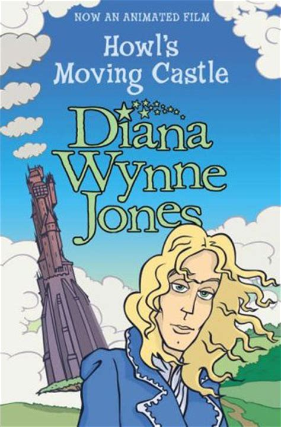
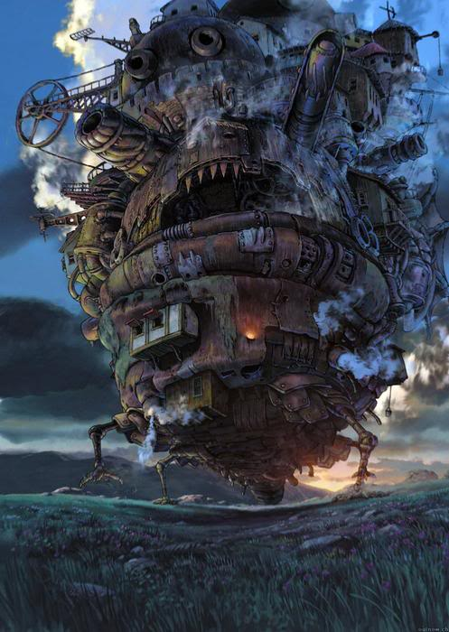
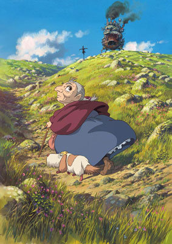

Title: Kastalahrúgald á tveimur jafnfljótum
Slug: kastalahrugald-a-tveimur-jafnfljotum
Date: 2007-11-29 11:58:00
UID: 199
Lang: is
Author: Íris Ellenberger
Author URL: 
Category: Teiknimyndir
Tags: 

Í tæpa þrjá áratugi hefur rithöfundurinn Diana Wynne Jones sent frá sér eina bók á ári, hugmyndarík og ærslafull ævintýri fyrir börn og fullorðna. Hún var lengi ókrýnd drottning breskra barnabókmennta og þurfti aðeins nýlega að víkja fyrir J.K. Rowling, en þó ekki fyrr en í fulla hnefana. Árið 1986 gaf hún út _Howl’s Moving Castle_ sem fjallar um Sophie, verndaða og hlédræga unglingsstúlku sem eldist um rúma sjö áratugi í einu vetfangi. Til að aflétta álögunum verður hún að hafa uppi á töframanninum Howl sem einn getur komið í veg fyrir að Sophie verði ellidauð áður en hún kemst af gelgjuskeiði.

Fimmtán árum eftir útkomu bókar Jones ákváðu forsvarsmenn Studio Ghibli, eins virtasta teiknimyndastúdíós Japans, að gera mynd eftir henni. Stúdíóið hefur ekki ómerkari menn innanborðs en Isao Takahata og Hayao Miyazaki en þó var ákveðið að fá utanaðkomandi leikstjóra til verksins í fyrsta skipti í sögu þess. Mamoru Hosoda varð fyrir valinu en hann stóð ekki undir gífurlegum væntingum stúdíósins og hrökklaðist frá verkinu. Hayao Miyazaki tók þá sjálfur að sér handrit og leikstjórn myndarinnar og það þrátt fyrir yfirlýsingar sínar um að _Andans ævintýri_ (Sen to Chihiro no Kamikakushi) yrði hans síðasta mynd.

Hayao Miyazaki fæddist í Tókýó árið 1941 og fagnar nú 44 ára starfsafmæli við teiknimyndagerð. Hann hóf feril sinn sem teiknari og vakti strax athygli fyrir einstaka hæfileika og óþrjótandi ímyndunarafl. Árið 1982 hóf hann gerð teiknimyndasögunnar _Nausicaa of the Valley of the Wind_ (Kaze no Tani no Naushika) og tveimur árum síðar var honum boðið að gera teiknimynd um Nausicu. Hann setti það skilyrði að fá Isao Takahata, annan meistara japanskra teiknimynda, sem samstarfsmann og var samvinnan kveikjan að stofnun Studio Ghibli. 

Frá og með miðjum níunda áratugnum gerði Miyazaki hverja gersemina á fætur annarri á milli þess sem hann tók að sér smærri verkefni við framleiðslu enn fleiri teiknimynda. Meðal annars leikstýrði hann og skrifaði handritið að _My Neighbour Totoro_ (Tonari no Totoro) árið 1988 og _Porco Rosso_ (Kurenai no Buta) árið 1992, sem hefur flugmann í svínslíki fyrir aðalpersónu. Myndin um úlfadótturina _Princess Mononoke_ (Mononoke Hime) vakti heimsathygli 1997 og er sú eina eftir Miyazaki sem sýnd hefur verið hingað til í bíó á Íslandi. Sumarið 2002 var _Andans ævintýri_ (Sen to Chihiro no Kamikakushi) frumsýnd í Japan og hlaut hún fádæma viðtökur. Myndin sló aðsóknarmet _Titanic_ í Japan og sópaði til sín verðlaunum, hlaut m.a. Óskarsverðlaun og Gullna björninn á kvikmyndahátíðinni í Berlín. Ekki fengum við að sjá _Andans ævintýri_ í íslenskum kvikmyndahúsum en hún var valin besta myndband ársins 2003 af _Morgunblaðinu_.

Miyazaki leggur gríðarlega vinnu í myndir sínar og er með puttana í öllu svo jaðrar við fullkomnunaráráttu. Hann átti það til að angra teiknarana með endalausum lagfæringum og breytingum uns hann náði tilætluðum árangri, t.d. hafði hann persónulega umsjón með 80.000 römmum Princess Mononoke allt til að ganga úr skugga um að persónurnar „hagi sér rétt“. Vegna vinnuálagsins fór Miyazaki þó að veita undirmönnum sínum aðeins meira sjálfstæði en samt hefur hann endurtekið staðhæft að hann ætli á eftirlaun, t.d. eftir að _Andans ævintýri_ kom út 2002. Enda var Miyazaki var ekki fenginn til að skrifa og leikstýra _Howl’s Moving Castle_ (Hauru no Ugoku Shiro) frá upphafi. Þó mætti halda að Jones hafi skrifað söguna fyrir hann einan. Þetta er þroskasaga hlédrægrar ungrar konu; sagan er uppfull af kynlegum skepnum, fólki í furðulegustu álögum, spennandi ferðalögum og svölum kvenpersónum. Allt þetta hefur einkennt síðustu myndir Miyazakis. Hann skortir einungis tækifæri til að koma dálæti sínu á flugi og trjám að.

_Howl’s Moving Castle_ sannar að Miyazaki er enn í essinu sínu. Teiknistíllinn einn myndi nægja til að laða fólk í bíó. Hann er ljóðrænn á köflum og ímyndunarafl Miyazakis er engu líkt. Miyazaki er hrifinn af mikilfenglegu landslagi og náttúru sem hann undirstrikar með björtum og tærum litum. Hann er næmur á smáatriði sem koma fram í hönnun hans á stórkostlegum tækjum, tólum og byggingum sem heilla unga sem aldna. Persónur eru listilega útfærðar og látbragð þeirra eykur á glensið, sérstaklega þegar fuglahræður, kastalar og arineldar taka sporið. Joe Hiaishi styður sem fyrr dyggilega við bakið á Miyazaki með tónlist sinni. Miyazaki leggur sig í lima við koma sýn sinni óskiptri til skila á hvíta tjaldið sem útheimtir þvílíka ósérhlífni að hann sér eftirlaun í hillingum.

Miyazaki gerði róttækar breytingar á sögu bókarinnar _Howl’s Moving Castle_ og lagði þær fyrir Jones sem var hæstánægð með útkomuna. Þótt undarlegt megi virðast hefst allsherjar þeysireið þegar gamlinginn Sophie haltrar af stað í leit að hinum dularfulla töframanni. Howl til mikillar armæðu þröngvar Sophie sér upp á heimilisfólkið sem ráðskona í stórkostlegu kastalahrúgaldi sem ferðast um á tveimur jafnfljótum fyrir tilstilli bitra „arineldsins“ Calcifer og hefur aðaldyr sem liggja að fjórum mismunandi stöðum, þar á meðal tveimur ólíkum borgum. Töframaðurinn mikli reynist dramatísk gelgja sem hefur meiri áhyggjur af hári sínu en að leysa unga konu úr álögum. Sophie verður því að hjálpa sér sjálf, m.a. með því að grafast fyrir um dularfulla fortíð Howl. Kímnigáfa Miyazakis fær að njóta sín í glettnum aukapersónum, aðstoðarmanninum Marco, „lifandi“ fuglahræðu, astmaveikum hundi og ævafornri norn sem gengur í barndóm. Í bakgrunni myndarinnar geisar ógnvænlegt stríð sem Sophie, Howl og allir hinir dragast inn í en útkoman er samt sem áður ein hin skemmtilegasta þroskasaga ungrar konu.

Afstæði aldurs er rauði þráðurinn í _Howl’s Moving Castle_. Miyazaki segir sjálfur að hann hafi ætlað að gera barnamynd en heimspekilegar vangaveltur um æviskeið höfði ef til vill frekar til fullorðinna. Hvernig mótumst við af aldri okkar? Ákvarðar hann líf okkar eða þurfum við nokkuð að haga okkur í samræmi við árafjölda? Hvað á unglingsstúlka að gera þegar hún sökum elli gæti hrokkið upp af á hverri stundu? Hin hlédræga Sophie hefur sóað lífi sínu við þrotlausa vinnu en fyrst þegar hún hrekkur af léttasta skeiði öðlast hún þor til að halda á vit ævintýranna.

Miyazaki vinnur nú að nýrri mynd sem hefur hlotið titilinn _Gake no ue no Ponyo_ og mun hún fjalla um gullfiskaprinsessuna Ponyo og mennska drenginn Sosuke. Flest viðkomandi myndinni er enn hernaðarleyndamál en Miyazaki-aðdáendur á öllum aldri bíða spenntir eftir næsta stórvirki meistarans.

