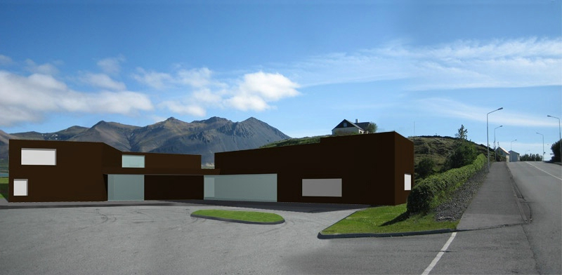
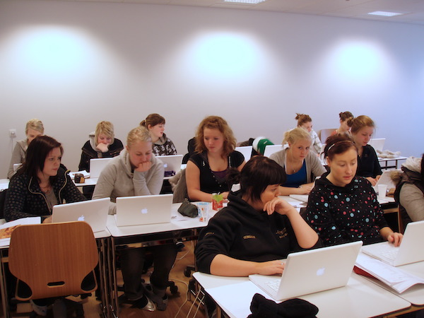

Title: Kennsla í fartölvuskóla
Slug: kennsla-i-fartolvuskola
Date: 2008-04-22 08:28:58
UID: 271
Lang: is
Author: Ívar Örn Reynisson
Author URL: 
Category: Kennslufræði
Tags: sögukennsla, Menntaskóli Borgarfjarðar, Menntaborg, Sparisjóður Mýrasýslu, Apple, Ársæll Guðmundsson, Lilja Sesselja Ólafsdóttir, Borgarnes, Borgarfjörður, framhaldsskóli, fartölvur, símat, stúdentspróf

Síðastliðið haust tók til starfa í Borgarnesi nýr framhaldsskóli, Menntaskóli Borgarfjarðar. Skólinn er fyrir margra hluta sakir sérstakur og er þar einna helst að nefna að öllum nemendum í fullu námi eru lánaðar fartölvur þann tíma sem þeir stunda nám við skólann og geta svo keypt tölvurnar að námi loknu. Verkefnið er unnið í samstarfi við Apple umboðið á Íslandi og Sparisjóð Mýrarsýslu. Aðrir þættir þar sem Menntaskóli Borgarfjarðar hefur sérstöðu eru t.d. eignarhald, en skólinn er einkaskóli, námsmat, en enginn prófatími er í desember og maí og fjöldi starfsdaga er alls 9 dögum fleiri á ári en í hefðbundnum framhaldsskólum. Þá verður hægt að útskrifast til stúdentsprófs úr skólanum á þremur árum á eðlilegum námshraða.

Reynsla höfundar af fartölvuvæðingunni er á langflestan hátt jákvæð. Nemendur hafa stöðugan aðgang að vinnutæki sínu, þ.e. að þeir eiga auðvelt með að nota tölvurnar í eyðum til að vinna að ritgerðum og öðrum verkefnum, skólinn er nálægt því að vera pappírslaus, og svona mætti lengi telja. Gallarnir eru hins vegar augljósir. Kennslufræði fartölvuskóla verður ólík hefðbundinni kennslu. Nemendur sem hafa stöðugt opinn skjá fyrir framan sig freistast sumir hverjir til að gera hluti sem þeir eiga ekki að gera í tímum. Kennslufræði fartölvunnar gengur því að mestu leyti út á að nemendur hafi nóg fyrir stafni sjálfir, séu virkir sem stærstan hluta kennslustundarinnar. Það þýðir því lítið fyrir kennara að ætla að tala stöðugt í 80 mínútur. Þetta verður til þess að nemendur sofa ekki í tímum, þeir öðlast mikla færni í vinnubrögðum, þeir öðlast gífurlega færni í upplýsingatækni og síðast en ekki síst öðlast þeir mikið sjálfstraust í öllu framangreindu.

Nemendur eru sjálfir gríðarlega ánægðir með það að fá tölvu til einkanota. Þeir nota hana í ýmislegt annað en námið eins og gefur að skilja og það eitt og sér eykur lífsgæði þeirra. Þá standa hugmyndir til að gera allt nám við skólann að dreifnám, að ekki verði um sérstaka fjarnámsáfanga að ræða heldur verði allar kennslustundir teknar upp og verði ávallt aðgengilegar fyrir alla nemendur, hvort sem þeir eru á staðnum eða ekki. Nemendur hafa stöðugan aðgang að internetinu sem gerir það að mikilvægu námsefni. Þannig notar höfundur t.d. ekki kennslubók í sögukennslu sinni. Sögukennsla höfundar fer þannig að stærstu leiti fram á internetinu með verkefnamiðaðri kennslu. Áfanginn er skipulagður þannig að tekin eru fyrir átta þemu úr mannkynssögunni og unnin heimildaverkefni úr hverju þeirra. Að auki er síðan eitt stórt heimildaverkefni sem nemendur velja sér úr einu þessara átta þema. Meðal minni verkefna eru einfaldar stuttar ritgerðir, 400-1000 orð með heimildavinnu sem yfirleitt byggist á heimildum af netinu, gjarnan wikipedia eða vísindavefnum. Þá hafa nemendur skilað teiknimyndasögum, wikipediastubbum og unnið samvinnuverkefni á docs.google.com sem væri varla gerlegt án þess að hafa stöðugan aðgang í öfluga tölvu. Eins og sjá má eru heimildir mikið notaðar og rýndar rækilega. Þannig hafa skapast frjóar umræður í kringum verkefni hvað varðar ábyggilegar og óábyggilegar heimildir. Mikill áhugi virðist skapast í kringum einstaka þætti mannkynssögunnar og geta nemendur þá valið sér að gera stóra verkefnið um það sem hefur vakið sérstakan áhuga þeirra.

Markmið áfangans er fyrst og fremst að kenna nemendum vinnubrögð. Skoðun höfundar er sú að nemendur sem læra vinnubrögð gleyma þeim mun síður en sú þekking sem næst með því að t.d. hlusta á fyrirlestur. Að auki læra þau í stuttum ritgerðum töluvert um það efni sem þau skrifa um. Gallinn er hins vegar sá að ekki næst ítarlegur krónólógískur skilningur á mannkynssögunni. Þá falla ýmsir þættir út þegar nemendur taka t.d. einungis fyrir ákveðna þætti iðnbyltingar, t.d. uppfinningu James Watt á gufuþéttinum, þá missa þeir af öðrum þáttum, t.d. borgavæðingu. Slíkt er þó hægt að laga með kynningum nemenda á verkefnum sínum.

Engin formleg lokapróf eru haldin í skólanum, heldur eru nemendur metnir í reglulegum viðtölum og með fyrrnefndum verkefnum og ýmsum æfingum og prófum. Það að hafa engin formleg lokapróf kallar á að kennarar séu þeim mun öflugri í að vita nákvæmlega hvað hver nemandi kann, af vel fyrirfram skilgreindum markmiðum. Mat þarf þannig að vera mjög nákvæmt og gegnsætt, nemendur þurfa að vita nákvæmlega til hvers er ætlast og hvað stendur á bak við einkunnina. Einhver kann að spyrja hvernig vinnist tími til að standa við öll þessi fögru fyrirheit, en svarið við því er sáraeinfalt. Þegar kennari hættir að eyða tíma sínum í að tala sjálfur og kennslustofan er orðin að vinnustofu, þá eru nemendur einfaldlega að vinna í sínum verkefnum og kennarinn er að vinna að sínum störfum, t.d. getur hann þá tekið nemendur út í viðtöl, hann getur verið að sinna mati, búa til verkefni og fleira þess háttar. Auðvitað eru ekki allar mínútur allra kennslustunda með þessum hætti, kennari þarf oftar en ekki að ganga um og hjálpa nemendum.

Menntaskóli Borgarfjarðar er í mjög hraðri þróun. Skólinn gefur sér þrjú ár til að ná tökum á fyrirbærum eins og flæðinámi, sem gengur út á að nemendur geti flætt áfram í námi óháð önnum og skólaárum, dreifnámi og til að fullvinna símatskerfin. Óhætt er að segja að það er afar spennandi fyrir ungan kennara að fá að taka þátt í starfi sem þessu. Þó má ekki gleymast að góðir kennarar eru lykillinn að góðum skólum, sama hversu góður tækjabúnaðurinn er. Þó mætti hvetja stjórnvöld til að skoða vandlega þann kost að fartölvuvæða alla nemendur framhaldsskóla. Það gæti kostað 180-360 milljónir á ári. Allar upplýsingar um skólann er að finna á menntaborg.is.

