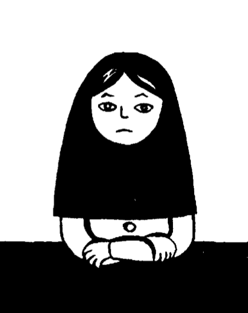

Title: Kim Wilde í Íran
Subtitle: Um teikni&shy;mynda&shy;sögur Marjane Satrapi
Slug: kim-wilde-i-iran
Date: 2005-10-18 00:01:00
UID: 5
Lang: is
Author: Íris Ellenberger
Author URL: 
Category: Bókmenntir, Teiknimyndir
Tags: 

„Ha! Eru gefnar út teikni&shy;mynda&shy;sögur eftir konur í Íran?“ spyr Vestur&shy;landa&shy;búinn ég eftir að hafa uppgötvað áhuga&shy;verðan nýliða í teikni&shy;mynda&shy;sögu&shy;bransanum, Marjane Satrapi. Um leið rámaði mig í að hafa séð kvik&shy;mynd eftir 18 ára íranskt stelpu&shy;skott; svo að tjáningar&shy;frelsi kvenna í Íran virðist ekki gjör&shy;samlega fótum troðið. Að vísu er Satrapi búsett í París og bækur hennar hafa aldrei verið gefnar út í Íran. Það hlaut líka að vera því þar mega konur varla sýna hár&shy;lokk án afskipta lög&shy;reglunnar, eða hvað? Í augum Vestur&shy;landa&shy;búans er Íran fullt af mótsögnum, opinber ímynd og frétta&shy;flutningur stangast á við þær fáu upplýsingar sem fengnar eru eftir öðrum leiðum.

Þegar Marjane Satrapi dvaldi í Frakklandi við listnám þurfti hún sífellt að leiðrétta franskan frétta&shy;flutning frá Íran því henni fannst þær síst endurspegla hennar raun&shy;veru&shy;leika. Hún fór að segja vinum sínum sögur af heima&shy;landinu, hún útskýrði fyrir þeim ástandið; hvernig almennir íranskir borgarar upplifðu það sem greint var frá á dramatískan hátt í fjölmiðlum. Þegar hún hafði lokið námi sínu hvöttu vinirnir hana til að koma sögum sínum á bók og bentu henni á ævisögulegar teikni&shy;mynda&shy;sögur eins og til dæmis Maus eftir Art Spiegelman. Fyrsta bindi Persepolis kom út í Frakk&shy;landi árið 2000 og en utan þeirrar seríu hafa tvær sjálfstæðar bækur litið dagsins ljós.

Persepolis er byggð á ævi Satrapi. Hún er dóttir einarðra marxista sem leyfðu dóttur sinni að leika lausum hala á götum Teheran og veittu henni afar pólitískt uppeldi. Satrapi var aðeins 10 ára þegar byltingin átti sér stað og við kynnumst grund&shy;vallar&shy;breytingum á samfélaginu með augum barns sem skilur t.d. ekki hvers vegna það þarf skyndilega að bera blæju og kemur sér sífellt í vandræði fyrir að tjá skoðanir sínar of frjálslega. Aðeins 14 ára er henni ekki lengur óhætt í Íran og hún er send í skóla til Austurríkis. Þar reynir hún allt til að samlagast samfélaginu með þeim afleiðingum að hún bælir niður öll merki um uppruna sinn, týnir sér í vestrænni menningu og endar að lokum á götunni áður en henni er kippt aftur til Íran.

Þegar heim er komið er stríðið milli Íran og Írak yfirstaðið. Þjóðin er lang&shy;þreytt og fólk er of upptekið við að passa upp á „siðlegt“ útlitið til að velta réttindum sínum fyrir sér. Satrapi kemst í listnám en bakar sér sem fyrr vandræði með því að tjá efasemdir sínar um fyrir&shy;skipaðar reglur. Í gegnum andstöðu sína öðlast hún sjálf&shy;svirðingu á ný en finnur sig að lokum knúna til að fara af landi brott, þá til Frakklands þar sem hún hefur búið síðan.

Persepolis virðist í fyrstu hetjusaga ungrar, hugrakkrar konu í harð&shy;stjórnar&shy;ríki. Bókin fjallar þó aðallega um hvernig borgararnir halda áfram að lifa lífinu á sinn hátt þrátt fyrir tilraunir klerka&shy;stjórnarinnar til að bæla niður fjölmarga þætti mannlegs eðlis. Ungmennið Marjane hlustar á Kim Wilde, veggfóðrar herbergi sitt með myndum af pönk&shy;hljóm&shy;sveitum og glápir á MTV. Unga fólkið heldur partí, drekkur og dansar. Ungar konur mála sig, stundum í óhófi, og ástfangin pör sinna tilhugalífinu af miklum móð. Aðeins bregður á skugga þegar lögreglan mætir á svæðið og refsar þeim fyrir að nýta sjálfsagðan rétt til að njóta lífsins.

Persepolis gerði Vestur&shy;landa&shy;búum kleift að líta á bak við opinbera ímynd Íran og í kjölfarið hélt Satrapi áfram að segja frá daglegu líf Írana. Hún skyggnist enn lengra á bak við blæjuna í bókinni Embroideries, sem kom fyrst út árið 2003 í Frakklandi og fjallar um íranskan „saumaklúbb“. Þar segir frá teboði ömmu Satrapi þar sem nokkrar eldri konur koma saman til að spjalla um daginn og veginn. Haldi maður að íranskar konur á eftir&shy;launaaldri séu íhalds&shy;samar og siðsamar kemst maður fljótt að öðru. Umræðu&shy;efnið er kynlíf og meira kynlíf með tilheyrandi blót&shy;syrðum og ófáguðu orðbragði. Fram&shy;hjáhöld, hvernig á að falsa meyjarhaft og fleira er til umfjöllunar, s.s. allt það sem maður vill ekki vita um ömmur sínar. 

Satrapi er því hvergi nærri hætt að leið&shy;rétta sýn okkar Vestur&shy;landa&shy;búa á Íran og leiðrétta fréttaflutning og fordóma. Í endur&shy;minningum hennar sjáum við glöggt að Íranir eru ekki endilega heila&shy;þvegnir af klerka&shy;stjórninni né kúgaðir til algerrar hlýðni. Þeim tekst að sinna þörfum sínum fyrir skemmtanir, afþreyingu og rómantík þótt reynt sé að stjórna lífi þeirra og siðferðis&shy;viðmiðum. Bækurnar draga einnig upp grát&shy;broslega mynd af opinberu reglu&shy;farganinu og örand&shy;spyrnu&shy;aðgerðum borgaranna. Sýnilegir hár&shy;lokkar og andlits&shy;farði verða ágætis uppreisnartól og rauðir sokkar þykja mjög grun&shy;samlegir eins og Satrapi fékk sjálf að reyna.

Teikni&shy;mynda&shy;sögur Satrapi sýna okkur umfram allt að mannlegt eðli er svipað hvar sem fólk er staðsett í heiminum. Bak við tjöldin í Íran sjáum við svo margt sem við þekkjum. Við raulum „We're the Kids in America“ með aðalsöguhetjunni, skiljum kenndir gömlu kvennanna í saumaklúbbnum, upplifum fyrstu ástina aftur í nýju umhverfi og dönsum fram á rauða nótt í félagsskap listnema í Teheran. 

---

<small class="blurb">Meiri upplýsingar um Satrapi og skrif hennar má fá á slóðinni: http://www.randomhouse.com/pantheon/graphicnovels/persepolis.html</small>

