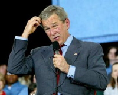
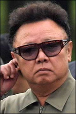
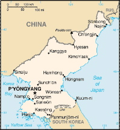

Title: Kjarnavopn á Kóreuskaga
Slug: kjarnavopn-a-koreuskaga
Date: 2007-09-13 11:37:00
Part: 1/2
UID: 178
Lang: is
Author: Hilmar Magnússon
Author URL: 
Category: Alþjóðasamskipti
Tags: 

Grein þessari er ætlað að fjalla stuttlega um markmið og framvindu í viðræðum þeim sem Norður Kórea hefur átt í við umheiminn um kjarnorkuvopnaáætlun sína undanfarin ár. Í greininni verður reynt að varpa ljósi á hvort eitthvað hafi þokast í átt að samkomulagi um að fá ríkið til að hverfa frá kjarnavopnastefnu sinni. Eins verður litið á hvort eitthvað hafi breyst í samskiptum Norður Kóreu við önnur ríki heimsins og þá sérstaklega Bandaríkin.

Greininni er skipt í tvo hluta og verður sá fyrri helgaður sögu N-Kóreu, ásamt því að fjalla um kjarnorkupólitík ríkisins og samningaviðræður við umheiminn. Seinni hlutanum er ætlað að gera grein fyrir því hvert viðræðurnar hafa leitt, hvaða lausnir hafa skotið upp kollinum sem og hvernig þær hafa verið gagnrýndar. Þá verður einnig gerð grein fyrir helstu niðurstöðum.

### „Öxulveldi hins illa“ fæðast og vaxa

Margir yrðu eflaust æfir, væru þeir svo mikið sem nefndir á nafn í sömu andrá og fyrirbæri á borð við „öxulveldi hins illa“. Á enskri tungu er hugtakið kallað „axis of evil“, sem kann þó jafnvel að hljóma hálf hjákátlega og leiða hugann að svarthöfðuðum þjónum illra keisaravelda í stjörnustríðskvíkmyndum Hollywood. Neikvæð merkingin er engu að síður kjörin til að kveikja reiði þeirra sem átt er við og þess vegna má vafalaust færa rök fyrir því orðræða af þessu tagi sé lítt til þess fallin að vera jákvætt innlegg í viðkvæmar milliríkjadeilur.

Þrátt fyrir það hafa þessi þrjú orð verið fremur fyrirferðamikil í alþjóðlegri umræðu síðan þau voru fyrst höfð í frammi í stefnuræðu George W. Bush forseta Bandaríkjanna, til Bandaríkjaþings árið 2002.[^1] Í janúarræðu forsetans þetta ár náði hugtakið yfir ríkin Írak, Íran og Norður-Kóreu og snerist öxullinn að mati forsetans um stuðning ríkjanna við hryðjuverk, sem og áætlanir um eign og notkun gjöreyðingarvopna. Hér var sem sagt um að ræða skilgreiningu á hluta af þeim óvinum sem Bandaríkin og heimurinn allur ættu við að etja í hinu svokallaða „stríði gegn hryðjuverkum“.[^2] Ekki leið á löngu þar til bandarísk stjórnvöld sögðu öxulinn hafa lengst og þannig fóru Sýrland, Lýbía og Kúba einnig að snúast um hann nokkrum mánuðum síðar.[^3]

Margt hefur gerst á leiksviði alþjóðastjórnmála síðan Bush forseti flutti áðurnefnda stefnuræðu. Komið hefur til harkalegra orðaskipta, árekstra og jafnvel styrjalda, en ekki er ætlunin að kryfja alla þá atburðarrás hér. Þess í stað verður sjónum beint að einu hinna fyrrnefndra „öxulvelda“, Norður-Kóreu. Markmiðið er að fá betri sýn inn í þá samninga sem Bandaríkin, Japan, Kína, Rússland og Suður Kórea hafa átt við ríkið í sex ríkja viðræðum undanfarið um kjarnavopnaáætlun þess. Til þess að skilja betur það ferli er þó rétt að byrja á því að kynnast þessu ríki aðeins betur. 

### Frá stríðslokum að dauða Kim Il Sung

Norður-Kórea nútímans rekur rætur sínar til loka síðari heimsstyrjaldar árið 1945. Við japanskri hersetu tekur sovésk og árið 1946 kemst Kommúnistaflokkur Kóreu til valda með Kim Il Sung, föður núverandi leiðtoga, í broddi fylkingar. Alþýðulýðveldið N-Kórea er stofnað tveimur árum síðar og Sovétmenn yfirgefa landið. Árið 1950 lýsir Suður-Kórea yfir sjálfstæði sínu, sem leiðir til innrásar N-Kóreumanna. Þeirri styrjöld lýkur með vopnahléi, þremur árum og 2 milljónum mannslífa síðar.

Á 7.áratug 20.aldar upplifir þjóðin gríðarlegan vöxt í iðnaðarframleiðslu og eftir talsverða árekstra við Bandaríkin á alþjóðavettvangi í lok þess áratugar hefjast viðræður við S-Kóreu um hugsanlega sameiningu árið 1972.

Árið 1991 ganga bæði Suður- og Norður-Kórea í Sameinuðu þjóðirnar og ári síðar fellst síðarnefnda ríkið á eftirlit Alþjóða kjarnorkumálastofnunarinnar (IAEA) með kjarnorkumálum í landinu. Næstu tvö árin er stofnuninni þó neitað um aðgang að svæðum þar sem talið er að kjarnorkuvopnaframleiðsla fari fram.[^4]

### Frá valdatöku Kim Jong Il til ummæla Bandaríkjaforseta

Kim Jong Il tekur við stjórnartaumum við andlát föður síns árið 1994, án þess þó að taka sér titil forseta. Þetta ár næst samkomulag um að N-Kórea láti af kjarnavopnaáætlun sinni og fái í staðinn eldsneyti að verðmæti 5 milljarða dollara, ásamt tveimur kjarnakljúfum, sem Bandaríkjastjórn fellst á að útvega ríkinu ári síðar.
Í kjölfar mikilla flóða árið 1996 verður hungursneyð í landinu, en á sama tíma fer ríkið að ögra umheiminum. Þannig lýsa stjórnvöld því yfir að þau muni ekki standa við vopnahléð sem batt enda á Kóreustríðið og senda herlið inn á herlausa svæðið sem er á milli Kóreuríkjanna tveggja.

Valdsvið Kim Jong Il er víkkað út 1998. Hann er gerður að þjóðhöfðingja, en látinn faðir hans verður „eilífðarforseti“. Ríkið þiggur matvælaaðstoð frá Sameinuðu þjóðunum, en heldur engu að síður áfram að ógna. T.a.m. lendir stjórnin í deilum við S-Kóreu og skýtur flugskeyti yfir Japan, sem hafnar í Kyrrahafi. N-Kórea heldur því staðfastlega fram að þar hafi gervihnöttur verið á ferð, en ekki sprengiflaug.

Árið 2000 verður þíða í samskiptum við umheiminn og Kim Jong Il hittir forseta S-Kóreu, Kim Dae-jung. Ríkið hættir áróðursútsendingum gegn grannanum í suðri, blaðamönnum frá suðrinu er hleypt inn í landið og opnað er fyrir samskipti á milli ríkjanna. Þá eru landamærastöðvar opnaðar á ný, föngum gefnar upp sakir og hundrað N-Kóreumönnum leyft að hitta ættingja að sunnan.

Í maí mánuði 2001 fer sendinefnd á vegum ESB til N-Kóreu. Nefndin, undir forystu Göran Persson, forsætisráðherra Svíþjóðar er sú allra hæst setta sem farið hefur til landsins. Markmiðið er að liðka fyrir samskiptum ríkjanna tveggja á Kóreuskaganum. Í júní sama ár lýsir N-Kórea því yfir að landið sé að glíma við verstu þurrka í sögu sinni og í ágúst fer Kim Jong Il í opinbera heimsókn til Moskvu.

Í janúar 2002 lýsir George W.Bush því svo yfir að N-Kórea sé hluti af „öxulveldum hins illa“.[^5]

### Gagnrýni, taugatitringur og kólnun samskipta

Rússar segja sannanir vanta fyrir tengingum við þau illvirki [hryðjuverk og hryðjuverkahópa] sem Bush vísar til og fyrrverandi utanríkisráðherra Bandaríkjanna, Madeleine Albright gengur svo langt að kalla ummælin „gríðarleg mistök“. Þá eru bandamenn Bandaríkjanna í Evrópu uggandi, sem og framkvæmdastjóri NATO. N-Kórea lýsir því yfir að ummælin jaðri við stríðsyfirlýsingu af hálfu Bandaríkjamanna og séu merki um hve Bandaríkjamenn hverfist um sjálfa sig í alþjóðasamskiptum. Ríkið fordæmir ummælin ásamt írönsku ríkisstjórninni.[^6]

Um sumarið lendir svo Kóreuríkjunum það illilega saman að þau heyja sjóorrustur sem lýkur með falli nokkurra tuga manna. Í september sama ár verða þó vatnaskil í sambandi N-Kóreu og Japans. Junichiro Koizumi, forsætisráðherra Japans heimsækir N-Kóreu, fyrstur japanskra leiðtoga og Kim Jong Il notar tækifærið til að biðjast afsökunar á mannránum sem N-Kóreumenn stóðu fyrir á japönskum ríkisborgurum á 8. og 9.áratugnum.[^7]

### Pólitískir háskaleikir og skrautlegar viðræður

Í október 2002 segir Bandaríkjastjórn að N-Kórea hafi viðurkennt tilvist leynilegrar vopnaáætlunar og stöðvar olíuflutninga til Pyongyang. N-kóresk stjórnvöld reka alþjóðlega eftirlitsaðila úr landi í desember sama ár og hefja endurgangsetningu Yongbyon kjarnakljúfsins. Í janúar 2003 segir Norður-Kórea sig svo frá Sáttmálanum um takmörkun kjarnavopna (NPT), alþjóðlegu lykilsamkomulagi sem hefur það höfuðmarkmið að koma í veg fyrir frekari dreifingu kjarnavopna.

Sendinefndir frá N-Kóreu, Bandaríkjunum og Kína hefja í apríl 2003 viðræður í Beijing og eru þetta fyrstu viðræðurnar um kjarnorkuáætlanir N-Kóreu síðan kjarnorkukreppan hefst. Í júlí lýsir N-Kóreustjórn því yfir að hún hafi framleitt nægt magn af plútóníumi til að hefja gerð kjarnorkusprengju og í ágúst tekst ekki að brúa bilið milli Washington og Pyongyang í viðræðum sex þjóða. Í október 2003 segist N-Kóreustjórn vera búin að endurvinna 8.000 stangir af kjarnorkueldsneyti og sé þannig komin með nægt hráefni í allt að sex kjarnorkusprengjur.

Þriðju umferð sex-ríkja viðræðnanna um kjarnorkuáætlanir N-Kóreu lýkur án árangurs í júni og Norður-Kórea dregur sig út úr viðræðum sem voru á dagskrá í september. Í desember verða deilur við Japani vegna áðurnefndra mannrána á japönskum ríkisborgurum, en Norður-Kórea lét ræna þeim og þjálfa upp sem njósnara. Japönsk stjórnvöld halda því fram að 8 fórnarlömb séu enn á lífi, þrátt fyrir að N-Kóreumenn segi þau látin.

Í febrúar 2005 tilkynnir stjórnin í Pyongyang að hún hafi komið sér upp kjarnorkuvopnum í varnarskyni og í september lýkur 4.umferð sex-ríkja viðræðnanna um kjarnorkuáætlanir N-Kóreu. Ríkið samþykkir að gefa kjarnavopn sín upp á bátinn í skiptum fyrir aðstoð og tryggingar fyrir öryggi. Seinna kemur krafa stjórnvalda um kjarnakljúf sem nota á í friðsamlegum borgaralegum tilgangi.

Í febrúar 2006 fara fram viðræður æðstu embættismanna N-Kóreu og Japans. Löndunum mistekst að komast að samkomulagi, þ.á.m. um örlög japönsku gíslanna. Í júlí standa n-kóresk stjórnvöld fyrir prófunum á lang- og meðaldrægum flugskeytum. Þrátt fyrir orðróm um að geta náð ströndum Bandaríkjanna, hrapar hið langdræga Taepodong-flugskeyti skömmu eftir flugtak, að sögn Bandarískra yfirvalda. Í október 2006 lýsir N-Kórea því yfir að ríkið hafi sprengt kjarnorkusprengju í tilraunaskyni í fyrsta skipti.[^8] Viðbrögð alþjóðasamfélagsins eru mjög sterk og samþykkir Öryggisráð Sameinuðu þjóðanna ályktanir um fordæmingu bæði á flugskeytaprófununum,[^9] sem og tilraunasprengingunni í október.[^10]

Sex-ríkja viðræðurnar um kjarnavopnaáætlun Norður-Kóreu hefjast þó að nýju í Beijing í febrúar 2007 og á síðustu metrunum fellst N-Kórea á að loka aðal-kjarnakljúf sínum í skiptum fyrir eldsneytisaðstoð.[^11]

Hér hefur verið stiklað á stóru í sögu Norður Kóreu og fjallað um viðræður ríkisins við umheiminn um kjarnorkuáætlun þess. Í næsta hluta verður gerð betri grein fyrir markmiðum og nálgunum þeirra ríkja sem tekið hafa þátt í þessum viðræðum og verður áherslan lögð á Norður-Kóreu og Bandaríkin. Þá verður rætt um samkomulag ríkjanna sex og hvernig atburðarrásin hefur þróast í framhaldinu. 

[^1]: BBC, 2003.
[^2]: Bush, 2002.
[^3]: BBC, 2002b.
[^4]: BBC, 2007a:1-2.
[^5]: BBC, 2007a:2-3.
[^6]: BBC, 2002a.
[^7]: BBC, 2007a:3-4.
[^8]: BBC, 2007a:4-5.
[^9]: Öryggisráð Sameinuðu þjóðanna, 2006a.
[^10]: Öryggisráð Sameinuðu þjóðanna, 2006b.
[^11]: BBC, 2007a:5.
