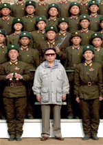
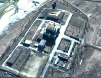
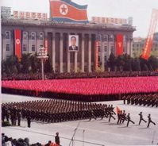

Title: Kjarnavopn á Kóreuskaga
Slug: kjarnavopn-a-koreuskaga
Date: 2007-09-14 11:00:00
Part: 2/2
UID: 179
Lang: is
Author: Hilmar Magnússon
Author URL: 
Category: Alþjóðasamskipti
Tags: 

Í fyrri hluta þessarar greinar var stiklað á stóru í sögu Norður Kóreu og fjallað um viðræður ríkisins við umheiminn um kjarnorkuáætlun þess. Í þessum hluta verður gerð betri grein fyrir markmiðum og nálgunum þeirra ríkja sem tekið hafa þátt í þessum viðræðum og verður áherslan lögð á Norður-Kóreu og Bandaríkin. Þá verður rætt um samkomulag ríkjanna sex, gagnrýni á þann gjörning og hvernig atburðarrásin hefur þróast í framhaldinu. Að lokum verða stærstu þættirnir dregnir saman og grein gerð fyrir helstu niðurstöðum. 

### Kúgun eða kall eftir athygli?

Þegar aðilum að viðræðunum eru gerð skil er auðvitað nærtækast að byrja á ríkinu sem þetta snýst allt um, nefnilega Norður-Kóreu. Eins og glögglega má sjá á hegðun Norður-Kóreu í alþjóðasamskiptum í gegnum árin, hefur ríkið stundað sína pólitísku leiki úti á ystu nöf. Margir gætu túlkað þessa hegðun sem hreina brjálsemi, eða jafnvel einhverskonar pólitíska fjárkúgun.

Samkvæmt Dr. Edward A. Olsen, sérfræðingi í málefnum Kóreu og Norðaustur-Asíu og prófessor við Naval Postgraduate School í Kaliforníu, er þetta þó ekki svo einfalt. Hann heldur því fram að verið sé að ná fram tvennu. Annars vegar séu stjórnvöld í N-Kóreu að skapa sér svigrúm til að koma í veg fyrir, að þeirra mati, háskalega pólitíska leiki Bandaríkjamanna, sem víli ekkert fyrir sér að einangra og ráðast á svokölluð „utangarðsríki“ í krafti þess að vera eina stórveldið. Hins vegar snúist pólitíkin um að ná athygli umheimsins, vissulega með því að fara út á ystu nöf, en draga svo málsaðila frá hengifluginu og að samningaborðinu með það langtímamarkmið í huga að ná fram sameiningu ríkjanna á Kóreuskaganum. Í því augnamiði horfi Kóreuríkin bæði til Kína sem vænlegs málamiðlara og samstarfsaðila í viðræðum.[^1]

Þá hefur verið bent á að sjálfseyðingarhvöt N-Kóreu sé ekki meiri en svo að stjórnvöld þar horfi mikið til vinsamlegra framtíðarsamskipta við Bandaríkin. Lykilatriðið sé í þeirra huga að tryggja varanlegt og gott samband við bandarísk stjórnvöld. Með slíku sambandi sjái N-Kóreumenn fyrir sér að einangrun landsins ljúki, efnahagurinn batni og að samskiptin við nágrannaríkin verði óþvingaðri og eðlilegri.[^2]

### Juche gegn bandarískum lýðræðisboðskap

Ef litið er á afstöðu Bandaríkjanna til Norður-Kóreu er ágætt að hafa það í huga að sögulega séð hafa samskipti ríkjanna aldrei verið góð. Má segja að Kóreustríðið hafi haft þar mikið að segja, en þar urðu til bönd annars vegar á milli Bandaríkjanna og Suður-Kóreu og hins vegar á milli Norður-Kóreu og Kína. Þá hefur juche hugmyndafræði N-Kóreu, sem gengur út á að ríkið treysti á sjálft sig og sé sjálfu sér nægt, einnig haft mikið að segja um afstöðu Bandaríkjamanna.

Juche  stefnan leiðir nefnilega af sér að N-Kórea hefur verið afar þjóðernissinnuð þegar kemur að öryggis- og efnahagsmálum. Þannig hefur ríkið komið sér upp gríðarlegum herstyrk og hefur ávallt unnið að efnahagslegu sjálfstæði. Á efnahagssviðinu hefur þessi stefna, ásamt náttúruhamförum, reynst afar dýrkeypt og hefur því oft verið búist við því að landið stefndi einfaldlega í þrot. Það hefur þó ekki gerst, aðallega vegna kænsku stjórnvalda í að spila djarft í utanríkismálum og græða á því.

Sú velgengni hefur svo orðið til þess að stjórnvöld öðlast enn meiri trú á juche  stefnunni, vilja veg hennar sem mestan og reyna þess vegna að styrkja hana af öllum mætti. Það útskýrir ofuráherslu Norður-Kóreu á að næla sér í kjarnorkuvopn. Þessar staðreyndir hafa vissulega haft áhrif á stefnu Bandaríkjanna gagnvart N-Kóreu í gegnum tíðina og má þar nefna bæði ríkisstjórnir George Bush eldri og Bill Clinton.[^3]

Stefna Bandaríkjanna gagnvart N-Kóreu eftir kalda stríðið mótast í fyrstu af aðlögun Bandarískra stjórnvalda að „nýrri heimsmynd“, með George Bush eldri. Sú stefna kristallast í fyrra Íraksstríði, þar sem Bandaríkin fara í forystu mikils liðssafnaðar og sýna mátt sinn og megin sem eina stórveldi heimsins. Clinton og Bush yngri fylgja svo kenningum Wilson forseta um afskipti Bandaríkjanna af alþjóðamálum og inngrip í atburðarrásir, með það að markmiði að breiða út hið vestræna lýðræðisform.

Eftir hryðjuverkaárásirnar þann 11.september 2001 verða svo umskipti í pólitíkinni og afstaðan harðnar til muna. Nú er ekki talað um að semja við hið „illa“, heldur skal það sigrað. Pólitíkin færist því í átt til þess að breyta stjórnkerfum óvinveittra ríkja með valdi, svokallað regime change.[^4]

Eftir þessa reið yfir markmið og nálganir í stefnu ríkjanna, skal nú vikið að samkomulagi því sem náðist á milli þeirra í febrúar á þessu ári.

### Samkomulagið frá 13.febrúar 2007

Eftir þær þriggja og hálfs árs samningaviðræður sem hófust í apríl 2003, ásamt þeim fjölmörgu skrautlegu uppákomum sem fylgt hafa í kjölfarið, náðist loks samkomulag milli aðila í Beijing þann 13.febrúar í ár.[^5]

Í grófum dráttum felur samkomulagið það í sér að N-Kórea slökkvi á, innsigli og hætti með öllu notkun sinni á kjarnakljúf sínum í Yongbyon. Að auki eiga stjórnvöld að hleypa eftirlitsmönnum Alþjóða kjarnorkumálastofnunarinnar á ný inn í landið og í staðinn fær ríkið 50.000 tonn af eldsneyti. Þetta verður allt að gerast innan 60 daga frá undirritun samkomulagsins.[^6]

Fleira hangir á spýtunni, því gert er ráð fyrir að krafa N-Kóreu um kjarnakljúf til nota í friðsamlegum tilgangi verði einnig rædd við „viðeigandi tækifæri“.[^7] Þá á N-Kórea, samkvæmt samkomulagi frá 2005, að binda enda á kjarnorkuáætlun sína og gangast undir Sáttmálann um takmörkun kjarnavopna á ný.[^8] Blikur eru þó á lofti um það samkomulag, þar sem ríkið fór á þeim tíma í fússi frá samningaborðinu vegna frystingar á bankainnistæðum í Macau, sem gerð var að undirlagi Bandaríkjamanna.[^9] 

Orðalag samkomulagsins í ár er töluvert frábrugðið því sem það var í samkomulaginu frá 1994 og hvergi er kveðið eins fast að orði um afvopnun og framgangsmáta. Gert er ráð fyrir frekari efnahags- og mannúðaraðstoð, sem og eldsneytisaðstoð upp á 950.000 tonn.

Í samningnum frá 1994 var einnig gert ráð fyrir viðlíka eldsneytisaðstoð, en nú á að fara öðruvísi að allri framkvæmdinni. Í fyrri samningi var tímaramminn mikið rýmri og N-Kórea þurfti t.d. ekki að uppfylla skilyrði hans fyrr en árið 2003 (sem síðar var lengt í 2009 áður en hann rann út í sandinn), þrátt fyrir að vera búin að fá eldsneytisaðstoð.

Að þessu sinni á að taka málin öðrum tökum og þannig mun N-Kórea t.d. ekki fá neina eldsneytisaðstoð umfram 50.000 tonnin fyrr en ríkið hefur uppfyllt eitthvað af þeim atriðum sem upp á það standa.[^10] Þannig verður unnið í skrefum eftir þeirri grundvallarreglu að allir fái eitthvað fyrir sinn snúð, eða „action for action“.

Önnur atriði samningsins kveða m.a. á um að unnið verði að því að koma, annars vegar, sambandi N-Kóreu og Bandaríkjanna í eðlilegan farveg. Hins vegar er um að ræða að koma sambandi Japans og N-Kóreu í eðlilegt horf. Þá verði unnið að friði til langframa í öllum heimshlutanum.[^11]

### Þróun atburða í  kjölfar samkomulags

Þrátt fyrir að samkomulag um kjarnorkuáætlun N-Kóreu hafi náðst í febrúar, er engan veginn hægt að segja að viðræðum sé lokið. Þvert á móti gerir samningurinn einmitt ráð fyrir að lífi sé haldið í viðræðum til að tryggja að árangur náist.[^12]

Ýmislegt hefur og gerst frá undirritun samkomulagsins. Í lok febrúar tilkynnir yfirmaður Alþjóða kjarnorkumálastofnunarinnar, Mohamed ElBaradei, að honum sé boðið til N-Kóreu til viðræðna um kjarnorkuáætlunina. Um miðjan mars heldur hann til Pyongyang, á viðræður við stjórnvöld og lýsir því yfir að N-Kórea hafi fullan hug á að hætta við kjarnorkuáætlunina. Í anda samkomulagsins fer Bandaríkjastjórn samtímis að liðka fyrir um að bankainnistæðurnar sem frystar voru á sínum tíma í Macau verði aðgengilegar N-Kóreumönnum. Um er að ræða 25 milljónir dollara.

Þann 22.mars gerist það svo að sex-ríkja viðræður, þar sem ræða á um hvernig málum miðar áfram, sigla í strand eftir að N-Kóreumenn segjast enn ekki geta nálgast sjóði sína í bankanum í Macau.[^13] Bandaríkjastjórn bregst skjótt við og daginn eftir tilkynnir aðalsamningamaður þeirra, Christopher Hill, að viðræðum verði hægt að halda áfram eftir nokkrar vikur þegar búið er að kippa þessu máli í liðinn.[^14] Þann 10.apríl tilkynna svo peningamálayfirvöld í Macau að sjóðirnir í Banco Delta Asia séu lausir til útborgunar.[^15]

Samkomulagið gerir ráð fyrir að lokafrestur N-Kóreumanna til að loka Youngbyon kjarnorkuverinu sé þann 14.apríl. Þrátt fyrir að peningavandamálið virðist úr sögunni lýsa n-kóresk stjórnvöld því nú samt yfir, daginn fyrir lokafrestinn, að það vanti staðfestingu á því að peningarnir séu aðgengilegir. Þau muni því halda að sér höndum þar til tryggt sé að peningarnir séu þeirra. Daginn eftir rennur lokafresturinn loks upp, án þess að N-Kóreumenn aðhafist nokkuð.[^16]

### Háværar gagnrýnisraddir

Margir hafa orðið til að gagnrýna þetta nýja samkomulag. Helst hefur verið bent á að orðalagið sé of loðið og að N-Kóreumenn geti því alltaf túlkað það sér í hag. Meðal gagnrýnenda er fyrrverandi sendiherra Bush-stjórnarinnar hjá Sameinuðu þjóðunum, John Bolton. Hann segir samkomulagið slæmt og að það sendi þau röngu skilaboð til ríkja sem vilja kjarnorkuvæðast að sýni þau næga þolinmæði gagnvart samningamönnum bandaríska utanríkisráðuneytisins verði þau verðlaunuð fyrir rest. Bandarísk stjórnvöld vísa þessari gagnrýni á bug og leggja mikla áherslu á að aðferðafræðin sé önnur í dag en í síðasta samningi. Til dæmis sé núverandi samningur á milli 6 ríkja, en ekki einungis tveggja eins og síðast. Það eitt og sér ætti að skapa mun betra taumhald á N-Kóreumenn, þar sem t.d. Kína sé þeirra stærsti birgir og hafi því verulegra hagsmuna að gæta.[^17]

Gagnrýnendur halda því aftur á móti fram að kjarnorkuvopn séu eina trygging Kim Jong-Il fyrir því að halda völdum í Norður-Kóreu og því muni hann aldrei nokkurn tíma gefa þau upp á bátinn. Styðjast þeir m.a. við álit háttsettra manna innan kínverskra stjórnkerfisins. Bolton er í þessum hópi gagnrýnenda og talar hann meira að segja enn á þeim nótum að forsendan til að losna við kjarnavopn Norður-Kóreumanna, sé að skipta stjórnvöldum í landinu út og losna við Kim Jong Il og ríkisstjórn hans. Stemningin fyrir svo róttækum lausnum er hins vegar afar lítil í Hvíta húsinu.[^18] 

### Bandaríkjamenn taka U-beygju og setja í lægri gír

Þrátt fyrir að N-Kóreumenn hafi nú þegar brotið gegn samkomulaginu frá því í febrúar hafa viðbrögðin ekki verið hörð, hvorki af hálfu Bandaríkjamanna né hinna samningsaðilanna. Samningurinn virkar líka að því leytinu að á meðan N-Kóreumenn gera ekkert fá þeir heldur enga eldsneytisaðstoð.

N-Kóreustjórn hefur engin svör veitt varðandi framferði sitt, en ljóst þykir að hvorki hún né ríkisstjórn Bush ætla í hart, enn sem komið er.[^19] Þann 1.maí gaf Condoleeza Rice, utanríkisráðherra Bandaríkjanna meira segja út þá yfirlýsingu að þarlend stjórnvöld hefðu ákveðið, eftir samráð við Japani, að veita N-Kóreu örlítið svigrúm. Þó kom einnig fram að bandarísk stjórnvöld hefðu ekki endalausa þolinmæði.[^20]
Á öllu þessu virðist nokkuð augljóst að bandarísk stjórnvöld hafa algerlega skipt um stefnu í málefnum N-Kóreu og þar sem áður voru notuð stór lýsingarorð virðist nú stigið mjög varlega til jarðar. En hvað veldur? Svo virðist sem að málarekstur bandarísku ríkisstjórnarinnar í Írak og aukið vantraust á honum ráði hér miklu og að utanríkisráðherrann Condoleeza Rice hafi náð að sannfæra Bush forseta um að breyta stefnunni, a.m.k. hvað varðar N-Kóreu. Þá hafa háttsettir bandarískir stjórnmálamenn verið í sambandi við yfirvöld í N-Kóreu, sem hafa fullvissað þá um að stjórnin muni hleypa eftirlitsmönnum Alþjóða kjarnorkustofnunarinnar inn í landið um leið og peningamálin í Macau komast á hreint.[^21] Þetta virðist róa bandarísk stjórnvöld.

### Betri tíð með blóm í haga?

Varðandi næstu skref er ágætt að hafa í huga orð prófessors Stephen Blank. Hann bendir á að sú staðreynd að N-Kórea hafi getað komist á það stig að framkvæma tilraunakjarnorkusprengingu sína árið 2006, sé mikill áfellisdómur yfir utanríkisstefnu Bandaríkjanna. Þá segir hann einu leiðina til að hafa áhrif í Norðaustur-Asíu og um leið á stefnu N-Kóreu, sé að hafa hana með í ráðum og bendir á reynslu Rússa síðan árið 2000. T.d. séu þeir eingöngu með í núverandi viðræðum vegna óska N-Kóreustjórnar. Jafnframt bendir hann á að Bush-stjórnin hafi hingað til ekki verið nógu dugleg við að draga lærdóm af reynslu fyrri ríkisstjórna Bandaríkjanna.[^22] Þess ber að geta að þessi gagnrýni er sett fram áður en febrúarsamkomulagið nær fram að ganga og því er vel hugsanlegt að Bandaríkjastjórn hafi nú þegar tekið hana til sín.

Hvað sem því líður er ljóst af öllu framansögðu að bandarísk stjórnvöld eru á allt annarri braut en áður hvað varðar málefni N-Kóreu. Stefnan í dag virðist einkennast af mun meiri skilningi og þolinmæði en fyrr, sem og samvinnu og vilja til að deila ábyrgð. Með hliðsjón af því sem á undan er gengið og í ljósi nýjustu yfirlýsinga, má jafnvel segja að samskipti þjóðanna einkennist næstum af rólyndi. Það er nýr tónn, sem gæti boðið upp á mörg sóknarfæri í framtíðarsamskiptum ríkjanna. 

Næstu dagar, vikur og mánuðir verða svo örugglega spennandi og munu að líkindum leiða í ljós hvort N-Kóreumönnum sé virkilega treystandi í alþjóðasamstarfi. Vonum það besta, en verum við öllu búin.

<small>_Skrifað í maí 2007._</small>

---

#### Heimildir
* Blank, Stephen. „The End of the Six-Party Talks?“ Strategic Insights janúar 2007. 1.hefti, 6.bindi, bls.1-16. Monterey, California: The Center for Contemporary Conflict, The Naval Postgraduate School, 2007. http://www.ccc.nps.navy.mil/si/2007/Jan/blankJan07.asp. (Skoðað 14.5.2007).
* Bandaríska utanríkisráðuneytið. „North Korea - Denuclearization Action Plan.“ Media Note 13.2.2007 (fréttatilkynning). Washington D.C.: Office of the Spokesman, U.S.Department of State, 2007. http://www.state.gov/r/pa/prs/ps/2007/february/80479.htm. (Skoðað 14.5.2007).
* BBC. „Bush's 'evil axis' comment stirs critics.“ BBC News 2.2.2002 (netmiðill).  London: British Broadcasting Corporation, 2002a. http://news.bbc.co.uk/2/hi/americas/1796034.stm. (Skoðað 14.5.2007). 
* BBC. „US Expands 'Axis of Evil'.“ BBC News 6.5.2002 (netmiðill). London: British Broadcasting Corporation, 2002b. http://news.bbc.co.uk/2/hi/americas/1971852.stm. (Skoðað 14.5.2007).
* BBC. „Who is who in the 'axis of evil'.“ BBC News 20.12.2003 (netmiðill). London: British Broadcasting Corporation, 2003. http://newsvote.bbc.co.uk/mpapps/pagetools/print/news.bbc.co.uk/2/hi/in_depth/1988810.stm. (Skoðað 14.5.2007).
* BBC. „Timeline: North Korea.“ BBC News 9.2.2007, síða 1-7 (netmiðill). London: British Broadcasting Corporation, 2007a. http://news.bbc.co.uk/go/pr/fr/-/2/hi/asia-pacific/country_profiles/1132268.stm. (Skoðað 14.5.2007).
* BBC. „N Korea talks 'may soon restart'.“ BBC News 23.3.2007 (netmiðill). London: British Broadcasting Corporation, 2007b. http://newsvote.bbc.co.uk/mpapps/pagetools/print/news.bbc.co.uk/2/hi/asia-pacific/6483173.stm. (Skoðað 14.5.2007).
* BBC. „Macau unblocks N Korean funds.“ BBC News 10.4.2007 (netmiðill). London: British Broadcasting Corporation, 2007c. http://newsvote.bbc.co.uk/mpapps/pagetools/print/news.bbc.co.uk/2/hi/asia-pacific/6540527.stm. (Skoðað 14.5.2007).
* BBC. „Analysis: N Korea deadline passes.“ BBC News 14.4.2007 (netmiðill). London: British Broadcasting Corporation, 2007d. http://newsvote.bbc.co.uk/mpapps/pagetools/print/news.bbc.co.uk/2/hi/asia-pacific/6556417.stm. (Skoðað 14.5.2007).
* BBC. „Timeline: N Korea nuclear stand-off.“ BBC News 17.4.2007 (netmiðill). London: British Broadcasting Corporation, 2007e. http://newsvote.bbc.co.uk/mpapps/pagetools/print/news.bbc.co.uk/2/hi/asia-pacific/2604437.stm. (Skoðað 14.5.2007).
* BBC. „US to give North Korea more time.“ BBC News 1.5.2007 (netmiðill). London: British Broadcasting Corporation, 2007f. http://newsvote.bbc.co.uk/mpapps/pagetools/print/news.bbc.co.uk/2/hi/asia-pacific/6613953.stm. (Skoðað 14.5.2007).
* Bush, George W.. „The President's State of the Union Address.“ President Delivers  State of the Union Address 29.2.2002 (fréttatilkynning). Washington, D.C.: Office of the Press Secretary, The White House, 2002. http://www.whitehouse.gov/news/releases/2002/01/print/20020129-11.html (Skoðað 14.5.2007).
* Economist, The. „The North Korean nuclear deal: Faces saved all round.“ The Economist 17.-23.2.2007. 8516.hefti, 382.bindi, bls.26-28. London: The Economist Newspaper Ltd., 2007a.
* Economist, The. „Time to party: A victory to celebrate?“ The Economist 21.-27.4.2007. 8525.hefti, 383.bindi, bls.58. London: The Economist Newspaper Ltd., 2007b.
* Olsen, Edward A.. „The Goal of North Korean Brinkmanship: Mediation.“ Strategic Insights mars 2004. Bls.1-4. Monterey, California: The Center for Contemporary Conflict, The Naval Postgraduate School, 2004. http://www.ccc.nps.navy.mil/si/2004/mar/olsenMar04.asp. (Skoðað 14.5.2007).
* Olsen, Edward A.. „U.S. Policy Towards North Korea: Context and Options.“ Strategic Insights september 2006. 7.hefti, 5.bindi, bls.1-8. Monterey, California: The Center for Contemporary Conflict, The Naval Postgraduate School, 2006. http://www.ccc.nps.navy.mil/si/2006/Sep/olsenSep06.asp. (Skoðað 14.5.2007).
* Öryggisráð Sameinuðu þjóðanna. „Security Council SC/8778: Security Council Condemns Democratic People's Republic of Korea's Missile Launches ... Resolution 1695.“(ályktun). New York: United Nations, 2006a. http://www.un.org/News/Press/docs/2006/sc8778.doc.htm. (Skoðað 14.5.2007).
* Öryggisráð Sameinuðu þjóðanna. „Security Council SC/8853: Security Council Condemns Nuclear Test by Democratic People's Republic of Korea ... Resolution 1718.“ (ályktun). New York: United Nations, 2006b. http://www.un.org/News/Press/docs/2006/sc8853.doc.htm (Skoðað 14.5.2007).

[^1]: Olsen, 2004:1-4
[^2]: Economist, 2007a:28
[^3]: Olsen, 2006:1-3
[^4]: Olsen, 2006:3-8
[^5]: Economist, 2007a:26
[^6]: Bandaríska utanríkisráðuneytið, 2007
[^7]: BBC, 2007b
[^8]: Bandaríska utanríkisráðuneytið, 2007
[^9]: Economist, 2007a:27
[^10]: Economist, 2007a:26-27 
[^11]: Bandaríska utanríkisráðuneytið, 2007
[^12]: Bandaríska utanríkisráðuneytið, 2007
[^13]: BBC, 2007e
[^14]: BBC, 2007b
[^15]: BBC, 2007c
[^16]: BBC, 2007d
[^17]: Economist, 2007a:27
[^18]: Economist, 2007a:27-28
[^19]: Economist, 2007b:58
[^20]: BBC, 2007f
[^21]: BBC, 2007d
[^22]: Blank, 2007.
