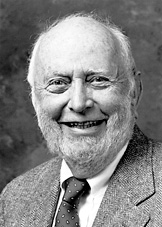
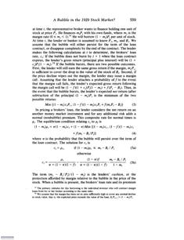

Title: Klíómetrían og einangrun hagsögunnar í Bandaríkjunum
Slug: kliometrian-og-einangrun-hagsoegunnar-i-bandarikjunum
Date: 2006-12-07 15:59:00
UID: 117
Lang: is
Author: Magnús Sveinn Helgason
Author URL: 
Category: Hagfræði, Sagnfræði
Tags: 

Í þessari grein mun ég fjalla í stuttu máli um þróun hagsögunnar í bandarískum háskólum á seinustu hálfu öld eða svo, sigurför klíómetríunnar (e: _cliometrics_) á sjöunda og áttunda áratugnum, og ástæður einangrunar og “krísu“ hagsögunnar og klíómetríunnar í upphafi þessarar aldar.[^1] 

Hagsaga nýtur ákveðinnar sérstöðu innan sagnfræðinnar, því hún er bæði undirgrein hagfræðinnar og sagnfræðinnar. Sumstaðar í Evrópu hefur hagsaga jafnvel verið kennd sem sjálfstæð fræðigrein. “Gullöld“ hagsögunnar var tvímælalaust á áttunda og níunda áratugnum, en frægðarsól hennar hafði þegar tekið að hníga þegar sænska akademían veitti hagsögufræðingunum Douglass North og Robert Fogel nóbelsverðlaunin í hagfræði 1993.[^2]  Á níunda áratugnum hafði hagsagan einangrast og orðið hornreka innan hagfræðinnar. Afdrif hennar innan sagnfræðinnar voru síst betri, því bandarískir sagnfræðingar hafa misst nánast allan áhuga á hagsögu. 

Ástæður akademísks heimilsleysis hagsögunar er að finna bæði innan hagsögunnar og móðurgreina hennar. Þessi sorglegu örlög sýna hversu varhugavert það getur verið fyrir undirgreinar sagnfræðinnar að reiða sig um of á aðferðafræði og tungutak sem er upprunnið í öðrum fræðigreinum, því helsta ástæða þess að hagsagan hefur orðið útundan innan sagnfræðinnar er að hún hefur tileinkað sér tungumál, sem er illskiljanlegt öðrum sagnfræðingum eða þeim sem ekki eru “innvígðir“ í leyndardóma tölfræði og nýklassískrar hagfræði. 

Hagsagan á sér ekki mjög langa sögu sem sjálfstæð undirgrein sagnfræðinnar í Bandaríkjunum. Félag hagsögufræðinga, _The Economic History Association_ var stofnað 1941 og hefur allar götur síðan gefið út _The Journal of Economic History_. Þó það sé eitt sérkenni bandarískrar hagsögu hversu nátengd hagfræðideildum hún er, var hún þó ekki svo frábrugðin annarri sagnfræði fyrstu áratugi aldarinnar. Aðferðafræði og frásagnarmáti hagsögunnar var hinn sami, hagsagan var fyrst og fremst lýsandi. Hagtölur og hagfræðilegar kenningar fengu lítið rými og tölfræðilegum greiningartækjum var sjaldan beitt til þess að varpa ljósi á tölulegar heimildir. 

Á sjöunda áratugnum varð bylting í hagsögunni, þegar hin eldri hagsaga vék fyrir “nýrri“ hagsögu sem beitti hagfræðilegaum kenningum kerfisbundið og reiddi sig mjög á tölfræðilegar heimildir. Þessi nýja hagsaga var ýmist nefnd _the new economic history_ eða _cliometrics_. Mikilvægasta brautryðjendaverk hinnar klíómetrísku hagsögu var stórvirki Robert Fogel, _Railroads and American Economic Growth_ (1964).[^3]  Fogel lagði þar til atlögu við viðtekna skoðun bandarískra sagnfræðinga og hagfræðinga að járnbrautirnar hafi leikið lykilhlutverk í iðnvæðingu Bandaríkjanna — það sem hann kallaði “the axiom of indispensability“. Fogel hélt því fram að framlag járnbrautanna hafi verið mun minna en gert hafði verið ráð fyrir, og að hagvöxtur og iðnvæðing Bandaríkjanna hafi byggt á mun breiðari grunni en “járnbrautakenning“ fræðimanna á borð við W.W. Rostow gerði ráð fyrir.

Bók Fogel var byggð á doktorsritgerð sem hann skrifaði undir handleiðislu hagfræðingsins Simon Kuznets, en margir af doktorsnemum Kuznets urðu leiðandi í hinni nýju hagsögu. Richard Easterlin, Lance Davis og Stanley Engerman voru allir nemendur Kuznets, en aðrir frumkvöðlar klíómetríunnar eru Douglass North, Albert Fishlow og Jeremy Atack — allir menntaðir hagfræðingar. Með nýjustu hagfræðikenningar og tölfræðileg greiningartæki að vopni ruddu klíómetrísku hagsögufræðingarnir sér til rúms. Athugun Robert Whaples á því hversu margar greinar í _Journal of Economic History_ beittu tölfræði eða hagfræðilegum kenningum á kerfisbundinn hátt, sýnir hvernig klíómetrían lagði undir sig hagsöguna.

<table cite="Heimild: Robert Whaples, “A quantitative History of the Journal of Economic History and the Cliometric Revolution“, The Journal of Economic History, Vol. 51, No. 2. (1991), bls 293.">
<thead>
<tr><th>Árabil</th><th>hlutfall „klíómetrískra“ greina</th></tr>
</thead>
<tbody>
<tr><td>1941-45</td><td class="num">0.0%</td></tr>
<tr><td>1946-50</td><td class="num">3.9%</td></tr>
<tr><td>1951-55</td><td class="num">1.5%</td></tr>
<tr><td>1956-60</td><td class="num">10.2%</td></tr>
<tr><td>1962-65</td><td class="num">17.6%</td></tr>
<tr><td>1966-70</td><td class="num">44.1%</td></tr>
<tr><td>1971-75</td><td class="num">78.3%</td></tr>
<tr><td>1976-80</td><td class="num">79.9%</td></tr>
<tr><td>1981-85</td><td class="num">80.7%</td></tr>
<tr><td>1986-90</td><td class="num">83.1%</td></tr>
</tbody>
</table>

Áberandi er hversu fáar greinar beittu hagfræðilegum kenningum framan af, og hversu ört klíómetrían lagði undir sig hagsöguna eftir miðjan sjöunda áratuginn. Á níunda áratugnum var hún orðin allsráðandi innan hagsögunnar. En samhliða þessari sigurför urðu alvarlegar breytingar á stöðu greinarinnar, og í lok tíunda áratugarins voru bandarískir hagsögufræðingar orðnir sammála um að hún stæði frammi fyrir djúpstæðum vanda. Klíómetrían hafði mikið til sagt skilið við hefðbundna sagnfræði, enda talið sig eiga meira skylt með hagfræðinni. Flestir hagsögufræðingar voru menntaðir í hagfræði og kenndu í hagfræðideildum. En eftir því sem hagfræðin varð stærðfræðilegri missti hún áhugan á hagsögu. Æ færri doktorsnemar skrifuðu lokaritgerðir í hagsögu og hagfræðideildir við bandaríska háskóla hættu að ráða hagsögufræðinga. Sömu sögu var að segja úr viðskiptaskólum — í upphafi níunda áratugarins buðu um 80% þeirra upp á námskeið í viðskipta- og hagsögu, en um aldamótin var hlutfallið komið niður í 50%.[^4] 

Ástæða þessarar þróunar var að hagsagan hafði misst sérstöðu sína. Á níunda áratugnum voru hagfræðingar að keppast við að flýja hinn áþreifanlega veruleika og hörfa á vit kenningasmíði, tölfræði og stærðfræði. Í þeirra augum virtist eini munurinn á hagsögu og stærðfræðilegri hagfræði sá að hagsagan notaðist við lítið eitt eldri tölfræðigögn. Það varð æ erfiðara með að réttlæta að hún ætti sjálfstæðan tilverurétt innan hagfræðinnar.

Á ársfundi _Economic History Association_ í St Louis haustið 2002 fluttu Douglass North og John Nye erindi þar sem þeir lýstu þungum áhyggjum af þessari þróun. North hvatti hagsögufræðinga til að hverfa aftur til sagnfræðinnar, því hagsagan sækti styrk sinn úr sögunni.[^5]  Slíkt “endurhvarf“ hagsögunnar til sagnfræðinnar er hins vegar vandkvæðum bundið, því meðan klíómetrían var að gera hosur sínar grænar fyrir hagfræðingum höfðu ýmsir póstmódernískir straumar lagt undir sig bandarískar sagnfræðideildir. 

Samfara því að klíómetristarnir ruddu “hefðbundum“ sagnfræðingum út úr hagsögunni misstu aðrir sagnfræðingar mikið til áhugann á kvantífíkasjón. Sumir sagnfræðingar í félags- og stjórnmálasögu héldu áfram að telja hluti, reikna út meðaltöl og prósentuhlutföll, en starfsbræður þeirra, sem voru undir áhrifum orðræðubyltingarinnar og the _cultural turn_, voru almennt áhugalausir um tölfræði, hvað þá hagfræðikenningar. Hagsögufræðingar voru gagnrýndir fyrir að leggja ofuráherslu á ópersónuleg lögmál, einblína á þurra statistík og horfa framhjá því “persónulega“ í sögunni. Samkvæmt þessari gagnrýni voru tölfræði og mælingar einhvernveginn sálarlausar, kaldar og mannfjandsamlegar. Þá fannst mörgum hagsögufræðingar hafa gerst sekir um hroka og dramb, því klíómetrían þykist geta kveðið upp vísindalega dóma um fortíðina. Slíkar vísindalegar stellingar áttu ekki upp á pallborðið hjá sagnfræðingum sem á níunda áratugnum tóku í vaxandi mæli að líta svo á að fortíðin væri einhverskonar framandi land, þar sem sagnfræðingurinn væri ætíð ferðalangur og gæti ekki vænst þess að finna öruggan sannleik. 

Það er þó rangt að skella skuldinni á einangrun hagsögunnar á stærðfræðiega hagfræðinga sem skortir skilning á gildi sögunnar eða póstmóderniska menningarsögufræðinga sem hafa fordóma gagnvart tölum og hagfræði. Þegar allt kemur til alls ber hagsagan sjálf ábyrgð á eigin einangrun.

Viðtaka fræðiverka og fræðigreina byggist nefnilega alfarið á því “tungumáli“ sem þær nota. Eftir því sem klíómetrían varð theoretískari varð hún líka óskiljanlegri fyrir óinnvígða. Þó nánast allir klíómetrísku hagsögufræðingarnir séu menntaðir í hagfræðideildum lögðu fyrstu klíómetristarnir mikið upp úr því að skrifa verk sem voru aðgengileg sagnfræðingum. Þetta breyttist á níunda áratugnum. Greinar í _Journal of Economic History_ urðu æ tæknilegri, heilu blaðsíðurnar voru undirlagðar af töflum og jöfnuútleiðingum sem hefðu sómt sér vel í fagtímaritum í hagfræði eða tölfræði. Mín eigin athugun á efni JEH árið 1993, sama ár og North og Fogel fengu nóbelsverðlaunin, sýnir að í 31 grein voru alls 110 jöfnur og 130 töflur, og eru þá ótalin allskonar línu- og stöplarit. Aðeins tvær greinar höfðu hvorki töflur né jöfnur, en í einni grein voru alls 23 jöfnur! Til samanburðar birti _Journal of American History_ (sem er virtasta tímarit helgað bandaríkjasögu) aðeins fjórar töflur sama ár. Það þarf varla að taka fram að JAH birti ekki eina einustu jöfnu.

Flestar töflur í JEH þekja heilu og hálfu blaðsíðurnar og er fylgt eftir með langri umræðu um chi-squared, t-tests og önnur tölfræðileg hugtök. Þar á ofan eru margar greinar með langar útleiðingar á jöfnum með grískum bókstöfum. Í þessu ljósi er vel skiljanlegt að óbreyttir sagnfræðingar, sem fæstir kunna að skrifa gríska bókstafi og hætta sér ekki í að notast við háleitari stærðfræði en prósentureikningu, skuli ekki leggja í að lesa hagsögu.

En þó orðaforði og aðferðafræði hagsögunnar geri hana óárennilega í augum annarra sagnfræðinga er það frásagnarmáti hennar sem hefur gert mest til þess að einangra hana. Margir hagsögufræðingar hafa nefnilega misst sjónar af sögunni, stórsögunni, og því sem engilsaxneskir sagnfræðingar kalla _the narrative_. Hagsagan hefur tapað sér í aðferðafræðilegri naflaskoðun. Greinar í _Journal of Economic History_ eða _Economic History Review_ virðast oft hafa það eitt að markmiði að sanna eða afsanna hagfræðilegar kenningar og of oft gera þær enga tilraun til þess að setja niðurstöður sínar í víðara samhengi, útskýra á hvaða hátt þær kunni að breyta skilningi okkar á stórsögunni. Neðanmálsgreinar vísa iðulega í aðrar rannsóknir í hagsögu og höfundar staðsetja rannsóknir sínar innan klíómetríunnar, frekar en að taka þátt í samræðu við sagnfræðinga utan hagsögunnar.

Hagsagan hefur ratað í vandræði vegna þess að hún hefur tileinkað sér tungumál sem of fáir skilja. Ef hún vill fá að “hverfa aftur til sagnfræðinnar“ eins og Douglass North orðar það þarf hún í ríkara mæli að tala sama tungumál og aðrir sagnfræðingar. Lausnin er ekki að hagsagan gefi upp á bátinn málfræði sína eða tungutak — en hún þarf líklega að bæta við orðaforðann.

---

<small class="blurb">
__15. desember 2007:__ Höfundur óskar að tekið sé fram: Þessi grein er fyrstu drög að stærra verki sem er í vinnslu.
</small>

[^1]: Þessi grein byggir lauslega á erindi sem ég flutti á Þriðja íslenska söguþinginu. Erindið var frekar óformlegt, og var í pallborðsumræðum sem báru þann metnaðarfulla titil “Hvað er að gerast í sagnfræðinni í útlöndum.“ Erindið fjallaði um stöðu hag- og viðskiptasögu í bandarískum háskólum.  
[^2]: Það eru ekki margir sagnfræðingar sem hafa hlotið nóbelsverðlaunin: Þjóðverjinn Theodore Mommsen fékk nóbelsverðlaunin í bókmenntum 1902 og Winston Churchill fékk nóbelsverðlaunin 1953, sömuleiðis í bókmenntum. Sagnfræðingar virðast því hljóta nóbelsverðlaun á um það bil 50 ára fresti — sem er bara nokkuð góð frammistaða! Mommsen fékk verðlaunin fyrir að vera “the greatest living master of the art of historical writing, with special reference to his monumental work, A history of Rome“, en Churchill fékk sín verðlaun fyrir “his mastery of historical and biographical description as well as for brilliant oratory in defending exalted human values.“ Sjá http://nobelprize.org/nobel_prizes/literature/laureates/1902/ og http://nobelprize.org/nobel_prizes/literature/laureates/1953/
[^3]: Bók Fogel um járnbrautirnar var byggð á doktorsritgerð sem hann skrifaði undir handleiðslu Simon Kuznets, sem fékk nóbelsverðlaunin árið 1971, m.a. fyrir framlag sitt til gerðar sögulegra þjóðhagsreikninga. 
[^4]: David D. Van Fleet og Daniel Wren, “Teaching History in Business Schools: 1982-2003“, _Academy of Management Learning & Education_, Vol. 4, No. 1 (2005), bls. 47.
[^5]: Douglass C. North og John V.C. Nye, “Cliometrics, the New Institutional Economics, nd the Future of Economic History“. Fyrirlesturinn má nálgast á heimasíðu ESNIE: http://esnie.u-paris10.fr/pdf/textes_2004/nye_North_Nye_EHA_2002.pdf

