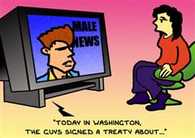

Title: Konur og fjölmiðlar
Subtitle: Stjórnmálakonur í gini ljónsins?
Slug: konur-og-fjolmidlar
Date: 2007-05-01 12:14:12
Part: 1/2
UID: 154
Lang: is
Author: Hrafnhildur Ragnarsdóttir
Author URL: 
Category: Stjórnmálafræði, Kynjafræði
Tags: 

Líkt og á svo mörgum öðrum sviðum, þá hafa karlmenn haft yfirráð á hinum pólitíska vettvangi. Kvenréttindabaráttan hefur ekki skilað konum eins langt og vonir stóðu til. Kosningaréttur kvenna og réttur til kjörgengis kom í þrepum við upphaf síðustu aldar. Giftar konur í Reykjavík og Hafnarfirði fengu kosningarétt og kjörgengi árið 1908. Eftir miklar umræður á Alþingi um getu kvenna var þeim veittur jafn réttur til allra embætta og menntunar á við karlmenn þremur árum síðar. Almennan kosningarétt fengu konur svo árið 1915, en með 40 ára aldurstakmarki sem lækka átti um eitt ár á ári þar til það næði 25 ára aldurstakmarkinu, jafnt á við karla. Ákvæðið var afnumið fimm árum síðar með nýrri stjórnarskrá og voru þá konur og karlar komin með sömu réttindi. 

Stjórnmál halda þó áfram að vera fyrst og fremst vettvangur karla. Fræðikonan Jill M. Bystydzienski telur stjórnmál vera einn þann kynjaðasta vettvang sem fyrirfinnst næst á eftir hernum. Feminískar fræðikonur hafa notað hugtakið „kynjaðar stofnanir“ (_gendered institutions_) sem tilvísun í hvernig kyn hefur áhrif á ímynd, hugmyndafræði og dreifingu valds á flestum sviðum samfélags okkar, þar með talið í viðskiptum, hernum, háskólasamfélaginu og stjórnmálum. Ef litið er á stjórnmál út frá sögunni þá má sjá að þau hafa verið sköpuð, þeim stjórnað og þau túlkuð og skilgreind af körlum. Hin karllægu gildi eru ráðandi þegar kemur að almennum skilningi á stjórnun og valdi. Stjórnmál hafa frá upphafi verið skilgreind út frá fjarveru kvenna, ákvarðanataka fer enn fram að miklu leyti án kvenna og þeim hefur verið komið í sérlega óhagstæða stöðu á þessu sviði þjóðfélags okkar. 

Fræðikonunum Ingunn Nordeval, Joni Lovenduski og Pippa Norris ber saman um að stjórnmálamenn og leiðtogar stjórnmálaflokka fagni jafnan þátttöku kvenna í framboðum, því þannig nái þeir frekar atkvæðum kvenna. Þessir sömu menn séu svo síður ákafir er kemur að stöðuveitingum til kvenna innan flokka og á þingi þar sem slíkar stöður, og þingsætin sjálf, eru pólitísk verðlaun sem stjórnmálaþátttakan snýst fyrst og fremst um. Þessara pólitísku verðlauna er því vel gætt. Eitt sæti handa konu er þannig eitt sæti tapað fyrir karlmann. 

Það sem gerir stjórnmálakonum svo enn erfiðara um vik er hversu stórt hlutverk fjölmiðlar spila í kosningabaráttu. Fjölmiðlar eru ekki síður gegnsýrðir af reynsluheimi og gildismati karla en stjórnmálaheimurinn. Fjölmiðlar hafa tilhneigingu til að styrkja staðalmyndir af konum, þeim sömu sem konur berjast gegn. Ályktað er að kvenframbjóðandi sé reynsluminni, hún viti meira um daggæslu barna og aðra félagslega málaflokka en minna um virkjanir, vegagerð eða efnahaginn. Kvenframbjóðandi er álitinn vera „umhyggjusöm“ en karlframbjóðandi „ákveðinn“. 

Fjölmiðlar og stór hluti fréttaflutnings þeirra endurspeglar hefðbundin gildi og venjur. Þannig endurkastast ráðandi venjur og gildi frá samfélaginu og til þessa aftur, með tilheyrandi samþykki ráðandi hóps. Yfirgnæfandi fjöldi þeirra einstaklinga sem stjórna helstu fréttamiðlum heimsins eru karlar og það sama á við þegar kemur að eignarhaldi á fjölmiðlum. Fréttir hvers lands eru meira og minna fréttir af því sem körlum þykir fréttnæmt. Hin „hlutlausa“ fréttamennska er langt frá því að vera hlutlaus heldur styður það viðhorf að karlmenn séu normið en konur frávikið, sem veldur því að konur verða utanveltu. Þetta kemur mjög skýrt fram í fréttum og umræðuþáttum hérlendis sem annars staðar. 

Þannig er aðgangur að fjölmiðlum á margan hátt vandkvæðum bundinn fyrir stjórnmálakonur. Þeim er ekki einungis haldið utan við alla „alvöru“ umræðu heldur er einblínt á útlit þeirra og persónu fremur en þau málefni sem þær standa fyrir, þegar þeim er loks veitt viðtöl eða hleypt að í umræðum. Þetta getur haft mjög neikvæð áhrif á kosningabaráttu kvenna og minnkað möguleika þeirra á að ná kosningu. Minni sýnileiki í fjölmiðlum, í bland við yfirleitt skakka umfjöllun, setur þær skör lægra en karla. 

Hluti af staðalímynd hinnar pólitísku konu er að hún búi yfir meira siðferði en karlkyns félagar hennar. Hún hefur því ekki sama rétt til að gera mistök eins og þeir og mætir meiri dómhörku og sætir harðari refsingu en ef „hún“ væri „hann“. Þannig verður auðveldara að skipta konum út fyrir karla.  

Áhugavert er að konur eru oft ekki tilbúnar til að viðurkenna að misrétti í fjölmiðlum hafi áhrif á þær persónulega, þó að þær séu ekki einungis meðvitaðar um það misrétti sem á sér stað gagnvart kvenframbjóðendum almennt í fjölmiðlum, heldur eru einnig mjög ósáttar við það. Fræðikonurnar Annabelle Sreberny-Mohammadi og Karen Ross gerðu rannsókn í Bretlandi sem leiddi í ljós að þrátt fyrir beitta gagnrýni kvenframbjóðenda á fjölmiðlaumfjöllunina voru fáar þingkonur viljugar til að viðurkenna að það hefði verið gert lítið úr þeim sjálfum eða að þær yrðu persónulega fyrir neikvæðum áhrifum vegna fjölmiðlaumfjöllunar. Þetta var nokkuð á skjön við hversu mikilvægt hlutverk þær töldu fjölmiðla spila, áhrif þeirra á almenningsálitið og þar af leiðandi áhrif á þróun lýðræðisins. 

Þær Sreberny-Mohammadi og Karen Ross telja að ein ástæða þess að stjórnmálakonur telji sig ekki verða fyrir mismunun geti verið sú að konur líti á sjálfar sig sem fagmanneskjur. Sú vissa verndar þær gegn því að verða fórnarlömb fjölmiðlanna. Þær viðurkenndu þó flestar að það færi fyrir brjóstið á þeim hversu mikla áherslu fjölmiðlar legðu sífellt á útlit þeirra en töldu það betra en að fá enga umfjöllun. 

Á sá heimur sem hér hefur verið lýst við um íslenskar stjórnmálakonur? Hvernig upplifa þær samskipti sín við fjölmiðla í ljósi stöðu sinnar? Telja þær sig standa jafnfætis körlum þegar kemur að aðgengi að fjölmiðlum og umfjöllun. Um þessar spuningar mun ég fjalla í öðrum hluta þessarar greinar. Sá hluti byggir á könnun minni sem gerð var í tengslum við alþingiskosningarnar árið 2003. 

---

#### Heimildir

* Bystydzienski, Jill M: _Women in Electoral Politics. Lessons from Norway._ Connecticut 1995.
* Lovendunski, Joni and Norris, Pippa: _Gender and Party Politics._
* Norris, Pippa: _Women, Media and Politics._ London 1993.
* Norderval, Ingunn: _Party and Legislative Participation among Scandinavian Women._ Stockholm 1990.
* Ross, Karen: _Women, Politics, Media. Uneasy Relations in Comparative Perspective._ New Jersey 2002.  
* Sreberny-Mohammadi, Annabelle and Ross, Karen: “Women MPs and the Media: Representing the Body.” _Women in Politics._ Joni Lovenduski and Pippa Norris (eds.), New York 1996, bls. 105-117.

