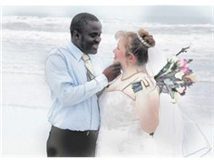

Title: Konur sem tákn menningar
Slug: konur-sem-takn-menningar
Date: 2006-03-02 13:39:00
UID: 51
Lang: is
Author: Helga Tryggvadóttir
Author URL: 
Category: Kynjafræði, Mannfræði
Tags: 

Samtal sem ég átti við samnemendur mína fyrr í vetur leiddi til þess að ég fór að íhuga hvort að í samfélagi okkar leynist ólík viðhorf til þess að íslenskar konur eigi erlenda maka heldur en ef um væri að ræða íslenska karlmenn. Það vildi svo til að nokkrar kvennanna í hópnum höfðu reynslu af því að mökum þeirra af erlendum uppruna hafi ekki verið vel tekið af fjölskyldum þeirra. Einn karlanna í hópnum lýsti því að viðhorf föður síns til þess ef hann sjálfur ætti erlendan maka væru mun jákvæðari en ef um væri að ræða systur hans. Ein kvennanna lýsti neikvæðum athugasemdum sem hún hafði fengið frá ókunnugu fólki þegar hún var að gæta systurbarna sinna, en litarhaft þeirra benti til þess að þau væru af erlendum uppruna. Eru þessi viðhorf lýsandi fyrir viðhorf í samfélaginu, eða eru þetta einungis afmörkuð dæmi? 

Ef þessi dæmi endurspegla samfélagið í heild sinni, eru Íslendingar þá almennt neikvæðari gagnvart því að íslenskar konur séu með erlendum karlmönnum, eða á það sama við um íslenska karlmenn með erlendum kvenmönnum? Ef svo er, hver er þá ástæðan fyrir því? Að mér vitandi hefur ekki verið gerð nein viðhorfsrannsókn á þessu máli, en það væri þó athyglisvert að skoða það nánar. Í skoðanakönnun sem IMG Gallup gerði fyrir Alþjóðahúsið kom fram að tæp 72% svarenda væru mjög ósammála eða frekar ósammála þeirri fullyrðingu að leyfa ætti fleiri útlendingum að vinna hér á landi.[^1] Ætli sömu einstaklingar væru mótfallnir því að barn þeirra eignaðist erlendan maka? 

Til er kenning um að í mörgum samfélögum sé það frekar ábyrgð kvenna en karla að viðhalda menningu. Þar sé jafnvel litið á konur sem tákn menningar. Í ýmsum samfélögum er lögð meiri áhersla á það að konur giftist ekki út fyrir hópinn sem þær tilheyra heldur en að karlmenn geri slíkt hið sama. Það getur verið afleiðing þess að litið sé svo á að konan eigi að varðveita menninguna, taki hún sér utanaðkomandi maka er hætt við að menningin glatist. Svo virðist sem margir séu ósáttir við að konur leiti út fyrir sinn etníska hóp að maka, en það sama eigi ekki við um karla. Til dæmis er það sjaldan viðurkennt í Íslam að konur giftist út fyrir trú sína, en það sama á ekki við um karlmenn. Ástæðuna má rekja til þess að trúin breiðist út í karllegg. Í mörgum samfélögum er ætlast til að konur varðveiti etníska sjálfsmynd, sökum þess að þær eru taldar þungamiðja hennar. Því skiptir miklu máli fyrir viðhald táknrænnar sjálfmyndar hópsins að stýra því hverjum kona giftist og hvaða hópi börn hennar tilheyra. Til dæmis var það lögbrot fyrir hvítar konur í Suður-Afríku að sofa hjá karlmönnum af öðrum hópum á tímum aðskilnaðarstefnunnar.[^2] 

Í greininni „Maður íslenskur“ talar Unnur Karlsdóttir um að  litið sé á það sem landráð ef íslenskar konur séu með útlenskum karlmönnum. Þar nefnir hún dæmi frá ástandsumræðunni þar sem barneignir með erlendum hermönnum voru álitnar ógn við íslenskt þjóðerni.[^3] Það má velta því fyrir sér hvort viðbrögðin hefðu orðið þau sömu ef um hefði verið að ræða íslenska karlmenn með erlendum konum.   

Sigríður Dúna Kristmundsdóttir segir að oft séu konur notaðar sem tákn fyrir menningu. Hefðir þeirra, hlutverk og klæðnaður sé leið til að tjá sérstæði menningar þeirra.[^4] Sem dæmi má nefna íslenska þjóðbúninginn, en þrjár tegundir af þjóðbúningi eru til fyrir konur. Búningurinn undirstrikar móðurhlutverkið með víðu pilsi sem ýkir mjaðmir konunnar og leggur þar með áherslu á hæfileika hennar til að eiga börn, og þröngum upphlut sem beinir athyglinni að brjóstum konunnar, sem nærir ungviðið. Þessi búningur er í samræmi við þá ímynd konunnar sem hefur viðgengist í íslenskri þjóðernisvitund. Það er að konan sé móðir og næri börn sín ekki einungis líkamlega heldur einnig andlega. Innræti þeim menningu, sögu og tungu landsins.  „Konur sem mæður voru taldar gegna lykilhlutverki í mótun og þróun íslensku þjóðarinnar og aðeins hjónabandið og móðurhlutverkið var talið gefa lífi kvenna varanlegt gildi“.[^5]

Ástæðan fyrir því að konur eru álitnar varðveita menninguna fremur en karlar gæti verið sú að þær sjái um að ala upp næstu kynslóð. Konur bera ábyrgð á uppeldi barnanna og því á varðveislu menningarinnar. Því hefur verið haldið fram að móðurhlutverkið styrki mörkin milli karla og kvenna. Það sé sökum þess að konur séu fyrst og fremst skilgreindar sem mæður. Karlmenn séu aftur á móti skilgreindir fyrst sem karlar, síðan sem feður.[^6] Því virðist sem karlmenn hafi meira frelsi til þess að taka upp nýja siði án þess að litið sé svo að þeir glati menningu sinni. Á undanförnum árum hefur verið mikið um fólksflutninga víðs vegar í heiminum. Konur sem eru innflytjendur þurfa að velja um það hvort þær vilji halda fast í menningu sína og hefðir eða hvort þær vilji taka upp nýja siði í nýja landinu. Þær samlagast almennt nýja samfélaginu seinna en karlar sem oft hafa meiri samskipti út fyrir heimilið, og því við aðra en sinn eigin hóp. Það er ef til vill þess vegna sem konur eru álitnar standa vörð um og jafnvel tákna menningarlega sérstöðu.[^7]

Þessa kenningu, að konur séu álitnar tákn menningar, má nota til að varpa ljósi á ástæður stríðsglæpa gegn konum. Alvarlegasta birtingarmynd þess er þegar kerfisbundnar nauðganir eru vísvitandi notaðar til þess að undiroka og niðurlægja óvininn. Með því að ráðast á konur óvinarins er um leið verið að ráðast á tákn sjálfsmyndar hans og því eru nauðganir í stríðum ein leið til þess að brjóta niður andstæðinginn. Það varpar um leið ljósi á hvers vegna konur sem eru sjálfviljugar með hermönnum óvinarins séu álitnar svikarar.[^8]

Þessa umræðu má ekki skilja sem svo að karlmenn neyði þá sjálfsmynd upp á konur að þær beri meiri ábyrgð á viðhaldi menningar og hreppi þær þar með í hlekki hefða karlaveldisins. Það er ekki síður þær sjálfar sem líta á sig sem verndara menningar og eru stoltar af hlutverki sínu sem mæður og uppalendur. Til dæmis tóku íranskar konur virkan þátt í íslömsku byltingunni í Íran, og tóku vísvitandi upp blæjuna.[^9] Mannfræðingurinn Lila Abu-Lughod segir að það væri tilgangslaust ef karlmenn myndu neyða konur til þess að ganga með blæju. Blæjan er tákn góðs siðferðis, sem er ekki hægt að neyða upp á fólk. Hún segir kerfinu viðhaldið sökum þess að konurnar langi til að vera góðar og virðingarverðar manneskjur.[^10] Sigríður Dúna segir konur oftar en ekki stoltar af móðurhlutverkinu og verja það með kjafti og klóm.[^11]

Athyglisvert væri að skoða nánar viðhorf Íslendinga til hjónabanda íslenskra kvenna og erlendra karla. Eru þau að einhverju leyti frábrugðin viðhorfum til íslenskra karlmanna sem eiga erlendar eiginkonur? Óttumst við að íslensk menning glatist ef að íslenskar konur eignast erlenda maka? Hefur þetta ef til vill eitthvað að gera með valdamun á milli karla og kvenna? Sé það svo að karlmaðurinn „ráði“ yfir konunni þá má skilja það sem svo að hlutverk hans sé ráðandi í sambandinu. Því sé það ekki jafn alvarlegt að hann eigi erlenda konu og að kona af okkar menningu eigi erlendan eiginmann. Má túlka það svo að í seinna tilvikinu hafi „okkar“ menning „tapað“? 

[^1]: Sótt af vefsíðu IMG Gallup þann 1.mars 2006. Slóðin er: http://www.gallup.is/main/view.jsp?branch=526353&e342RecordID=3383&e342DataStoreID=514959 - Niðurstöðurnar voru birtar 16.11. 2004. 

[^2]: de Cuéllar. 1997. „Gender and Culture.“ Í: de Cuéllar (ritstj). Our Creative Diversity: Report of the World Comission on Culture and Development_. Oxford: Unesco Publishing. 

[^3]: Unnur Karlsdóttir. 2003. „Maður íslenskur: Hugmyndir á fyrri hluta tuttugustu aldar um samband íslensk þjóðernis og kynþáttar.“ ‘I: Jón Yngvi Jóhannson, Kolbeinn Óttarson Proppé og Sverrir Jokobsson (ritstj); _Þjóðerni í þúsund ár?_ Reykjavík: Háskólaútgáfan. 

[^4]: Sigríður Dúna Kristmundsdóttir. 2004. „Women’s Movements and the Contradictory Forces of Globalization.“ Í: H.R. Christiansen, B. Halsaa og A.Saarinen (ritstj); _Crossing Borders: Re-Mapping Women’s Movements at the Turn od the 21st Century_. 

[^5]: Inga Dóra Björnsdóttir. 1994. „Þeir áttu sér móður: Kvenkenndir þættir í mótun íslenskrar þjóðernisvitundar. Í: Ragnhildur Richter (ritstj); _Fléttur_. Reykjavík: Háskólaútgáfan.  

[^6]: Sigríður Dúna Kristmundsdóttir. 1999. „„Father dif not answer that question“: Power, Gender and Globalization in Europe.“ Í A. Cheater (ritstj); _The Anthropology of Power: Empowerment and Disempowerment in Changing Structures_. London: Routledge. 

[^7]: De Cuéllar, 1995: bls. 141.

[^9]: Afshar. 1998. „Disempowerment“ and the Politics od Civil Liberties for Iranian Women. Í: H. Afshar (ritstj): Women and Empowerment: Illustrations from the Third World. New York: St.Martins Press. 

[^10]:  Abu-Lughod. 1999. Veiled Sentiments: Honour and Poetry in a Bedouin Society. Berkeley: University of California Press. 

[^8]: Sigríður Dúna Kristmundsdóttir. 2004: Bls. 327

[^11]: Sigríður Dúna Kristmundsdóttir. 1999: Bls.51

