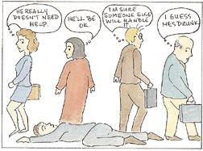

Title: Kötturinn sagði „Ekki ég“
Slug: kotturinn-sagdi-ekki-eg
Date: 2008-08-07 14:35:13
UID: 441
Lang: is
Author: Sólrún Ósk Lárusdóttir
Author URL: 
Category: Sálfræði
Tags: Litla Gula hænan, hjálpsemi, hjálp, áhorfendaáhrif, Kitty Genovese, afskiptaleysi, John Darley, Bibb Latane, Batson, miskunsami Samverjinn, ábyrgð, kostnaður

> „Litla gula hænan fann fræ. Það var hveitifræ.“  
> <cite>(úr kennslubók í lestri, 1943)</cite>

Óeigingjörn hjálpsemi, það að veita öðrum aðstoð án þess að það gagnist á beinan hátt þeim sem hjálpar, er hegðun sem hefur lengi verið félags&shy;sál&shy;fræðingum hug&shy;leikin. Fólk tekur höndum saman til hjálpar bág&shy;stöddum, opnar styrktar&shy;reikninga, mætir á tónleika og stendur upp fyrir elli&shy;líf&shy;eyris&shy;þegum í strætó. Öll höfum við ýmist hjálpað, og/eða þegið hjálp með þökkum frá ókunnugum á lífs&shy;leiðinni.

Því hefur reyndar verið haldið fram að ekkert góðverk sé algjörlega án umbunar fyrir gefandann, þótt ávinningurinn sé vissulega misjafn. Gjafmild ríkmenni og fyrirtæki fá gjarnan að launum jákvæða umfjöllun í fjölmiðlum en oft er umbunin einfaldlega fólgin í sælu yfir því að hafa gefið frekar en þegið.

Það kemur samt fyrir okkur öll að við hegðum okkur eins og dýrin í dæmisögunni um litlu gulu hænuna og segjum „ekki ég", eða hreinlega lítum undan og látum eins og neyðin sé ekki til staðar. Hugsanlega er það öllu áhugaverðari hegðun sem þarfnast frekari skýringa. Raunar hafa rannsóknir sýnt fram á að því fleiri vitni að atburði þar sem einhver þarfnast hjálpar, því minni líkur eru á að hjálpin verði veitt. Gjarnan er þá talað um áhorfendaáhrif eða bystander effect.

Eitt frægasta dæmið um áhorfendaáhrifin er sagan af Kitty Genovese, ungri konu sem sem var stungin til bana á götuhorni í New York árið 1964 eftir fólskulega líkamsárás.  Hún lést af stungusárum sínum eftir að hafa öskrað og barist um í hálftíma á meðan nágrannar hennar horfðu á gegnum glugga sína án þess að aðhafast nokkuð. Frétt sem birtist í _New York Times_ um að minnst 38 manns hefðu orðið vitni að árásinni án þess að neinn hringdi á lögreglu vakti mikla hneykslan meðal almennings. Síðar voru þær tölur dregnar í efa og atburðarrásin sögð ýkt, en frásögnin lifir góðu lífi og eru áhorfendaáhrif stundum kölluð Genovese áhrif.

Svipaðar sögur um afskiptaleysi fjölmennis er að finna víðs vegar í heiminum og er Ísland þar engin undan&shy;tekning. Má þar nefna að í byrjun þessa árs kom fram frétt um eldri mann sem hafði dottið illa um hábjartan dag og gekk um í blóði sínu án þess að nokkur öku&shy;maður kæmi honum til hjálpar. Málið vakti mikla athygli í fjöl&shy;miðlum og margir fundu sig knúna til að tjá sig um samvisku&shy;leysi og til&shy;finninga&shy;doða þeirra sem óku þarna framhjá.

Þeir John Darley og Bibb Latane (1968) voru meðal þeirra fyrstu til að kalla fram þessi áhrif á tilraunastofu. Þar voru þátt&shy;takendur hafðir einir í herbergi undir því yfir&shy;skini að um annars konar tilraun væri að ræða. Þeim var sagt að þeir gætu heyrt í öðrum þátt&shy;takendum gegnum hátalarakerfi. Þeir heyrðu í raun og veru hljóð&shy;upptöku þar sem einn „þátt&shy;takenda" virtist vera að fá flog. Síðan var mælt hversu langan tíma það tók hinn raun&shy;verulega þátt&shy;takanda að gera rann&shy;sakanda viðvart. Það reyndist fara eftir því hvað viðkomandi hélt að margir aðrir þátttakendur hefðu heyrt það sem fór fram. Sumir höfðu raunar aldrei samband við rann&shy;sakandann! Svipaðar tilraunir hafa margsinnis verið endurteknar þar sem þátt&shy;takendur verða vitni að hinum ýmsu neyðar&shy;aðstæðum, svo sem að hlusta á einhvern fá astmakast, hjartaáfall eða jafnvel að herbergi fyllist af reyk. Niður&shy;stöðurnar eru alltaf á þá leið að því stærri hóp sem þátttakandi er í eða heldur að hann sé í því minni líkur eru á að hann aðhafist nokkuð.

En hvað er það sem veldur því að við högum okkur á þennan hátt? Hvernig stendur á því að jafnvel besta fólk sýnir sinnuleysi þegar það heyrir í eða horfir upp á einhvern í vanda? Eflaust er engin ein skýring til en nokkrar skýringar hafa verið lagðar til, svo sem mat á aðstæðum, kostnaður og síðast en ekki síst dreifing ábyrgðar.

Fólk sem kemur að meðvitundarlausum manni á götunni á ef til vill erfitt með að meta hvort maðurinn sé veikur eða drukkinn, og vill hugsanlega síður skipta sér af síðarnefndum aðstæðunum. Þeir Darley og Latane héldu því fram að við höldum ekki að okkur höndum af því að okkur sé sama heldur af því að við vitum ekki hvað við eigum að gera og skiljum ekki aðstæðurnar rétt. Sum vitnin að árásinni á Kitty Genovese báru því fyrir sig að þau hefðu haldið að ef till væri um að ræða rifrildi elskenda eða jafnvel leikþátt og mátu það svo að hvers konar inngrip hefði verið vandræðalegt. Þegar aðstæður eru óljósar eru líkur á að hver og einn efist um eigin dómgreind og líti til annarra til að meta hvort hjálpar sé raunverulega þörf. Ef hver horfir á annan og enginn gerir neitt, gera allir ráð fyrir að það sé samdóma álit hópsins að hjálpar sé ekki þörf. Einnig má nefna að stundum efast fólk ekki um aðstæðurnar heldur um eigin getu til að hjálpa og vissulega er það stundum rétt mat. Þannig getur verið að vegfarandi telji aðra betur til þess fallna að aðstoða í ákveðnum neyðaraðstæðum, til dæmis heilbrigðisstarfsfólk eða lögreglu og að inngrip þeirra séu beinlínis óþörf.

Fólk býður síður fram hjálparhönd ef það metur aðstæðurnar þannig að það gæti verið hættulegt eða kostað tíma og fyrirhöfn að grípa inn í. Darley og Batson (1973) gerðu tilraun á nokkrum óafvitandi nemendum sem þurftu að fara úr einni háskólabyggingu í aðra á fyrirlestur. Þeim var sagt að flýta sér af því að þeir væru orðnir of seinir. Því var hagað þannig að þeir þurftu að fara framhjá manni sem lá í dyragætt og kveinkaði sér. Aðeins tíundi hluti nemendanna gerði hlé á för sinni og gaf sig á tal við manninn. Kaldhæðni örlaganna var sú að um var að ræða guðfræðinemendur á leið á fyrirlestur um miskunnsama Samverjann.

Ein áhugaverðasta skýringin er sú að þegar margir verða vitni að atburði þar sem hjálpar er þörf, gera allir áhorfendur ráð fyrir að einhver annar muni grípa inn í. Þetta leiðir til þess að hverjum og einum finnst hann bera minni ábyrgð á aðstæðunum. Ábyrgðin dreifist á fleiri og hverjum og einum finnst þess vegna í lagi að bregðast ekki við. Ökumenn fá þannig minna samviskubit yfir að taka ekki upp puttaferðalang ef þeir vita eða sjá að um fjölfarinn veg er að ræða. Þessi hugmynd um dreifing ábyrgðar (diffusion of responsibility) hefur verið notuð til að skýra ýmsa aðra hegðun. Í aftökusveitum þekkist það að einum meðlimi er afhent skotvopn með engum skotum í, án þess að neinn viti hver hafi það vopn undir höndum. Þannig getur hver talið sér trú um að hann hafi ekki verið sá sem hleypti af banaskotinu. Hugmyndin á einnig við um hversdagslega hluti eins og að skýra af hverju enginn eða fáir sinna þeim verkefnum sem eru á sameiginlegri ábyrgð stærri hóps, svo sem að þrífa stigaganginn eða ganga frá eftir kaffið.

Vafalaust hafa allir lent í aðstæðum þar sem þeir voru of þreyttir, tímabundnir eða óöryggir til að rétta fram hjálparhönd. Þeir sömu hafa eflaust reynt að telja sér trú um að það væri ekki alfarið á þeirra ábyrgð ef fleiri komu að málinu. En þrátt fyrir að sagan um litlu gulu hænuna hafi endað vel er nauðsynlegt að brjótast stundum úr viðjum hins aðgerðarlausa áhorfanda og kanna aðstæður þegar einhver virðist vera í vanda staddur. Það eitt og sér breytir hóphegðuninni, aðrir áhorfendur ranka við sér og túlka aðstæðurnar upp á nýtt.  Fyrir þann sem þarf á hjálp að halda má benda á að talið er að það skili betri árangri að biðja einhvern einn ákveðinn um aðstoð heldur en heilan hóp. Hver veit nema litla gula hænan hefði fengið aðstoð við baksturinn ef hún hefði blikkað köttinn einslega og beðið hann um hjálp.

---

#### Sjá einnig: 

* http://en.wikipedia.org/wiki/Bystander_effect
* http://en.wikipedia.org/wiki/Kitty_Genovese

---

#### Heimildir

* Bierhoff, H.W. (1996). Prosocial Behaviour. Sjá í M. Hewstone, W. Stroebe og G. M. Stephensson (ritstj.). _Introduction to Social Psychology_ (2. útg) (bls. 375-401). Oxford: Blackwell publishers.
* Darley, J. M. og Batson, C. D. (1973). From Jerusalem to Jericho. A study of situational and dispositional variables in helping behavior. _Journal of Personality and Social Psychology_, 27, 100-108. 
* Darley, J. M. og Latané, B. (1968). Bystander intervention in emergencies: Diffusion of responsibility. _Journal of Personality and Social Psychology_, 10, 202-214. 
* Gansberg, M. (1964, 27. mars). Thirty-eight who saw murder didn’t call the police. _New York Times._ Sótt 30. júlí 2008 af slóðinni http://www2.selu.edu/Academics/Faculty/scraig/gansberg.html
* Gleitman, H. (1995). _Psychology_ (4. útg.) New York: Norton & Company. Latané, B. og Nida, S. (1981). Group size and helping. _Psychological Bulletin_, 89, 308-324.
* Margir óku framhjá slösuðum manni (2008, 6. janúar). _Morgunblaðið._ Sótt 30. júlí 2008 af slóðinni http://www.malbum.is/mm/frettir/innlent/2008/01/06/margir_oku_framhja_slosudum_manni/

