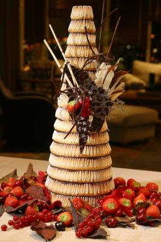

Title: Kransakökur, allsnægtir og borgaralegar hefðir. Fyrri hluti
Slug: kransakoekur-allsnaegtir-og-borgaralegar-hefdir
Date: 2006-06-15 12:56:00
UID: 79
Lang: is
Author: Magnús Sveinn Helgason
Author URL: 
Category: Neyslusamfélagið, Menningarfræði
Tags: 

Í þessari grein er ætlun mín að skyggnast fyrir um hvaða hlutverki kransakökur gengdu í íslensku neyslusamfélagi. Þetta vildi ég auk þess helst gera án þess að fara út úr húsi. Metnaðarfullur sagnfræðingur myndi leita í matreiðslubækur, æviminningar, tímarit og blöð, og loks taka viðtöl við bakara og veitingamenn. Ég ákvað hins vegar að treysta alfarið á eina einustu heimild, nefnilega Morgunblaðið, því það er hægt að lesa það á netinu...

Það var margt sem kom mér á óvart þegar ég fór að skoða hvernig fjallað var um kransakökur í Morgunblaðinu. Fyrir það fyrsta bjóst ég við að finna uppskriftir að kransakökum, og kannski eina eða tvær greinar í fermingar- eða jólablaðinu um hvernig ætti að skreyta kransakökur, hversu mikill munur ætti að vera á þvermáli hvers þreps (til þess að kakan hryndi ekki), ágæti þess að skreyta með fánum (að dönskum sið) eða Machintosh konfekti (að síðari tíma íslenskum sið), hversu stór kransakakan yrði að vera fyrir meðal fermingarboð, og þar fram eftir götunum. Það voru hins vegar engar uppskriftir, og engar greinar um kransakökugerð. Í örfáum greinum er minnst á kransakökur í brúðkaupum og þá var þess ætíð getið ef erlendum þjóðhöfðingjum var boðið upp á kransakökur og annað hvort kaffi eða kampavín. Þannig fékk Ólafur Noregskonungur kransaköku og kampavín í Þjóðleikhúskjallaranum þegar hann kom í heimsókn 1961, Friðrik danakonungi var hins vegar boðið upp á kaffi og kransaköku þegar hann heimsótti landið 1970, og Ronald Reagan fékk kransaköku og kampavín hjá Vigdísi Finnbogadóttur á Bessastöðum 1989. Ég er viss um að bæði Ólafur og Friðrik voru ánægðir með kransakökuna sem þeir fengu, enda bæði Norðmenn og Danir kransakökuþjóðir. Hvort Reagan kunni að meta kransakökuna er annað mál.

Hins vegar var töluvert af auglýsingum frá bakaríum og veisluþjónustum sem buðu upp á kransakökur. Og það voru þessar auglýsingar sem vöktu athygli mína. Þar sem ég er “neyslusögufræðingur“ bjóst ég reyndar við að auglýsingarnar yrðu jafn áhugaverðar og lengri greinar, uppskriftir eða húsmæðradálkar. Neyslusögufræðingar hafa nefnilega frekar lítinn áhuga á fréttum eða aðsendum greinum dagblaða (nema þegar þar er skammast út í neysluhætti fólks). Þess í stað lesa og afbyggja neyslusögufræðingar auglýsingar, í leit að kynjun, stétt- og þjóðernismyndum, nú og svo auðvitað vísbendingum um hvers var neytt, hvenær og hvernig. Neyslusögufræðingurinn er því oft í stellingum einhverskonar menningar eða mannfræðings. 

En það er þó grunnt á hagsöguna í mér, og því fannst mér ég þurfa að fara að telja, helst búa til einhverskonar línu- eða stöplarit, reikna út hlutföll og setja upp töflur. Þessi árátta fékk byr undir báða vængi þegar ég tók eftir því hversu undarlega ójafnt kransa&shy;köku&shy;aug&shy;lýsingarnar dreifðust. Þar sem ég hef sjálfur aðallega borðað kransakökur í fermingarveislum bjóst ég við að kransa&shy;köku&shy;aug&shy;lýsingar væru algengastar í kringum apríl, og svo bjóst ég við að kransa&shy;köku&shy;aug&shy;lýsingum væri nokkuð jafnt dreift yfir öldina, og þó væri sennilega meira af þeim á síðari áratugum, nú, vegna þess að auglýsingamennska hefði aukist, og sýndarneyslan sömuleiðis — bakaríin hlytu að keppast um að auglýsa veglegustu kransakökurnar fyrir ferminguna.

Bæði reyndist rangt. Hlutfallslega voru flestar kransa&shy;köku&shy;aug&shy;lýsingarnar á fyrri hluta aldarinnar — flestar á fjórða áratugnum. Þeim fækkar hinsvegar mjög á eftirstríðsárunum, kransakökur hverfa þá nánast af síðum Morgunblaðsins, og birtast fyrst aftur í lok áttunda áratugarins — orðaleitin skilaði ekki nema þremur auglýsingum um kransakökur á milli 1950 og 1970! Ég þykist fullviss um að fólk hafi borðað kransakökur á þessum árum, og kransakökugerðarlistin hafi ekki fyllilega glatast eins og kornræktin á miðöldum. Í það minnsta varðveitti Húsmæðrafélagið þessa list — þann 15 desember 1960 greindi Morgunblaðið frá því að á jólafundi félagsins hefði verið sýnd forláta kransakaka: “Sérstaka athygli vakti heimatilbúin kransakaka, feiki stór og fallega skreytt. Þolir hún mjög vel geymslu...“ og rúmlega einu og hálfu ári síðar fékk Ólafur Noregskonungur einmitt kransaköku og kampavín í opinberri heimsókn.

Þær 125 kransa&shy;köku&shy;aug&shy;lýsingar sem orðaleit Morgunblaðsins skilaði skiptust þannig upp á milli áratuga:

<svg width="100%" viewBox="0 0 700 245">
  <line x1="69.5" x2="69.5" y2="245" stroke="black" />
  <g transform="translate(70,5)">
    <g transform="translate(0,0)">
      <text dy="1em" x="-5" text-anchor="end">1913-20</text>
      <text dy="1em" x="15" text-anchor="start">1%</text>
      <rect x="0" height="24" width="10" fill="#aaa" />
    </g>
    <g transform="translate(0,30)">
      <text dy="1em" x="-5" text-anchor="end">1921-30</text>
      <text dy="1em" x="195" text-anchor="start">19%</text>
      <rect x="0" height="24" width="190" fill="#aaa" />
    </g>
    <g transform="translate(0,60)">
      <text dy="1em" x="-5" text-anchor="end">1931-40</text>
      <text dy="1em" x="465" text-anchor="start">46%</text>
      <rect x="0" height="24" width="460" fill="#aaa" />
    </g>
    <g transform="translate(0,90)">
      <text dy="1em" x="-5" text-anchor="end">1941-50</text>
      <text dy="1em" x="15" text-anchor="start">1%</text>
      <rect x="0" height="24" width="10" fill="#aaa" />
    </g>
    <g transform="translate(0,120)">
      <text dy="1em" x="-5" text-anchor="end">1951-60</text>
      <text dy="1em" x="15" text-anchor="start">1%</text>
      <rect x="0" height="24" width="10" fill="#aaa" />
    </g>
    <g transform="translate(0,150)">
      <text dy="1em" x="-5" text-anchor="end">1961-70</text>
      <text dy="1em" x="15" text-anchor="start">1%</text>
      <rect x="0" height="24" width="10" fill="#aaa" />
    </g>
    <g transform="translate(0,180)">
      <text dy="1em" x="-5" text-anchor="end">1971-80</text>
      <text dy="1em" x="65" text-anchor="start">6%</text>
      <rect x="0" height="24" width="60" fill="#aaa" />
    </g>
    <g transform="translate(0,210)">
      <text dy="1em" x="-5" text-anchor="end">1981-90</text>
      <text dy="1em" x="265" text-anchor="start">26%</text>
      <rect x="0" height="24" width="260" fill="#aaa" />
    </g>
  </g>
</svg>

Reynsla mín af orðaleit Morgunblaðsins er sú að hún skili í besta falli þriðju hverri færslu — sem þýðir að það séu líklega þrisvar sinnum fleiri auglýsingar og greinar um kransakökur en ég fann, en það er engin ástæða til annars en að ætla að það brottfall dreifist nokkuð jafnt yfir öldina, þ.e. orðaleitinni ætti að yfirsjást hlutfallslega yfir jafn margar færslur á eftirstríðsárunum og öðrum áratugum.

Hér er því á ferðinni merkilegan leyndardómur: Hvað varð um kransakökuna á eftirstríðsárunum og af hverju er hún endurvakin á níunda áratugnum? Til þess að svara þessari spurningu lagðist ég i nokkuð umfangsmiklar kökurannsóknir — þær niðurstöður munu birtast síðar í seinni hluta þessarar greinar.

En það var af nógu öðru að taka, því þegar ég athugaði hvenær kransa&shy;köku&shy;aug&shy;lýsingar birtust kom í ljós að á fyrri hluta aldarinnar voru kransakökur fyrst og fremst auglýstar fyrir jólin. Alls voru 70% allra kransa&shy;köku&shy;aug&shy;lýsinga fram til 1950 í mánuðunum fyrir jól, 20% um vorið og aðeins 10% á öðrum tíma árs. Þessi hlutföll breytast nokkuð á síðari helmingi aldarinnar, þegar rétt tæplega helmingur, eða 51% auglýsinganna birtust fyrir jól, en fjöldi auglýsinga á öðrum árstímum eykst sem því nemur.

Jólakransakakan virðist hafa verið mikivægur og fastur liður í jólahaldi betri borgara. Björnsbakarí auglýsti fyrir jólin 1923 með þessum orðum: “Húsmæður! Munið að láta yður ekki vanta tertu, ís, fromage eða kransaköku á jólaborðið, og sendið eða símið nú þegar.“ Þá voru auglýst kransakökuhorn til jólanna — og þó ég þykist vita að það hafi verið bökuð kransakökuhorn á seinni helmingi aldarinnar birtast þau í það minnsta ekki í Morgunblaðinu. 

Sem kransakökuhorn hefur kransakakan ummyndast í eftirmynd af alls&shy;nægtar&shy;horninu, táknmynd veraldlegra allsnægta og auðs, fyllt konfekti í marglitum pappír, sem glitrar eins og gimsteinar og gullmolar. Þannig stendur kransa&shy;köku&shy;hornið á miðju borði og symbolíserar auð og velgengni fjölskyldunnar. Kransakakan ber reyndar af öllu öðru bakkelsi þegar kemur að sýndarneyslu — þar sem hún endist lengi getur hún staðið á borði í nokkra daga — án þess að verða vond. Og ólíkt tertum verða kransakökur ekki eins auðveldlega að kökurústum... Það er auðvelt að taka hringina í sundur, og neyta kökunnar smátt og smátt. Sem slík er kransakakan, og þó sérstaklega kransakökuhornið, fullkomin sem hátíðarkaffibrauð á jólaborði betri borgara.

Kransakakan er nefnilega líka mjög borgaraleg — það er eiginlega ekki hægt að hugsa sér neitt borgaralegra bakkelsi en kransakökur. Þær komu til Íslands með danskri kaupmanna og embættismannastétt, lögfræðingum og læknum (sem skýrir líka tengslin við stúdentsveisluna — kransakakan og æðri menntun eru náskyld). Kransakökur eru því tengdar uppruna íslenskrar borgarastéttar órjúfanlegum böndum. Og þó hún eigi þannig uppruna sinn í danskri nýlendustefnu er hún einhvernveginn samt líka mjög þjóðleg. Stílfastur einfaldleikinn hentar einnig lúterskri hefð íslendinga afskaplega vel. 

Í Bandaríkjunum, þar sem kransakökur eru oft hafðar á borðum í brúðkaupum hjá bandaríkjamönnum sem þykjast geta rakið ættir sínar til Skandínavíu, er það þetta meinlætalega yfirbragð, skortur á rjóma og kremi sem helst heillar. (Í Bandaríkjunum heita kransakökur upp á dönsku "Kransekake", og eru seldar í bakaríum sem heita ýmist "The Danish Bakery", eða "The Scandinavian Bakery"). Það er kannski þetta sem skýrir vinsældir kransakökunnar í fermingarveislum: þær mynda ákveðinn samhljóm með því kristilega yfirbragði sem fermingin á að hafa — og um leið þjónar kransakakan sem nokkurskonar mótvægi og helgun á því neysluæði sem fermingarveislur eru. Í stað þess að vera í formi allsnægtarhorns, sem gestir þurfa að teygja sig inn í til að ná í konfektmola, hefur verið hvolft úr horninu, og góssið hefur húrrað út, og í stað konfektmola eru rafmagnstæki, peningar og verðbréf. En kransakakan stendur eftir, nokkuð meinlætaleg og einföld.

Það þarf að fara varlega í að skoða kransakökur sem óbreytanlegt tákn borgaralegrar hefðar eða allsnægta. Því kransakökur, sem verið höfðu hinar “hefðbundnu“ brúðartertur Íslendinga, hopa mjög skyndilega á áttunda áratugnum fyrir hvítum, rjóma og froðukenndum marghæða ameríkaníseruðum brúðartertum. Í umfjöllun um brúðkaup árið 1985 sagði Morgunblaðið að brúðartertur væru “af mörgu tagi og kannast flestir Íslendingar við sígildu kransakökurnar sem bornar eru fram í brúðkaupum og stórveislum hér á landi. Barst þessi siður hingað með dönsku fyrirfólki á fyrri hluta þessarar aldar ásamt fleiri erlendum hefðum. Í enskumælandi löndum tíðkast tilkomumiklar brúðartertur á stöplum... Ekki eru allir jafn hrifnir af kökunum en þær eru húðaðar með hvítu kremi...“ (Morgunblaðið 27 sept 1985). Hér er augljóst að blaðamaður gerir ráð fyrir að lesendur þekki ekki endilega engilsaxneskar brúðartertur, og að þeir sem það geri séu ekki endilega mjög hrifnir af þeim! Í sama blaði er umfjöllun um kostnað vegna brúðkaupa, og undir liðnum "veitingar" er aðeins minnst á kransakökur, en engar aðrar tertur eða kökur. 

Fimm árum síðar, eða 1990, þarf kransakakan hins vegar að sitja við hlið hvítra amerískra brúðarterta: Talað er jöfnum höndum um brúðartertur og kransakökur. Í sömu grein er sagt að “[á] undanförnum árum [hefði] það færst mjög í vöxt að haldnar eru veglegar og fjölmennar brúðkaupsveislur og er þá oft ekkert til sparað til að allt megi verða sem glæsilegast“ og að kirkjubrúðkaupum hefði mjög fjölgað á kostnað heimabrúðkaupa. Hér eru hugsanlega á ferðinni menningaráhrif frá bandarískum kvikmyndum, þar sem tilhugalíf elskenda endar með stórbrotnum brúðkaupum, og hvítum kökum, ekki stökku dönsku möndlubakkelsi.

Brúðkaup virðast hafa tekið einhverjum breytingum á seinni hluta níunda áratugarins, og læðist að manni sá grunur að yfirbragð brúðkaupa hafi orðið “rómantískara“, stórbrotnara og ævintýralegra. Hér er sennilega ekki endilega á ferðinni sýndarneysla à la Veblen, heldur frekar “draumaveröld“ neyslunnar sem Colin Campbell lýsir. Kransakakan er nefnilega alls ekki rómantísk — hún er ekki heldur ævintýraleg, þvert á móti er hún nánast gamaldags. Það er kannski til marks um breyttar áherslur í ímynd kransakökunnar að þegar barnastjarnan Rut Reginalds gifti sig 1989 tók hún það fram í viðtali við Morgunblaðið að í búðkaupinu hafi hún og eiginmaður hennar hafi haldið “gömlum hefðum eins og hægt var“ — eiginmaðurinn hennar var bakarasveinn, og hefði því hæglega getað bakað hvaða brúðartertu sem er, bakaði þess í stað kransakökur fyrir brúðkaupið.

Það er því sá eiginleiki kransakökunnar að vera “gömul hefð“ sem gerir henni kleift að halda velli í fermingar- og stúdentsveislum, sem enn eru jú mjög borgaralegar manndóms- og vígslu athafnir.

----

<small class="blurb">__15. desember 2007:__ Höfundur óskar að tekið sé fram: Þessi grein er fyrstu drög að stærra verki sem er í vinnslu.</small>
