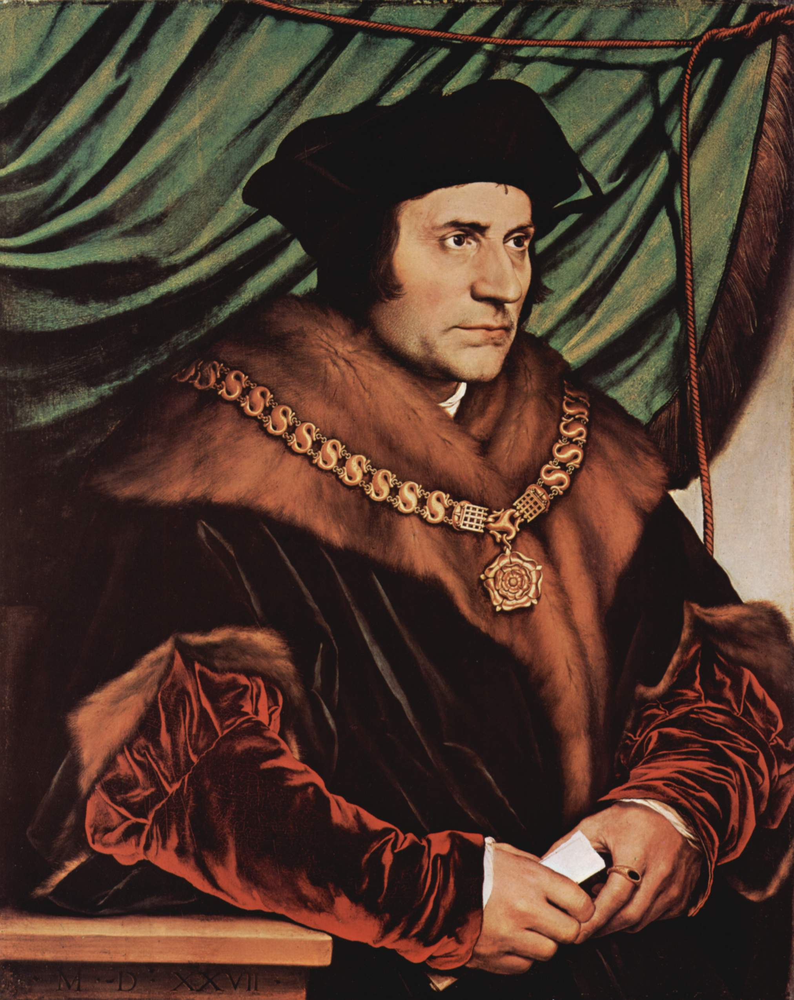
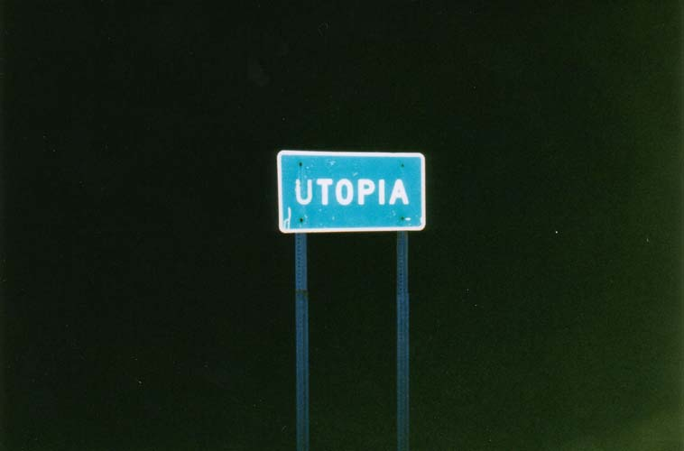

Title: Kyn, kommúnistar og kaþólikkar: Útópía eftir Thomas More 
Slug: kyn-kommunistar-og-katholikkar-utopia-eftir-thomas-more
Date: 2008-09-18 13:39:35
UID: 605
Lang: is
Author: Karl Jóhann Garðarsson
Author URL: 
Category: Heimspeki, Sagnfræði
Tags: Thomas More, Utopia, staðleysa, kommúnistar, kaþólikkar, Kreml, England, húmanismi, dýrlingur, kaþólska kirkjan, kyn, kynhlutverk, De Optimo Republicae Statu deque Nova Insula Utopia, Paul Tuner, Nonsenso, embættismenn, konur, karlar, heimilshald, hjónaband, menntun, prestar, guð, 16. öld, jafnrétti, útópísk, Karl Kautsky, Edward L. Surtz, The praise of Wisdom, Thomas More and his Utopia, feðraveldi

Fjögur hundruð árum eftir afhöfðun pólitíkusins, rithöfundarins og enska aðalsmannsins Thomas More tók kaþólska kirkjan hann í dýrlingatölu. Um svipað leyti, á millistríðsárum 20. aldar, heiðruðu sovésk stjórnvöld hann með minnisvarða í Kreml. Ekki þarf að fara mörgum orðum um hversu óvanalegt var að kommúnistar og kaþólikkar væru sammála um ágæti einhvers. Útópíur Rómar og Moskvu voru enda afar ólíkar. Hér verður _Útópía_ Thomas More til umfjöllunar og litið á hvernig fræðimenn tengdir kaþólsku og kommúnisma hafa túlkað kynhlutverk í bráðfyndinni ferðasögu frá sextjándu öld sér í hag.

Árið 1516 gaf Thomas More út _De Optimo Republicae Statu deque Nova Insula Utopia_, litla bók á latínu þar sem farið var nokkrum orðum um helstu galla evrópskra samfélaga og stjórnar og mikið fjallað um eyju, Útópíu, í nýja-heiminum þar sem málum var öðruvísi fyrir komið og mikið jafnræði virðist ráða ríkjum.[^1]  Nafn eyjunnar hefur orðið að samheiti yfir bæði draumsýnir um betri heim og óraunsæ markmið (Útópía er tekið úr grísku og getur bæði merkt staðleysa og góður staður).[^2]  Ýmis sérnöfn í bókinni eru á grísku og kom More gríninu vel á framfæri með því til menntaðra lesenda sinna. Þar sem grískukunnátta er lítt útbreidd nú til dags er fordæmi Paul Turner fylgt hér og sérnöfnum komið til skila á ensku, að undanskildu sjálfu eyjarnafninu.[^3]

Í Útópíu er mjög skýr stéttaskipting en þvert á hana gengur annað valdakerfi sem miðast út frá kyni. Raphael Nonsenso, sögumaður bókarinnar, hefur lýsingu sína á stjórnkerfi eyjarbúa. Þar er ekkert sagt um kjörgengi eða kosningarétt kvenna en vikið að því að embættismenn (t.d. Stywards og Bencheaters) séu kallaðir feður og hagi sér í samræmi við það.[^4]  Útópískum konum er ekki ætlað að taka að sér föðurhlutverk, hvorki á heimilum né í stjórnkerfinu. Enda er tekið fram þegar konur og karlar hafa sömu réttindi en slíku er ekki fyrir að fara í umfjöllun um stjórnkerfið.

Heimilshald umræddra eyjarskeggja var mun stærra í sniðum en það sem þekktist á eyju More í Norður-Atlantshafi því á hverju heimili voru 10-16 fullorðnir auk barna. Einkalíf sem og opinbert líf grundvallaðist á heimilinu. Öll eldamennska er í höndum kvenna en karlarnir bíða rólegir á meðan en til að dreifa álaginu taka nokkur heimili sig saman mat og þarf því ekki að elda á hverju heimili á hverju kvöldi.[^5]  Karlaveldinu er svo meðal annars haldið við með því að konur flytjast ávallt á milli heimila við giftingu og heimilum er stjórnað af elsta heilbrigða karlmanni (ekkjur eiga þannig ekki möguleika á að verða húsráðendur). Ef kemur til ættleiðinga er ávalt séð til þess að fóstur-faðrinn sé góður og réttsýnn, bæði af föður barnsins og yfirvöldum. Mæður hafa þannig ekkert um málið að segja, þó barnauppeldi sé í þeirra höndum.[^6]  Rétt eins og samfélagið í heild er beygt undir stífar reglur er undirstaða þess, heimilið, gert stöðugt með regluverki.

Menntun sker sig úr í jafnréttismálum Útópíubúa því allir hljóta menntun og frekari menntun stendur bæði strákum og stelpum til boða. Lætur More hér eyjarskeggja fylgja eigin fordæmi en hann sá sérlega vel fyrir menntun dætra sinna, og eflaust hefur höfundurinn verið hjartanlega sammála því húmaníska viðhorfi sem lá að baki jafnréttisstefnunni í menntun - leyndarmál hamingjusams lífs liggur í því að allir geti göfgað hugann.[^7]  Jöfn tækifæri til menntunar hefur þau mjög svo ókaþólsku aukaáhrif að konur geta orðið prestar (þó með strangari skilyrðum en gildir um karlpeninginn).[^8]  Konur eru þó alls ekki fjölmennar í preststéttinni enda kosið í hana af almenningi og einungis karlar sem kjósa. Guðfræðin á sér líka sterka jafnréttishlið því guð Útópíu nefnist Foreldri í daglegu tali innfæddra en ekki Faðir líkt og ætla mætti út frá samtíma höfundar.

Að mati More unnu evrópskar konur næstum ekki neitt á 16. öld en vinna utan heimilis er ekki kynjaskipt í Útópíu heldur vinna allir sína sex tíma á dag í því fagi sem þeir leggja fyrir sig. Heimilisstörf hvíla þó alfarið á herðum kvenna.  Almennt er þannig afar misjafnt hvernig jafnréttismál standa á útópískri eyju jafnræðis, að sumu leiti standa konur og karlar jafnfætis en annars staðar kemur fram að konur hafa ekki sömu grunnréttindi og karlar og staða þeirra er alltaf frávik frá hinu almenna sem Nonsenso lýsir.

Karl Kautsky var í fremstu röð kennismiða marxista í lok 19. aldar og upphafi þeirra tuttugustu.[^9]  Árið 1888 skrifaði hann bók um Thomas More og Útópíu þar sem hann rak hvernig More hafi verið frum-marxisti í skrifum sínum.[^10]  Eðlilega leggur Kautsky því töluverða áherslu á framleiðsluhætti en þeir ákvarða „gerð heimilishalds sem ákvarðar fjölskyldugerð, hjónaband og stöðu kvenna."[^11]  Í framhaldi fær More hrós fyrir þá hugmynd sína að konur vinni utan heimilisins til jafns við karla því þannig frelsist þær frá einangrandi heimilisstörfum. Er þetta lykilatriði í kommúnisma Mores að mati Kautsky og fellur eins og flís við rass við nútíma kenningar kommúnista. Frelsi frá heimilinu fylgir pólitískt frelsi í Útópíu að sögn Kautsky en þar virðist hann líta algerlega framhjá textanum sjálfum og einblína á það sem ætti að vera til staðar í fyrirmyndar sósíalísku ríki.[^12]  Það fer þó ekki fram hjá Kautsky að konur eru körlum undirgefnar í hinu ímyndaða ríki, feðraveldið er sett fram í nánst klassísku formi og því ljóst að hugmyndir Mores passa ekki að öllu leiti við kenningar „hvers nútíma alþýðu sósíalista" . Þar sem það er sósíalismi Mores sem gerði hann „ódauðlegan" verður Kautsky að skýra þennan mun: efnislegar aðstæður voru ekki nægilega þróaðar á 16. öld til þess að sósíalisminn gæti blómstrað að fullu.[^13]  Aðstæður hafa hins vegar breyst svo nú er hægt að koma hugsjóninni í framkvæmd, hugsjón sem er ekki aðeins afrakstur nítjándu aldar heldur og eins helsta húmanista árnýaldar.[^14]

Edward L. Surtz skrifaði _The praise of Wisdom_ um trú og siðferði í _Útópíu_ og kom bókin út í ritröðinni Jesuit Studies árið 1957 með samþykki erkibiskupsins í Chicago. Eðlilega eru áherslur hans nokkuð frábrugðnar túlkun Kautsky. Surtz leggur upp með það markmið að fjalla um trú og siðferði lið fyrir lið og gerir hann það nokkuð skipulega. Hann gerir þó kjör embættismanna eyjarbúa ekki að umræðuefni og virðist því ekki sjá siðferðislega hlið á því máli. Þegar kemur að heimilshaldinu tekur hann fram að þar sé nokkuð sígilt feðraveldi á ferð en lofar More á sama tíma fyrir hið mikla kvenfrelsi sem kemur fram í bókinni. Útópískar konur hafa það almennt mjög gott að mati Surtz því þær eru „hvorki þrælar né þjónar eiginmanna sinna".[^15]  Hvers vegna More velur feðraveldi sem grunn útópíu sinnar er einfaldlega vegna þess hversu mikils More mat og bar virðingu fyrir fjölskyldunni.[^16]  Virðast því allir vera jafnir sem ekki eru þrælar annarra og feðraveldið vera fyrirmyndar fyrirkomulag samkvæmt Surtz. Almennt talar hann um Útópíu sem húmanískar endurbótatillögur Mores en þegar kemur að kvenprestum og kynhlutlausum guð er útskýringin á þá leið að um ekki sé um kaþólikka að ræða heldur heiðingja. Játningar kvenna fyrir eiginmönnum sínum er ekki áhyggjuefni í augum Surtz nema vegna þess að þar talar dýrlingurinn um leikmenn að útdeila sakramenti.[^17]  Í raun lítur Surtz víða undan þegar kemur að ójafnrétti kynjana, breytir merkingu textans jafnvel og styrkir stöðu feðraveldisins í textanum.

Útópíubúar virðast á sumum sviðum búa við framúrstefnulegt jafnrétti á mælikvarða 16. aldar en margt mætti þó óneitanlega betur fara. Bæði Surtz og Kautsky lofa og prísa More fyrir góðar hugmyndir sem samræmast einstaklega vel þeirra kenningum og hugmyndaheimi þó andstæður séu að mörgu leiti. Má því segja að ímynd Mores sem góðs og gegns kaþólikka/kommúnista hafi orðið til þess að aðdáendur hans hafi beygt og sveigt orð hans til að viðhalda hinni sönnu ímynd.

[^1]: Thomas More, _De optimo statu republicae deque nova insula Utopia_, Wikisource, http://la.wikisource.org/wiki/Utopia (7. september). Einnig er hægt að lesa enska þýðingu á netinu í útgáfu frá 1901: http://www.gutenberg.org/files/2130/2130-h/2130-h.htm (7. september).
[^2]: Eitt hefti _Ritsins_ var helgað þessari arfleið, _Ritið_ 2:1 (2002).
[^3]:  Thomas More, _Utopia_. Paul Turner þýddi og ritaði inngang, önnur útgáfa. Penguin books (London, 2003).
[^4]:  Thomas More, _Utopia_, bls. 87.
[^5]:  Thomas More, _Utopia_, bls. 62.
[^6]:  Thomas More, _Utopia_, bls. 56 og 62-63.
[^7]:  More, _Utopia_, bls. 59.
[^8]:  More, _Utopia_, bls. 105.
[^9]:  Um Kautsky má t.d. lesa hér: _Encylopædia Britannica_, http://search.eb.com/eb/article-9044884.
[^10]:  Bókina má lesa í heild sinni á netinu: Karl Kautsky, _Thomas More and his Utopia_, http://search.eb.com/eb/article-9044884.
[^11]:  Karl Kautsky: T_homas More and his Utopia. With a Historical Introduction_. Þýdd af H.J. Stenning. A. & C. Black, (London, 1927), bls. 191 og 215.
[^12]:  Kautsky, _Thomas More_, bls. 222-224.
[^13]:  Kautsky, _Thomas More_, bls. 159, 224 og 227
[^14]:  Kautsky, _Thomas More_, bls. 250.
[^15]:  Edward L. Surtz, _The Praise of Wisdom. A Commentary on the Religious and Moral Problems and Backgrounds of St. Thomas More’s Utopia_. Loyola University Press (Chicago, 1957), bls. 235.
[^16]: Surtz, , _The praise of wisdom,_ bls. 232.
[^17]:  Surtz, _The praise of wisdom_, bls. 27, 162, 196 og 310.
