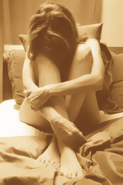

Title: Kynbundið ofbeldi
Slug: kynbundid-ofbeldi
Date: 2007-01-18 16:25:00
UID: 125
Lang: is
Author: Þórhallur Guðmundsson
Author URL: 
Category: Samfélag, Kynjafræði
Tags: 

Undanfarin ár hefur umræða um klám og klám&shy;væðingu haft áhrif á viðhorf fólks til kynlífs og kynlífsathafna. Vændi og mannsal hefur sömu&shy;leiðis verið áberandi í dægur&shy;mála&shy;um&shy;ræðunni á Ísland og umræðan um kynbundið ofbeldi orðið háværari.  Konur og börn eru talin koma við á Íslandi til þess að sinna vændi eða á leið sinni til áfangastaða þar sem þau munu verða hneppt í kynlífs&shy;ánauð.  Grunur leikur á því að karlmenn hafi af því háar tekjur að „gera út“ konur til þess að þjónusta menn kynferðislega.  Annaðhvort með beinu vændi eða í formi erótísks nudds.  Þá hafa vaknað grunsemdir um að einhverjir Íslendingar séu í tengslum eða hafi verið í tengslum við erlenda barnaníðshringi. Ef marka má þessa umræðu þá eru fjölmennur hópur hér á landi sem sækist í klám, vændi og börn til þess að fá hneigðum sínum fullnægt.  Hópur sem virðist hafa greiðan aðgang að þessum varningi.  Hvort sem hann sé í formi myndbanda eða lifandi mannvera.  

Umræðan um kynbundið ofbeldi hefur farið fram í fjölmiðlum og á Alþingi.  Flestir sem ljáð hafa máls á þessu meini eru á því að það aukist á milli ára og verði sífellt alvarlegra.  Kynbundið ofbeldi felur í sér líkamlegt, kynferðislegt og sálrænt ofbeldi innan fjölskyldunnar og í þjóð&shy;félaginu almennt, svo sem kúgun, barsmíðar, ofbeldi tengt heiman&shy;mundi, nauðgun í hjónabandi, limlestingu á kynfærum kvenna, mis&shy;notkun kvenna í gróðaskyni, mansal og þvingun til vændis, kynferðislega áreitni og hótanir á vinnustað og í mennta&shy;stofnunum svo dæmi séu nefnd.

Kynferðisbrot, og kynbundið ofbeldi almennt, brýtur gegn mannréttindum og grundvallarfrelsi þolenda sem eru í flestum tilvikum konur og börn.  Íslenska ríkið á aðild að fjölda mann&shy;réttinda&shy;samninga og yfir&shy;lýsinga er snerta kynferðisbrot, má þar nefna mann&shy;réttinda&shy;yfir&shy;lýsingu Sameinuðu þjóðanna frá 1948, samning Sameinuðu þjóðanna frá 1979 um afnám allrar mismununar gagnvart konum, samning um réttindi barnsins frá 1982 auk viðauka við hann um sölu á börnum, barnavændi og barnaklám frá 2000, samninga um borgaraleg og stjórnmálaleg réttindi og efnahagsleg, félagsleg og menningarleg réttindi frá 1966 og loks samning Sameinuðu þjóðanna gegn pyntingum eða annarri grimmilegri og ómannúðlegri eða vanvirðandi meðferð eða refsingu frá 1984. Einnig má nefna yfirlýsingu um afnám ofbeldis gegn konum, sem samþykkt var á 85. allsherjar&shy;þingi Sameinuðu þjóðanna, almennar athugasemdir nefndar um afnám mismununar gagnvart konum nr. 19 og fram&shy;kvæmda&shy;áætlun Sameinuðu þjóðanna um málefni kvenna frá árinu 1995 (Peking&shy;áætlunina). Þá ber að nefna mann&shy;réttinda&shy;sáttmála Evrópu og félags&shy;mála&shy;sáttmála Evrópu en Evrópu&shy;ráðið hefur á síðustu árum lagt áherslu á nauðsyn sérstakra aðgerða til að sporna gegn ofbeldi gagnvart konum. Sérstaklega er vakin athygli á tilmælum þings Evrópu&shy;ráðsins nr. 1582 frá 2002[^1] og tilmælum nr. 1681 frá 2004[2]. 

Ofbeldið sem hér um ræðir er margvíslegt, allt frá andlegu ofbeldi þar sem karlmaður neyðir konu til að fremja einhvern verknað eða athöfn og lætur í ljós skína með athöfnum eða orðum að annars fylgi einhvers&shy;konar refsing í kjölfarið og til þeirra glæpa sem dómskerfið lítur harðari augum eins og nauðgana, ofbeldisverka, misþyrminga á kynfærum, barnaníðs og því að halda einhverjum föngnum gegn vilja sínum.

Erfitt er með vissu að segja til um umfang kynbundis ofbeldis á Íslandi í dag, þar sem mörg málanna komast ekki til kasta lögreglu.  Þó virðast vísbendingar beinast í þá átt að vandinn sé mikill og fari vaxandi á milli ára ef eitthvað er.

Ef rýnt er í skýrslu Stígamóta[^3] fyrir árið 2005 kemur í ljós að alls komu 543 konur í viðtöl við ráðgjafa Stígamóta.  Sem ver 9,2% aukning frá árinu áður.  Verður það að teljast mikil aukning á einungis einu ári.  

Ef litið er á á stöðu heimsókna til Stígamóta eða í Kvennaathvarfið þá blasa þessar tölur við[^4]:

<table>
<thead>
<tr><th>Ástæður að leitað var til Stígamóta</th><th>Fjöldi</th><th>Hlutfall</th></tr>
</thead>
<tbody>
<tr><td>Sifjaspell og afleiðingar þeirra</td><td class="num">150</td><td class="num">52,80%</td></tr>
<tr><td>Nauðganir og afleiðingar þeirra</td><td class="num">98</td><td class="num">34,50%</td></tr>
<tr><td>Grunur um sifjaspell</td><td class="num">3</td><td class="num">1,10%</td></tr>
<tr><td>Grunur um nauðgun</td><td class="num">5</td><td class="num">1,80%</td></tr>
<tr><td>Kynferðisleg áreitni</td><td class="num">16</td><td class="num">5,60%</td></tr>
<tr><td>Vændi</td><td class="num">9</td><td class="num">3,20%</td></tr>
<tr><td>Klám</td><td class="num">3</td><td class="num">1,10%</td></tr>
</tbody>
</table>

Áhugavert er að lesa að „konur hafa leitað hjálpar vegna klámnotkunar sambýlismanna þeirra sem hefur misboðið þeim á ýmsa vegu. Aðrar hafa orðið fyrir því að teknar hafi verið myndir af þeim í kynlífsathöfnum með eða án þeirra vilja og þeim síðan dreift eða konunum hótað að þeim verði dreift.“[^5] Þá kemur fram í skýrslunni að vændi sé vaxandi á Íslandi.  9 ný mál komi upp 2005, auk þess sem unnið er áfram í 10 gömlum málum. Þá liggi vændi oft undir hjá öðrum þolendum ofbeldis, til dæmis þeim sem lengi hafa verið í mikilli áfengis- og/eða fíkniefnaneyslu og komi ekki fram fyrr en eftir margra mánaðar viðtalsmeðferð. Samkvæmt tölunum frá Stígamótum eru þó flestir sem leita til þeirra, fórnarlömb sifjaspella eða nauðgana, eða alls 87,30%.

Tölulegar upplýsingar sem koma frá Stígamótum eru þó ekki allur sannleikurinn, heldur einungis tölur yfir þá einstaklinga sem leitað hafa til Stígamóta eða í Kvennaathvarfið. Og þótt að þær tölur séu sláandi og sýni mikinn vanda og aukningu hans á milli ára þá batnar heildarmyndinn ekki þegar önnur gögn eru dregin fram sem viðbót.

Hrefna Ólafsdóttir, sem hefur meistarapróf í klínískri félagsráðgjöf og sérþjálfun í fjölskyldumeðferð, er nú að leggja lokahönd á rannsókn á umfangi kynferðislegrar misnotkunar hér á landi, sem hún hefur unnið að frá árinu 1999. Þetta er fyrsta tíðnirannsókn á kynferðislegri misnotkun barna sem gerð hefur verið hér á landi. 

> 1.500 manna slembiúrtaki fólks á aldrinum 18-60 ára úr þjóðskrá var sendur spurningalisti í pósti og svaraði helmingur þeirra eða 746 manns, sem þykir góð þátttaka í könnun um mál af þessu tagi. Hrefna kýs að tala um kynferðislega misnotkun frekar en kynferðislegt ofbeldi, þar sem hún telur að í orðinu misnotkun felist að gerandi misnoti valdastöðu gagnvart þolanda, meðan orðið ofbeldi tengist líkamlegu ofbeldi í hugum fólks.“[^6]

Niðurstöður rannsóknarinnar eru sláandi:

Alls höfðu 17% þeirra sem svöruðu verið misnotuð fyrir 18 ára aldur. 80% þeirra voru konur og 20% karlar. Þegar hlutföllin voru reiknuð út með kyn þolenda í huga kom í ljós að 23% kvenna sem svöruðu voru misnotuð fyrir 18 ára aldur og 8% karla. Niðurstöður rannsóknarinnar benda því til að rúmlega fimmta hver stúlka á Íslandi sé misnotuð fyrir 18 ára aldur og tæplega tíundi hver drengur. 

Þetta eru mun hærri tölur en hafa mælst í sambærilegum rannsóknum á hinum Norðurlöndunum. Í Noregi hefur tíðnin mælst 14%, 11% í Danmörku og 6% í Svíþjóð. Segir Hrefna að hún hafi beitt sömu aðferðafræði og var notuð í dönsku og norsku rannsóknunum, en Svíar hafi notað aðra aðferð. Hugsanlega geti það skýrt hvers vegna talan er svo mikið lægri í Svíþjóð en í hinum löndunum.[^7]

Tölurnar sýna mikla tíðni kynferðisafbrota hérlendis og er hún meiri en á hinum Norðurlöndunum.  17% landsmanna hafa samkvæmt rannsókn Hrefnu Ólafsdóttir verið misnotuð fyrir 18 ára aldur.  

Alvarlegt kynbundið ofbeldi er staðreynd á Íslandi. Hundruð kvenna og stúlkna eru fórnarlömb kynferðisofbeldis á ári hverju og fjöldi kvenna og barna lifir við hræðslu, kúgun, óöryggi, hótanir og ofbeldi á heimilinu sem, undir eðlilegum kringumstæðum, á að vera griðastaður.  

[^1]: Vefur Evrópurráðsins.  Tilmæli þings Evrópuráðsins nr. 1582 (27.09.2002), Domestic violence against women, http://assembly.coe.int/Documents/AdoptedText/TA02/EREC1582.htm.  Sótt 05.11.06
[^2]: Vefur Evrópurráðsins.  Tilmæli þings Evrópuráðsins nr. 1681 (08.10.2004), Campaign combat domestic violence against women in Europe, http://assembly.coe.int/Mainf.asp?link=/Documents/AdoptedText/ta04/EREC1681.htm  Sótt 05.11.06
[^3]: _Árskýrsla Stígamóta 2005_. http://www.stigamot.is/Apps/WebObjects/Stigamot.woa/swdocument/1000021/%E7rssk%3Frsla+2005.pdf.  Sótt 02.11.06
[^4]: Ibid.
[^5]: Ibid.
[^6]: Hrefna Ólafsdóttir.  „Fimmta hver stúlka misnotuð og tíundi hver drengur“.  Viðtal í morgunblaðinu.  17.09.2002.
[^7]: Ibid.

