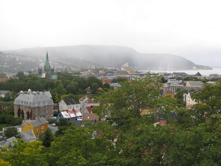
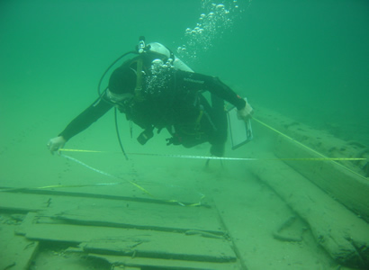
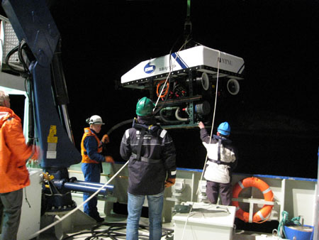

Title: Lært við Niðará
Slug: laert-vid-nidara
Date: 2008-04-10 13:58:20
UID: 252
Lang: is
Author: Brynhildur Baldursdóttir
Author URL: 
Category: Fornleifafræði, Póstur að utan
Tags: 

Haustið 2007 hóf ég MPhil nám í neðansjávar fornleifafræði (e. Maritime Archaeology) við Norsk teknisk naturvitenskapelig universitet (NTNU) í Þrándheimi. Eftir að hafa klárað BA nám í fornleifafræði við HÍ haustið 2007, var ég staðráðin í því að halda til einhvers hinna Norðurlandanna í meistaranám. Neðansjávar fornleifafræði varð fyrir valinu þar sem ég hef mikinn áhuga á köfun, auk fornleifafræði, og fannst því frábært að geta sameinað þetta tvennt. Á Norðurlöndunum er neðansjávar fornleifafræði kennd í Esbjerg í Danmörku og í Stokkhólmi í Svíþjóð auk Þrándheims. Ástæðan fyrir því að Þrándheimur varð fyrir valinu var sú að námið var vel útlistað á netsíðu skólans og einnig leit Þrándheimur út sem spennandi stúdenta borg, en sjötti hver íbúi borgarinnar er námsmaður. 

Námið fjallar ekki aðeins um þær fornleifar sem finnast neðansjávar heldur einnig þá efnismenningu sem tengist nýtingju sjávar og þá hugmyndafræðilegu tengingu (e. cognitive attachment) sem maðurinn hefur til hafsins. Hér í Þrándheimi hófst kennsla í neðansjávar fornleifafræði haustið 2005. Námið fer allt fram á ensku, þar sem það er hluti af alþjóðlegum masters-námsleiðum við NTNU. Þar af leiðandi hefur norsku kunnáttan ekki tekið miklum framförum þrátt fyrir að ég hafi nú búið hér í tvær annir.
Deildin er fremur fámenn og þegar ég byrjaði voru einungis sex nýnemar, en auk mín eru hér tveir Norðmenn, tveir frá Bandaríkjunum og einn frá Finnlandi. Fræðigreinin sjálf er einnig frekar ung, en hún byrjaði fyrir alvöru er köfunarbúnaðurinn (e. SCUBA gear) kom til sögunnar um 1950, en hið svokallaða vants-lunga var fundið upp árið 1942 af Emile Gagnan og Jaques Cousteau.

Sá tími sem kafarar hafa til neðansjávarrannsókna á fornleifum er mjög takmarkaður, en ef verið er að rannsaka svæði á 30 m dýpi hefur hver kafari um 10 mínútur til þess að komast að svæðinu, gera það sem þarf, t.d. mælingar, og svo komast aftur upp á yfirborðið. En einnig getur hver kafari verið neðansjávar í samtals 2 tíma yfir daginn án þess að eiga á hættu að fá köfunarveiki. Það þarf því mikið af hæfum köfurum og mikinn tíma til þess að vinna að fornleifafræðilegum neðansjávarrannsóknum til þess að fylla upp í heilann vinnudag. 

Neðansjávar fornleifafræðingar hafa stundum verið sagðir hafa svokallaðan Indiana Jones complex, þar sem “venjulegum” fornleifafræðingum finnst þeir þurfa að gera hlutina mun erfiðari en nauðsyn krefur. Fornleifafræðingurinn Paul Bahn, skrifaði eitt sinn að það að grafa neðansjávar væri eins og að reyna að standa upp í hengirúmi. Vissulega er fornleifafræði neðansjávar flóknari en uppi á yfirborðinu, þar sem mun erfiðara er að halda sama staðli í rannsóknum neðansjávar en á þurru landi. Með betri tækni hefur þetta þó orðið auðveldara og þá sérstaklega í sambandi við djúpsjávar fornleifafræði, þar sem notast er við sérstaka staðsetningatækni tengda GPS. Mælingatækni fyrir rannsóknir í grunnu vatni hefur ennþá því miður ekki verið þróuð nægilega.  

Það kemur fyrir að fornleifafræðideildin hér við NTNU þarf að láta fé af hendi rakna, sem er lúxus vandamál sem maður kannast ekki við frá HÍ. Á seinustu önn var öllum nemum í neðansjávarfornleifafræði boðið í tvær skólaferðir. Í þeirri fyrri var litið á minjar tengdar greininni  í kringum Þrándheimsfjörð s.s klettaristur, grafarhauga og lítil sjávarþorp. Einnig var heimsótt bátaverkstæði, sem smíðar viðarbáta með sömu aðferð og notuð var við gerð víkingaskipa. Í seinni skólaferðinni var haldið um borð í rannsóknarskip háskólans í þeim tilgangi að skoða skipsflök sem eru hluti af Ormen Lange rannsókninni og liggja þau á um 170 m dýpi. Ferðin var hluti af árlegri vettvangsskoðun þar sem verið er að athuga hvernig hafstraumar hafa áhrif á setlagamyndun og varðveislu skipsflaka og fengu nemar að fljóta með. Skipsflökin voru skoðuð með ROV (remotely operated vehicle), sem var sérsmíðaður fyrir rannsóknir í neðansjávarfornleifafræði. Þessi tiltekna rannsókn er búin að standa yfir síðan 2003 og er kostuð af olíu- og gas fyrirtækinu Hydro í samvinnu  við NTNU. Ástæðan fyrir rannsókninni á þessum skipsflökum er sú að þau fundust er verið var að kanna hentugar leiðir gasleiðslna og er hún ein dýrasta neðansjávarrannsókn á Norðurlöndunum. Það var mjög áhugavert að sjá hvernig fornleifafræðilegar djúpsjávarrannsóknir fara fram. Ef það á einhvern tíman við að fornleifafræði sé þolinmæðisvinna þá hlýtur djúpsjávarfornleifafræði að tróna þar á toppnum. Mestur hluti ferðarinnar fólst í því að bíða eftir að komast á áfangastað, bíða eftir að öll tæknileg atriði væru á hreinu, að ROV kæmist niður á rétta dýpt o.s.frv. 

Að búa í Þrándheimi er mjög fínt. Borgin er að svipaðri stærð og Reykjavík og því mjög auðvelt að rata og komast leiðar sinnar. Veðrið er einnig svipað og heima, nema bara betra, því það er mjög sjaldan rok hérna. Þrándheimur er einnig mjög krúttlegur og mikið um gömul timburhús sem vel er við haldið. Það er mjög áhugavert að heyra hvað Norðmenn halda að á Íslandi sé allt miklu dýrara en í Noregi. Þrándheimur getur m.a. státað  af því að eiga dýrasta strætókerfi á Norðurlöndunum, meira að segja dýrara en í Reykjavík, ef það er þá eitthvað til þess að hrópa húrra yfir. Þrándheimsbúum er þó mjög umhugað um heilsuna  og eyða miklum tíma í útiveru og því ekki óalgengt að sjá fólk skokkandi um borgina, eða á gönguskíðum þegar þannig viðrar. Einnig finnst mér ótrúlegt hvað það eru margir sem ferðast um á hjólum því Þrándheimur er staðsettur í frekar þröngum dal með mikið af bröttum brekkum en íbúarnir veigra sér ekki við að leggja á brattann. Stundum er að vísu mjög hentugt að búa uppi á hæðinni, t.d. þegar maður er á leiðinni niður í miðbæinn, en þeim mun erfiðara þegar snúa skal aftur heim. 

Skólinn hefur nokkra skólagarða á sínum snærum og ég bý einmitt í einum slíkum sem kallast Moholt. En svo eru einnig til hér einkareknir garðar en þeir eru heldur dýrari. Moholt er staðsett í um 45-50 mín. fjarlægð frá miðbænum, ofarlega í mikilli  brekku. Skólanum hefur verið skipt upp á mismunandi staði í bænum en Moholt er steinsnar frá tveimur þeirra, Dragvoll og Glöshaugen, þar sem  flestir nemanna í NTNU stunda nám sitt. Fornleifafræðideildin er þó á öðrum stað, staðsett í sama húsnæði og Vitenskapsmuseet í miðbænum. Þar hefur hún sitt eigið bókasafn ásamt húsi með skrifborðsaðstöðu fyrir masters-nema með útsýni yfir ánna. 

Annað hvert ár er haldin hátíð hér í Þrándheimi sem kallast UKA og samanstendur af tónleikum og öðrum uppákomum. Hátíðin er rekin í samstarfi við Samfunnet sem er félagsmiðstöð námsmanna hér. Allt árið um kring sér Samfunnet um allskonar tónleika, fyrirlestra og önnur skemmtilegheit. UKA hátíðin er svo vinsæl í Þrándheimi að nemar sem hafa lokið námi fyrir mörgum árum koma aftur og aftur á hana. Einnig stendur Samfunnet fyrir ráðstefnuhátíð annað hvert ár sem kallast ISFiT (The International Student Festival in Trondheim). Þá koma um 450 manns frá allt að 120 löndum til Þrándheims til þess að taka þátt í rökræðum og öðrum samræðulistum. Stundum koma heimsþekktar persónur á þennan atburð, s.s. Dalai Lama og ýmsir handhafar friðarverðlauna Nóbels. ISFiT verður næst haldið á næsta ári, eða 2009. 

En, þótt að lífið hér í Þrándheimi sé gott, þá jafnast ekkert á við það að koma heim í íslenska sumarsól, hitta vini og kunningja og síðast en ekki síst að upplifa uppgröft að sumarlagi á Íslandi, jafnvel þó að hann rigni! 

