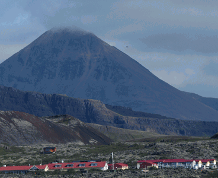

Title: Lagt upp í leiðangur í Norðurárdalinn
Slug: lagt-upp-i-leidangur-i-nordurardalinn
Date: 2007-09-04 16:19:00
UID: 174
Lang: is
Author: Sólveig Ólafsdóttir
Author URL: 
Category: Póstur að utan, Menningarfræði
Tags: 

Síðasta vetrardag síðastliðinn sat ég við eldhúsborðið heima hjá mér og var í fýlu og þá aðallega út í sjálfa mig. Mitt gamla og góða BA próf í sagnfræði frá Háskóla Íslands ásamt dágóðum skammti af frábærum MA námskeiðum höfðu fleytt mér áfram í afbragðs atvinnum í meira en tíu ár en nú þegar ég hafði falboðið markaðnum vinnukrafta mína í nokkra mánuði hafði hann bara enga lyst á sagnfræðingnum í vesturbænum, sem í þokkabót var orðinn 42 ára. Framtíðin var allt annað en björt tilsýndar. Af hverju í fjáranum hafði ég látið glepjast af brauðstritinu í staðinn fyrir að klára þó ekki væri nema MA ritgerðina, sem fengið hafði að rykfalla svo árum skipti niður í skúffu.Eitt af geðorðunum á ískápnum mínum er: „Haltu áfram að læra svo lengi sem þú lifir“ og þarna á borðinu fyrir fyrir framan mig lá lausnin á vandamálum mínum í formi heilsíðuauglýsingar um opið hús á Sumardaginn fyrsta í Háskólanum á Bifröst í Borgarfirði.

Námsbraut Háskólans á Bifröst í menningarstjórnun er aðeins nokkurra ára gömul. Frá því til hennar var stofnað hefur hún þó tekið töluverðum breytingum. Upphaflega leiddi hún til MA prófs í mennta- og menningarstjórnun en þegar hér er komið sögu er sjónum eingöngu beint að menningarstjórnuninni sem heitir á ensku „cultural management“. Þetta nám á að undirbúa nemendur undir að reka og stjórna lista- og menningarstofnunum ýmiskonar.  Ekki hvað síst á það að kenna mis„hræddum“ fræðimönnum og listafólki á það sem við fyrstu sýn virðast markaðkúnstir og galdrabrögð í sambandi við áætlanagerð og verkefnastjórnun og allt það sem við kemur stjórnun og rekstri en eru þó í raun og veru aðeins sjálfsagður hluti af stjórnun menningar- og listastofnanna. Þetta var sérstaklega dregið fram í inngangsnámskeiðinu í upphafi þar sem Njörður Sigurjónsson fór á kostum í því að koma nemendunum nýju rækilega niður á jörðina. Hann hélt því blákalt fram að rekstur á menningar- og listastofnunum væri í engu frábrugðinn rekstri á hefðbundnum fyrirtækjum og það væri ekkert sem benti til þess að menntaðir fræðimenn í þessum geira væru eitthvað betri stjórnendur en aðrir. Og svo byrjaði hann að pota okkur í gegnum kenningarnar og fræðin og hópurinn fylgdi honum eftir hálfskelkaður. Fyrstu framkvæmdaáætlanirnar urðu til í hópavinnu í lok námskeiðsins og þar fengu nemendur að vinna með eigin hugmyndir og máta þær við fræðin.. 

Sjálf markaðsfræðin eru samt ekki nema hluti af náminu. Menningarhugtakið er skoðað frá öllum hugsanlegum hliðum og þær gífurlegu breytingar sem eru að verða á lista- og menningarheiminum um allan heim og tengsl markaðarins og menningarinnar gaumgæddar. Helstu kenningar og rannsóknir í hugvísindum voru kynnt á stórskemmtilegu námskeiði í sumar þar sem átta fræðimenn komu og kynntu fyrir nemendum glænýjar rannsóknir. Í tvær vinnuvikur kom nýr kennari á hverjum degi. Hann eða hún hélt tveggja til þriggja tíma fyrirlestur fyrir hádegi. Þar á eftir voru hópar myndaðir og verkefnum skipt á milli þeirra. Eftir örstutt hádegishlé sem var tekið jafnframt hópavinnunni var sett málstofa þar sem hóparnir fluttu úrlausnir sína og þar á eftir var orðið laust. Það voru nær undantekningarlaust miklar og frjóar umræður sem sköpuðust. Þegar þessum langa kafla var lokið þeyttust nemendur að vinnuborðunum þar sem ólesnir textar morgundagsins biðu í stöflum. Sem dæmi umfjöllunarefni þessa námskeiðs má nefna að einn daginn sátum við og hlustuðum með andakt á Ingunni Ásdísardóttur þjóðfræðing segja okkur frá gyðjunum Frigg og Freyju og tilraunum miðaldakirkjunnar til að ritstýra norrænum goðsögnunum. Annan dag velti hópurinn fyrir sér félagslegri samkynhneigð líberalistans Jóns Sigurðssonar forseta undir forystu Páls Björnssonar sagnfræðings og síðasta daginn voru andstaða við stjórnvöld, mótmæli og hryðjuverk skeggrædd í þaula í málstofu hjá Jóni Ólafssyni heimspekingi. 

Námið í menningarstjórnun er snilldarkokteill af staðnámi og fjarnámi. Það hefst um mitt sumar með sex vikna staðlotu þar sem þrjú námskeið eru kennd hvert á eftir öðru. Námskeiðin byggjast mikið upp á hópavinnu og í þessari sex vikna dvöl kynnist hópurinn svo rækilega að hver mafía væri fullsæmd af þeim böndum sem þar eru bundin. Eftir þessar sex vikur hafa nemendur halað inn hvorki fleiri né færri en níu einingar af þeim 45 sem eru undir til MA prófs og í fjarnáminu á haust- og vormisseri er hægt að halda hópastarfinu áfram þó hópurinn sé dreifður um höf og lönd svo vel þekkjast allir. Á haustmisseri taka við námskeið í eigindlegum rannsóknaraðferðum, áætlanagerð og verkefnastjórnun og valnámskeið sem er sameiginlegt með MA náminu í Evrópufræðunum og felur í sér vikuferð til höfuðborgar Evrópu, Brussel. Eftir jól tekur við vormisserið með menningarfræðum og menningarhagfræði. Næsta sumar er önnur staðlota á Bifröst þar sem lokanámskeiðin eru kennd og náminu lýkur svo með 15 eininga MA ritgerð. 

Háskólinn á Bifröst er mjög sérstakur skóli með sérstaka sögu. Hann rekur ættir sínar til Samvinnuskóla Jónasar frá Hriflu en var stofnaður á Bifröst árið 1955. Hann komst á háskólastig 1988 og hefur eflst og stækkað fram til þessa dags. Tengslin við Samvinnuhreyfinguna eru enn sýnileg innan húss og utan og salir bera nöfn sem tengjast mörg hver Jónasi frá Hriflu. Gamla skólahúsnæðið er enn í notkun með innlögðu SÍS merkinu í anddyrinu og KEA standklukku í setustofunni en allt nýja skólahúsnæðið er bæði nútímalegt og töff.. Það eina sem má setja alvarlega út á svæðið er skortur á frágangi. Tilfinningin er sú að skólinn hafi stækkað svo ört að ekki hafi gefist færi á að klára neitt almennilega en það hlýtur að standa til bóta.

Bifröst er „campus“ skóli upp í sveit þar sem sérstaklega vel er búið að nemendum. Íbúðarhúsnæðið sem stendur nemendum til boða er af ýmsu tagi. Það er hægt að vera á gamaldags vist, í hefðbundnum íbúðum, herbergjum með sameiginlegu eldhúsi og einnig er hægt að vera á Hamragörðum; fjögurra hæða nýrri blokk með stórum herbergjum með eldunaraðstöðu og sér baði þar sem sturtuhausinn er 20 cm í þvermál í það minnsta. Á jarðhæðinni í Hamragörðum er bókasafn staðarins og lesstofa og í kjallaranum er þetta líka fína þvottahús. Innan seilingar er verslun, heitur pottur og tækjasalur sem er náttúrulega mismikið notaður, fífilbrekkur til að leggjast út í með námsefnið og náttúrulega kaffihúsið með sitt ómælda og ókeypis kaffi fyrir meistaranema ásamt mat, víni og bjór þegar það á við. 

Það verður að vísu ekki af vinnuhörkunni skorið á Bifröst í sumar og nemendur fengu réttilega á baukinn ef gleðin varð of mikil á kaffihúsinu kvöldinu áður. Það er hinsvegar alveg ótrúleg stemning fólgin í því að vita fyrir víst að á sama tíma og á sama stað og maður sjálfur er hópur fólks að lesa sama textann og maður sjálfur, hiksta  á sömu hugtökunum og óska sama kennaranum góðrar ferðar út í hafsauga. Gildi þessarar tilhögunar á staðnáminu felst ekki síst í því að vera fjarri daglegu amstri og hella sér á bólakaf í fræðimennskuna. Þar sem fjöldi nemenda er ekki mikill verður einnig vægi hvers nemanda fyrir sig mikið bæði í tímum og í hópavinnunni. Nemendur á fyrsta ári í menningarstjórnuninn eru um 20 og var fjöldinn í námskeiðunum eitthvað þar um bil. Virkustu og bestu hóparnir voru þeir sem ekki voru fjölmennari en fimm. Á hverjum degi fyrstu fjórar vikurnar voru búnir til sífellt nýjar útgáfur af hópum þannig að það má segja að allir hafi einhvern tímann unnið með öllum.

Munurinn á Háskóla Íslands og Háskólans á Bifröst er alveg ótrúlega mikill sérstaklega þegar horft er til þess að stjórnendurnir á Bifröst eiga rætur sínar að rekja til Háskóla Íslands. Deildir HÍ eru einangraðar og sjálfstæðar einingar sem lítið hafa við hverja aðra saman að sælda þó svo að tilraunir hafi verið gerðar til að bjóða upp á þverfagleg námskeið og öll þróun sé augljóslega í þá átt. Það er tilhlökkunarefni að sjá deildir innan hvers háskóla fyrir sig opnast hver fyrir annarri og vonandi fylgir í kjölfarið meira samstarf á milli háskólanna sjálfra. Það væri ekki dónalegt að geta tekið eitt og eitt námskeið í HÍ og fengið það metið inn í MA nám á Bifröst. Til dæmis námskeið hjá Valdimar Hafstein í þjóðfræði eða kúrs hjá Eggert Þór Bernharðssyni í hagnýtri menningarmiðlun. Kannski væri heldur ekki vitlaust fyrir nemendur í MA námi í hugvísindum við Háskóla Íslands að kynna sér eitt og annað um markaðsmál, verkefnastjórnun og áætlanagerð á Bifröst enda eru þetta órjúfanlegir þættir í nútíma vísinda- og fræðastarfi.

Ég er ekki ennþá alveg búin að átta mig til fullnustu á náminu á Bifröst. Það sem mér hefur fundist óþægilegt og erfitt má að flestu leyti rekja til eigin fordóma. Hvað er að því að þurfa að skipta um heimilda- og tilvísanakerfi í ritgerðum? Hvað er að því þó að fólk hafi minni áhuga á sögulegri þróun og ég, og hvað er að því að kennararnir séu upp til hópa fæddir 1974? Ég bara spyr?

---

Að lokum langar mig til að gefa hér uppskrift svokölluðu Hamragarðapasta sem varð til á Bifröst í sumar. Þetta er varíasjón fyrir eina manneskju, tvær eldavélahellur, gult skurðarbretti og vöruúrvalið í verslun staðarins

* ⅓ poki af skrúfupasta
* 1 pakki af bollasúpu, helst kjúklingasúpa með brauðteningum
* 2 skinkusneiðar
* ½ paprika
* 1 grein af ferskri steinselju (má sleppa en gerir réttinn mun „sífiliseraðri“)
* salt, pipar, og slatti af ólífuolíu

Á annarri hellunni er soðið pasta eftir leiðbeiningunum á pokanum. Á hinni hellunni er soðinn slatti af vatni. Í stóru glerskálina er sett bollasúpuduftið, skinkusneiðarnar í bitum og niðursneidd paprikan og söxuð steinseljan. Soðnu vatni er hellt út í og hrært vel þannig að úr verður nokkuð þykk sósa. Þegar pastað er soðið er það hrist með örlitilli olíu og sett út í sósuna. Þetta er svo borðað upp úr stóru skálinni til að spara uppvaskið, á bleikum náttbuxum, við skrifborðið með 50 bls. af ólesnum texta fyrir framan sig og veforðabókina opna. Ef það verður afgangur af réttinum má nota hann sem stofn að eggjaköku daginn eftir. Þriðja daginn verður vonandi eitthvað gott í matinn á kaffihúsinu.

