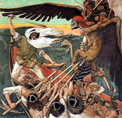
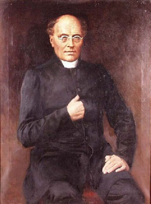

Title: „Látum oss vera Finna“
Subtitle: Þróun finnskrar þjóðmenningar innan rússnesks stórfurstadæmis
Part: 1/2
Slug: latum-oss-vera-finna
Date: 2008-01-29 15:37:00
UID: 212
Lang: is
Author: Erla Elíasdóttir
Author URL: 
Category: Menningarfræði
Tags: Finnland, Rússland, sjálfstæðisbarátta, sjálfsmynd

Íslensk þjóðarvitund, sjálfsmynd samvitundar Íslendinga, á það sameiginlegt með t.d. sjálfsmyndum einstaklinga og sértækari þjóðfélagshópa að vera stöðugri endurmótun undirorpin. 

Íslensk þjóðarvitund, líkt og aðrar slíkar, sækir viðmið sín og gildi í það sem hún telur sig standa fyrir, og ekki síður hitt sem hún telur sig ekki standa fyrir. Hún speglar sig jöfnum höndum í fyrirmyndum sínum, vítum til varnaðar og eigin ímynd af sjálfri sér. Sem ærskilegastri útkomu er síðan viðhaldið með síendurteknum yrðingum, þar sem stuðlar og höfuðstafir spilla síst fyrir. Á íslensku má alltaf finna svar. Dirty weekend in Reykjavík. Leikið, lömb, í kringum lítinn smaladreng. Allir elska lambakjöt. Þannig matreiðum við eigin ímynd og markaðssetjum, fyrir okkur sjálf og aðra.

Þótt brotin í mósaíksjálfsmynd íslensku þjóðarinnar séu frá ýmsum tímaskeiðum allt frá landnámi, og sæki m.a. töluvert í fornsögurnar, má segja að ímyndin eins og við þekkjum hana í dag hafi gengið í gegnum eitthvert mikilvægasta mótunarskeið sitt á 19. öld.  Þá átti sér stað vitundarvakning sem birtist m.a. í sjálfstæðisbaráttu, málverndarstefnu og auknum vilja til varðveislu bókmenntaarfsins, en allt eru þetta mikilvægir þættir þjóðarvitundarinnar í dag.

### Áhrif einangrunar

Einn flötur sjálfsmyndar okkar snýr að því að við séum norræn þjóð eða skandinavísk. Það virðist reyndar helgast af samhengi hverju sinni hvort Ísland sé „bara“ skilgreint sem innan Norðurlandanna, eða einnig Skandinavíu. Samkvæmt fyrri skilgreiningunni samanstendur hin eiginlega Skandinavía af Danmörku, Noregi og Svíþjóð en með þeirri síðarnefndu bætast í hópinn tvö sjálfstæð, norræn þjóðríki; Ísland og Finnland, nyrstu og strjálbýlustu ríki Norðurlanda. Meðal annars hefur það greint Íslendinga og Finna frá hinum þjóðunum þremur að hafa lengst af lotið yfirráðum grannríkja og búið síðar við eigin forseta- og þjóðþingræði, en aldrei átt sér innfædda konungsætt. Ísland er einangrað af úthafi, og þrátt fyrir töluverðar lengjur landamæra hefur Finnland að vissu leyti einangrast frá grannríkjunum Svíþjóð og Rússlandi sökum þess, hversu grimmt þau hafa barist um yfirráð yfir því. Það er þó einmitt þetta sem aftur greinir hina herlausu Íslendinga frá Finnum; auk þess að hafa barist á ýmsum vígstöðvum fyrir Rússa í Krímstríðinu og fyrri heimsstyrjöld, hafa Finnar bæði háð blóðugt borgarastríð og átt í vök að verjast í skotgröfum seinni heimsstyrjaldar.

Matti Klinge, finnskur sagnfræðingur sem ritað hefur töluvert um þróun finnskrar þjóðmenningar, hefur nefnt einangrun sem veigamikinn þátt í mótun hennar og vísar þar einkum til einangrunar Finna frá Svíum, frá og með valdatöku rússneska keisaraveldisins 1809. Klinge er á þeirri skoðun að „sameiginleg gildi og hefðir“ Finna hafi ekki tekið að mótast af alvöru fyrr en þeir losnuðu undan Svíum. Hann vill reyndar einnig meina að sænska þjóðin hafi endurnýjast að miklu leyti eftir slitin, þótt menn átti sig ef til vill síður á því í dag.[^1]

### Umrótaskeið í Evrópu

18\. og 19. aldirnar voru umrótatími í evrópskri sögu. Samfara upplýsingu, og síðar rómantík, höfðu menningarlegar áherslur fjarlægst trúarlífið; menning átti ekki lengur að vera einokunarvara klerka og yfirstéttar heldur færast nær fólkinu. Upplýsingin krafðist réttar leikmanna til einstaklingsveru og vitsmunalífs, rómantíkin réttar þeirra til tilfinninga. Ein af lykilhugmyndum rómantíkurstefnunnar, í lok 18. aldar og á þeirri 19., var svo þjóðernisrómantíkin. Helstu suðupottar þessa ferlis voru staðsettir í vestur- og miðevrópu, en áhrifin náðu að sjálfsögðu norðar á bóginn. Eilífðarnýlendurnar Ísland og Finnland tóku að vakna til vitundar um þjóðararfinn og gildi þess að finna honum stað í samtímanum. Vilji magnaðist til að halda sínu og forðast samruna við herraþjóðirnar. Bókmenntafélög voru stofnuð og tímarit hófu göngu sína, með aukinn veg móðurmálsins að leiðarljósi.

Þróun sænskrar menningar á 19. öld var undir áhrifum frá rómantíkurstefnunni á meginlandi Evrópu á meðan finnsk menning stóð lengur í stað, m.ö.o. á fornum grundvelli búskapar og tilheyrandi lifnaðarhátta, enda þróaðist hún undir Rússneska keisaradæminu þar sem ekki fór mikið fyrir áhrifum evrópskrar hugsunar. Matti Klinge heldur því fram að finnsk menningarþróun á þessum tíma hafi fremur borið keim af síðhúmanískri rökhyggju en evrópsku rómantíkurstefnunni.[^2]   Þrátt fyrir það hélt það Finnum í tengslum við evrópska lifnaðarhætti að þeir, sem sjálfsstjórnarstórfurstadæmi innan rússneska keisaradæmisins, fengu að halda sænskum lögum og trú, auk eigin tungu, án teljandi afskipta. Finnskir bændur þurftu t.a.m. aldrei að búa við lögskipaða bændaánauð líkt og rússneskir starfsbræður þeirra, heldur yrktu þeir eigin jörð. Þrátt fyrir að vera ekki fyllilega sjálfstæðir gátu Finnar í fyrsta sinn á Rússaveldistímanum farið að líta á sig sem þjóð er heyrði engum öðrum til. „Svíar erum við ei meir, Rússar verðum við aldrei, svo látum oss vera Finna!“ Svo hljóðuðu einkunnarorð Fennoman-hreyfingarinnar svonefndu, sem nánar verður vikið að á eftir. Í þessum orðum sést það berlega, sem Klinge hefur sagt og vitnað er til hér að ofan, að finnsk þjóðarvitund hafi fyrst farið að mótast fyrir alvöru að yfirráðatíma Svíanna loknum. Finnar virðast hafa gert sér ljóst að þeir væru komnir of langt frá Svíum til að snúa aftur, en ættu á sama tíma erfitt með að aðlagast Rússum.

### Rússnesk uppbygging

Rússarnir byggðu Helsinki upp sem höfuðborg, m.a. sökum þess að Turku, sem hafði gegnt hlutverki höfuðborgar fram að því, þótti þeim full nálæg Svíþjóð. Þeir byggðu háskóla, þinghús og dómkirkju, en allar standa þessar byggingar enn og eru með þeim glæstari í borginni. Háskólanum gamla, sem stofnsettur hafði verið í Turku 1640, voru falin þau hlutverk strax 1809 að mennta alla opinbera starfsmenn og klerka, og auk þess að móta „sér-finnska“ menningu. Í þessu augnamiði var háskólinn stækkaður umtalsvert, og eftir mikinn bruna í Turkuborg 1827 gafst kjörið tækifæri til að flytja starfsemi háskólans eins og hún lagði sig til Helsinki árið 1828. Háskólinn var sjálfstæð stofnun, óháður annarri stjórnsýslu og heyrði beint undir keisarann. Starfsemi þingsins var nátengd háskólanum, enda höfðu allir opinberir starfsmenn gengið þar til mennta, og þinghúsið og aðalbygging háskólans standa enn sitthvorumegin sama torgs í miðborginni.[^3]  Matti Klinge fullyrðir að hvergi annarsstaðar í Evrópu hafi háskóli gegnt jafn mótandi hlutverki fyrir þjóð og menningu hennar, og að hvergi annarsstaðar séu tengsl háskóla við ríkisvaldið sjáanleg á eins táknrænan máta; staða bygginganna bendi til hinna gagnkvæmu hagsmuna sem verið hafi til staðar, án þess að annar aðilinn hafi lotið hinum. Samkvæmt Klinge var Helsinki byggð til að sýna það á afgerandi máta, bæði útlendingum og Finnum sjálfum, að nýtt pólitískt afl hefði fæðst. Því, líkt og hann bendir jafnframt á, þjónaði þjóðernisvakning Finna einnig hagsmunum Rússa, þar eð þeir sáu sér akk í breikkun þeirrar gjár sem myndast hafði milli Finna og Svía.[^4]  

---

<small class="blurb">
Í síðari hluta greinarinnar verður fjallað frekar um finnskt menningarlíf og þjóðernishreyfingar á 19. öld, auk sífellt umfangsmeiri afskipta Rússa af Finnum. Loks verður tæpt á sjálfstæðisyfirlýsingunni og borgarastyrjöldinni sem braust út í kjölfarið.
</small>

---

#### Heimild

* Ritgerðir úr bók Matti Klinge, _Let us Be Finns: Essays on History_,  (Helsinki: Otava, 1990)

[^1]: „Let us Be Finns — the Birth of Finland’s National Culture“, bls 72
[^2]: Sama, 75
[^3]: „Intellectual Tradition in Finland“, bls 162
[^4]: Sama, bls. 157, og „Let us Be Finns — the Birth of Finland’s National Culture“, bls. 76 og 80

