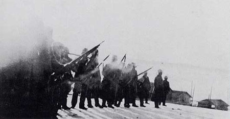
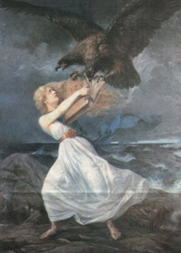

Title: „Látum oss vera Finna“
Subtitle: Þróun finnskrar þjóðmenningar innan rússnesks stórfurstadæmis
Part: 2/2
Slug: latum-oss-vera-finna
Date: 2008-01-31 13:22:00
UID: 214
Lang: is
Author: Erla Elíasdóttir
Author URL: 
Category: Menningarfræði
Tags: 

### Menningararfurinn

Hið finnska bókmenntafélag var stofnað 1831. Finnski sagnfræðingurinn Matti Klinge segir markmið þess hafa verið að breiða út vitneskju um föðurlandið og sögu þess, auka veg finnskrar tungu og þróa fagurbókmenntir á finnsku fyrir bæði menntamenn og lægri stéttir. Meðal markmiða.var að þýða verk þjóðskáldsins sænskumælandi, Johans Ludvigs Runeberg, á finnsku og hinn forna goðsöguljóðabálk Kalevala á sænsku, auk þess að setja fram skýrar skilgreiningar á  ýmsum vafabundnum málfræðiatriðum. Klinge segir Kalevala hafa gegnt sérlega mikilvægu hlutverki, þar sem það sýndi svart á hvítu að Finnar ættu sér fornan hámenningararf á eigin tungu.[^1]  Til samanburðar má þess geta að Hið íslenska bókmenntafélag var stofnað 1816, með svipuðum markmiðum og hið finnska. Félög þessi hafa átt sinn þátt í að styrkja tilfinningu þjóðanna fyrir sameiginlegri sögu, og þannig efla þá samkennd meðal fólksins sem nauðsynleg var til að horfa fram á veginn. 

### Fennoman

Orðræða finnskrar þjóðernishyggju var mótuð af skáldum, vísindamönnum, guðfræðingum og hvers konar öðrum fræðimönnum. Við upphaf þjóðernisvakningarinnar var menntastéttin að mestu skipuð sænskumælandi Finnum, enda var sænska ríkjandi mál í opinberri stjórnsýslu á meðan finnska var að miklu leyti enn mál lægri stétta. Fennoman-þjóðernishreyfingin var fyrst og fremst helguð finnskri tungu, varðveislu hennar og framþróun. Markmiðið var að hefja finnsku upp til stöðu opinberrar þjóðartungu á öllum vettvangi. Það er einkum athyglisvert að margir hinna sænskumælandi Finna af fyrstu kynslóð Fennoman-hreyfingarinnar lögðu sig sérstaklega fram um að læra finnsku og kenna hana börnum sínum, og mynda þannig tengsl sem þeim þótti sjálfum hafa skort í eigin uppvexti. 

Einn þeirra sem gengu hvað ötullegast fram í starfi fyrir Fennoman-hreyfinguna var Elias Lönnrot, læknir að mennt en haldinn ástríðu fyrir móðurmáli sínu. Hann vann sér helst til frægðar að safna saman _Kalevala_-bálkinum, og einnig skrifaði hann fyrstur manna grasafræðirit á finnskri tungu, _Flora Fennica — Suomen Kasvisto_, er var á meðal fyrstu vísindarita sem rituð voru á alþýðlegu máli á Norðurlöndum. 

Annar þekktur Fennoman-meðlimur var hinn sænskumælandi Johan Vilhelm Snellman, sem var heimspekiprófessor við háskólann í Helsinki uns hann missti stöðuna vegna aðgerða stjórnvalda gegn byltingarsinnuðum menntamönnum. Snellman var alla tíð talsmaður mikilvægis finnskrar tungu og þess, að hún yrði tekin upp af menntamönnum sem mennta- og listamál, til sameflis finnsku þjóðinni. Hann beitti sér fyrir endurstofnun finnska þingsins og fékk því m.a. framgengt að finnskur gjaldmiðill, markið, yrði tekið upp 1865. Einnig náði hann fram lögum sem kváðu á um jafnan rétt finnsku á við sænsku til þingstarfa.  Hann neyddist að lokum til afsagnar frá þingi sökum sögu sinnar sem róttæklingur, en var áfram virkur í þjóðmálaumræðunni og naut mikillar lýðhylli. Fleiri þekktir Fennomenn eru rithöfundurinn Aleksis Kivi og tónskáldið Zacharias Topelius. Stúdentapólitíkin var einnig litrík á þessum árum, og leiðir Matti Klinge líkur að því að hinar áberandi umræður um þjóðfélags- og menningarmál hafi bókstaflega þjálfað ungt fólk til að velta fyrir sér þjóðfélagsvandamálum; það hafi þurft að taka afstöðu til mismunandi málaflokka og skipa sér í fylkingar samkvæmt því. Slíkar fylkingar hafi síðar  myndað kjarna hinna ýmsu þingflokka. [^2] 

### Rússering og réttindaaukning

Þegar nær dró lokum 19. aldar, nánar til tekið frá 1899 til 1905 og aftur milli 1908 og sjálfstæðisyfirlýsingarinnar 1917, bar töluvert á því að Rússar færu að þröngva eigin gildum upp á Finnana, enda urðu þeir varir við sívaxandi sjálfstæðisþrá þeirra. Þetta náði hámarki um 1900, en þá var rússneska gerð að lögbundnu máli Finna. Mikillar andstöðu gætti gegn þessum áhrifum, einkum rússneskunni. Þó ber að hafa í huga að ekki var aðeins um finnskuna að tefla, heldur einnig hinn sænskumælandi minnihluta. Matti Klinge heldur því til haga að sjálfstæðissinnar 19. aldarinnar hafi aldrei beitt sér fyrir eintyngdri menningu, heldur þvert á móti lagt áherslu á mikilvægi þess að finna hópunum tveimur sameiginlegan grundvöll.[^3]  

Ósigur Rússa gegn Japönum árið 1905 hafði mikil áhrif á rússneskt þjóðlíf og teygðu byltingarkenndar hugmyndir anga sína til stórfurstadæmisins Finnlands. Í kjölfarið fengu Finnar af öllum stéttum kosningarétt og kjörgengi, þó aðeins karlmenn, en árið eftir veitti Nikulás II keisari konum sömu réttindi. Þetta hafði aftur í för með sér aukið brautargengi Sósíalistaflokksins í kosningunum 1916, sem Klinge telur hafa valdið finnsku þjóðinni alvarlegri sjálfsmyndarkrísu. Þess má geta að í sömu kosningum náðu kvenkyns frambjóðendur 19 þingsætum af 200.[^4]  

### Menningarlegar miðjur

Klinge segir vitneskju manna um eigin menningu og samastað í tilverunni hljóta að koma að „ofan“; frá „miðjunum“ og hinum menningarlegu stofnunum sem þær stjórni. Þessu tengt nefnir hann þá tilhneigingu að sjá höfuðborgir jafnan sem sameinandi miðjur, þrátt fyrir að samfélög sumra bæja kunni að vera bæði land- og málfræðilega skyldari samfélögum handan landamæranna. Suður-Frakkar eiga þannig mun meira sameiginlegt með Katalónum á Norður-Spáni en með Parísarbúum, en þó er gert ráð fyrir að þeir líti til Parísar og Katalónar til Madrídar. Þannig hafa mörk, gerð af mannavöldum, oft afmarkað svæðið sem þjóðmenningin skal síðan fylla út í, segir Klinge, og bendir á hvernig tungumálatengsl hafi ekki verið tekin með í reikninginn þegar finnsk landamörk voru látin ráðast af hagsmunum Rússa við innlimun Finnlands. Bæði sænskumælandi minnihluti, áður hluti Svíþjóðar, og Rússar á Kirjálasvæðinu hafi lent innan finnskra landamæra. Þetta hafi svo aukið á deilur um þjóðmenningu Finna síðar á 19. öld; hinir sænskumælandi hafi lagt áherslu á samskipti við Vesturlönd á meðan Kirjálarnir hafi viljað upphefja austrænan uppruna sinn og auka veg rússnesks rétttrúnaðar, sem er reyndar enn opinber þjóðtrú í Finnlandi samhliða lútherskunni.[^5]  

### Sjálfstæði og borgarastríðið

Sú varanlega hugarfarsbreyting meðal finnsku þjóðarinnar, sem hér hefur verið fjallað um,  leiddi að lokum að sjálfstæðisyfirlýsingu hennar þann 6. desember 1917, strax í kjölfar rússnesku byltingarinnar. Hugsuðir 19. aldar virtust hafa vakið lýðinn til nægilegrar vitundar um einstaklingsvirði hvers manns innan hverrar þjóðar, og að hver þjóð byggi yfir eigin, einkennandi menningu sem bæri að berjast fyrir og varðveita. Þrátt fyrir þetta átti borgarastyrjöld eftir að kljúfa finnsku þjóðina strax í ársbyrjun 1918. Orsakir styrjaldarinnar voru margþættar, en í grófum dráttum var deilt um það, hvernig haga skyldi nýju þjóðskipulagi. Svonefndir hvítliðar vildu líta til Evrópu á meðan rauðliðar litu á nýstofnuð Sovétríki sem fyrirmynd. Þegar striðið braust út barst hvítliðum stuðningur Þjóðverja, en rauðliðum Sovétmanna. Þeir síðastnefndu áttu þó nóg með sitt eftir nýafstaðna byltingu, og varð stuðningsaflinn aldrei eins mikill og staðið hafði til. Hvítliðar báru sigur af hólmi eftir um 8600 manna fall á þremur og hálfum mánuði, auk þess sem 8-10.000 rauðliðar voru teknir af lífi, um 2000 hurfu sporlaust og um 12.000 létust í fangabúðum. Að stríðinu loknu gátu Finnar fyrst hafið uppbyggingu þjóðar sinnar á eigin forsendum. 

### Vítt samhengi valdatafls

Þannig hafa hræringar annarra ríkja oftar en ekki valdið straumhvörfum í finnskri sögu og átt stóran þátt í mótun þjóðmenningar þeirra. Valdatafl Svía og Rússa í upphafi 19. aldar varð til þess að Finnar endurskoðuðu sjálfa sig og endurfæddust sem þjóð í vissum skilningi. Rússneska byltingin gerði þeim síðar kleift að lýsa yfir sjálfstæði, sem leiddi aftur til átaka þegar þeir þurftu loks að móta sér eigin stefnu. Í síðari heimsstyrjöld börðust Finnar með Þjóðverjum, fyrst og fremst til að vera ekki með Rússum, og voru í vissum skilningi fórnarlömb valdatafls enn einu sinni, þótt hlutur þeirra í því stríði hafi að vísu skilað sér á afar skapandi hátt inn í finnskan skáldskap, kvikmyndagerð og aðrar listgreinar allar götur síðan. Ekki síst ber að nefna íhlutanir Rússanna í háskólamálum, sem höfðu mikil áhrif á finnskt þekkingarsamfélag, skrifræði og fjölmiðla og mótuðu þannig þjóðfélagið allt. 

---

#### Heimild

* Ritgerðir úr bók Matti Klinge, _Let us Be Finns: Essays on History_,  (Helsinki: Otava, 1990)

[^1]: „Let us Be Finns — the Birth of Finland’s National Culture“, bls. bls. 77-78, einnig  M. K., „Intellectual Tradition in Finland“, bls 162
[^2]:  „Intellectual Tradition in Finland“, bls. 163
[^3]:  „Let us Be Finns — the Birth of Finland’s National Culture“,bls 89
[^4]:  „Nation-Making and the Visual World“, bls 141
[^5]:  „Let us Be Finns — the Birth of Finland’s National Culture“, bls 68 og 70-71

