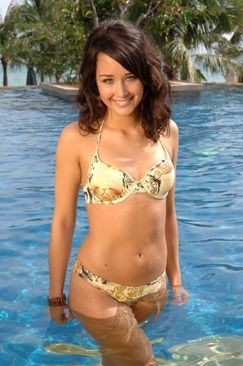
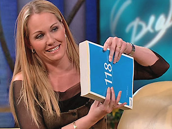
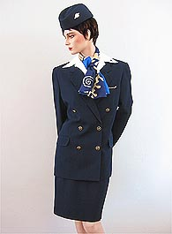
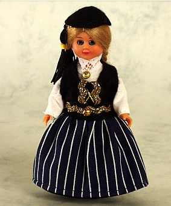

Title: Lauslæti íslenskra kvenna
Slug: lauslaeti-islenskra-kvenna
Date: 2006-04-04 09:00:00
UID: 60
Lang: is
Author: Erna María Jensdóttir
Author URL: 
Category: Mannfræði, Samfélag
Tags: 

Ríkjandi hugsun virðist vera í þjóðernis&shy;kennd Íslendinga um að íslenskar konur séu yfirleitt mjög fallegar og virðist sem áhugi Íslendinga til fegurða&shy;samkeppna mikill, svo vísað sé til ný hlotins titils Unnar Birnu „Ungfrú heimur“ og fjöl&shy;miðla&shy;fársins í kringum keppnina.

Vaxandi umfjöllun hefur átt sér stað um ímynd fegurðar íslenskra kvenna í erlendum fjölmiðlum á seinustu árum og virðist sem staðalmynd íslenskra kvenna komi fram sem fallegar ljóshærðar stúlkur sem eru partíglaðar og lauslátar.[^1]

Umræða hefur til dæmis átt sér stað í erlendum spjall&shy;þáttum og fjöl&shy;miðlum. Flug&shy;félög hafa verið að kynna helgar&shy;ferðir til Íslands sem tækifæri fyrir karlmenn að komast yfir fallegar íslenskar stúlkur. Íslenska konan hefur meðal annars komið fram í leiknum sjónvarps&shy;þáttum. Einnig er það algengt að þegar þekktir leikarar koma til Íslands sé þeim boðið upp á félags&shy;skap íslenskra fegurðar&shy;dísa.  

Hvað gerir slík umfjöllun fyrir sjálfs&shy;mynd íslenskra kvenna? Vissulega er þarna verið að fjalla um staðal&shy;myndir, og samkvæmt mann&shy;fræðingnum Thomas H. Eriksen telur hann að fólk falli sjaldnast fyllilega að þeirri staðal&shy;mynd sem það er flokkað undir.[^2] En hann heldur því einnig fram að sjálfs&shy;mynd fólks myndist af því hvernig aðrir koma fram við það. Er þá ekki hægt að tengja þessa umræðu og ímynd við mótun sjálfs&shy;myndar ungra kvenna á Íslandi? Þannig að, ef það er í sífellu verið að benda ungum konum á að þær séu fallegar og þær stundi þar af leiðandi frjálsar ástir eða lauslæti, þá ýtir það ef til vill undir slíka hegðun. 

Ekki er þó hægt að segja til um að íslenskar konur séu almennt laus&shy;látari og fallegri en aðrar konur, en hins vegar er ef til vill hægt að segja til um hvernig ímynd íslenskra kvenna í erlendum fjöl&shy;miðlum kemur fram, út frá þessari umfjöllun.

 Síðastliðinn vetur fjallaði Valgerður Hafstað í innsendri grein í _Morgun&shy;blaðinu_ um þátt Opruh Winfrey, þar var Oprah með þátt um konur víðsvegar um heiminn. Meðal þeirra var fjallað um konur á Íslandi. Þar var sett upp mynd af fallegum, partíglöðum og lauslátum konum sem byrjuðu að stunda kynlíf um 15 ára aldur. Á Íslandi væri ekki tiltökumál að vera einstæð móðir eða að fjölskyldur væru mikið til samsettar af hálfsystkinum og stjúpsystkinum.  Svanhildur Hólm Valsdóttir, þáverandi sjónvarpskona Ríkisútvarpsins, var fengin í viðtal til að fjalla um þessa ímynd íslenskra kvenna. Virtist sem Opruh og öðrum Bandaríkjamönnum hafi fundist íslenskar konur heldur djarfar og lauslátar. Það eina sem Oprah hafði áhuga á að vita um íslenskar konur væri hvernig stæði á því að þær séu svona lauslátar og hún furðaði sig á að margar íslenskar konur skuli stunda kynlíf á fyrsta „stefnumóti.“[^3]

Árið 2003 var bandaríski þátturinn _Jackass_ mjög vinsæll, komu þá nokkrir félagar úr þeim þætti til Íslands. Meðal þess sem þeim var boðið upp á var að eyða degi með þátttakendum úr fegurðarsamkeppninni Ungfrú Ísland.is. Vegna einhverra samskiptaörðugleika náðu þau ekki vel saman og heldur lítið varð af frekari samskiptum þeirra á milli. Vegna þessa virtist bera á nokkurri gremju frá Íslendingum yfir að strákarnir hafi ekki kunnað að meta íslensku þokkadísirnar sem þeim var boðið upp á, ef marka má umfjallannir á bloggsíðum og spjallvefjum.

Í Bandaríska sjónvarpsþættinum _Sopranos_ komu fram nokkrar Íslenskar flugfreyjur til að hafa ofan af fyrir nokkrum mafíuósum. Hlutverk þeirra var fallegar, partýglaðar og lauslátar konur. Þar er ekki hægt að átta sig á öðru nema að þær áttu að vera tilbúnar að stunda samræði með mafíuósunum án nokkura eftirmála, sem ætti því að geta fallið undir skýringu lauslætis.

Fyrir rúmum fjórum árum hljómaði auglýsingaherferð á vegum Flugleiða á forsíðu ferðablaðsins U.S.A. Today svo „Íslenskar fegurðardísir kalla.“ Auglýsingin var sérstaklega látin höfða til karlmanna og innan ferðarinnar var aðgangur að fegurðarsamkeppni og möguleiki að hitta stúlkurnar eftir keppnina. Þarna er ekki hægt að átta sig á öðru en það sé tilætlan að einhvers konar samband myndi skapast á milli fegurðardísanna og karlmannana, og þar sem að þeir hafi keypt sér aðeins tímabundna ferð til Ísland, er líklegast að meiningin sé sú að sambandið myndi endast stutt og án frekari eftirmála. Ekki er þó ljóst hvort fegurðardísirnar hafi elt karlana heim til þeirra. Fleiri auglýsingar voru birtar til að reyna að markaðssetja meint lauslæti íslenskra kvenna, meðal annars með að auglýsa helgaferð til Íslands undir orðunum „Dirty weekend in Iceland,“ en sú setning vísar til þess að hér sé auðvelt að ná sér í félaga til að stunda með skuldbindingarlaust kynlíf.

Í vetur fjallaði _DV_ um grein sem kom fram í _Norska Dagbladet_ sem var um íslenskt næturlíf. Þar fjallaði blaðamaður norska tímaritsins um nokkrar konur sem hann hitti á skemmtistað í miðbænum. _DV_ tók fram að norski blaðamaðurinn taldi „Íslenskar stelpur elska kókaín og útlenska karla.“[^4]  Í sama blaði kom fram umfjöllun _DV_ um hegðun íslenskra fermingarstúlkna. Það sé orðið algengt að þær taki ögrandi myndir af sér og birti á netinu og einnig að þær fjalli um kynlífsreynslu sínar á bloggsíðum sínum.

Heiða Jóhannsdóttir minnist, í grein sinni í _Morgunblaðinu_, á að Bandarískur blaðamaður frá ferðablaði _New York Times_ hafi komið til Ísland til að fjalla um Icelandic Airways, kemur þar blaðamaðurinn inn á að íslenskar konur séu almennt mjög fallegar, þokkafullar, og kunni að skemmta sér manna best. Heiða segir að blaðamaðurinn skilgreini „Reykjavík sem exótíska partíborg“ og birtir svo myndir af föngulegum stúlkum að dansa á skemmtistað. Hann minnist einnig á útlendinga sem hann hafi hitt í Bláa lóninu sem komnir voru til Íslands til að sannreyna goðsögnina um íslensku konuna.[^5]

Íslenska heimasíðan [Legend](http://www.legend.is) fjallar um lauslæti íslenskra kvenna í garð útlendinga.[^6] Þar er sagt að mörg dæmi séu til um að þekktir erlendir menn endi með íslenskum stúlkum þegar þeir koma til Íslands. Sem dæmi er ekki langt síðan Joshua Jackson kom til landsins og endaði hann með fjórum stelpum upp á hóteli. DV birti grein sem í stóð „Ekkert er vitað um stelpurnar fjórar sem eyddu nóttinni með honum, en allavega byrjaði árið vel hjá þeim.“ Menn eins og Kiefer Suteherland, Sailesh og Jamie Kennedy hafa svo fylgt í kjölfarið og fara svæsnar sögur af þeim hér á landi ef marka má sögusagnir slúðurblaðanna eins og _Séð og Heyrt_ og _Hér og nú_.  

Ekki er auðvelt að finna eina haldbæra skýringu á hugtakinu lauslæti, þó virðast flestir hafa sínar hugmyndir um það. En nokkuð ljóst er að hægt sé að fella lauslæti undir það þegar einstaklingur er viljugur að stunda kynlíf með fleiri en einum og án mikilla skuldbindinga. Það er því þó nokkur tengsl á milli lauslætis og skyndikynna.

Þau dæmi sem nefnd voru hér að ofan vísa til þeirra vaxandi umfjöllunar sem hefur átt sér stað, bæði hér á Íslandi og erlendis. Þó flest þeirra séu ekki endilega byggðrá fræðilegum bakgrunni er hægt að nýta þau til að fá þá lýsingu sem virðist í mörgum tilfellum ríkja í staðalmynd íslenskra kvenna á erlendri grundu. Konur eru eflaust misjafnlega lauslátar og sjálfsagt finnst lauslæti í flest öllum samfélögum. En einhverra hluta vegna hefur skapast jákvætt samband á milli fegurðar og lauslætis hér á Íslandi, þar sem því fallegri sem konan er því meiri líkur eru á að hún sé lauslát. Einnig er vert að benda á hvernig athyglin hefur beinst að kvenmönnum frekar en karlmönnum. Því líklegast þurfa konur einhverja karlmenn til að stunda meint lauslæti.

Ekki er gott að ákveða hvort það sé góður eða slæmur hlutur að vera lauslátur. Það verður held ég hver og einn að gera upp við sig. En mín persónulega skoðun er sú að sjálfstæði íslenskra kvenna birtist sem lauslæti í augum útlendinga sem ekki eru vanir því að konur taki hindrunarlaust þau skref sem þær kjósa, svo sem hvort þær vilja stunda kynlíf án frekari skuldbindinga eða ekki. Hins vegar er það varhugavert að konur stundi lauslæti til að (meðvitað eða ómeðvitað) falla inn í þá sjálfsmynd sem þær hafa skapað sér í kjölfar umfjallana um meint hátterni þeirra, sökum fegurðar þeirra og skemmtanagleði. 

[^1]: Samkvæmt _Íslensk Orðabók_ er skýring orðsins _lauslátur_: fjöllyndur í ástarmálum, léttúðugur (Árni Böðvarsson, 1992).           

[^2]: Eriksen, T. H. (2002). Ethnicity and Nationalism: Anthropological Perspectives (2. útgáfa). London: Pluto Press

[^3]: Valgerður P. Hafstað (2005) Íslandskynning hjá Opruh: Ljóskur og lauslæti. Sótt þann 21. desember 2005 af [http://www.mbl.is/mm/gagnasafn/grein.html?grein_id=1015490](http://www.mbl.is/mm/gagnasafn/grein.html?grein_id=1015490)  úr gagnagrunni Morgunblaðsins.

[^4]: DAGBLAÐIÐ VÍSIR 279. tbl. — 95. árg. — [ ÞRIÐJUDAGUR 6. DESEMBER 2005 ]

[^5]: Heiða Jóhannsdóttir, (e.d.). Fögur fljóð. Sótt þann 27. desember 2005, af [http://www.mbl.is/mm/gagnasafn/grein.html?grein_id=838271](http://www.mbl.is/mm/gagnasafn/grein.html?grein_id=838271) , gagnagrunni morgunblaðsins.

[^6]: Legend (e.d.). Lauslæti íslenskra kvenna í garð útlenginga??. Sótt þann 26. desember 2005 af [http://www.legends.is/?site=6&fid=10](http://www.legends.is/?site=6&fid=10) 

