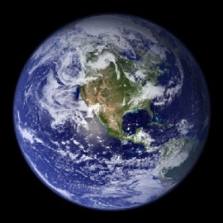
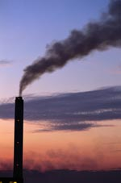

Title: Loftslag breytinganna
Slug: loftslag-breytinganna
Date: 2006-10-03 11:47:00
UID: 98
Lang: is
Author: Björk Þorleifsdóttir
Author URL: 
Category: Umhverfismál, Í umræðunni
Tags: 

Nú er septembermánuður liðinn. Þetta var enginn venjulegur haustmánuður á íslenskan mælikvarða, heldur var hann ákaflega hlýr og sólríkur og fjallageitur spókuðu sig alsælar á stuttermabolum efst á fjallstindum helgi eftir helgi. Þrátt fyrir að útivistarfólk eins og ég hafi glaðst yfir fádæma veðurblíðunni og nýtt hvern einasta frídag í fjallaklifur, fer ekki hjá því að illur grunur læðist að manni um orsakir þessa veðurs.

Síðustu ár hefur vorið byrjað fyrr og vetur byrjað seinna en gengur og gerist á landinu bláa. Farfuglarnir fara ekki varhluta af þessum loftslagsbreytingum og eru fuglahóparnir farnir að koma til landsins allt að tveimur vikum fyrr en vanalega. Skrýtnir hlutir gerast líka á varptíma eins og sést hefur á lundavarpinu í Vestmannaeyjum. Þar mata lundarnir ungviðið í auknum mæli á sænálum, nýrri hlýsjávartegund sem algeng er orðin við eyjarnar. Sænálar eru ómeti fyrir lundaunga og aðra sjófugla og hafa fregnir borist af mjög lélegri afkomu fuglanna vegna þessa. Sömu sögu er að segja af kríunni þar sem varp hefur misfarist í mörgum kríuvörpum síðustu tvö ár að talið er vegna ætisskorts og nú berast okkur fréttir af mikilli fækkun toppskarfa á Breiðafirði.[^1]  Jafnvægi lífsins við sjávarsíðuna virðist hafa raskast.

Loftslagsbreytingar hafa ekki einungis áhrif á fánu landsins því skriðjöklar hafa hopað hratt frá því í kringum 1990 eftir stutt framgangsskeið á árunum þar á undan. Gígjökull, sem áður setti svip sinn á Þórsmörk, hefur síðustu árin til að mynda hopað mjög hratt upp hlíðar Eyjafjallajökuls og svipaða sögu er að segja af flestöllum skriðjöklum landsins. Að þessu sögðu er hægt að velta því fyrir sér hvort Ísland sé að ganga inn í nýtt hlýindaskeið. Vissar sveiflur í loftslagi eru taldar eðlilegar og vitna borkjarnar frá Grænlandsjökli um það, en þeir eru meðal annars notaðir til að upplýsa okkur um þessar náttúrulegu sveiflur á norðurhveli jarðar áður jafnt sem eftir að sögur hófust. En eru þessar vistfræðilegu breytingar sem við erum nú vitni að tengdar náttúrulegri sveiflu eða er eitthvað annað hér á ferð?

Umhverfissagnfræðingurinn John Robert McNeill gaf fyrir nokkrum árum út bókina _Something new under the Sun_. Bókin fjallar um sögu umhverfisins á 20. öld. Titill bókarinnar er orðaleikur þar sem höfundur snýr út úr setningu úr Biblíunni þar sem sagt er að ekkert sé nýtt undir sólinni. McNeill heldur því fram að á 20. öldinni hafi nefnilega eitthvað nýtt gerst undir sólinni og þar sé maðurinn sökudólgurinn. Hann segir að tegundin okkar hafi með gegndarlausum ágangi á auðlindir jarðarinnar breytt jafnvægi jarðarkúlunnar og séum við nú að súpa seyðið af þeim gjörðum.[^2]

Þessi ágangur mannsins er sjáanlegur hér á Íslandi, í morgunstillum liggur oftar en ekki mengunarský yfir höfuðborginni og skýrði Fréttablaðið frá því mánudaginn 2. október 2006 að Reykjavík sé mengaðasta borg Norðurlanda ef frá er talin Malmö í Svíþjóð. Þegar kemur að mengun erum við sem sagt komin fram úr langtum stærri borgum á borð við Kaupmannahöfn, Osló og Stokkhólm. Ennfremur mun nýtt álver bráðlega taka til starfa á Reyðarfirði og er áætluð mengun frá því á ársgrundvelli jafnmikil og mengunin sem kemur frá öllum bílaflota landsmanna á ári hverju.[^3]

Því fer reyndar fjarri að loftslagsbreytingar og mengun frá gastegundum á borð við CO2 og SO2 séu nýjar af nálinni hér á landi. Við búum jú á eldfjallaeyju og gróðurhúsalofttegundir losna eðlilega út í andrúmsloftið þegar eldfjöllin okkar ræskja sig. Við Skaftárelda losnaði til dæmis jafn mikið af mengandi gösum út í andrúmsloftið og hinn vestræni heimur losar út í umhverfið á ári hverju. Ef við snúum þessari staðreynd við verður hún jafnvel ennþá ógnvænlegri, iðnaðarþjóðir menga jafn mikið á hverju ári og eldsumbrotin sem ollu dauða stórs hluta búpenings landans og voru orsök dauða nær fjórðungs íbúanna auk þess að bana tugum þúsunda manna annars staðar í Evrópu.[^4] Stóri munurinn á þessum tveimum dæmum er að við á norðurhjara höfum ekki lent í stórgosi eins og Skaftáreldum síðan 1784 en mengun frá iðnaði okkar og annara þjóða hellist jafnt og þétt yfir Vesturlönd á hverju einasta ári en þess má einnig geta að líkamleg viðbrögð við hvoru tveggja eru svipuð, sviði í augum, öndunarörðugleikar og svo mætti lengi telja.

Umhverfissagnfræði er ein af nýjustu tegundum sagnfræðinnar. Hún er hluti af endurskoðun sögunnar og andmæla umhverfissagnfræðingar því að maðurinn einn skapi söguna, náttúran hefur alltaf einhver áhrif á hvernig sagan þróast.[^5] Fagið skoðar tengsl manns og náttúru, hvernig náttúran mótar manninn og að sama skapi hvernig maðurinn mótar umhverfi sitt. Þó að maðurinn sé órjúfanlegur hluti af náttúrunni er þessum tveimur oft stillt upp sem andstæðum, maðurinn berst við náttúruöflin og öfugt. 

En er komin upp ný staða á tækniöld? Hefur jafnvægið verið rofið? Maðurinn berst við náttúruna og virðist ætla að hafa hana undir, náttúruauðlindir eru gjörnýttar og mengun eykst. Við aukna losun gróðurhúsalofttegunda hitnar jörðin og afleiðingarnar geta verið hrikalegar, við hitann vex fellibyljum ásmegin, hver man ekki eftir Katrínu og New Orleans? Hitinn veldur einnig bráðnun pólanna, ferskvatn streymir í sjóinn og breytir lífríkinu og kannski straumunum sjálfum. Eru þessir hlutir kannski eðlilegir og hlutar af náttúrulegum sveiflum í veðurfari eða er eitthvað nýtt undir sólinni? Aðeins tíminn og nauðsynlegar ráðstafanir í umhverfismálum munu leiða hið sanna í ljós.

[^1]: Viðtal við Einar Þorleifsson talsmann Fuglaverndar.

[^2]: J. R. McNeill, _Something new under the Sun. An Environmental History of the Twentieth Century_. London, 2000.

[^3]: http://www.visindavefur.is/svar.asp?id=5096

[^4]: Sjá til dæmis greinar breska fræðimannsins John Grattan um eldfjallamengun og mannfall af völdum Skaftárelda.

[^5]: Donald Worster, "Appendix: Doing Environmental History," í _The Ends of the Earth. Perspectives on Modern Environmental History_, ritstjóri Donald Worster . Cambridge, 1988.

