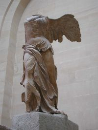
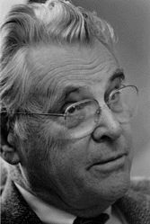
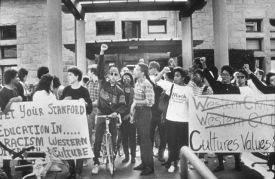

Title: Mannkynssagan: Saga veraldarinnar allrar eða bara vesturlanda?
Slug: mannkynssagan-saga-veraldarinnar-allrar-eda-bara-vesturlanda
Date: 2007-04-24 13:23:00
UID: 150
Lang: is
Author: Magnús Sveinn Helgason
Author URL: 
Category: Sagnfræði
Tags: 

Þó það sé mikilvægt að ræða kosti og galla yfirlitsverka á borð við _Kristnisögu,_ er ekki síður mikilvægt að leiða hugann að því hvernig fólk kynnist sagnfræði í háskólanámskeiðum. Það er í stóru inngangs- og yfirlitsnámskeiðunum sem sagnfræðingar, sögukennarar og blaðamenn framtíðarinnar, að ótöldum öðrum háskólaborgurum, hljóta yfirsýn yfir söguna.

Yfirirlitið er tvímælalaust einn mikilvægasti hluti sagnfræðikennslu í háskólum beggja vegna Atlantshafsins. Á Íslandi er það “Íslands- og Norðurlandasaga”, sem fjallar nánast alfarið um Ísland og “Mannkynssaga”, sem fjallar nokkurnveginn einvörðungu um þann hluta mannkynsins sem býr í Evrópu, jú, og líka um Egypta og Persa. Kennsla í “mannkynssögu” við Háskóla Íslands er því föst í því sem hefur verið kallað “the European tunnel of time” — þar sem sagan er sögð sem nokkurskonar boðhlaup siðmenningar allt frá fornegyptum til okkar daga. Í þessari grein mun ég gera grein fyrir sögu þessarar “mannkynssögu” í Bandaríkjunum.

Eitt mikilvægasta yfirlits og inngangsnámskeið sem boðið er upp á í bandarískum háskólum er _Western Civilization_ — sem í efnisvali svarar nokkurnveginn til “mannkynssögu” þeirrar sem kennd er við Háskóla Íslands. Síðan _Western Civ,_ eins og það er yfirleitt nefnt, kom fyrst fram hefur staða þess innan háskólans breyst mikið. Gagnrýnendur bentu á að námskeiðið gæfi nemendum ranga mynd af sögunni, ekki síður en samtímanum. _Western Civ_ fjallaði nánast ekkert um aðra heimshluta en Evrópu, að undanskildum hámenningarríkjum fyrir botni Miðjarðarhafs. Þessi áhersla gerði lítið úr öðrum heimshlutum, og þeirri menningu eða kynþáttum sem ekki geta rekið rætur sínar til Evrópu. _World History,_ eða “veraldarsaga”, kom fram á eftirstríðsárunum sem svar við þessu vandamáli.

Upphaf mannkynssöguyfirlitsins í Bandaríkjunum má rekja til þátttöku Bandaríkjamanna í fyrri heimsstyrjöldinni. Stríðsátök evrópsku stórveldanna soguðu Bandaríkin, sem fram til þessa höfðu verið frekar einangruð, inn í hringiðu heimsmálanna. Bandaríkjamenn gátu ekki lengur skotið sér undan því að lesa sér til um umheiminn. Heimsstyrjöldin bar vitni um að atburðir sem áttu uppruna sinn í sögulegum deilum Evrópumanna gátu steypt veröldinni allri út í glötun. Columbia háskóli brást við með námskeiði sem nefndist “War Issues” og veitti nemendum sögulegan skilning á heimsstjórnmálum. Námskeiðið reyndist gríðarlega vinsælt, og eftir að stríðsátökum lauk var það endurnýjað undir titlinum “Peace Issues”, en þá voru aðrir háskólar farnir að kenna sambærileg námskeið.

Það var eðlilegt að áhersla væri lögð á Evrópu og evrópska sögu, því þó heimurinn væri þá, líkt og nú, stærri en vesturangi Evrasíu, drottunuð evrópsk stórveldi yfir veröldinni, og háborgir fjármála og heimsstjórnmála voru allar í Evrópu eða Bandaríkjunum. Tilgangur námskeiðsins var þó ekki síður að innprenta bandarískum háskólanemum skilning á heimssögulegu mikilvægi Bandaríkjanna sem arftaka “vestrænnar menningar” — _Western Civilization._ Þessi áhersla á sameiginlegan, vestrænan, sögulegan arf Bandaríkjamanna var enn mikilvægari í ljósi vaxandi innflutnings fólks af suður- og austur-evrópskum uppruna. _Western Civ_ átti að innprenta háskólanemum, sem fram til þessa höfðu verið nánast einvörðungu sóttir af engilsaxneskum mótmælendum, sameignlegan menningararf.

_Western Civ_ átti gullöld á millistríðsárunum og fyrst eftir stríð, fjölmargir háskólar gerðu það að skyldunámskeiði fyrir alla nemendur — nokkurskonar inngangsnámskeiði að frekara háskólanámi, líkt og heimspekileg forspjallsvísindi við Háskóla Íslands. En þó námskeiðið væri vinsælt meðal nemenda, tóku sagnfræðingar að efast um hlutverk þess og ágæti. Ofuráhersla á Evrópu og evrópumiðjun þess gerði að verkum að mikill meirihluti mannkynsins væri svo að segja “sögulaus”.

Þó það hefði hugsanlega verið skiljanlegt á fyrri helmingi aldarinnar að Evrópa og evrópsk saga sæti í hásæti, var landslag veraldarinnar orðið gerbreytt á sjötta og sjöunda áratugnum. Fyrrum nýlendur Evrópu fengu sjálfstæði og kalda stríðið teygði anga sína til Asíu, Afríku og Suður Ameríku. Bandarískt samfélag breyttist einnig. Löggjöf tryggði fyrrum hermönnum háskólavist og hagvöxtur gerði fleiri Bandaríkjamönnum kleift að afla sér menntunar. Nemendum fjölgaði því hratt og háskólar urðu fjölmenningarlegri. Bandarískir háskólamenn gerðu sér því ljóst að _Western Civ_ endurspeglaði hvorki alþjóðlegan veruleika né fjölmenningarlegt samfélag Bandaríkjanna.

Námskeið í sögu einstakra heimshluta utan Evrópu og _Area Studies_ voru svör við þessu. _Area Studies_ skorti hins vegar sögulega dýpt og buðu upp á mjög brotakennda mynd af sögu veraldarinnar. Margir sagnfræðingar leituðu því að námskeiði sem gæti komið í stað _Western Civ_ — námskeið sem gæti veitt betri yfirsýn yfir sögu mannkynsins frá upphafi vega til okkar daga. Þó _Western Civ_ liði ekki undir lok, né breyttist í grundvallaratriðum, missti það hægt og bítandi stöðu sína innan akademíunnar. Í upphafi níunda áratugarins voru fræðimenn farnir að lýsa yfir dauða þess. Slíkir spádómar reyndust fullbráðir því _Western Civ_ gekk í gegnum endurnýjun lífdaga á níunda áratugnum, og er enn í dag eitt mikilvægasta yfirlitsnámskeið sem boðið er upp á. Það hefur þó þurft að gefa upp tilkall sitt til þess að vera “mannkynssaga”, því ný yfirlitsnámskeið, veraldarsaga og hnattsaga gera nú tilkall til þess titils.[^1] 

“Nútíma” veraldarsaga kom fram á sjötta og sjöunda áratugnum undir handleiðslu Leften Stavrianos og William McNeill.[^2]

Stavrianos og McNeill leituðust báðir við að skrifa sögu sem gæti fangað fortíð alls mannkynsins, en Stavrianos sagði að Kóreustríðið hafi opnað augu sín fyrir nauðsyn þess að kenna námskeið sem gætu gert Bandaríkjamönnum kleift að skilja hvernig sögulegur bakgrunnur atburða í Asíu, Evrópu og Bandaríkjunum var samofinn. Veröldin, og veraldarsaga væru ein heild: “What does this new [Global] perspective mean…? It means the perspective of an observer perched on the moon rather than ensconced in London or Paris or Washington”. Þó kennslubækur Stavrianos séu enn í notkun hefur McNeill þó haft meiri áhrif á hugmyndir veraldarsögufræðinga. McNeill leit svo á að skrifa ætti veraldarsögu sem sögu samskipta, mannflutninga og ferðalaga, frekar en “siðmenninga”, menningarsvæða og stórvelda eins og Stavrianos gerði. Veraldarsaga í anda Stavriaons eða McNeill á þó öll sameiginlegt að hún stefnir að því að yfirstíga þröngan ramma þjóðríkisins og evrópumiðjunar _Western Civ_.[^3]

Hinum megin Atlantshafsins komu einnig fram svipaðar hugmyndir á eftirstríðsárunum. Annálaskólinn franski stefndi, líkt og bandarísk veraldarsaga, að því að skrifa sögu sem gæti veitt yfirlit yfir söguna sem væri viðameira en hefðbundin þjóðríkjasaga. _The Mediterranean World in the Age of Philip II_ eftir Fernand Braudel hafði einnig mikil áhrif í Bandaríkjunum þegar hún kom út í enskri þýðingu (kom út 1949, ensk þýðing 1972), þó sú veröld sem hann fjallaði um hafi aðeins náð yfir Miðjarðarhafið. 

Það var þó ekki fyrr en á níunda áratugnum sem veraldarsagan tók að vinna sér raunverulegt fylgi í bandarískum háskólum. _The World History Association_ var stofnað 1983, og fjöldi kennslubóka í veraldarsögu voru skrifaðar. Veraldarsögunámskeið hafa vaxið hratt seinustu tuttugu árin, og eru nú með fjölmennustu námskeiðum í sagnfræði í bandarískum háskólum. Í upphafi tíunda áratugarins voru rétt tæp 10% sagnfræðideilda í Bandaríkjunum með minnst einn veraldarsögufræðing innaborðs. Í dag er þetta hlutfall 45%. Samkvæmt tölum frá 2004 eru yfirlitsnámskeið í veraldarsögu næst best sóttu yfirlitsnámskeiðin sem boðið er upp á í bandarískum háskólum: Meðalstærð námskeiða í Bandaríkjasögu er 101 nemandur, veraldarsögu 97 nemendur og _Western Civ_ 78 nemendur.[^4]

Vöxtur veraldarsögu hefur fyrst og fremst verið knúinn af eftirspurn, aðallega frá menntaskólum og smærri háskólum sem ekki hafa bolmagn til að bjóða upp á mörg námskeið í sagnfræði, sérstaklega ekki í sögu annarra heimshluta en Bandaríkjanna. Veraldarsaga var því framan af fyrst og fremst kennslugrein en ekki rannsóknargrein, enda neituðu margir stærri rannsóknaháskólar lengi vel að kenna veraldarsögu. Það er raunverulega ekki fyrr en á síðustu árum að veraldarsaga hefur fengið viðurkenningu sem raunveruleg undirgrein sagnfræðinnar í Bandaríkjunum. Stofnun _The Journal of World History_ (1990) var mikilvægt skref til að vinna greininni virðingu.

Eitt af því sem hefur staðið veraldarsögu fyrir þrifum hefur verið að hana skortir frásagnarhefð — _grand narrative_ — sem getur jafnast á við það sem _Western Civ_ býður upp á. Veraldarsögufræðingar hafa kvartað undan því að þessi skortur á frásagnarhefð eða söguþræði, gerði að verkum að mjög erfitt væri að setja saman heildstæð námskeið, sem gæti bæði veitt nemendum merkingarbært yfirlit yfir sögu mannkynssins alls, skilning á fjölbreytileika sögunnar og sögulegu eðli vandamála samtímans. Námskeið í veraldarsögu skorti því oft rökrænt samhengi og kennslubækur í veraldarsögu voru lengi vel “warmed-over versions” kennslubóka í _Western Civ_ — þær fylgdu röklegri uppbyggingu Evrópumiðjaðrar mannkynssögu, en viku hér og þar að sögu annarra heimshluta.[^5]

Í dag ríkir mun minni óvissa um hvernig skipuleggja eigi frásögnina og hvaða þemu hentuðu best til að veita mannkynssögunni einhverskonar rökrænt samhengi. Þetta endurspeglast í auknu framboði kennslubóka. Þó sumar þeirra séu skrifaðar með það fyrir augum að þær geti þjónað bæði sem kennslubækur í Western Civ og veraldarsögu, er samdóma álit veraldarsögufræðinga að myndast hafi frásagnarhefð sem geri sagnfræðingum kleyft að byggja námskeið í veraldarsögu sem bjóði upp á sæmilega heildstæða frásögn.

Í megindráttum má segja að fram hafi komið tvær mismunandi leiðir til að segja sögu veraldarinnar. Annarsvegar er það hefð sem kennd er við Leften Stavrianos, sem nálgast veraldarsöguna út frá samspili mismunandi menningasvæða eða hámenninga. Saman&shy;burður á skipulagi og hugmyndafræðilegri réttlætingu ríkisvalds og samkeppni heims&shy;velda ljá þessari frásögn samhengi. Kostur þessarar nálgunar er að hún samrýmist vel frásagnarmáta hefðbundinnar stjórnmálasögu og _Western Civ._ Hins vegar er það frásagnarhefð sem kennd er við McNeill sem leggur áherslu á snertipunkta mismunandi menningarsamfélaga frekar en menningarsamfélögin sjálf. Nálgun McNeill er mun þematískari en hefðbundnari veraldarsaga Stavrianos, og opnari fyrir menningarsögu, enda leggur hún áherslu á blöndun menningarhefða, “cross fertilization”, fólksflutninga og samskipti, “hybrid spaces” og “diasporas”. Öll veraldarsaga á þó sameiginlegt að hún leitaðist við að segja sögu mannkynssins frá upphafi til enda, fanga alla sögu mannkyns, frá upphafi til okkar daga.

---

<small class="blurb">
__15. desember 2007:__ Höfundur óskar að tekið sé fram: Þessi grein er fyrstu drög að stærra verki sem er í vinnslu.
</small>

[^1]:  Gilbert Allardyce, “The Rise and Fall of the Western Civilization Course”, _The American Historical Review,_ 87:3 (júní 1982), bls. 695-725. Endurnýjun _Western Civ_ stóð meðal annars í sambandi við hægrisveiflu í bandarískum stjórnmálum á níunda áratugnum. Í flestum háskólum hefur það þó verið endurskipulagt sem nánast hrein Evrópusaga, frekar en einhverskonar “mannkynssaga”.

[^2]: “Veraldarsaga” er mun eldri — mikið af sagnfræði miðalda og árnýaldar var skrifuð sem Veraldarsaga, en Oswald Spengler og Arnold Toynbee skrifuðu einnig mjög vinsælar veraldarsögu á millistríðsárunum. _The Decline of the West_ eftir Spengler kom út í tveimur bindum 1918-1923 og stórvirki Toynbee, _A Study of History,_ í tólf bindum, kom út 1934-1961. Ákveðin menningarleg svartsýni einkenndi hugmyndir bæði Toynbee og Spengler, og flestir sagnfræðingar litu mjög niður á skrif þeirra. 

[^3]: Leften Stavrianos, “A Global Perspective in the Organization of World History”, _New Perspectives in World History,_ ritstýrt af Shirley Engle, Washington 1964, bls. 616-620, tilvitnun á bls. 617. Bók hans, _A Global History: From Prehistory to the 21st Century,_ (Englewood Cliffs N.J. 1966) var endurprentuð í sjöunda sinn 1999.

[^4]: “Latest Figures Show Sizeable Increases in History Majors and Bachelor's Degrees”, _Perspectives_ (apríl 2004).

[^5]: Joe Gowaskie, “The Teaching of World History: A Status Report”, _The History Teacher,_ Vol. 18, No. 3. (May, 1985), bls. 365-375. Tilvitnun bls. 368.

