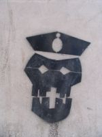
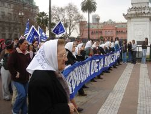
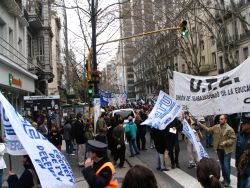

Title: Mánudagur án mótmæla
Subtitle: Hugleiðing um argentínskan og íslenskan aktivisma
Slug: manudagur-an-motmaela
Date: 2007-09-11 10:49:00
UID: 177
Lang: is
Author: Áslaug Einarsdóttir
Author URL: 
Category: Í útlöndum, Samfélag
Tags: 

Að búa í Buenos Aires er mögnuð upplifun. Borgin hefur allt það sem aðrar stórborgir hafa upp á að bjóða, hún iðar af fjölbreyttu menningarlífi en samt fara sérargentísk einkenni hennar ekki framhjá neinum og saga Argentínu blasir við á hverju götuhorni. Argentínumenn hafa þurft að horfast í augu við pólitíska hörmungarsögu á síðustu áratugum líkt og mörg önnur lönd Suður-Ameríku. Yfir Argentínumenn hafa gengið ofbeldis&shy;fullar herstjórnir sem beittu linnulausu ofbeldi gagnvart borgurum og stóðu fyrir fjölda mannshvarfa og morða á áttunda og níunda áratugnum. Efnahags&shy;hrunið árið 2001, sem hefur verið lýst sem einu versta hruni seinni hluta tuttugustu aldarinnar, hefur ennfremur lagst þungt á þjóðina.

Ein afleiðing af átakalegri sögu Argentín&shy;umanna er sú að borgaraleg þáttaka á hinum ýmsu sviðum er afar fjölmenn og fjölbreytt. Argentínumenn eiga mjög öfluga mótmælahefð og flóra félags&shy;hreyfinga og mann&shy;réttindas&shy;amtaka er gífurleg. Það mætti kannski segja að í Argentínu sé mótmæla&shy;hefðin, aktivisminn, orðin að nokkurs konar normi. Á hverjum degi heyrist af mótmælum eða verkföllum vegna spillingar ráðamanna, lélegra samgangna, atvinnu&shy;leysis, getuleysis stjórnvalda til að ráða fram úr ýmsum málum, og svo mætti lengi telja. Í sjónvarps&shy;fréttunum var það til að mynda stundum sérstaklega tekið fram ef að engin mótmæli eða verkföll hefðu tafið fyrir umferðinni í miðborginni þann dag; „Þetta var ósköp venjulegur mánudagur í Buenos Aires, þó var óvenjulítið af mótmælum“, heyrðist stöku sinnum í fréttaþulnum. 

Aktivismi í Argentínu hefur vakið heimsathygli. Mæðurnar á Mayo-torgi (Las madres de la plaza de Mayo) eru til að mynda ekki aðeins ein elsta og virtasta mann&shy;réttinda&shy;hreyfing Argentínu heldur eru þær ein frægasta friðar&shy;hreyfingin í Suður-Ameríku. Hreyfingin var stofnuð fyrir um 30 árum af fjórtán mæðrum sem hittust á aðaltorginu í Buenos Aires og kröfðust þess að stjórnvöld og herinn yrðu dregin til ábyrgðar fyrir hvörf dætra þeirra og sona. Talið er að mannshvörfin sem áttu sér stað á tímum herforingja&shy;stjórnanna á árunum 1977 til 1983 telji á fjórða tug þúsunda. Nú 30 árum seinna safnast mæðurnar og stuðnings&shy;menna þeirra enn saman á Mayo-torgi vikulega og ganga nokkra hringi í kringum það. Hreyfingin er ennfremur orðin að margþættu mann&shy;réttinda&shy;afli. Mæðurnar reka sína eigin bókaútgáfu og dagblað og hafa opnað sinn eigin háskóla svo eitthvað sé nefnt.

Einn fimmtudag mætti ég út á Mayo-torg með argentískum meðleigjanda mínum og gekk nokkra hringi með mæðrunum. Sumar þeirra báru hvíta höfuðklúta og upplýsti hann mig um að þar væru á ferð nokkrar af stofn&shy;mæðrunum, sem eru í dag margar komnar á níræðisaldur. Meðleigjandi minn gekk með þeim í hverri viku þegar hann var í háskólanum fyrir nokkrum árum en hann var að mæta aftur í fyrsta skipti í mörg ár. Þennan fimmtudag voru afar margir ferðamenn á Mayo-torgi með myndavélarnar á lofti, tilbúnir að mynda hringferðina í kringum torgið. Meðleigjandi minn hafði aldrei séð eins marga ferðamenn á torginu og þann dag, og úr varð stórfurðuleg uppákoma þar sem ferðamanna&shy;hópurinn með myndavélarnar var mun stærri en hópurinn sem gekk með mæðrunum í kringum torgið. Ég velti fyrir mér af hverju túristarnir hefðu ekki áhuga á labba einn hring í stað þess að standa með vélarnar á lofti, a.m.k upplifði ég samstöðu með mæðrunum þegar ég gekk með þeim, þrátt fyrir að vera vissulega bara enn einn túristinn. 

Það eru þó ekki öll mótmæli eins „túristavæn“ og uppákomur mæðranna, ef svo má að orði komast. Róttækari hliðar aktivisma í Argentínu eru mjög umdeildar fyrir að stuðla að átökum á milli borgara og lögreglu. Gott dæmi um róttækari aktivisma eru uppgangur piqueteros hreyfinganna í dag sem eru iðulega áberandi í argentískum fjölmiðlum. Piqueteros er samnefnari yfir hreyfingar sem að fara út á umferðargötur víðsvegar um landið og loka götunum klukkutímum saman í mótmælaskyni. Þessar mótmæla&shy;að&shy;ferðir hafa verið notaðar víða um heim í marga áratugi. Piqueteros hreyfingarnar sem eru áberandi í Argentínu í dag urðu hins vegar til í kringum 1996 þegar loka átti verksmiðju einni í Neuquén héraði en starsfólkið streymdi út á göturnar til að mótmæla yfirvofandi atvinnuleysi. Í slíkum aðgerðum myndast oft mikill hasar á milli mótmælenda og lögreglu sem getur haft dapurlegar afleiðingar. Árið 2002 voru þeir Darío Santillán og Maximiliano Kosteki skotnir af lögreglu í friðsamlegum piqueteros mótmælum í Buenos Aires og vakti það atvik mikla reiði. Í dag er þess atburðar minnst árlega með stórri mótmælagöngu og loka mótmælendur Puyerredón-brúnni þar sem atvikið átti sér stað.

Stuttu eftir minninga&shy;gönguna um Darío og Maximiliano í sumar sá í ég fréttunum að Saving Iceland samtökin hefðu beitt piqueteros aðferðum og lokað Snorra&shy;brautinni í einhvern tíma. Ég sýndi meðleigjanda mínum, sem tók þátt í minningar&shy;göngunni, myndirnar frá uppákomunni hér heima og kallaði hana í gríni hin íslensku piqueteros mótmæli. Hann sá þó ekki margt sameiginlegt með þessum tveimur uppákomum og spurði bara undrandi af hverju allir væru trúðsmálaðir og hvort þetta væri eitthvað lélegt grín.

Með fullri virðingu fyrir hinum ýmsu mótmælum á Íslandi þá fannst mér felast í þessum orðum dálítið góður punktur hvað varðar íslenskan aktivisma, einmitt það að hann er sér_íslenskur_. Ég áttaði mig enn betur á því þegar ég fór í heimsókn í tíma í sjónrænni mannfræði í háskólanum í Buenos Aires. Að labba inn í hugvísinda&shy;deildina var upplifun út af fyrir sig. Deildin var til húsa í yfirgefinni verksmiðju og upp um ómálaða steypuveggi hennar hengu óteljandi skilti og veggspjöld ýmissa stjórn&shy;mála&shy;hreyfinga og samtaka. Tilgangur heim&shy;sóknarinnar var að sýna heimildamynd um íslenskan aktivisma, Sófa&shy;kyn&shy;slóðina, og spjalla um efni hennar. Aldrei hefði mér þó órað fyrir viðbrögðum nemendanna við myndinni. Þeir beinlínis göptu yfir sumum skotunum og aftur varð ég spurð hvort þetta sem þau sáu væri brandari.

Mér leiðist að tilkynna það, en fyrir þessum argentískum áhorfendum mínum virtist íslenskur aktivismi nákvæmlega það, eitt stórt grín. Þau áttu ekki orð yfir þeim litla fjölda sem þau sáu mæta á hinar ýmsu uppákomur. Þeim fannst hreint og beint kjánalegt að sjá nokkrar hræður með skilti upp á hálendinu eða tíu unglinga ryðjast inn á skrifstofur Alcoa. Sumir vilja kalla það þrælslund, aðrir eintóma leti og rigningar&shy;fóbíu. Eitthvað er það þó sem að gerði íslenskan aktivisma beinlínis hlægilegan í augum þessarra Argentínu&shy;manna. 

Það þarf þó ekki að fara í felur með það að Íslendingar hafa náð ágætis árangri í mörgum af þeim málefnum sem Argentínumenn eru að glíma við, líkt og ólæsi og atvinnuleysi. Í íslenskum aktivisma er verið að berjast fyrir ákveðnum málum sem sumum þykja „lúxusmál“ í Argentínu, mál á borð við umhverfis&shy;vernd, femínisma og alþjóðleg mannréttindi. „Það er enginn að spá í því að loka Guantanamo hér“ sagði einn nemandinn við mig í tímanum, „við erum nógu upptekin af því að passa upp á að atkvæða&shy;seðlarnir okkar séu ekki falsaðir, að við komumst til og frá vinnu vegna verkfalla og að við höfum þak yfir höfuðið“. Einhver í tímanum kom þó með þá verðugu ábendingu að samfélags&shy;vandamál séu metin fyrst og fremst út frá upplifun borgaranna sjálfra af þeim. Þannig reyndi ég að sannfæra þau um að launamunur kynjanna og virkjun hálendisins, svo dæmi séu tekin, væru mikil hitamál fyrir Íslendinga, en einhvern&shy;veginn stóð eftir í mér sú tilfinning að þessir nemendur litu á málefni okkar og aðferðir léttvægum augum.

Okkar eigin aktivismi er afar sérstakt fyrirbæri, amk miðað við aktivisma í Suður-Ameríku. Jú, við höfum það ógurlega gott á mörgum sviðum og ættum að gleðjast yfir því að þurfa ekki upp til hópa að stoppa samgöngur til að berjast fyrir réttindum okkar. En þau ýmsu mál sem við berjumst fyrir eru auðvitað ekkert grín og mættum við að mínu mati hiklaust vera róttækari og pólitískari í okkar aktivisma, og þá er ég að sjálfsögðu að tala á friðsamlegum nótum. Þá ættum við einnig að getað sameinast í sterkari afstöðu með alþjóðlegum baráttumálum. Ef við með okkar meintu „lúxus“-útgáfu af aktivisma erum ekki fær um það, geta aðrar þjóðir það þá?
