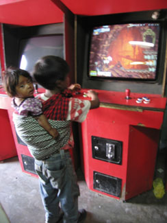
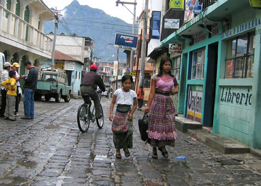
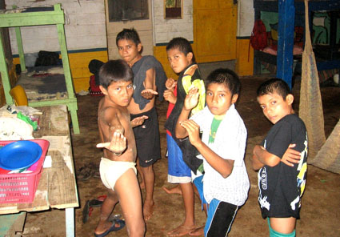
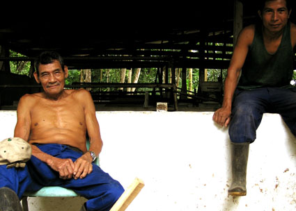

Title: Máttur er mennt, - og stundum froskur, í Gvatemala
Subtitle: Af furðulegum vandamálum, litlum og stórum, í framandi landi
Slug: mattur-er-mennt-og-stundum-froskur-i-gvatemala
Date: 2006-11-02 15:34:00
UID: 107
Lang: is
Author: Bryndís Björgvinsdóttir
Author URL: 
Category: Samfélag
Tags: 

_Eftir langt ferðalag komst ég loksins á klósett sem staðsett var í kofa úti á miðju túni. Af einhverri ástæðu hafa landsmenn mjög sjaldan lok á salernum sínum og þegar ég skimaði ofan í klósettið þá sá ég einhverja hreyfingu, ég leit betur ofan í innviði klósettsins og feitur gulbrúnn froskur glápti á móti. Það var stærðarinnar froskur að baða sig ofan í klósettinu! Er það nú vandamál! Á maður að sturta honum niður? Eða... bara láta sem hann sé ekki þarna? Á kannski að grípa hann og skutla honum upp úr? Hvað er málið með fáránleg&shy;heitin? Froskur ofan í eina klósettinu á öllu svæðinu og margra tíma rútuferð framundan! Það sem ég hugsaði  út frá þessum bjánalega froski, þá stundina,  spannaði aðeins víðar en ástand mitt og hans þessa stundina: “Ég er í Gvatemala, og ég held að ég sé að upplifa vandamál þróunara&shy;landanna, í hnotskurn, akkúrat núna...!“. Í vonleysi mínu gerði ég nákvæmlega ekkert, fór aftur upp í rútu  og hef síðan ekki gleymt þessum feita gulbrúna froski sem var á röngum stað á röngum tíma._

---

Manni kann að þykja óskiljanlegt hvernig þessi fátæku lönd, eins og t.d. Gvatemala, fari eiginlega að því að vera alltaf jafn fátæk. Er ekki hægt að gera eitthvað í málunum? Kippa bara öllu í liðinn? Sturta froskinum niður, láta sem hann sé ekki þarna eða taka hann upp? Þegar ég lít um öxl og hugsa til sumardvalar minnar í Gvatemala þá er ég ekki frá því að ég hafi hitt fyrir froskinn í klósettinu á hverjum degi. 

### Fátækir menn og fátækari konur

Fólk þarf að fullnægja frumhvötum sínum, fólk á rétt á að stunda vinnu, fólk á rétt á tækifærum, en það skal alltaf vanta eitthvað upp á að hægt sé að framfylgja ofantöldu. Oftar en ekki er hindrunar&shy;þátturinn frekar fáránlegur, eins og froskurinn, ef ekki eitthvað enn fáránlegra. Til að byrja með er kven&shy;fyrir&shy;litningin í Gvatemala heilmikil. Þar með er búið að minnka tækifæri helming þjóðarinnar á einu bretti. Eina vonin sem margar ungar konur eygja er að gifta sig karlmanni sem getur unnið og séð fyrir þeim, reddað málunum og tekið ábyrgð á þeim gagnvart lífinu og fátæktinni. Þegar karlinn er fundinn virðast barneignir vera þjóðráð, því þá neyðist karlinn til að giftast móðurinni, og lífið verður einfaldara og fyrir&shy;sjáanlegra. Þessi hernaðar&shy;áætlun endar oft á því að karlinn yfirgefur konu og barn. Karlinn hefur nefnilega gjarnan annarskonar hernaðar&shy;á&shy;ætlun í huga þar sem kona og barn koma ekki við sögu, og eftir situr einstæð móðir, gjarnan á unglings&shy;aldri, fátækari en nokkru sinni fyrr. 

Skortur á fræðslu varðandi barneignir og getnað er mikill og auk þess kosta getnaðar&shy;varnir peninga. Eins og fólk veit þá hefur páfinn ekki verið neitt rosalega spenntur fyrir því að hvetja kaþólikka til að nota getnaðar&shy;varnir. Margir líta á forvarnir gagnvart barneignum sem synd, verið sé að grípa inn í örlögin og gangverk Guðs. Birtingarmynd mikilla barneigna eru stútfull munaðar&shy;leysingja&shy;hæli landsins sem þó eru ekki full af eiginlegum munaðar&shy;leysingjum, heldur börnum sem eiga foreldra sem geta alls ekki séð fyrir þeim. Það að sjá fyrir barni í Gvatemala gengur  þó oft ekki út á mikið meira en að færa því  þrjár skálar af baunum ásamt nokkrum tortíum á dag. 

### Máttur er mennt

Yfirmenn munaðar&shy;leysingja&shy;hælisins sem ég vann á í Gvatemala síðasta sumar afsönnuðu það hugtak að mennt væri máttur, og snéru því einfaldlega við, máttur er mennt. Vel menntaðir hjúkrunar&shy;fræðingar frá Bandaríkjunum sem komu til hælisins til þess að hjálpa börnum höfðu ekkert um hlutverk sitt að segja. Yfirmennirnir létu hjúkrunar&shy;fræðinga vinna við að þurrka af borðum á bar í grennd við hælið á meðan helmingur barnanna á hælinu sjálfu þjáðust af sníkjudýrum, lús eða opnum sárum. Barinn var í eigu yfirmannsins, rétt eins og hælið, og því leyfði yfirmaðurinn sér að áætla sem svo að fólk kæmi víðsvegar að til þess að vinna á bar í  þróunarlandi, og skipaði því mörgum sjálf&shy;boða&shy;liðanum þangað, engum dirfist að mótmæla yfirmanninum. 

Einn daginn kom sú skipun frá yfirmanninum að halda ætti hátíðlega upp á Mæðradaginn, á munaðar&shy;leysingja&shy;hælinu sjálfu. Þeim sjálf&shy;boða&shy;liðum sem mótmæltu var hótað brottrekstri og börnunum var smalað saman til þess að syngja nokkur kvæði um móðurina. Nokkur barnanna tóku þátt í leikriti sem æft hafði verið í tilefni dagsins, sem var þó einskonar spuni. Leikritið var þannig að einn drengurinn var fullur fjöl&shy;skyldu&shy;faðir sem hélt á rommflösku og lamdi hina fjöl&shy;skyldu&shy;með&shy;limina með henni, og móðurina þá mest.

### Brauðskortur og humarhalar

Einn daginn kláraðist allt brauð á hælinu, þ.e.a.s. tortíurnar, og börnin fengu ekkert að borða nema baunir og hrísgrjón í öll mál í heila viku. Yfirmaður hælisins, sem hélt sig oftast fjarri því, sat í þæginda&shy;stól í nærliggjandi þorpi, svo ég sá sjálf til, og nagaði þar humarhala. Hún var ungleg og sterk kona, furðulegur yfirmaður en talin vera bjargvættur allra barnanna á hælinu. Fólk velti fyrir sér örlögum hælisins er þessi kona hyrfi á vit forfeðranna, því hún gaf jú eitthvað af sínum auði til hælisins, og enginn annar auðmaður var líklegur til að taka hælið undir sinn væng. Ég sá dauða hennar ekki fyrir mér í uppsiglingu þangað til ég komst að því að hún, þessi unglega kona, var 75 ára gömul. Hún hafði bara farið í svona margar lýtaaðgerðir. Eins og froskurinn í klósettinu sat hún bara þarna, í þægindastól, nagandi humarhala með ofurlítinn nebba og kinnarnar strekktar upp á enni. Á meðan vann hjúkrunar&shy;fræðingurinn á barnum dag og nótt, börnin borðuðu einungis baunir og grjón í öll mál og fréttir af kyn&shy;ferðis&shy;legri misnotkun á sumum þeirra var eitthvað sem enginn gerði neitt í nema e.t.v. nokkrir sjálf&shy;boða&shy;liðar sem áttu þá hættu á því að verða reknir. Og ég gat ekki gert upp við mig hvort betra væri að sturta svona konu niður, líta fram hjá henni, eða hjálpa hennar furðulegu starfsemi. Ekkert af þessu virtist vera betra ráð en annað.  

### Fjöldamorðinginn Ríos Montt fer á þing

Gvatemala skreið árið 1996 upp úr 30 ára borgarastríði þar sem yfir 200.000 manns voru myrtir. Stjórn&shy;málamenn og efri stéttir okkar daga misnota vald sitt og margir Gvatemalamenn eru hræddari við lögregluna en glæpamenn, enda er löggan ákaflega spillt og óútreiknanleg. 
Fyrrverandi forseti landsins, Ríos Montt, er sagður bera einna helst ábyrgð á fjöldamorðum á Indíánum í Gvatemala í borgara&shy;stríðinu, en þess má geta að um 50% Gvatemala&shy;manna eru Maya-Indíánar. Í forsetatíð Montts átti sér stað einna blóðugasti kafli borgara&shy;stríðsins en engu að síður var hann, af einhverjum óskiljanlegum ástæðum, kosinn inn á þing fyrir örfáum árum síðan. Gvatemala&shy;maður einn sagði mér að Montt hafi komið í mörg fátæk þorp og lofað því að fólkið þar fengi mjólk, brauð og maís og hvaðeina, fólkið trúði honum og kaus hann. Loforðin hafa ekki verið uppfyllt en þetta fátæka fólk, langflestir Indíánar, komu m.a. Montt á þing, manni sem ber ábyrgð á morðum á þúsundum Indíána u.þ.b. tuttugu árum áður.  

### Dagurinn sem bóndinn steig á jarðsprengjuna

Í borgunum standa smávaxnir en kröftugir menn á öðrum fæti, því hin vantar, og betla. Þeir standa upp við veggi allan daginn, alla daga. Einfættu mennirnir með sólbarin andlit og barðastóra hatta eru bændur sem hafa stigið á jarðsprengjur við vinnu sína. Bændurnir í Gvatemala eru ótrúlegir, þeir vakna fyrir sólarupprás og vinna til sólseturs. Þeir rækta landið og framleiða ótrúlega fjölbreytt úrval af ávöxtum og grænmeti. Sagt er að þeir vinni þrefalt hraðar en borgarbúi getur ímyndað sér að mannslíkaminn þoli og sé hæfur til. Nú standa þeir bara þarna betlandi  á götunni því einhver samlandi þeirra álpaðist til þess að setja jarðsprengju á landsvæði þeirra þegar borgara&shy;stríðið átti sér stað. Það er víst ekki hægt að vinna á þreföldum hraða, frá sólarupprás til sólseturs, á aðeins öðrum fætinum. 

Nú er ég ekki mann&shy;fræðingur, þróunar&shy;fræðingur eða slíkt. Ég veit ekkert um þróunarmál eða lausnir á vandamálum fátæku landanna. Það eina sem ég veit er að vandamálin eru miklu stærri og flóknari heldur en ég, með mín vestrænu gildi og viðmið, gat ímyndað mér. Öllu er snúið á haus; klósett eru óvirk vegna þess að þar situr froskur í makindum sínum, yfirmenn munaðar&shy;leysingja&shy;hælis fara í lýtaaðgerðir og borða humarhala á meðan munaðar&shy;leysingjarnir sjálfir lifa við sult, fjölda&shy;morðingjar eru kosnir af fórnarlömbum sínum á þing og bændur hafa aðeins einn fót og vinna því fyrir sér sem betlarar í borgum. Ef einhver gæti bara sturtað þessum vandamálum niður um klósettið, þá mætti auðvitað gera það, hinn umtalaði froskur var þó allt of stór, að ég held, til þess að fara auðveldlega niður rörin og út í sjó. 

---

Ofanskrifað þýðir samt alls ekki að ómögulegt sé að fara til Gvatemala til að aðstoða fátækt fólk, langt því frá. Mikil þörf er á hugar&shy;fars&shy;breytingu, skipu&shy;lagningu, menntun, læknisaðstoð og þar fram eftir götunum. Hvatningaræðu til þessa og nánari upplýsingar um Gvatemala, munaðar&shy;leysingja&shy;hælið, hjúkrun í frumskógum Gvatemala og hin framandi vandamál má finna á síðunni [sjalfbodalidahjukrun.tk](http://www.sjalfbodalidahjukrun.tk).

Geta má þess að síðan, ýmis verkefni og fyrirlestrar tengdir hjúkrun á munaðar&shy;leysingja&shy;hæli í Gvatemala fékk styrk frá Nýsköpunar&shy;sjóði námsmanna síðasta sumar. Mig grunar að áhugasamir um sambærileg verkefni gætu vel fengið styrk frá sjóðnum næsta sumar og ættu allir áhugasamir að láta reyna á slíkt.

