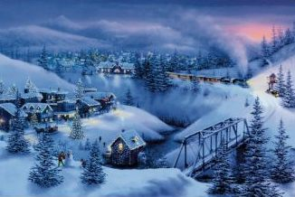

Title: Með hlustaverk á jólunum
Slug: med-hlustaverk-a-jolunum
Date: 2007-12-20 13:54:00
UID: 205
Lang: is
Author: Karl Gunnarsson
Author URL: 
Category: Tónlist
Tags: Jól, jólalög, Tónlist, Johnny Cash, Blue Christmas, Elvis, Mér hlakkar svo til, Dáðadrengir, Gleðileg jól, Baggalútur, Kósíheit par exelans, Iron Maiden, Run to the hills, Með klamydíu á jólunum, Áblástur, Voltaire, Helga Möller, hátíðarskap

Hátíð ljóss og friðar. Heilög jól. Ríflega mánuður af kaupæði, hömlulausri neysluhyggju, vafasömum skreytingum og síðast en ekki síst jólalögum. Það er fátt sem fer meira í taugarnar á mér en neysluhyggja. Þið kinkið kannski kolli, eða ranghvolfið augunum, en ég skal segja ykkur að ég hef langa reynslu af því að láta hluti fara í taugarnar á mér. Ég gæti verið atvinnumaður í pirringi. Og þrátt fyrir óþol mitt fyrir neysluhyggju, svo ég nefni ekki heimili og vinnustaði sem einhyrningar með ebólu virðist hafa ælt glimmer yfir, eru það jólalögin sem fara auðveldlega mest í taugarnar á mér.

Ég get litið fram hjá viðbótartímanum sem ég eyði í umferð yfir jólamánuðinn vegna umferðarþungans. Vissulega leiðinlegt en samt bara meira af því sama. Opinberar jólaskreytingar eru orðnar merkilega smekklegar í seinni tíð og koma mér í ágætis sólstöðuhátíðarskap. Ég þori varla að viðurkenna það en mér finnst umhverfi Tjarnarinnar aldrei fallegra en í desember og Austurvöllur sömuleiðis. Smekklausar skreytingar eru því aðallega á vegum einkaframtaksins sem þáttur í sterabættri neysluhyggju eða afvegaleiddum keppnisanda úthverfakónga.

Umferðin er hreinn mínus en þegar allt kemur til alls fyrirgef ég skreytigleðina vegna þess að fallegustu hlutar Reykjavíkur verða jafnvel fallegri. Þeir ljótustu (lesist: Kringlan) verða þó enn ljótari. Það er líklega afrek og jafnvel þótt við miðum ekki við höfðatölu. Augnskaði Kringlunnar fölnar samt við hliðina á færibandaframleiddri jóla„tónlist” sem sumt fólk virðist þurfa til að komast í jólaskap. Ég skal gefa textahöfundum sem skrifa aspartamesæta, gervihressa og klisjufyllta jólalagatexta eina vísbendingu: ef þú skrifar texta í, fullri alvöru, sem fjallar að einhverjum hluta um hangikjöt, í rómantísku samhengi, ertu ekki hæfur til að taka þátt í samfélagi manna.

Ekki misskilja mig; hangikjöt er eitt af því sem gerir jólin þess virði að halda upp á. Tekið inn munnlega það er að segja. Getur einhver nefnt til lag fyrir mig sem fjallar af alvöru, að hluta til, um hangikjöt, eða eitthvað álíka, og er ekki annað hvort óvartfyndið eða vandræðalega slæmt? Þegar ég reyni að svara þessu sjálfur enda ég alltaf á „Kósíheit par exelans” með Baggalút sem er viljandi fyndið og síst vandræðalega slæmt.

Vandamálið við mörg jólalög virðist vera það sama og við mörg kántrílög; textahöfundurinn hefur gátlista yfir hugtök og hluti sem þarf að taka fyrir til að lagið verði nógu kántrí — eða nógu „jóla” í tilfelli jólalaganna. Hver sem hefur hlustað á Johnny Cash veit að það þarf ekki að nefna mömmu, pallbíl, hundinn, lest, fyllerí og fangelsi, öll saman, í einu og sama laginu svo það sé kántrí. Þetta sama á við um jólalög; minna er oftast betra. Ef menn eru virkilega flinkir er hægt að komast vel frá því að minnast til dæmis á hvít jól _og_ jólaskraut, eins og í „Blue Christmas” en þá þyrfti maður helst að láta Elvis syngja lagið. Og leyfið mér að upplýsa ykkur: Elvis er dauður.

Engu að síður enda ég alltaf á að hlusta á jólalög þegar líður á desember. Sjálfviljugur það er. Ég held þetta séu varnarviðbrögð undirmeðvitundarinnar til að halda í leifarnar af geðheilsunni. Á mínum lagalista eru gjarnan lög eins og „Mér hlakkar svo til” með Dáðadrengjum, „Gleðileg jól” með Baggalút, sem er stórkostleg ábreiða af Iron Maiden laginu „Run to the Hills” og hið ógleymanlega „Með klamydíu á jólunum” með Áblæstri. Illkvittinn húmor er best allra varna og með vini eins og þessa þarf ég, ólíkt Voltaire, ekki Guð til að gera „óvini” mína hlægilega. Því miður virkar lagalistinn minn samt ekki eins og bólusetning gagnvart jólalögunum sem ég heyri þegar ég skýst í verslanir eftir gjöfum. Lagalistinn er frekar andlegi sælureiturinn minn þar sem ég hringa mig upp, skjálfandi í fósturstellingu, eftir að troðast um Kringluna á meðan Helga Möller reynir að koma mér í „hátíðarskap”. Henni hefur ekki enn tekist það en, hey, ég hef ekki enn verið með klamydíu á jólunum. Hvað er ég að kvarta?
