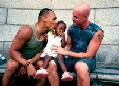

Title: Mega samkynhneigðir ekki eignast börn?
Subtitle: Um rök gegn fjölskyldulífi homma og lesbía
Slug: mega-samkynhneigdir-ekki-eignast-born
Date: 2006-03-30 09:13:00
UID: 59
Lang: is
Author: Eygló Árnadóttir
Author URL: 
Category: Kynjafræði, Mannfræði
Tags: 

Þó réttindabarátta samkynhneigðra hafi fært íslenskum hommum og lesbíum aukin lagaréttindi á óvenju skömmum tíma, miðað við þróun í nágrannaríkjunum, sæta samkynhneigðir enn lagalegu misrétti. Það sem svíður einna mest er skortur á lagalegum lausnum á barnleysi, en eðli málsins samkvæmt eignast samkynhneigð pör ekki saman börn upp á gamla mátann. Staðfest samvist samkynhneigðra jafngildir hjónabandi gagnkynhneigðra að undanskilinni kirkjuvígslu og aðgangi að tæknifrjóvgunum og ættleiðingum.

Í september 2003 skipaði þáverandi forsætisráðherra nefnd til að kanna réttarstöðu samkynhneigðra og gera tillögur um úrbætur á ójöfnuði. Nefndina skipuðu sex sérfræðingar tilnefndir af fjórum ráðuneytum, lagadeild HÍ og Samtökunum '78. Nefndin skilaði skýrslu að hausti 2004 og á grundvelli hennar lagði ríkisstjórnin fram frumvarp á Alþingi í nóvember 2005. Frumvarpið leggur til ýmsar lagabreytingar til að afnema mismunun gagnvart hommum og lesbíum, s.s. þær að heimila samkynhneigðum pörum aðgang að ættleiðingum og tæknifrjóvgunum.

Þegar kemur að tæknifrjóvgunum og ættleiðingum á erlendum kjörbörnum byggir frumvarpið á áliti þriggja af sex nefndarmeðlimum, þar sem nefndin klofnaði í tvennt í afstöðu sinni og helmingur hennar taldi slíkar lagabreytingar ekki tímabærar. Allir nefndarmeðlimir voru þó sammála um að samkynhneigðir séu jafnhæfir uppalendur og gagnkynhneigðir, enda staðfest með fjölda rannsókna. Byggt á því náðu allir nefndarmeðlimir samstöðu um að samkynhneigðum pörum skyldi heimilt að ættleiða íslensk börn.

### Ólík afstaða varðandi ættleiðingar samkynhneigðra á erlendum kjörbörnum

Þeir þrír nefndarmeðlimir sem ekki vildu heimila samkynhneigðum að ættleiða börn að utan tiltóku tvær ástæður. Annars vegar óvissu um sálræna líðan erlendra kjörbarna, og hins vegar óvissu um áhrif þess á samvinnu erlendra ríkja við gagnkynhneigð pör. 

Í dag koma flest kjörbörn til Íslands frá Kína. Asíuríkin viðurkenna ekki rétt samkynhneigðra til barneigna sem vekur ótta nefndarmeðlima um að löndin kunni að bregðast við slíkum lagabreytingum með að loka á allar ættleiðingar til Íslands. Hinir nefndarmeðlimirnir telja ekki rétt að leyfa reglum annarra ríkja að hafa úrslitaáhrif á mótun íslenskrar löggjafar og vísa til þess að tveimur árum eftir að sænsk yfirvöld gerðu samkynhneigðum kleift að ættleiða börn hafði ekkert ríki slitið samstarfi við sænsk gagnkynhneigð pör. 

Annar helmingurinn bendir einnig á erlendar rannsóknir sem sýna að erlend kjörbörn upplifa allmikið sálrænt álag sem þeim gengur misvel að vinna úr, og geti ýmsir álagsþættir hjá fjölskyldunni bætt á vandann. Rannsóknir sýna einnig að börn samkynhneigðra verða fyrir ákveðnu félagslegu álagi. Samkynhneigð kjörforeldranna gæti verið álagsþáttur. Hinn helmingurinn minnir á að ekki fannst ástæða til að koma í veg fyrir ættleiðingar samkynhneigðra para á íslenskum börnum, svo augljóslega þykir samkynhneigðin ekki nægur álagsþáttur til að valda íslenskum kjörbörnum álagi. Hver sú vanlíðan sem erlend kjörbörn upplifa hlýtur að ganga yfir alla kjörforeldra.

Þess má geta að í febrúar 2000 var meirihluti landsmanna hlynntur því að samkynhneigðir fengju að ættleiða börn, eða tæp 53%. Í sænskum og norskum viðhorfskönnunum kemur fram að þeir sem hafa átt í samskiptum við samkynhneigðar fjölskyldur eru gjarnan jákvæðari í garð þeirra en aðrir. Í öllum löndum tengist lækkandi aldur aukinni jákvæðni í garð samkynhneigðra. Sem gefur þá von að fordómar séu á undanhaldi með breyttum tíðaranda.

### Ólík afstaða varðandi tæknifrjóvganir lesbía

Ástæða þess að þrír nefndarmeðlimir telja rétt að halda enn í skilyrði fyrir gagnkynhneigð para sem nýta sér tæknifrjóvgun varðar rétt barns til að þekkja faðerni sitt. Lesbískt par þyrfti jú að styðjast við sæðisgjafa sem ætti kost á að vera því og barninu óþekktur. Hinir nefndarmeðlimirnir samþykkja vissulega rétt barna til að þekkja faðerni sitt en benda á að gagnkynhneigð pör geta notast við gjafasæði, sé sæði eiginmanns konunnar ónothæft. Sæðið er þá sótt til Danmerkur og sæðisgjafinn ónafngreindur. Börn sem verða til á þennan hátt hafa enga möguleika á að komast að raunverulegu faðerni sínu. 

Þessi helmingur bendir einnig á að lesbíur stofna gjarnan til þungunar með þekktum sæðisgjafa utan sjúkrastofnana. Við formlega tæknisæðingu er búið svo um að barnið er þegar skráð sem barn eiginmanns móðurinnar. Slíkt lagaumhverfi er ekki til staðar þegar um óformlega tæknisæðingu er að ræða, og getur leitt til ýmissa lagaflækja. Þetta kunni einnig að stofna heilsu móður og barns í hættu, þar sem heilbrigði sæðisgjafa er ekki kannað líkt og í formlegri tæknisæðingu. Hinir þrír telja ekki að heimatilbúinni tæknisæðingu fylgi meiri áhætta en almennt er til staðar við hefðbundinn getnað. Þá er bent á að leiðir lesbía til að leita tæknifrjóvgunar erlendis eru bundnar efnahag og félagsstöðu. Skortur á slíkum lausnum hérlendis elur á félagslegu misrétti.

### Mýtur fáfræði og fordóma um samkynhneigða foreldra

Hvað sem persónulegum skoðunum líður eru rök nefndarmeðlima gegn lagabreytingum byggð á málefnalegri ígrundun og ábendingum sérfræðinga. En miðað við almenna umræðu og greinaskrif síðustu mánuða, grípa margir til röklausrar gagnrýni á fjölskyldulíf samkynhneigðra sem sprottin er úr fáfræði og fordómum. Þó freistandi sé að leiða slíkt hjá sér hefur almannarómur áhrif á lagasetningu og því ástæða til að svara slíkri umfjöllun.

Þær mýtur sem oftast er kastað fram eru þær að hommar og lesbíur séu lakari uppalendur en gagnkynhneigðir, samkynhneigðir séu geðveikir, lífsstíll og ástarsambönd þeirra séu ósamrýmanleg barnauppeldi, persónuleikaþroski barnanna truflist og kynímynd þeirra og hugmyndir um hefðbundin kynhlutverk brenglist,  börnin verði fyrir aðkasti og eigi erfiðara með mynda félagstengsl, þau verði samkynhneigð eða fyrir kynferðislegri misnotkun.

Rannsóknir sýna ekki mun á gagnkynhneigðum og samkynhneigðum foreldrum hvað varðar s.s. uppeldisfærni, uppeldishætti, áhuga á börnunum eða tilfinningatengsl við þau. Sá litli munur sem sumar rannsóknar finna á samkynhneigðum og gagnkynhneigðum feðrum er þeim samkynhneigðu í vil. Hugsanlega telja hommar að til að vega á móti erfiðleikum sem kynhneigðin gæti valdið börnum þeirra, beri þeim að sinna föðurhlutverkinu enn betur en ella.

Hugmyndin um samkynhneigð sem geðveilu var studd á sjöunda áratugnum með gölluðum og hlutdregnum rannsóknum. Á árunum 1973-74 hættu bandarísk heilbrigðisyfirvöld að skilgreina samkynhneigð sem geðsjúkdóm. Ekki finnast nein sjúkleg einkenni sem tengjast samkynhneigð, þó hommar og lesbíur séu líklegri til að stríða við andlega kvilla á borð við streitu og þunglyndi, sem rekja má til upplifunar af eða ótta við stimplun og útskúfun.

Sumir trúa því að samkynhneigðir séu uppteknari af kynlífi en gengur og gerist, láti stjórnast af kynhvötinni og séu ekki færir um stöðug langtímasambönd. Samkynhneigð snertir alla hluta lífs viðkomandi og kynlíf er aðeins einn þáttur þess. Ekkert bendir til að kynlíf spili stærri part í lífi og samböndum samkynhneigðra en gagnkynhneigðra.

Engar rannsóknir sýna að þroskaþættir barna samkynhneigðra séu ólíkir barna gagnkynhneigðra. Ekki finnst samband á milli kynhneigðar foreldra og þróunar kynbundinnar sjálfsmyndar barna. Börn lesbía skera sig ekki úr þegar kemur að hegðun eða vali á leikföngum, sjónvarpsþáttum og klæðnaði. Þó er löngu tímabært að samfélagið hætti að leggja slíka ofuráherslu á úrelt og niðurnjörvandi kynhlutverk og fagni fremur fjölbreytileikanum með að ýta undir styrkleika hvers og eins, án tillits til kyns viðkomandi.

Börn samkynhneigðra verða ekki fremur samkynhneigð en önnur. Ekkert bendir til þess að samkynhneigðir hvetji börn sín til samkynhneigðar, og hefðu enda enga ástæðu til. Fæst bendir til þess að kynhneigð megi kenna, en þá væru fáir samkynhneigðir þar sem samfélagið heldur almennt gagnkynhneigðum normum að börnum. Þessi röklausa hugmynd ýtir líka undir þá fordóma að samkynhneigð sé slæmt fyrirbæri sem ekki megi breiðast út.

Almennt eiga börn samkynhneigðra í jafn góðum tengslum við jafningja sína og önnur, en sum hafa áhyggjur af neikvæðum viðhorfum til kynhneigðar foreldranna. Þessa hættu eru flestir samkynhneigðir foreldrar varir um, reyna að verja börnin fordómum og kenna þeim að takast á við þá. Börn samkynhneigðra reynast oft umburðarlyndari gagnvart ólíkum samfélagshópum.

Hin skemmandi mýta um að samkynhneigðir misnoti börn sín er byggð á algerri rökleysu þar sem meginþorri barnaníðinga eru gagnkynhneigðir karlmenn. Börnum samkynhneigðra foreldra stendur í raun síður ógn af kynferðislegu ofbeldi. Karlmenn sem misnota drengi eru oft taldir vera hommar en varast skal að rugla saman barnaníð og skaðlausri kynhneigð. Kynferðislegur áhugi á börnum, hvort sem er stúlkum eða drengjum, samsvarar ekki gagn-, tví- eða samkynhneigð. 

Allar rannsóknir hrekja hinar algengu mýtur um hættur sem steðji að börnum samkynhneigðra foreldra. Nú er tími til kominn að binda endi á lagalegt misrétti gegn hommum og lesbíum, og styðja ímynd Íslands sem land jöfnuðar og mannréttinda. Ég skora á íslensk stjórnvöld að samþykkja frumvarpið um lagaleg réttindi samkynhneigðra!

---

#### Heimildir

* Baker, Jean M.. 2002. How Homophobia hurts Children: Nurturing Diversity at Home, at School, and in the Community. New York: Harrington Park Press
* Barn í homosexuella familjer: Betänkande av Kommittén om barn i homosexuella familjer (Skýrsla). 2001. Stockholm: Statens offentliga utredningar
* Barret, Robert L. & Bryan E. Robinson. 1990. Gay Fathers. Toronto: Lexington Books
* Frumvarp til laga um breytingu á lagaákvæðum er varða réttarstöðu samkynhneigðra, Þskj. 374  —  340. mál/ Lagt fyrir Alþingi á 132. löggjafarþingi 2005—2006
* Gallup. 2000, febrúar. Ættleiðingar samkynhneigðra. Skoðað 1. mars 2006. Slóðin er http://www.gallup.is 
* Julie Schwarts Gottman. 1990. Children of Gay and Lesbian Parents. Í Bozett, Frederick W. & Marvin B. Sussman (Ritstj.). Homosexuality and Family Relations, (bls. 177-96). New York: Harrington Park Press
* Kristinn Hegna o.fl. 1999. Levekår og livskvalitet blant lesbiske kvinner og homofile menn (Skýrsla). Norsk institutt for forskning om oppvekst, velferd og aldring. NOVA Rapport 1/1999
* Rannveig Traustadóttir. 2003. Hvað segja rannsóknir: Um samkynhneigða foreldra og börn þeirra. Í Rannveig Traustadóttir og Þorvaldur Kristinsson (Ritstj.).
* Samkynhneigðir og fjölskyldulíf. Reykjavík: Háskólaútgáfan

