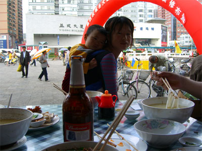
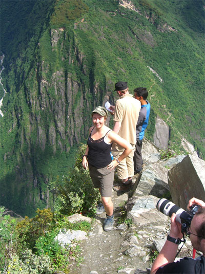
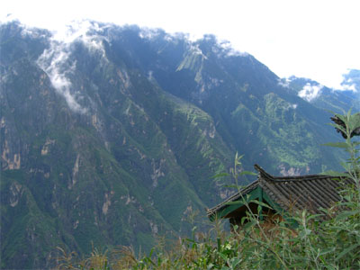
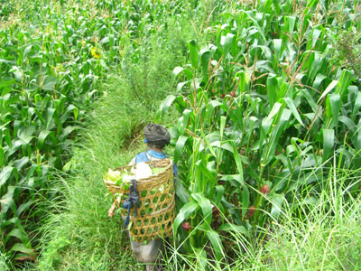
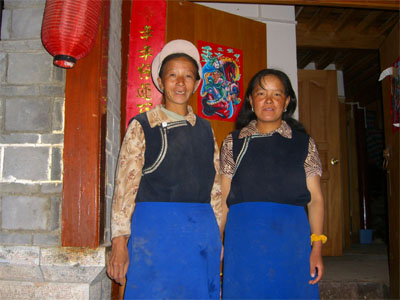
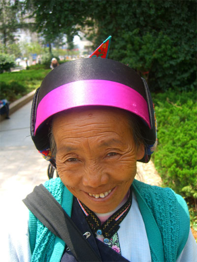

Title: Minnihlutahópar í Suður-Kína
Slug: minnihlutahopar-i-sudur-kina
Date: 2006-02-23 14:16:00
UID: 49
Lang: is
Author: Ingibjörg Björgvinsdóttir
Author URL: 
Category: Ferðamálafræði, Neyslusamfélagið
Tags: 

Ég byrjaði í júlí 2005 að undirbúa ferð mína til Yunnan héraðs í Kína með það að markmiði að afla heimilda fyrir B.Sc verkefni í ferðamálafræði. Verkefninu var ætlað að fjalla um minni&shy;hluta&shy;hópa í suður-Kína, nánar tiltekið í Yunnan fylki og áhrif ferðamannaiðnar á líf þessara hópa. Ég hafði mjög óljósa hugmynd um það hvers ég yrði vísari enda hafði ég við undirbúning ferðarinnar ekki haft mikið upp úr heimildaleit hvað varðar menningu minni&shy;hluta&shy;hópa í Kína. Heimilda&shy;öflunin átti enda mest megnis að fara fram með viðtölum í Yunnan.  

Um Yunnan fylkið er það helst að segja að það er svæði í Suður Kína sem er þekkt fyrir ríka menningu minna&shy;hluta&shy;hópa.  Af þeim 51 minni&shy;hluta&shy;hópum sem hafa þar aðsetur telja 25 þeirra yfir hálfri miljón einstaklinga.  Fimmtán þessara hópa eiga uppruna sinn að rekja tilYunnan.  Þessir minni&shy;hluta&shy;hópar kalla sig Bai-, Hani-, Dai-, Lisu-, Lahu-, Wa-, Naxi-, Jing po-, Bulang-, Pumi Achang-, Nu, Jinuo-, Deang- og Dulongfólkið.

Það var svo í september 2005 sem ævintýrið varð að veruleika. Ferðin hófst í  Kunming, höfuðborg Yunnan og skipti ég við ástralska fyrirtækið Geckos tours. Frá Kunming lá leiðin til afskekktari hluta Yunnan fylkis þar sem ég stefndi að því að komast í meiri nálægð við meðlimi ýmissa minni&shy;hluta&shy;hópa.   Markmiðið var að taka viðtöl um þær breytingar sem eru að eiga sér stað á lífi þessara einstaklinga í menningar&shy;legum og efnahagslegum skilningi.  

Yunnan fylkið er það fylki í Kína þar sem minni&shy;hluta&shy;hópar eru hvað mest áberandi en  33% af íbúafjölda svæðisins eða u.þ.b 26 miljónir einstaklingar tilheyra minni&shy;hluta&shy;hópum. Yunnan svæðið hefur mikið aðdráttarafl, en náttúra þess er óvenju falleg og hefur að geyma mikla  líffræðilega og landfræðilega fjölbreytni. Um helming af tegundaflóru Kína er hér að finna.  Höfuðborg Yunnan, Kunming hefur viðurnefnið vorborgin vegna hagsældra veðráttu allt árið. Í huga margra innfæddra Kínverja er Yunnan nær heilagur staður og nýtur gífurlegra vinsælda sem meðal innlendra ferðamanna. Líklega er bara tímaspurnsmál hvenar Yunnan verður hluti af hinum hefðbundnu stoppistöðum erlendra ferðamanna.  Það er þó einungis á síðustu árum sem Yunnan  hefur fengið þær samgöngubætur sem voru nauðsynlegar fyrir frekari þróun ferðaþjónustu á svæðinu.  Samgöngu&shy;bæturnar hafa líka greitt fyrir viðskiptum og  frekari efnahagsþróun á svæðinu sem er þó enn á kínverskan mælikvarða vanþróað.    

Leiðsögu&shy;maðurinn minn og túlkur í verkefninu var ung kínversk kona, Jenny að nafni.  Jenny samþykkti gegn vægri greiðslu að gerast túlkurinn minn og aðstoða mig við töku viðtalanna og með hennar hjálp tók ég 7 viðtöl við meðlimi 4 minni&shy;hluta&shy;hópa víðsvegar um Yunnan. Það var mér mikill gleðigjafi hve Jenny hafði gaman af að ræða við fátæka ferða&shy;þjónustu&shy;bændur og innfædda í Yunnan.  Jenny er borgarbarn frá Guayan sem er þéttbýlt svæði á  austurströnd Kína.  Áhugi Jenny á viðfangs&shy;efninu var mér auðskilinn þegar ég komst að því að hún hafði alist upp við allt annan raunveruleika en þeir ferða&shy;þjónustu&shy;bændur og meðlimir minni&shy;hluta&shy;hópa sem við ræddum við.  

Verkefnið gaf mér einstakt tækifæri að skilja  þær öru þjóð&shy;félags&shy;breytingar sem hafa átt sér stað í Kína í kjölfar aukinnar iðn- og markaðs&shy;væðingar.  Þjóð&shy;félags&shy;breytingar síðustu ára hafa skapað himin og haf milli þétt- og dreifbýlis í Kína og milli ríkra og fátækra.  Hafa ber í huga að Kína er nú land þar sem tekju&shy;skiptingin er með því mesta í heimi og sú staðreynd hefur skapað mikla sundrungu í landinu.  Það má með sanni segja að þorri landsmanna hafi hagnast af efnahags&shy;umbótum síðustu ára en þó svo sannarlega mismikið.  Fólks&shy;flutningar úr dreifbýli í þéttbýli á síðustu árum eru án efa þeir umfangsmestu í sögunni og þeim er langt frá því að vera lokið. Markvisst hefur þó verið reynt að sporna við fólks&shy;flutningu þar sem þeir hafa haft gífurleg áhrif á menningu Kínverja og efnahags&shy;landslag.  

Þeir einstaklingar minni&shy;hluta&shy;hópa sem ég talaði við  voru sammála um að ferðaþjónusta væri af því góða fyrir þá sjálfa og landið í heild.  Flestir viðmælanda minna voru ekki meðvitaðir um að menning þeirra gæti verið verðmæt sem söluvara og að hana bæri að vernda gegn ágangi.   Ég þori næstum því að fullyrða að þeir sem ég talaði við voru sammála um að þær efnahags&shy;umbætur sem voru að eiga sér stað í landinu væru til góða og ef það þýddi að einhver menningar&shy;einkenni minni&shy;hluta&shy;hópa myndu glatast væri það bara eðlileg þróun.  Sú fórn væri í raun fagnaðarefni ef henni fylgdi aukin velmegun.  Þessi niðurstaða fékk mig til að spyrja mig hvort það megi vera að menning verði þá fyrst að verðmæti í huga fólks þegar það er búin að tryggja  með öruggum hætti helstu lífs&shy;nauð&shy;synjar og sómasamlegt líf? Mögulega, eins og Maslow fjallaði um í  kenningum sínum, er nauðsynlegt að  tryggja líkamlegar þarfir og  þörf manneskjunnar fyrir öryggi áður en aðrir þættir tilverunnar geti öðlast þýðingu.  Raunveru&shy;leikinn virðist að minnsta kosti vera sá að margir meðlimir minni&shy;hluta&shy;hópa hafi lítinn áhuga á að vernda sína menningu og sérkenni hennar

Ég vona innilega að hin einstaka menning minni&shy;hluta&shy;hópana glatist ekki.  Það væri synd að sjá menningarleg sérkenni þeirra lúta í lægra haldi fyrir nútíma&shy;væðingunni. Það sem er að glatast í þessum þjóð&shy;félags&shy;breytingum er tungumál minni&shy;hluta&shy;hópanna, siðir þeirra, sögur og söngvar.  Nærri því allir eru sem eru með einhver fjárráð geta komið sér upp sjónvarpi og gera það. Fólks&shy;flutningarnir valda því að einstaklingar innan minni&shy;hluta&shy;hópanna missa tengslin við hópinn og þar með tengslin við sína sértæku menningu. Er það virkilega þess virði að líkjast okkur kaupóðu vestur&shy;landa&shy;búunum sem mest?

Hverjum hefði dottið í hug að þjóð sem hefur svo ríka menningar&shy;arfleið þyrfti uppfræðslu  hvað varðar varðveislu á eigin menningar&shy;háttum samtíðar og þá sérstaklega þegar kemur að varðveislu menningu minni&shy;hluta&shy;hópa.   Markaðsöflin hafa vissulega ýtt kínverjum inn í vestrænari lífstíl en áður þekktist en einnig eru áhrif ríki&shy;stjórnarinnar á þetta ferli mjög áberandi.  Það er án efa hluti af stjórnunar&shy;stíl kínversku kommúnista&shy;stjórninna að reyna að þjappa þjóðinni saman með því að minka menningarleg sérkenni einstakra hópa.

----

<small class="blurb">Ég vil þakka leiðbeinanda mínum Magnfríði Júlíusdóttir við undir&shy;búnings&shy;vinnu og einnig vil ég þakka þeim fjölmörgu einstaklingum sem gáfu af tíma sínum til að gera þetta verkefni að veruleika.  She she (takk fyrir)!</small>
