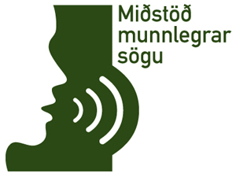

Title: Munnleg saga
Slug: munnleg-saga
Date: 2007-03-13 13:56:00
UID: 141
Lang: is
Author: Unnur María Bergsveinsdóttir
Author URL: http://unnur.klaki.net
Category: Sagnfræði, Munnleg saga
Tags: 

[Miðstöð munnlegrar sögu](http://munnlegsaga.is) var formlega stofnuð 26. janúar síðastliðinn. Hér á Íslandi er nokkur hefð fyrir því að rækt sé lögð við söfnun og varðveislu munnlegrar geymdar og fer Árnastofnun þar fremst í flokki að öðrum aðilum ólöstuðum.  Munnleg saga og munnleg geymd eru hugtök sem oft er ruglað saman. Sumir vilja jafnvel meina að ekki séu skýr mörk þar á milli. Munnlegri sögu, í hinum sagnfræðilega skilningi, hefur hinsvegar hingað til ekki verið sinnt á skipulagðan hátt. Miðstöð munnlegrar sögu er stofnuð með það að markmiði að auka veg hinnar sagnfræðilegu áherslu. En hvað er eiginlega munnleg saga?

### Hvað er munnleg saga?

Munnleg saga er ein af mörgum sagnfræðilegum aðferðum og felst í því að afla sögulegrar þekkingar með viðtölum við fólk sem hefur tekið þátt í eða þekkir til þeirra atburða sem verið er að rannsaka. Það er sérstaklega á síðari árum að munnleg saga hefur  verið viðurkennd sem fullgild aðferð innan sagnfræði. Aðferðin þykir enda enn að einhverju leyti nýstárleg og hún er krefjandi. Það er tímafrekt að vinna með munnlegar heimildir þó svo að stafræna byltingin hafi að mörgu leyti einfaldað meðferð hljóð- og myndupptakna og skapað nýja möguleika hvað úrvinnslu þeirra varðar. Að vinna með munnlegar heimildir er hinsvegar líka afar gefandi. Ég er um þessar mundir að leggja lokahönd á eigin rannsókn á íslensku pönki. Þar byggi ég aðallega á munnlegum heimildum, á viðtölum, sem ég tók sjálf á tveggja ára tímabili. Slíkar heimildir eru afar ólíkar kirkjubókum, en á þesskonar heimildum grundvallaði ég einmitt b.a. ritgerð mína. Fyrir það fyrsta rekst maður aldrei á kirkjubækur á Grandrokk. Kirkjubækur spyrja mann heldur ekki stoltar hvort sonurinn sem stendur á sviðinu og spilar á gítar sé ekki hæfileikaríkur. Og kirkjubækur bjóða manni aldrei upp á drykk á barnum. 

### Sérstaða munnlegra heimilda

Það er einmitt þetta samspil rannsakanda og heimilda sem gerir munnlegar heimildir svo heillandi. Munnlegar heimildir verða til með ýmsum hætti, en algengast er þó að þær verði til í tengslum við ákveðið markmið, t.d. þegar fræðimaður eða blaðamaður tekur viðtal við einstakling um lífshlaup hans eða ákveðna atburði sem viðkomandi hefur tekið þátt í eða orðið vitni að. Rannsakandinn tekur þannig beinlínis þátt í að skapa heimildirnar. Að skapa er þó ekki hið sama og að stjórna, líkt og gildir um aðrar heimildir ganga munnlegar heimildir oft í endurnýjun lífdaga og öðlast nýja merkingu í meðförum þeirra sem á eftir koma. 

Mikið af munnlegum heimildum eru þó einnig sjálfsprottnar og verða til þegar fólk hljóðritar sjálft frásagnir sínar eða nákominna ættingja í því skyni að varðveita heimildir um líf og starf viðkomandi fyrir afkomendurna. Það er enda ekkert nýtt að einstaklingum leiki forvitni á að heyra um reynslu annarra og það er heldur ekkert nýtt að einstaklinga langi sjálfa að skrásetja bæði reynslu sína og sjálfa sig. 

Þegar segulböndin urðu að almenningseign í upphafi sjöunda áratugarins voru þau einmitt óspart notuð til að taka upp raddir og frásagnir einstaklinga, söng og hjal barna. Fyrir nokkrum árum sagði kunningi minn mér einmitt frá því að hann ætti stóra gamaldags segulbandsspólu frá þessum tíma sem geymdi samtal föður hans, sem þá var lítill drengur, við föður sinn. Á spólunni ræða þeir feðgar um daginn og veginn, pabbinn syngur fyrir drenginn og drengurinn syngur fyrir pabbann. Í huga þessa vinar míns var þessi spóla sem á tala saman faðir hans og afi ein af hans kærustu eignum. 
Faðir upptökutækninnar, Edison, sá reyndar akkúrat þessi not fyrir. Hann talaði reyndar ekki um munnlegar heimildir í þeim skilningi sem við leggjum í hugtakið í dag en talaði um að með hinni nýju tækni gætu fjölskyldur komið sér upp safni radda, varðveitt rödd afa og ömmu, langafa og langömmu í þágu komandi kynslóða. Reyndar hafa mörg söfn erlendis það sérstaklega á stefnuskrá sinni að safna sýnishornum af röddum einstaklinga sem teljast á einn eða annan hátt hluti af sögu viðkomandi þjóðar. 

Til munnlegra heimilda geta einnig talist upptökur af atburðum. Meðal efnis af því tagi sem safni miðstöðvarinnar hefur borist má t.d. nefna upptökur af miðilsfundum. Það er þó ekki enn sem komið er á stefnuskrá Miðstöðvarinnar að safna slíkum upptökum sérstaklega, heldur munum við sem að söfnunarstarfinu vinnum einbeita okkur að persónulegum frásögnum. 

Munnlegar heimildir eru ríkar af ýmsum atriðum sem minna fer fyrir í öðrum tegundum heimilda s.s. viðhorfum og lífsháttum fólks, upplifun einstaklinga og tilfinningum, og því tekst oft með þessari aðferð að gefa sögunni meira líf og lit en með notkun annarra sögulegra heimilda. Þá hafa munnlegar heimildir reynst ómetanlegar þegar kemur að því að segja sögu ýmissa hópa sem ekki hafa skilið eftir sig mikið af rituðum heimildum eða haft bein áhrif á þær opinberu heimildir sem mest eru notaðar í sagnfræði. Munnlegar heimildir eru þannig sérlega gagnlegar, og sköpun þeirra oft beinlínis nauðsyn þegar fjallað er um t.d. menningarfyrirbæri á borð við pönk, verkalýðssögu, iðnað á jaðri hins ólöglega, innflytjendur eða börn.

### Munnlegar heimildir á íslenskum söfnum

Þó svo umræða um munnlegar heimildir hafi hérlendis lengst af ekki farið hátt og ekki verið til neitt tæmandi yfirlit yfir þær munnlegu heimildir sem íslensku söfn varðveita er engu að síður til töluvert magn þessara heimilda, bæði á söfnum og hjá einstaklingum. Þegar stofnun miðstöðvarinnar var undirbúin var leitað til safnafólks eftir upplýsingar um það hvort hjá þeim leyndust frásagnir á hljóð- eða myndupptökum. Oft var fátt um svör og er ljóst að þessi tegund heimilda er sú sem hvað verst er skráð á íslenskum söfnum, þó með nokkrun undantekningum. Í samtölum við starfsfólk þessara stofnana kom hinsvegar ýmislegt athyglisvert í ljós. Upptökur var að finna í safnkosti langflestra safna og varlega ágiskað er ljóst að hér er um nokkur þúsund klukkustundir að ræða og er þá ótalið það efni sem liggur hjá einstaklingum. Margar þessara upptakna eru afrakstur einstaklingsframtaka og sprottnar af vilja fólks og löngun til að varðveita frásagnir eldra fólks af horfnum tímum, breyttum búháttum eða atvinnuháttum, af því hvernig lítil byggðarlög úti á landi byggðust upp eða lögðust af og svo einfaldlega frásagnir eldra fólks af því hvernig það hefur upplifað breytingar á íslenskum lífsmáta. Sumsstaðar eru til hljóðupptökur af viðburðum í bæjarlífinu, á Akranesi er t.d. til upptaka af vígslu barnskólans um miðja síðustu öld. 

Mest reyndist vera um hefðbundnar kasettur en einnig er á íslenskum söfnum til þó nokkuð af gamaldags hljóðböndum af ýmsu tagi, stálþráðum og jafnvel vaxhólkum. Hvað síðastnefndu hljóðsniðin varðar er það í sjálfu sér ekki undarlegt að safnafólk viti ekki hvað er á svo arkaískum formum, tæki til afspilunar þeirra eru fyrir löngu orðin sjaldgæf ef ekki ófáanleg. Miðstöð munnlegrar sögu sér því fram á heilmikla samvinnu við söfnin í landinu hvað varðar yfirfærslu þessara eldri hljóðsniða yfir á stafrænt form. 

### Munnlegar heimildir eru frumheimildir

Lengst af nálguðust fræðimenn munnlegar heimildir á þann hátt að þegar viðtöl höfðu verið tekin voru þau skrifuð upp, unnið úr þeim og niðurstöðurnar kynntar. Sjálft viðtalið var hinsvegar ekki talið athyglisvert þegar þessum lokapunkti var náð. Mörg athyglisverð viðtöl hafa þannig glatast, við höfum ekki lengur möguleikann á því að heyra hvernig tiltekin persóna sagði frá tilteknum atburðum, við höfum aðeins úrvinnslu og niðurstöður. Margir kynnu jafnvel að spyrja hvaða þörf sé á því að varðveita hversdagslegar frásagnir hversdagslegs fólks þegar skráðar hafa verið niður þær staðreyndir og sú tölfræði sem í þeim kemur fram. Í dag er það hinsvegar almennt viðurkennt að sú tjáning sem í frásögn felst inniheldur svo miklu meiri en hægt sé að koma henni að öllu leyti til skila í rituðu máli. 

Það er heldur ekki eðli heimilda, á hvaða formi sem þær eru, að vera einnota. Með stofnun Miðstöðvarinnar er markmiðið það að veita munnlegum heimildum tækifæri til að öðlast nýtt líf, í stað þess að þær dagi uppi á rykföllnum kasettum, grafnar í skókössum og plastpokum. Augljóst er að það er að því mikill fengur fyrir alla sem fást við rannsóknir á íslenskri sögu og samfélagi að þessum röddum verði safnað saman. Það er von okkar sem höfum starfað að undirbúningi Miðstöðvarinnar að hún muni einn daginn hafa að geyma margradda kór íslenskra radda. 

