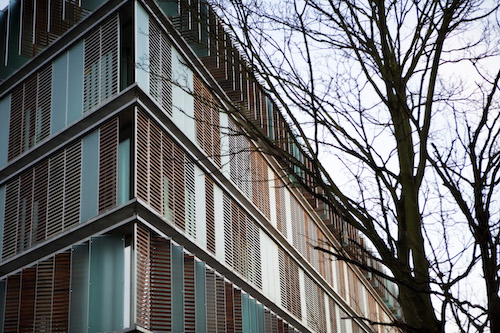

Title: Nýtt nám í Copenhagen Business School
Slug: nytt-nam-i-copenhagen-business-school
Date: 2008-09-11 14:30:18
UID: 580
Lang: is
Author: Eyrún Jónsdóttir
Author URL: 
Category: Póstur að utan, Listir, Stjórnun
Tags: Kaupmannahöfn, Copenhagen Business School, skapandi viðskiptaferlar, mastersnám, Stjórnun, LÍN, Danmörk

Fyrir ári síðan hóf ég mastersnám í stjórnun í skapandi viðskiptaferlum (e. Management of Creative Business Processes). Ég hef mjög oft verið spurð hvað í ósköpunum það er nú og mér hefur fundist best að lýsa því sem master í stjórnun innan skapandi atvinnugeira (listir, menning og afþreying) eins og t.d. fyrirtæki sem gefa út eða framleiða tónlist, kvikmyndir, bækur, tímarit, tölvuleiki, fatnað, húsgögn, leikföng o.s.frv. Enda er markmið námsins að gera nemendur hæfa til að taka stjórnunarstöður í skapandi fyrirtækjum og er mikil áhersla lögð á að finna rétta jafnvægið á milli þess að hlúa að sköpunargáfu listamannsins og að reka arðbært fyrirtæki. Á fyrra árinu var auk annars áhersla lögð á höfundarétt og nýsköpun. Á seinna árinu velja nemendur svo sjálfir sín fög (innan ákveðins ramma) á haustönn og svo er mastersritgerðin á vorönn. Mikil vöntun er á viðskiptafræðimenntuðum stjórnendum innan skapandi fyrirtækja sem er ört vaxandi atvinnugrein í Danmörku sem og víðar. Þetta nám er ekki í boði á Íslandi og því skellti ég mér til Kaupmannahafnar í Copenhagen Business School (CBS). Enda var ekki seinna vænna að drífa sig í framhald, ég fann það fljótt að námstæknin og lestrarhraðinn var verulega farin að ryðga.

CBS er tæplega 100 ára gamall viðskiptaháskóli með um 16 þúsund nemendur og þar af þó nokkuð marga Íslendinga. Þrátt fyrir að skólinn hafi aðsetur í fjórum mismunandi byggingum er ótrulegt hvað það er góð stemmning og mikil sameining meðal nemenda. Hver veit nema stúdentabarinn hjálpi þar til?

Mikið er af hópavinnu, stundum aðeins of mikið af hinu góða að mínu mati en að sjálfsögðu hefur maður bara gott af að venjast því að vinna með ólíku fólki með ólíkar skoðanir. Danir eru mjög svo hrifnir af munnlegum prófum, þar komum við Íslendingarnar yfirleitt alveg af fjöllum enda er þetta próftækni sem danskir námsmenn hafa æft sig í síðan í framhaldsskóla. En það lærist (eða venst) eins og allt annað.

Námið er nýtt, það eru aðeins tvö ár síðan fyrsti hópurinn hóf nám. Það hefur sína kosti að vera með þeim fyrstu sem stunda námið, það er t.d. mikil áhugi meðal fyrirtækja í þessum geira varðandi námið og mikið sótt í það að fá nemendur til að vinna verkefni fyrir sig og sýna þau mikinn áhuga á að koma í tíma og fjalla um ýmis málefni tengd námsefninu. Hins vegar eru ætíð einhverjir byrjunarerfiðleikar, kennarar sem standa ekki undir væntingum og námið kannski ekki alveg upp sett eins og best væri á kostið. En það lagast vonandi með tímanum.

Allt námið fer fram á ensku og þar sem ég er umvafin Íslendingum á stúdentagarðinum sem ég bý á voru ekki mörg tækifæri til að byrja með til þess að rifja upp gömlu góðu menntaskóladönskuna. CBS býður öllum erlendum nemendum upp á dönskukennslu þeim að kostnaðarlausu. Ég skellti mér í einn kvöldkúrs þar ásamt nokkrum öðrum Íslendingum og Svíum sem hjálpaði aðeins til en það var ekki fyrr en ég byrjaði að vinna í sumar sem danskan fór virkilega að rúlla. Fyrstu 2 vikurnar skyldi ég nánast ekki neitt og enginn skyldi mig en þetta er ótrulega fljótt að koma ef maður notar tungumálið á hverjum degi í smá tíma.

Lífið gengur fínt fyrir sig hér í Danmörku, enda Kaupmannahöfn yndislegur staður til að búa á, sérstaklega með börn. Það er þvílíkur lúxus að geta komist nánast allra sinna ferða á reiðhjóli, lest og metró og vera laus við allt það vesen og þann kostnað sem fylgir því að vera á einkabíl. Aldrei mál að finna stæði og þúsundkallarnir fuðra ekki upp í bensínkostnað. Svo er maður farinn að herma eftir Dönunum og elta uppi bestu tilboðin (sérstaklega bleyjutilboð) í matvörubúðunum. Það er reyndar nauðsynlegt að taka stóra þolinmæðispillu áður en maður fer út úr húsi, því það gengur allt mun hægar fyrir sig hér heldur en maður er vanur heima á Íslandi.

Töluverðar breytingar voru gerðar á úthlutunarreglum Lánasjóðs íslenskra námsmanna (LÍN) í vor. Lánakerfið er mun sveigjanlegra á þann hátt að núna er lánað út á staðnar einingar í staðinn fyrir þá mánuði sem námsmaður er í skóla. Fyrir námsmenn sem stunda nám á Íslandi hefur þetta ekki miki áhrif en fyrir námsmenn í Danmörku þar sem að skólaárið er nánast undartekningalaust 10 mánuðir en ekki 9 mánuðir eins og á Íslandi hafa þessar breytingar í för með sér um 10% kjaraskerðingu yfir skólaárið. Nú er bara að bíða og sjá og vona að þessi villa verði lagfærð.

Skerðingahlutfallið er áfram 10% eins og í fyrra en nú er sú breyting á að það miðast við þreyttar einingar sem þýðir að ef námsmaður er í hálfu námi verður hann fyrir 5% skerðingu á útreiknuðu láni vegna tekna. Þrátt fyrir að skerðingahlutfallið sé í sögulegu lágmarki vona ég að það standi til að afnema það fyrir fullt og allt sem allra fyrst, því það getur reynst námsmönnum fjárhagslega erfitt að hefja nám eftir hlé auk þess sem það á ekki að refsa fólki fyrir að vilja afla sér aukatekna með því að vinna með námi. Þrátt fyrir að pælingin sé að ungt fólk eigi að spara áður en það fer í nám þá er það nú hægara sagt en gert í því ástandi sem hefur ríkt á Íslandi síðastliðin ár, verðbólga og stýrivextir upp úr öllu veldi. Sem betur fer er mjög gott félagslegt kerfi í Danmörku sem styður vel við bakið á tekjulágum einstaklingum, eins og námsmenn eru oftar en ekki.

Ég mæli hiklaust með því við alla sem eru að hugsa sér að bregða undir sig betri fætinum og skella sér í nám erlendis að láta verða af því. Það er alltaf hollt að breyta aðeins til og sjá heimalandið með augum „útlendings“ í smá stund auk þess sem það er ómetanleg reynsla að fara erlendis í nám.
