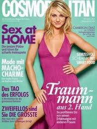

Title: Í blöðunum býr draumurinn
Slug: oennur-omerkileg-hugsun
Date: 2005-10-28 12:46:00
UID: 11
Lang: is
Author: Ingveldur Geirsdóttir
Author URL: 
Category: Kynjafræði, Fjölmiðlar
Tags: Glanstímarit, konur

Nokkru sinnum í mánuði á ég mínar einkastundir á kaffihúsinu Súfistanum fyrir ofan bókabúð Máls og menningar á Laugarvegi. Kaffihúsagestir geta fengið lánuð blöð og bækur úr búðinni til að lesa með kaffibollanum og þar les ég minn skammt af erlendum tísku- og slúðurblöð eða svokölluðum glanstímaritum.

Ekki veit ég hvað það er sem fær mig til að lesa heilan bunka af þeim í hverjum mánuði. Ekki er innihaldið merkilegt og oft það sama í blaði eftir blað. En eitthvað er það við lestur þessara blaða sem gerir það að verkum að ég laðast að þeim. Reyndar held ég að þetta sé svipað og með litríkt sælgæti í skál. Sælgætið er fallegt og girnileg og mann langar í það þó maður viti að bak við skærlita skelina leynist aðeins súkkulaðidrulla sem maður fær nóg af eftir nokkra mola.  Svipað er það með glanstímaritin, þau glansa svo fallega í hillunum, eru með fallegri manneskju utan á og grípandi fyrirsögnum. Í blöðunum er nákvæmlega það sem þarf til að hvíla hausinn, í þeim er fjallað um allt sem höfðar til kvenna og vonar þeirra um betra líf. Í blöðunum býr draumurinn.

Glanstímarit blanda saman samfélagsvandamálum, tísku, afþreyingu og dægurmála-umfjöllun. Þau fjalla um stjörnurnar, hvernig þær klæða sig og hvernig lesandinn getur klætt sig til að líkjast þeim, einnig sem þar eru tískuþættir, greinar um kynlíf og karlmenn og svo auðvitað a.m.k ein alvarleg grein sem tekur á vandamálum kvenna í samfélaginu. Ekki má gleyma þáttunum um förðun, megrun og hvernig þú átt að næla í drauma starfið. Toppurinn er samt stjörnuspá mánaðarins í lok blaðsins en í þeim er lesandinn látinn halda að draumarnir, sem hann átti í gegnum lestur blaðsins, munu rætast á næstunni. Samkvæmt þeim er yfirleitt karlmaður á leiðinni eða ástarsambandið verður betra, auk þess sem fjárhagurinn mun batna og markmiðum verður náð. Í lok blaðanna eru einnig auglýsingar sem upplýsa konur um hvernig þær geti komist nálægt draumunum á auðveldan hátt. Það eru auglýsingar um brjósta-stækkanir, megrunarlyf, andlitslyftingar og aðrar lýtaaðgerðir sem eiga að auðvelda þeim lífið. Þessar auglýsingar eru yfirleitt í hrópandi ósamræmi við það sem á undan er gengið í blaðinu því flestar greinarnar í því eru til þess að auka sjálfstraust kvenna og gera þeim grein fyrir að þær geti náð markmiðum sínum á eigin verðleikum. Auglýsingarnar draga sjálfstraustið niður og segja í raun og veru að það sé útlitið sem skiptir máli, ekki það sem konan sjálf hefur fram að færa.

Þrátt fyrir að ég geri mér fyllilega grein fyrir þessu innihaldsleysi glanstímaritanna þá slafra ég þeim samt í mig eins og súkkulaðimolum og enda á því að lesa stjörnuspána í lokin með von í hjarta. En lestur þessa blaða skilur lítið eftir sig, um leið og ég loka blaðinu er ég komin í raunveruleikann.  Þetta stutta stopp í fantasíuveröldinni er nauðsynlegt, það lætur mig gleyma og dreyma og ég mun alltaf hafa þörf fyrir mína einkastund með glanstímaritunum á Súfistanum.
