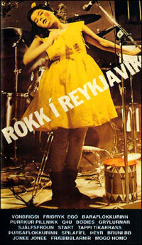

Title: Of fá til að hneykslast?
Slug: of-fa-til-ad-hneykslast
Date: 2006-05-11 13:19:00
UID: 71
Lang: is
Author: Unnur María Bergsveinsdóttir
Author URL: http://unnur.klaki.net
Category: Menningarfræði, Sagnfræði
Tags: 

1\. desember 1976 blótaði bresk hljómsveit all hressilega í viðtalsþætti á breskri sjónvarpsstöð. Daginn eftir var hún orðin illræmd um allt Bretland. Fjölmiðlar kepptust við að lýsa hneykslan sinni á uppátækinu og _The Daily Express_ lýsti viðbrögðum þjóðarinnar sem „Fury at filthy TV chat“[^1] . Íslenska ríkisútvarpið var með á nótunum og fjallaði ýtarlega um hin ógeðfelldu ungmenni[^2] .  Þetta atvik var upphafið að litríkum ferli _The Sex Pistols_ og framhaldið þekkja flestir, hljómsveitin varð holdgervingur alls þess sem góðborgarar óttuðust og óttast jafnvel enn.  

Á sama tíma og _The Sex Pistols_ blótuðu í beinni útsendingu var franski heimspekingurinn Bourdieu að velta fyrir sér vægi smekks. Niðurstaða hans var sú að smekkur sé ekki náttúrulegt fyrirbæri heldur félagslegt og það að hafa góðan smekk sé því lærð hegðun en ekki meðfædd. Í kenningum Bourdieu eru mörk hins góða smekks skilgreind út frá hagsmunum hópa sem afmarkast einna helst af stéttarstöðu en einnig af kyngervi. Smekkur er ein helsta aðferðin til að viðhalda félagslegri aðgreiningu þar sem þeir sem hafa hinn góða smekk á valdi sínu eiga auðveldara með að rata rétta leið innan þess skipulags sem byggir á tilteknum smekk. Sömuleiðis eru það auðvitað yfirleitt einnig þeir sem teljast valdamestir innan hvers samfélags sem hafa vald til að skilgreina eðli og útlínur hins góða smekks.

Eðli kerfisins þýðir þó auðvitað líka að á sama hátt og smekkurinn er ekki náttúrulegt fyrirbæri þá er viðhald hans ekki sjálfvirkt. Hinn góði smekkur er sífellt í krísu og tilvera þeirra smekklausu ögrar. Því þarf að standa vörð um mörk hans og er það gert með umræðum, sérstaklega í fjölmiðlum. Efni sem er álitið óæskilegt er oft úthrópað sem skaðlegt  og eru lagasetningar og þrýstingur af öðru tagi notaðar til þess að viðhalda fagurfræðilegum viðmiðum, oft undir því yfirskini  að vernda þurfi börn og unglinga gegn skaðlegum áhrifum afþreyingarefnis eða að standa verði vörð um menningararf[^3] . 

Með því að gefa skít í reglur um það hvað var leyfilegt að segja í sjónvarpi gerðu _The Sex Pistols_ þannig beina atlögu að borgaralegum gildum. Viðbrögð samfélagsins voru að úthrópa pönkið og þá sem aðhylltust það en félagsfræðingurinn Henry Jenkins hefur einmitt sýnt fram á hvernig endurteknar birtingar fjölmiðla á staðalímyndum af aðdáendum tiltekinna menningarfyrirbrigða þjóna þeim tilgangi að gera þá ótrúverðuga og lágmarka þannig menningarleg völd þeirra[^4] . Til þess að gera langa sögu stutta voru þetta einmitt örlög drengjanna í _The Sex Pistols_ og það var glettni örlaganna að John Lydon, eða Johnny Rotten eins og hann var kallaður í fjölmiðlum, hafði nýlega sungið inn á plötu að hann væri antíkristur[^5] . 

Menningarfræðingurinn Stuart Hall hefur fjallað um merkingarsköpun innan samfélaga og líkir henni við það hvernig landakort eru dregin upp. Hann bendir á að við séum of samofin merkingarsköpuninni til þess að greina eðli hennar: „ _We tend to live inside these maps as surely as we live in the "real" world: they "think" us as much as we "think" them, and this in  itself is quite "natural".[^6] “_ Öll mannleg samfélög draga upp slíkar myndir af sjálfum sér og þannig gerist það að tilteknir tilbúnir samskiptamátar, tiltekin tilbúin heimssýn verður í huga okkar náttúruleg. Hall bendir á að það sé þetta sem heimspekingurinn Alhusser hafi átt við þegar hann sagði hugmyndafræðina tímalausa. Í flóknum samfélögum eins og okkar er reyndin hinsvegar sú að aðgangur að kortlagningu merkingarinnar er afar ójafn og hagsmunir tiltekinna hópa hafa meira vægi en annarra. Bendir Hebdige sérstaklega á fjölmiðla sem helstu aðferð til þess að miðla hugmyndum og staðfesta slíkar kortlagningar[^7] . 

Félagsfræðingurinn Stanley Cohen þróaði hugtakið _Folk devil_ árið 1972. Það vísar til hópa, oftast ungmenna, sem fyrir tilstilli ímyndasköpunar fjölmiðla eru skilgreindir sem holdgerving ógnar við samfélagið. Stanley Cohen byggir kenningar sínar á rannsóknum á hópum breskra unglinga sem gengu undir nöfnunum _mods_ og _rockers_ og benti á það hvernig umfjöllun um meint andfélagslegt hugarfar þeirra og ógn við samfélagið hefði verið blásin upp úr öllu valdi, langt um fram það sem efni stóðu til. Þetta kallaði hann siðferðisuppþot og greindi nokkur stig þess ferlis. Forsenda þess að slík ímyndarsköpun gangi upp er sú að hin tilbúna staðalímynd sé skilgreind sem afbrigðilegt frávik frá ofureðlilegum bakgrunni[^8] . Skýr mynd sé dregin upp af hinum skaðlega hópi sem fráviki frá samfélaginu, skýr lína dregin milli „okkar“ og „þeirra“ og skorið sé á tengingar við djúpstæð samfélagsvandamál þannig skýringar byggðar á rökum missa vægi sitt[^9] . Vandamálið verður þannig ekki samfélagið sjálft heldur fyrst og fremst vanþakklát og spillt æska sem fær „kikk“ út úr því að haga sér illa. 

Það er áhugavert að setja þessar hugmyndir í samhengi við umfjöllun íslenskra fjölmiðla um tónlist. Á því tímabili er pönkið var að nema hér land hafði pönkáhugafólk lítinn aðgang að fjölmiðlum og takmarkað bolmagn til að krefjast sanngjarnrar umfjöllunar. Óháð fjölmiðlamenning kennd við _fanzines_,  eða fjölrituð aðdáendamálgögn, var enn ekki orðin til hér á landi. Þeir sem þá voru í aðstöðu til að draga upp mynd af menningarkimanum fyrir landsmenn[^10]  byggðu flestir aðgang sinn að kortlagningu meiningarinnar á því að hafa fjallað af kunnáttu um þær tegundir tónlistar sem nutu almennrar viðurkenningar bæði sem listform og afþreyingarefni og stutt viðhald þeirra viðmiða sem hún féll undir. Undir þau tónlistarlegu gildi sem þá voru viðtekin féll pönkið, sem snerist um höfnun tækni og færni[^11] , vitanlega ekki. Það var ekki fyrr en eftir 1981 sem nýliðun varð í hópi tónlistarblaðamanna, sem leiddi til þess að pönk- og nýbylgjuáhugafólk komst í aðstöðu til að skapa merkingu[^12] . 

Fram undir árið 1980 fylgdi umfjöllun íslenskra fjölmiðla um pönk erlendum línum og áherslan færðist af æsifréttum yfir á fjarlægari sýn þar sem pönkinu hafði verið úthlutað bás og var skilgreint sem lágmenningarleg unglingauppreisn.  Var umfjöllum um íslensku pönkfrumkvöðlana lituð þessum áherslum. Hér er ekki ráðrúm til að rekja dæmi en óumdeilanlegt er að íslenskir fjölmiðlar gerðu tilraun til að miðla erlendu siðferðisuppþoti áfram inn í íslenskt samfélag. Voru margar tilraunirnar ansi skrautlegar og er þær að finna jafnt í _Lesbók Morgunblaðsins_[^13]  og í hinu klámfengna tónlistartímariti _Halló_[^14] . Þrátt fyrir allt var það þó ekki fyrr en mun seinna, í  tengslum við frumsýningu kvikmyndarinnar _Rokk í Reykjavík_, sem umfjöllun um pönkið náði að skekja íslenskt samfélag. Það var þó ekki vegna þess að Íslendingar hafi verið umburðarlyndari gagnvart undarlega klæddu fólki en nágrannaþjóðirnar,  aðalástæða þess að innflutt siðferðisuppþot missti marks var einfaldlega smæð samfélagsins.

Í fyrrnefndri umfjöllun um „rokkara“ og „moddara“ bendir Stanley Cohen á muninn á því hvernig fjölmiðlar sem störfuðu á landsgrundvelli og smábæjarfjölmiðlar í strandbænum Clacton fjölluðu um Hvítasunnudagsslagsmál hinna tveggja hópa árið 1964. Á meðan að fjölmiðlar sem voru gefnir út á landsvísu slógu atburðum helgarinnar upp sem stríðsástandi og hikuðu ekki við að færa í stílinn forðuðust síðarnefndu blöðin staðhæfingar á borð við „Allir dansstaðirnir nálægt sjónum voru lagðir í rúst" af þeirri einföldu ástæðu að allir bæjarbúar vissu jú að það var bara einn dansstaður nálægt sjónum í Clacton[^15] .  Óhætt er að halda því fram að það sama gildi um íslenska fjölmiðlaumfjöllun um pönk: Ísland, og hvað þá Reykjavík, var of lítið samfélag til þess að blaðamenn gætu komist upp með að skrifa stílfærðar æsifréttir um hérlenda atburði. 

Að lokum er áhugavert að benda á að breski menningarfræðingurinn Sarah Thornton hefur fjallað um menningarkima og það sem hún nefnir subcultural capital eða menningarkimaauðmagn. Hún sækir í smiðju hugmynda Bourdieu um samspil smekks og valda og hefur gert þær athugasemdir við hugmyndir um siðferðisuppþot að gagnstætt greiningu Cohens þá sé neikvæð umfjöllun oft markmið þeirra sem taka þátt í unglingamenningarkimum af ýmsu tagi og siðferðisuppþot verði því að skoða sem hápunkt og uppfyllingu menningarlegra markmiða þeirra og í framhaldi af því einnig sem hluta af áróðri þess hluta menningariðnaðarins sem beinir sjónum sínum að tilteknum hópum[^16] . Það er við hæfi, í lok þessarar stuttu umfjöllunar, að spyrja hvort mögulegt sé að skortur á siðferðislegu uppþoti hafi framan af tafið vöxt íslenskrar pönkmenningar? Hvort pönkið hefði blómstrað hraðar ef fleiri gamlar konur hefðu fyrr orðið hræddar við pönkara? Til að svara því þyrfti frekari rannsóknir til en spurningin er vissulega verð umhugsunar. 

[^1]: Jon Savage,  _Englands Dreaming. Sex Pistols and Punk Rock_, London, 2005, bls. 263. Þess má geta að þessi fyrirsögn varð seinna heiti innblástur að heiti bæði vinsællar heimildarmyndar og bókar um The Sex Pistols: _The Filth and the Fury_. 

[^2]: Guðmundur Rúnar Guðmundsson, „Nýbylgjan. Kærkomin Endurnýjun" Helgarpósturinn, 11. janúar 1980.

[^3]: Henry Jenkins, _Textual Poachers. Television fans & participation culture. Studies in Culture and Communication_,  London, 1992, bls. 16- 17.  

[^4]: Ibid, bls 9- 24.

[^5]: Hér er vísað til smáskífunnar Anarchy in the Uk sem kom út 26. nóvember 1976.

[^6]: Dick Hebdige, "From Culture to Hegemony" Í _Media and Cultural Studies. Keyworks_, ritstj. Meenakshi Gigi Durham og Douglas M. Kellner, bls. 198- 207,  Oxford,  2001., bls. 203. 

[^7]: Ibid, bls. 203- 204. 

[^8]: Stanley Cohen, _Folk Devils and Moral Panics_,  London, 2002, bls. 45.

[^9]: Chas Chritcher, _Moral Panic and the Media_, Berkshire, 2006, bs. 46-49.

[^10]: Þ.e. tónlistar- og menningarblaðamenn. 

[^11]:  Bill Martin, _Avant Rock. Experimental music from the Beatles to Björk_, Illinois, 2002, bls. 89- 91.

[^12]:  Árni Matthíasson, viðtal tekið 5. júní 2005.

[^13]: Sjá t.d. Gísli Sigurðsson, „Ræflarokk og kattarklæði",  _Lesbók Morgunblaðsins_, 19. mars 1978.

[^14]:  Sjá t.d. „Pungrokkið, ræflarokkið" í 1. tbl. _Halló_ maí 1978. 

[^15]: Cohen, 2002, bls. 19. 

[^16]: Martina Böse, „"Race" and Class in the "Post-subcultural Economy",  Í _The Post-Subcultures Reader_, ritstj. David Muggleton og Weinzierl Rupert, Oxford, 2003, bls. 168- 69.

