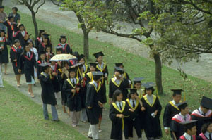

Title: Oft var þörf en nú er nauðsyn
Slug: oft-var-thoerf-en-nu-er-naudsyn
Date: 2005-12-01 14:39:00
UID: 24
Lang: is
Author: Jóhann Hjalti Þorsteinsson
Author URL: 
Category: Sagnfræði, Í umræðunni
Tags: nám, Háskóli Íslands, sagnfræðiskor

Sú staða sem kennsla í sagnfræði er komin í kallar á breytingar og það brýnar. Aðstæðurnar sem valda eru bæði neikvæðar og jákvæðar. Þær neikvæðu eru fjárhagur deildarinnar og sú samkeppni sem skorin og deildin eru í um fjármagn við aðrar deildir og í raun aðra skóla. Þær jákvæðu eru m.a. stórkostleg fjölgun nemenda í grunnnámi. Þessar aðstæður krefjast endurskipulags á námsframboði í skorinni þar sem boðið yrði meira úrval námskeiða og skilvirkari námsleiðir.

Til að vita hvað þarf að gera þá er nauðsynlegt að setja sér markmið. Ég tel að það sé mikilvægara fyrir okkur nemendur að fá góða þjálfun í vinnubrögðum og aðferðum sagnfræðinnar heldur en að okkur sé kynnt á formlegan máta hvert einasta tímabil mannkynssögunnar. Yfirlitsnámskeið í þeirri mynd sem við þekkjum í dag þjóna takmörkuðum tilgangi með þeim hraða sem er á yfirferðinni í þeim. Þau þurfa því endurskoðunnar við.

Þá eru fjárhagsaðstæður að takmarka úrræði skorarinnar í valnámskeiðum. Þetta kemur fram á tvennan hátt þar sem bæði vantar fé til að ráða stundarkennara að einhverju marki og yfirvinnubann á fastráðinna kennara bindur hendur þeirra um leið og hækkandi starfsaldur minnkar kennsluskyldu þeirra.

Að þessu öllu ofantöldu þá tel ég að það mjög jákvætt að skorarmenn hafi haft frumkvæði um að ráðast í þessa endurskipulagningu á námskránni. Ég sé fram á að breytingarnar verði bæði kennslunni og greininni til framdráttar þar sem skapist færi á stöðugara valáfangaframboði og að aðferðafræðin og hugtakanotkun fái enn hærri sess í kennslunni.

Það að festa yfirlitskúrsana (Heims- og Íslandssögu) á fyrstu tvö misserin hjálpar kennurum í starfi sínu þar sem það verður mun minna um það að fyrsta árs nemar sæki námskeið sem ætluð væru fyrir lengra komna þannig að kennarar þurfa þá ekki að taka tillit til þeirra í árangursmati. Þetta kemur nemendum að sjálfsögðu líka til góða þar sem þeir kæmu líka betur undirbúnir undan fyrsta vetrinum í náminu til þess að takast á við þau námskeið sem á eftir kæmu. Þá verður ekki lengur hætta á að nemendur ráfi af leið í vali á námskeiðum, ef svo mætti að orði komast. Það er að segja að með því að hafa fastsetja tímasetningar á kjarnanámskeiðum þá leikur engin vafi á hvaða námskeið þarf að skrá sig í hverju sinni.

Ég kom að því að safna hugmyndum nemenda um hvað betur mætti fara í skipulagi námsins og ég verð að segja að þær sem bárust fóru í megin atriðum saman við niðurstöður starfshópsins og er það vel.

Ég tel að með aukinni formun á BA-náminu þá verði minni hætta á því að gengið verði á hlut MA-stigsins í námsframboði en nú er, þar sem breytingarnar losa um að hluta þá krafta sem hafa farið í kjarnanámskeiðin og beina þeim í þau valnámskeið á BA-stigi. Þá er það mikilvægt að tækifærið verði notað til þess að endurhugsa kennsluaðferðirnar sjálfar og því er um að gera að hvetja kennara greinarinnar til þess að taka kennsluaðferðirnar og námsmatsleiðirnar til skoðunar þannig að þær hjálpi betur til við þann undirbúning sem námið á að vera að gerð BA-ritgerðarinnar því að í dag er ekki nóg að gert.
