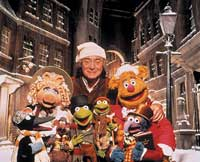

Title: …og einn talandi páfugl á grein!
Subtitle: Hugleiðingar um jólin og jólalögin
Slug: og-einn-talandi-pafugl-a-grein
Date: 2006-12-05 11:00:00
UID: 116
Lang: is
Author: Hilmar Magnússon
Author URL: 
Category: Samfélag, Tónlist
Tags: 

### Kertaljós og klæðin rauð

Eftir langa bið er loksins komið að uppáhaldstíma margra. Desember er aftur genginn í garð með fannhvíta jörð, vetrarsól og froststillur. Jólin eru á næsta leiti og allt verður svo ofsalega rómantískt og jóló í skammdeginu. Ja, allavega svona á milli þess sem veðrið er bara aldeilis ekkert jólavænt og býður upp á hífandi rok og rigningarbeljanda.

Fyrir jólabörnin er þetta tími íhugunar og rólegheita, piparkökuáts á aðventu, endalausra heimsókna, góðra veitinga og gjafa. Skemmtilegur tími með glögg, kakói og föndri í faðmi yndislegs fólks. Þá kvikna kertaljós í myrkrinu og lífið verður eilítið dulúðugt og dásamlegt.

### Jólaflóðbylgjan

Þetta er líka tími jólaauglýsinganna, sem kaupahéðnar fóru að láta hljóma strax í nóvember. Þegar þessi orð eru skrifuð er flóðbylgja jólanna orðin mjög vaxandi og hin alræmdu jólalög einnig farin að bylja á manni. Úr útvarpstækjum vinnustaða, bíla, heimila og verslana. Svona rétt til að fylla upp á milli auglýsinganna.

Fyrir suma eru jólalögin kærkomin, þó ekki væri nema fyrir þá sök að örlítið lengra verður á milli geðveikislegra auglýsinganna. Aðrir ærast og fá velgju í magann og suð fyrir eyrun. Reyna í örvæntingu sinni að skipta um stöð undir stýri, jafnvel slökkva. Áhætta í akstri margfaldast á þessum tíma árs.

### Eyrnakonfektið í desemberdrunganum

Þrátt fyrir að mörg jólalaganna séu vissulega alveg laus við frumlegheit, leiðinleg fram úr hófi og bara virkilega pirrandi, má alltaf sjá ljós í myrkrinu. Innan úr sorphaug endurunninna ítalskra slagara í flutningi Stebba Hilmars, Eyfa, Bó eða Helga Björns er nefnilega hægt að draga sífellt fleiri áheyrilega konfektmola. Þessir molar eru jafnt rammíslenskir sem alþjóðlegir.

Þannig kyrjum við til dæmis kapítalíska kóklagið í kór og látum í nokkrar mínútur á milli hluta liggja hvort við séum örgustu frjálshyggjumenn eða eldrauðir andstæðingar alþjóðavæðingar og markaðshyggju.

Í skammdegisrökkrinu fær maður líka að heyra angurværa rödd Röggu Gísla syngja um lítið fólk sem gengur illa að sofna á Þorláksmessukvöldi. Björk fer að syngja sögur af jólakettinum feita og ljóta og Raggi Bjarna fer í sparifötin og syngur um drungann í desember.

Í byrjun mánaðarins fara Þú og ég líka í Hátíðarskap og taka til við að ryksuga stofuna. Í Aðfangadagskvöldi hamrar Helga Möller svo á algildum sannleik: nefnilega þeim að jólin séu "...enn barnahátíðin mest". Langt fram á fullorðinsár heyrðist mér hún þó alltaf syngja um að jólin væru "eldvarnahátíðin mest" og fannst það bara mjög lógískt. En látum það liggja á milli hluta, enda efni í heila grein.

### Tólf daga jólaofstæki?

Einn þessara konfektmola er að hið sígilda lag um jóladagana. Undanfarin ár hefur lag þetta verið hvað þekktast hér á landi undir heitinu _Skrámur skrifar jólasveininum_. Þar fer Skrámur Laddason hamförum í bréfaskrifum til jólasveinsins og eins og við er að búast fer hann heldur frjálslega með texta Hinriks Bjarnasonar. Reyndar er meirihluti orðaflaumsins frá hans eigin brjósti.

Í laginu hefur Sveinki orðið jólaofstækinu að bráð og sendir Skrámi og mömmu hans sístækkandi hauga af jólagjöfum. Flestar eru þær í formi lifandi fiðurfénaðar. Undir lokin er Skrámur orðinn brotin og buguð brúða vegna framkomu feitabollunnar Sveinka og heitir því að finna hann í fjöru einn daginn. Og hver láir honum það svo sem? Sveinki er þarna nefnilega farinn að minna á hrottafenginn hryðjuverkamann og hegðun hans er alls ekki til eftirbreytni.

Skrámur er þó ekki sá eini sem gert hefur þessu einfalda lagi skil. Ýmsir barnakórar hafa til dæmis sungið lagið og yfirleitt er það maður að nafni Jónas sem færir okkur gjafirnar. 

Enskur texti lagsins hefur hljómað í ótrúlegustu útgáfum um alla heimsbyggðina síðan hann var fyrst gefinn út á prenti í ensku barnabókinni Mirth Without Mischief árið 1780. Þannig hafa til dæmis sjálfir Prúðuleikarar Jim Hensons tekið lagið upp á sína arma, með þau Kermit og Svínku í broddi fylkingar. Þar sem enska útgáfan hefur náð svo mikilli útbreiðslu í gegnum árin halda margir að hér sé á ferðinni enskt lag. Svo er þó ekki. Lagið er að öllum líkindum franskt og er til í þremur útgáfum þar í landi.

### Dulmálslykill eða dægrastytting?

Í gegnum tíðina hafa spunnist upp margar sögusagnir um texta lagsins og gjafir þær sem þar er minnst á. Sögur sem jafnvel hafa valdið deilum og illindum. Til dæmis er hreint ótrúlega lífsseig sú saga að texti lagsins geymi falinn boðskap.

Fjöldi gjafanna og gjafirnar sjálfar eiga samkvæmt þessari sögu að tákna ákveðna hluti eða atburði úr sögu kristninnar. Þannig eiga dúfurnar tvær að tákna nýja og gamla testamenti Biblíunnar. Dulmálið átti að hafa verið gert til þess að auðvelda ofsóttum kaþólikkum í Englandi miðalda að muna atriði úr trú sinni og iðka hana.

Saga þessi hefur þó oftsinnið verið kveðin í kútinn með býsna sterkum rökum. Fyrst ber að nefna að hlutirnir og dýrin sem nefnd eru í textanum lýsa einungis umbúðum en ekki innihaldi. Það hefði lítt gagnast kaþólikkum að vita af tilvist tveggja dúfna (testamentanna), en ekki hvaða boðskap þær kurruðu.

Að auki hefði verið meira en lítið undarlegt að láta þetta dulmál aðeins birtast í jólalagi, því jólalög eru í eðli sínu bundin við þessa einu hátíð. Áttu þá kaþólikkarnir aðeins að hafa aðgang að trú sinni í stuttan tíma einu sinni á ári?

Sterkast er þó vafalaust að benda á þá einföldu staðreynd að kaþólikkar voru ofsóttir af sínum eigin trúbræðrum. Kaþólikkar notast við alveg nákvæmlega sama helgiritið og sóknarbörn ensku biskupakirkjunnar gera, nefnilega Biblíuna. Hún var aldrei bönnuð og því engin þörf á að dulkóða hana yfir í sáraeinfalt jólalag.

Mun líklegra er að lagið hafi verið samið sem skemmtileikur og dægrastytting, dálítið í ætt við flöskustút. Lagið er jú byggt upp á sífellt fleiri endurtekningum og tilvalið að leika sér með þær. Sá sem flaskaði á endurtekningunum hefur þá þurft að leysa einhver einföld verkefni, svo sem að kyssa sessunaut sinn eða standa á öðrum fæti og snúa sér í hring. Lagið virðist því einfaldlega af veraldlegum toga, eins leiðinlegt og það nú kann að hljóma.

### Hlutirnir vinda upp á sig

Það sem mér finnst hinsvegar skemmtilegast við þetta lag er að það hefur svo margar vísanir í það hvernig hlutir, já og jafnvel hreinasta vitleysa, geta undið upp á sig.

Í fyrsta lagi má nefna jólagjafaruglið sem vindur sig upp í gegnum allan textann. Ég meina, “níu skip í naustum“?! Það liggur við að skemmtibátur Baugsfeðga blikni í samanburðinum. Eða hvað með “ellefu hallir álfa“ og “tíu hús á torgi“? Hér er verið að gefa heilu fasteignafélögin í jólagjöf. Magasin & Illum kannski innanborðs?

Í öðru lagi er það vitleysan með lagið sjálft, uppruna þess og sögurnar sem hafa spunnist upp í kringum það. Það sýnir okkur hvað einföldustu ósannindi geta orðið flókin og trúverðug. Allt sem þarf eru rangar upplýsingar, sem með tímanum verða sannar í hugum fólks og geta af sér enn fleiri skröksögur. Þar sem fáir eru til að benda á vitleysurnar verða þær sífellt styrkari í sessi og hlaða fleirum utan á sig.

Í tilfelli þessa litla jólalags er skrökið kannski ekki svo hættulegt, en mannkynssagan er full af svipuðum “jólalögum“. Þau eru bara af annarri stærðargráðu og afleiðingar þeirra eru mun hrikalegri.

### Jólaboltinn stækkar og stækkar

Í þriðja lagi minnir lagið á hvernig sjálf jólahátíðin hefur undið upp á sig. Snjóboltinn byrjar að rúlla sem frekar einföld heiðin sólstöðuhátíð og bætir svo utan á sig kristninni. Svo byrjar hann að rúlla fyrir alvöru og hleður utan á sig sífellt fleiri hefðum, merkingum og gildum.

Hraðinn eykst og fleiri sögur bætast við, sannar og lognar. Grýla og Leppalúði, jólatré, jólalög og jólagjafir. Áfram rúllar hann með auknum þunga. Jólaþetta og jólahitt. Jólastress og jólaveiki. Jólageðveiki.

Í áranna rás hafa sífellt fleiri orðið undir boltanum og hlotið sömu örlög og Skrámur forðum. Bitrir út í Sveinka, brotnir og bugaðir. Og það er líklega bara spurning um tíma þar til röðin kemur að okkur að verða undir honum. Það hlýtur því að vera aðkallandi að reyna að vinda aðeins ofan af þessum bolta og létta hann eitthvað.

Njótum jólanna og þess sem þau hafa upp á að bjóða. Njótum þess að slaka á í faðmi okkar nánustu. Látum okkur svo nægja að gefa hvert öðru smá virðingu, ást og umburðarlyndi og aðeins "einn talandi páfugl á grein".

----

#### Heimildir

* _Snopes.com - Rumor Has It_: Fróðleg vefsíða þar sem flett er ofan af hinum ýmsu sögusögnum og gróusögum. [Vefslóð: http://www.snopes.com/holidays/christmas/12days.asp]
* _Tónlist.is_: Alveg hreint frábær íslenskur vefur með upplýsingum um ótalmargt sem viðkemur tónlist. Vefurinn inniheldur einnig lagabanka með vel flestum íslenskum lögum. [Vefslóð: http://www.tonlist.is]

