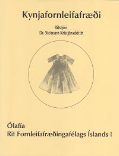

Title: Ólafía — nýtt rit Fornleifafræðingafélags Íslands
Slug: olafia-nytt-rit-fornleifafraedingafelags-islands
Date: 2006-03-14 08:08:00
UID: 54
Lang: is
Author: Þóra Pétursdóttir
Author URL: 
Category: Fornleifafræði, Kynjafræði
Tags: 

Nú á dögunum kom út fyrsta hefti nýrrar ritraðar Fornleifafræðingafélags Íslands (FFÍ). Ritröðin hefur hlotið nafnið _Ólafía_, í höfuðið á dr. Ólafíu Einarsdóttur, en ritið er einnig tileinkað henni.  Það er ekki af ástæðulausu sem við hæfi þótti — og tími til kominn — að heiðra Ólafíu Einarsdóttur með einhverjum hætti, en hún var fyrst Íslendinga til þess að ljúka háskólaprófi í fornleifafræði.  Það var árið 1950 og starfaði hún eftir það sem fornleifafræðingur hér á landi um nokkurt skeið.  Þrátt fyrir þetta hefur Ólafíu sjaldan verið minnst sem brautryðjanda í faginu.  Með útgáfu þessa nýja rits vilja aðstandendur þess hins vegar vekja athygli á henni sem slíkum.

Þema þessa fyrsta heftis _Ólafíu_ er ‘kynjafornleifafræði’ og er það nýlunda í íslenskri fornleifafræði.  Í heftinu er að finna sjö fræðilegar greinar eftir íslenska höfunda þar sem rýnt er í mismunandi viðfangsefni með gagnrýnum augum kynjafornleifafræðinnar. Einnig er að finna í safninu þýdda grein eftir einn fremsta fræðimann á sviði kynjafornleifafræði í dag.  Greinahöfundar koma úr ýmsum áttum, með mismunandi bakgrunn, auk þess sem mikil breidd er í umfjöllunarefnum þeirra.  Hvort tveggja er enda vel við hæfi í ljósi yfirskriftar ritsins.  Konur eru reyndar í meirihluta (aðeins tveir karlmenn eru meðal greinahöfunda) en það hefur viljað brenna við innan kynja(fornleifa)fræðinnar almennt.  Það er vonandi að með aukinni áherslu á þessi sjónahorn hér á landi megi með tíð og tíma virkja fleiri karlmenn í umræðunni um kyn og kyngervi.

Það er dr. Steinunn Kristjánsdóttir fornleifafræðingur sem ritstýrir þessu fyrsta hefti _Ólafíu_.  Steinunn skrifar jafnframt fræðilegan inngang þar sem hún fjallar stuttlega um kynjafornleifafræði og sjónarmið hennar í sögulegu ljósi.

Í fyrstu tveimur greinum heftisins gera þau Etel Colic og Guðmundur Stefán Sigurðarson kynjafornleifafræðina sjálfa að umfjöllunarefni.  Guðmundur Stefán fjallar um tilkomu og þróun greinarinnar og jafnframt um það mikilvægi og þann ávinning sem kynjafornleifafræðilegrar nálganir hafa í fornleifarannsóknum.  Í framhaldi af grein Guðmundar Stefáns fjallar Etel Colic nánar um hugmyndafræðilegan grunn kynjafornleifafræðinnar og ýmis kennileg vandamál henni viðkomandi.  Jafnframt leggur hún áherslu á mikilvægi einstaklingsins í rannsóknum undir formerkjum kynjafornleifafræði.

Dagný Arnarsdóttir og Guðlaug Vilbogadóttir, líkt og Hrafnkell Brimar Hallmundsson og Lísa Rut Björnsdóttir, taka í sínum greinum fyrir sköpun og viðhald hefðbundinnar karllægrar söguskoðunar og mótun kyngervislegra ímynda.  Guðlaug og Dagný fjalla um hvernig þessir þættir hafa kristallast í kennslubókum grunnskóla í Íslandssögu, annars vegar í bókum útgefnum á 6. og 7. áratug síðustu aldar og hins vegar í þeim bókum sem notaðar eru við kennslu í dag.  Grein Hrafnkels Brimars og Lísu Rutar er af sama meiði en þau falla um hvernig hefðbundnar vestrænar hugmyndir um hlutverkaskiptingu kynjanna hafa komið fram í túlkunum íslenskra kumla.  Með því að endurskoða gagnasafnið á gagnrýninn hátt sýna þau fram á hvernig slíkar ímyndir hafa áhrif á túlkun okkar á samfélagsgerð Víkingaaldar.

Í greinum Brynju Björnsdóttur og Ragnheiðar Glóar Gylfadóttur eru viðfangsefni sótt út fyrir landsteinana.  Brynja leitar til Rómaveldis og fjallar um siði við greftrun ungbarna og þá félagslegu stöðu sem lesa má úr þeim.  Ragnheiður Gló fjallar um tengsl klæðnaðar, kyns og kyngervis og snýr sér í því sambandi að fyrri rannsóknum og túlkunum á miklu safni klæðnaðar sem fannst við uppgröft kirkjugarðsins á Herjólfsnesi á Grænlandi árið 1921. Ragnheiður gagnrýnir þær aðferðir sem notaðar hafa verið við greiningu klæðasafnsins í karl- og kvenkyns, en þær byggja ekki á líffræðilegri kyngreiningu heldur tilfinningu og ímyndum fræðimannanna.  Ragnheiður bendir einnig á hvernig kynjafræðileg sjónarhorn hafa verið hunsuð í nýlegri endurskoðun gagnasafnsins.

Sandra Sif Einarsdóttir skrifar áhugaverða grein þar sem hún, eins og Ragnheiður Gló, gagnrýnir eldri rannsóknir og þær stöðluðu kynbundnu ímyndir sem einkennt hafa rannsóknir á horfnum samfélögum.  Sandra tekur fyrir ‘óhefðbundið’ kuml, sem fannst á Öndverðarnesi á sjöunda áratug síðustu aldar, og lýsir því hvernig fræðimenn hafa ítrekað reynt að finna því stað innan ramma staðlaðra kyngervisímynda.  Í tengslum við þetta fjallar Sandra einnig um merkingu haugfjár og bendir á mikilvægi þess að ekki sé litið framhjá einstaklingnum við rannsóknir, eða þeirri stöðu og áhrifum sem hann/hún kann að hafa haft.

Síðasta grein heftisins er eftir dr. Robertu Gilchrist, prófessor við Háskólann í Reading og einn fremsta fræðimann á sviði kynjafornleifafræði í dag.  Greinin, sem er þýdd af Steinunni Kristjánsdóttur, fjallar á gagnrýninn hátt um það hvernig staðlaðar vestrænar skilgreiningar á bæði tíma- og aldurshugtökunum hafa verið yfirfærðar á viðfangsefni fornleifafræðinnar.  

Kvenna- og kynjarannsóknir hafa á síðastliðnum áratugum rutt sér til rúms innan hug- og félagsvísinda um allan heim.  Fornleifafræðin er þar ekki undanskilin og hafa nýjar, gagnrýnar áherslur í rannsóknum bæði orðið til þess að auðga þekkingu á flóknum samfélögum fortíðar og ekki síður á stöðu rannsakandans í nútímanum.  Fornleifarannsóknir með kynjafræðilegum áherslum hafa þó ekki verið stundaðar hér á landi sem neinu nemur og stendur íslensk fornleifafræði langt að baki fornleifafræði í nágrannalöndunum hvað þetta varðar.  Það er fyrir löngu orðið tímabært að innleiða þessar áherslur í fornleifarannsóknum hérlendis, enda má með aðstoð þeirra varpa skýrara ljósi á þau samfélög sem byggt hafa landið frá upphafi — líkt og greinahöfundar í _Ólafíu_ hafa sýnt fram á.  Nú þegar fagið hefur loks hlotið akademíska viðurkenningu er þessi þörf orðin að nauðsyn, enda brýnt að upprennandi fornleifafræðingar kynnist kynjafornleifafræðilegum áherslum sem hluta af íslenskri rannsóknarhefð.

Með útgáfu þessa fyrsta heftis í nýrri ritröð Fornleifafræðingafélags Íslands er brotið blað í sögu íslenskrar fornleifafræði og það er afar ánægjulegt að það skuli enn og aftur vera _Ólafía_ sem ryður brautina. 

_Til hamingju með gott framtak og áhugavert rit!_

