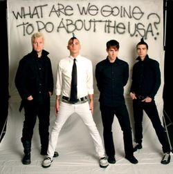
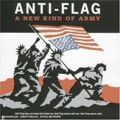
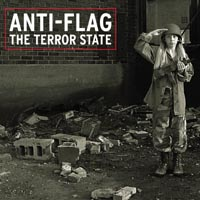
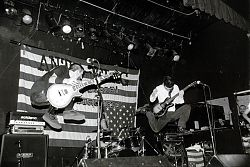

Title: Pönk og pólitík: Anti-Flag
Slug: poenk-og-politik-anti-flag
Date: 2006-08-11 15:54:00
UID: 88
Lang: is
Author: Karl Jóhann Jóhannsson
Author URL: 
Category: Tónlist, Samfélag
Tags: 

Hvað eiga pönk tónlist og stjórnmál sameiginlegt?  Kannski ekki mikið á yfirborðinu, en pönk tónlist hefur þó oft og lengi verið notuð til að koma skoðunum á framfæri, hvort sem þær eru um stjórnmál, samfélagskima eða bara kaffi.[^1]  

Frá árdögum þess hefur pönkið verið tengt við félagslegan óstöðugleika og er það oft skilgreint sem and-stofnanaleg (e. _anti-establishment_).  Hljómsveitir eins og [Sex Pistols](http://en.wikipedia.org/wiki/Sex_Pistols) sem óvart urðu að tákni fyrir allt sem var slæmt við England við lok 8. Áratugsins, [Dead Kennedys](http://en.wikipedia.org/wiki/Dead_Kennedys) sem börðust háðslega gegn vinstri og hægri öfgunum í bandarískum stjórnmálum og anarcho-pönk sveitin [CRASS](http://en.wikipedia.org/wiki/Crass) sem litu á pólitískt aðhald sem sitt helsta verk, hafa orðið vinsælar ekki eingöngu fyrir skemmtilega tónlist heldur þess boðskaps sem þær flytja.

Misgáfulegt pönkarar hafa viðrað skoðanir sínar um hin ýmis mál, með misjöfnum árangri.  Í dag eru skiptar skoðanir um það hvort pólitík eigi heima innan pönksenunnar og einnig eru pólitískar skoðanir innan pönksenunnar misjafnar.  Að nokkrum frávillingum undanskildum hefur pönkið þó helst verið tengt við vinstri sinnaðar stjórnmálaskoðanir og hefur pönkið að geyma allan vinstri skalann og jafnvel meirihlutann af öðrum.  Má þar nefna dæmi eins og sænsku kommúnistana í [Refused](http://en.wikipedia.org/wiki/Refused,) kaliforníubúa með  samfélagsvitund í hljómsveitum eins og [Bad Religion](http://en.wikipedia.org/wiki/Bad_Religion) og [NOFX](http://en.wikipedia.org/wiki/Nofx) og and-mæðraveldis slagarar hjá hinum íslensku [Fræbbblum](http://en.wikipedia.org/wiki/Fr%C3%A6bbblarnir).[^2]  Á hinum endanum eru svo ný-nasistasveitir og aðrar þess háttar, sem furðulega nokk eru sjaldnast, ef nokkurn tíma, vel spilandi.

Einn af helstu boðberum vinstri aflsins innan pönksins í dag er þó hljómsveitin Anti-Flag.

Hljómsveitin Anti-Flag var stofnuð 1993 í bænum Pittsburgh í norðausturhluta Bandaríkjanna.  Ungir gáfu þeir út sína fyrstu plötu, _Die for the Government_ árið 1996.  Á henni eru meðal annars gagnrýnd hernaðarstefna bandaríkjanna, fasismi og hræsnaraskapur innan pönksenunnar, stéttaskipting og lögregluofbeldi.  Í kjölfar útgáfunnar fylgdi tónleikaför um Norður-Ameríku, stofnun eigin útgáfufyrirtækis og útgáfa stuttskífunnar _Their system doesn't work for you_, þar sem fleiri illum öflum eins og klámvæðingu, byssueign almennings, fjölmiðlum, fordómum gagnvart samkynhneigðum og sjálfsmorðum eru gerð skil. Auk þess fordæma hljómsveitarmeðlimir unglingadrykkju, en Anti-Flag liðar eru að sjálfsögðu [“straight edge“](http://en.wikipedia.org/wiki/Straight_edge)", hvort sem í nafni eða ekki.[^3]

Það var þó árið 1999 sem fyrsta fullorðinsverk sveitarinnar kom út, hin fjölbreytta _A New Kind of Army_.  Áherslur Anti-flag skýrast þar enn frekar og texta- jafnt sem lagasmíði hljómsveitarinnar er orðin mun ákveðnari.  A New Kind of Army varð einnig til að vekja eftirtekt ýmissa aðila utan pönksenunnar, þá sérstaklega plötuútgefanda og stjórnmálaafla.  

Viðfangsefni plötunnar eru meira af því sama, tekið er fyrir hið vestræna neyslusamfélag, auk þess sem boðuð er félags- og menningarleg bylting.

Þetta byltingarkall er enn fremur ljóst á  _Underground Network_, sem kom út 2001, en hún er einnig fyrsta plata Anti-Flag sem inniheldur ritgerðir, ýmist eftir þá sjálfa eða aðra merka menn.  Þessar ritgerðir eru í raun óbundin orðræða (en ekki lagatextar) um hvað verið er að meina í hverjum texta fyrir sig, auk heimilda sem vísað er í því til stuðnings.

Þessi plata vakti enn fremur áhuga almennings á sveitinni og ekki löngu eftir hryðjuverkaárasirnar í september 2001 kom stuttskífan _Mobilize_ út.  Boðskapur hljómsveitarinnar var þá stimplaður [óamerískur](http://en.wikipedia.org/wiki/Mumia) og varð það til þess að margar plötusölur tóku plötur sveitarinnar úr sölu.  Platan innihélt áróður eins og að hryðjuverkaárásirnar ættu að vera vakning fyrir heimsbyggðina frekar en afsökun til stríðs, sem var að sjálfsögðu álitið svik gegn Bandaríkjunum.  Í laginu _Anatomy of Your Enemy_ er einnig útskýrt í 10 einföldum skrefum hvernig á að skapa sér óvin og fara í stríð. _Mumia's song_ fjallar um frelsun pólitískra fanga og er nafnið tilvísun í "Mumia Abu-Jamal" blaðamann sem var fangelsaður fyrir morð á lögreglumanni, en dómur hans er talinn hafa verið knúinn af pólitískum öflum auk þess sem sönnunargögn benda til þess að hann sé saklaus af verknaðinum.

_Terror State_ kom út árið 2003 en [Tom Morello](http://en.wikipedia.org/wiki/Tom_Morello) úr hljómsveitinni [Rage Against the Machine](http://en.wikipedia.org/wiki/Rage_Against_The_Machine) var upptökustjóri á þeirri plötu, en hann hreifst af stjórnmálaskoðunum þeirra auk tónlistar.

Platan er afar heilsteypt með sérstakar áherslur á stríðsrekstur bandaríkjastjórnar George W. Bush.  Á plötunni er meðal annars lag sem Anti-Flag sömdu við texta þjóðlagaskáldsins [Woodie Guthrie](http://en.wikipedia.org/wiki/Woodie_Guthrie), en áður fyrr höfðu þeir reyndar samið lagið _This Machine Kills Fascists_ honum til heiðurs, en Guthrie skrifaði það á gítarinn sinn.

Morello hélt áfram samstarfi við þá félaga og kom hann fram á nýjustu plötu þeirra, _For Blood and Empire_, sem kom út í vor.  Má segja að Anti-Flag liðar haldi sig við sama strikið félagslega.  Ádeilan er sem fyrr á bandaríkjastjórn og vestræna menningu.  Þema plötunnar er nokkuð svipað þeirri seinustu, fáránleiki stríðs.  Lagið _Depleted Uranium is a War Crime_ fjallar um áhrif notkunar útþynnts úraníums í vopnaframleiðslu og hvernig notkun þess getur mengað.  Lagið inniheldur viðtal söngvara Anti-Flag við þingmanninn [Jim McDermott](http://en.wikipedia.org/wiki/Jim_McDermott) þar sem þingmaðurinn lýsir yfir áhyggjum sínum vegna notkunar þess, auk þess að lýsa því hvernig mörg börn hafa fæðst vansköpuð í Írak eftir að feður þeirra — hermenn — höfðu andað að sér efninu.

Þessi plata hefur þá sérstöðu að vera gefin út af fyrirtækinu RCA, sem er í eigu Sony samsteypunnar.  Hljómsveitin hefur verið gagnrýnd mikið fyrir þá ákvörðun að skrifa undir samning við fyrirtæki sem í eðli sínu er í andstöðu við það sem hljómsveitin boðar (þ.e. kapitalískt), en sökum þess að hljómsveitin fær algjört listrænt frelsi þá telur hún að þessi ákvörðun geti hjálpað til við að dreifa boðskap sínum til almennings og því fylgi þessu fleiri kostir en ókostir.

Þegar Anti-Flag spilar á tónleikum er fólk frá, til dæmis, [PETA](http://peta.org), [Amnesty](http://amnesty.org) og [Human Rights Watch](http://www.hrw.org/) með þeim til að dreifa upplýsingum um félög sín.  Þetta er einn þeirra hluta sem þeir gera til að dreifa boðskap sínum og því fleiri sem koma á tónleikana, því fleiri hlýða á boðskapinn.

Fyrir utan tónlistina hafa meðlimir hljómsveitarinnar verið duglegir að taka þátt í hinum ýmsu mótmælum og átt þátt í að stofna félög eins og til dæmis [Punk Voter](http://punkvoter.com/) í kringum bandarísku forsetakosningarnar 2004.  Punk Voter hvetur ungt fólk til að skrá sig til að geta kosið í Bandaríkjunum, en hljómsveitin hefur unnið mikið í þeim málum.

Einnig var nýlega stofnuð vefsíðan [militaryfreezone.org](http://militaryfreezone.org/) sem hvetur ungt fólk í skóla til að skrifa beiðni sem bannar hernum að nálgast upplýsingar frá skólanum sem herinn notar til ráðninga, en herinn á samkvæmt lögum rétt á öllum persónuupplýsingum sem hann óskar frá skólanum ef skólinn fær fjármagn frá ríkinu.  Á síðunni er einnig að finna upplýsingar um réttindi nemenda.

Það verður spennandi að sjá hvað verður úr Anti-Flag og vonandi halda þeir félagar áfram að semja skemmtilega tónlist auk þess að berjast fyrir betri heimi.

[^1]: Hér er vísað til kaffi þráhyggju hljómsveitarinnar [Descendents](http://en.wikipedia.org/wiki/The_Descendents)

[^2]: Hér er vísað sérstaklega í lag Fæbbblanna _Bjór_.

[^3]: Straight edge felur í stuttu máli í sér að reykja ekki, drekka ekki og neyta ekki félagslegra eiturlyfja.

