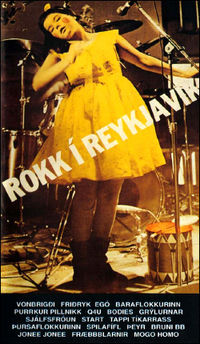

Title: Raddir heimildamynda
Slug: raddir-heimildamynda
Date: 2006-10-31 13:26:00
UID: 106
Lang: is
Author: Ása Baldursdóttir
Author URL: 
Category: Listfræði, Menningarfræði
Tags: 

Margir eru hættir að trúa því að myndavélin segi sannleikann og líta frekar svo á að kvikmyndir séu afurðir einstaklinga sem tilheyra ákveðinni menningu, hugmyndafræði og að þeir túlki veröldina útfrá einhverju meðvituðu sjónarhorni. Jay Ruby, mannfræðingur, hefur í skrifum sínum fjallað um siðferði kvikmyndarinnar og bendir á að áhorfandanum sé ekki alltaf ljóst hvort heimildarmyndarmaðurinn sé listamaður eða tæknimaður sem spegli hinn raunverulega heim í gegnum kvikmyndina.[^1] Áhorfandinn gerir sér því oft ekki grein fyrir því hvort að heimildarmyndir séu list, frásögn eða fréttaflutningur. 

Hugmyndir breytast ört um hvað sé hlutlæg miðlun á raunveruleikanum. Það fer í raun eftir skilgreiningu kvikmyndagerðarmannsins á því hvort tiltekin mynd sé heimildarmynd eða tilraunamynd. Ruby telur marga heimildamyndagerðarmenn hafi meiri áhuga á að rannsaka heldur en að lýsa og segja frá. Hann segir áhuga þessa fólks beinast að því að gera myndir af félagslegum eða pólitískum toga.[^2]

Kvikmyndaskáldið Friðrik Þór Friðriksson gerði heimildarmynd um pönkbylgjuna á Íslandi í byrjun niunda áratugarins. Björn Þór Vilhjálmsson, bókmenntafræðingur telur heimildarmyndina sem nefnist _Rokk í Reykjavík_, gefa ólíkum einstaklingum innan ákveðins menningarkima tækifæri til að tjá hugsanir sínar og viðhorf.[^3] Hljómsveitirnar í myndinni eru ekki kynntar né heldur lögin sem þær flytja. Í myndinni er þannig engin eiginleg frásagnarrödd. Með _einmitt_ þessari klippingu og sjónarhorni reynir kvikmyndaskáldið þó að stýra merkingunni fyrir áhorfandanum. Það kann að vera að Friðrik Þór haldi sig til hlés en uppröðun og formgerð einkennist ekki bara af naumhyggju heldur einnig andrúmslofti. Sköpun þessa ákveðna andrúmslofts skilja eftir spor kvikmyndaskáldsins í naumhyggjunni þ.e. fjarveru hans í myndinni. 

Eggert Þór Bernharðsson hefur fjallað mikið um mismunandi heimildir í sagnfræðilegum skilningi. Hann telur nýja tækni hafa aukið mjög við heimildarforðann m.a. kvikmyndir og hljómplötur. Nýjir miðlar þarfnast hinsvegar jafn mikillar túlkunar og hið ritaða orð.[^4]  Líta má á Rokk í Reykjavík sem eina af aðalheimildum pönksins og er mikilvægt að nýta okkur hana við túlkun á íslenskri menningu.

### Sjónarhorn

Björn Þór telur að miðill heimildarmyndarinnar geti ekki stjórnast af hlutleysi eingöngu heldur krefjist hann alltaf einhverskonar stjórnunnar kvikmyndagerðarmannsins sem þarf að velja sér sjónarhorn og skapa verkinu ákveðna formgerð.[^5] Rödd _Rokks í Reykjavík_ er hlutleysi hennar, sem er eiginlegt heildarmynstur verksins. Rödd kvikmyndagerðarmannsins heyrist í gegnum verk hans og hvernig hann tengir innbyrðis þá hluta sem hann kýs að kvikmynda. En uppröðun myndskeiða og fjarvera kvikmyndagerðarmannsins kallar á athygli áhorfands. Merkingarsköpunin hverfur því ekki alfarið bak við rödd viðmælanda og listrænnar klippinga á tónlistaratriðunum _Rokksins_. Bill Nichols skrifar í grein sinni „Rödd heimildarmynda“ um raunsæið og það að raunsæi einnar kynslóðar geti virkað sem uppspuni í augum þeirrar næstu. Hann telur að það þurfi sífellt að búa til nýjar aðferðir til þess að sýna hlutina og enn aðrar til þess að draga þessar sömu aðferðir í efa.[^6] Sögurödd einkenndi fyrstu heimildarmyndirnar þ.e. leitast var við að stýra merkingunni til áhorfandans. Eftir seinni heimstyrjöldina féll aðferð söguraddarinnar í ónáð og er í nútíma heimildarmyndagerð frekar óalgeng.[^7] Í kjölfar þessara sinnaskipta reyndu heimildarmyndagerðarmenn að gera kvikmyndir þar sem áhorfandinn gæti dregið sínar eigin ályktanir, þ.e.myndir án nokkurs skýringartexta. Seinna fóru kvikmyndagerðarmenn svo að nýta sér bein ávörp oftast í viðtalsformi og oft voru slíkar myndir mjög afhjúpandi en þó brotakenndar. Nýjasta aðferðin miðar svo að því að sýna þekkingarfræðilegar og fagurfræðilegar hugmyndir. Nichols bendir á að heimildarmyndaformið hafi alltaf verið form framsetningar en ekki hreinn gluggi að veruleikanum.[^8]

Kvikmyndagerðarmaðurinn hefur alltaf verið virkur í merkingarsköpuninni sem framleiðir kvikmyndalega orðræðu en er ekki hlutlaus eða alvitur fréttaritari og má það til sanns vegs færa ef litið er til _Rokks í Reykjavík_.[^9] Kvikmyndagerð myndar form orðræðu sem skapar áhrif, hughrif og sjónarhorn. Nichols telur athugunarmyndir gefa það til kynna að túlkunin liggi hjá áhorfandanum sem sé í raun færsla frá listrænni tjáningu til sögulegrar afhjúpunnar. Einstaklingar sem koma fram í heimildarmyndum beina orðum sínum til áhorfenda og með vitnisburði sínum ganga þeir stundum þvert á sögulegar heimildir. Þegar viðmælandinn er farin að yfirgnæfa texta myndarinnar er bilið milli heimildamynda og leikinna kvikmynda farið að minnka. Séu orð gagnrýnislaus samþykkt þurfa þau að sýna gildi sitt. Sumir kvikmyndagerðarmenn nota heimildarmyndaformið til þess að sannprófa hlutina með því að nota þráttaaðferðina en vitund slíkra mynda rannsakar umfjöllunarefnið og efast um það til þess að komast að niðurstöðu.[^10] 

Raddir persónanna spila einmitt lykilhlutverki í _Rokkinu_ og er því hlutur áhorfandans til túlkunar mikill. Var _Rokkið_ ekki hlutlaus spegill? Þvert á móti. Ákveðin sýn Friðriks Þórs sem leikstjóra beinir merkingarsköpun áhorfandans ákveðna leið þó svo að áhorfandinn túlki síðar það sem fyrir augu ber. Breytingar á  áðurnefndum aðferðum hafa sterk tengsl við söguna og er sjálfsrýnin gott dæmi um það. Sjálfsrýnin þjónar bæði m.a. pólitískum og vísindalegum markmiðum kvikmyndargerðarmanna. Taka mætti dæmi um andrúmsloftið á 8. áratugnum í vestrænu samfélagi sem kallaði fram frekari framleiðslu heimildarmynda. Femínískar myndir spruttu fram og voru oft um konuna sem einstakling. Lesbíur og samkynhneigðir fundu sér sína eigin rödd í gegnum heimildarmyndaformið og deildu með öðrum lífstíl sínum. Oft voru myndir notaðar í pólitískum anda og voru viðfangsefnin t.d. fóstureyðing, kynferðislegar ímyndir, rasismi og fleira.[^11] Rödd jaðarsins fékk nýja leið til tjáningar í gegnum heimildarmiðilinn. Rödd pönksins fékk að tjá sig í gegnum Rokkið. 

### Boðskapur myndarinnar

Í _Rokkinu_ eru ákveðin umræðusvið meira áberandi en önnur, t.d umræður um hugmyndaleg deilumál. Björn Þór nefndi að í myndinni takist félagslegt raunsæi og aktívismi Bubba Morthens á við stjórnleysi í anda Sex pistols sem miðlað er með rödd Fræbblanna. Björn Þór vill meina að Bubbi hafi verið nokkurs konar þjóðfélagsgagnrýnandi á meðan Fræbblarnir stæðu fyrir utan kerfið.[^12] Ákveðnar andstæður einkenndu pönktímabilið og hefur Friðrik Þór ákveðið að fanga hinn sanna anda pönksins _á meðan það var að gerjas_t. Það að standa fyrir utan kerfið og taka ekki afstöðu var ákveðin hugmyndafræðilegur kjarni sem hann ákvað að sýna með mynd sinni. Annað andstæðuparið hefur því meira gildi í myndinni þ.e. að taka afstöðu með því að taka ekki raunverulega afstöðu. Brot á tónlistarhefðinni og samfélagshegðan var þeirra tjáning þ.e. pönkarana. Strax árið 1983-1984 hættu margar þessara hljómsveita sem komu m.a. fyrir í myndinni og pönkið lagðist smám saman af. _Rokkið_ er nær eina íslenska kvikmyndin sem tók á borgaralegum samtíma og hafa fáar þannig myndir komið út síðan. 

Myndin sjálf verður þá kannski nokkurs konar þátttakandi í pönk hreyfingunni á Íslandi. Með pönkinu byrjaði menningarleg endurnýjun í íslensku tónlistarlífi sem greiddi leið nýbylgjunnar enn frekar. Líta má á pönkið sem ákveðna fagurfræði sem með ákveðnum lífstíl tekur afstöðu til menningarinnar. Sköpun á ákveðinni sjálfsmynd nýtti sér tónlistina og klæðaburð fremur en orðræðu. Myndin einkennist af stílbragði Friðriks, hann velur það sem hann vill sýna og einkennist boðskapur myndarinnar á upphafningu ákveðinna einstaklinga innan myndarinnar. Eins og Ruby tekur fram er hlutlæg miðlun á raunveruleikanum háð hverjum tíma og tel ég þessa bestu heimild um pönkmenningu hérlendis ekki falla í þann flokk. Mynd Friðriks tekur hinsvegar á reykvískum nútimaveruleika og varðveitir brot af tónlist sem tilheyrir menningarsögu Íslendinga. 

[^1]: Ruby, Jay: „Siðferði mynda, eða „Ég fæ að leika í bíómynd, þeir ætla að gera mig að stjörnu.“ _Áfangar í kvikmyndafræðum_, ritstj. Guðni Elísson. Reykjavík: Forlagið, 2003, bls. 210-211.

[^2]: Ruby, Jay: „Siðferði mynda.“ bls. 215-17.

[^3]: Björn Þór Vilhjálmsson: „Breyttir tímar: _Rokk í Reykjavík_ og íslensk pönkmenning“ í _Kúreki norðursins. Kvikmyndaskáldið Friðrik Þór Friðriksson_, ritstj. Guðni Elísson. Reykjavík: Sjöunda listgreinin, 2005, bls.  130.

[^4]: [Frumskógar samtímans. Hugleiðing um heimildavanda í samtímasögu.](http://www.hi.is/~eggthor/samtimaheimildir.htm)Tekið af vefsíðu höfundar 20. desember 2005.

[^5]: Björn Þór Vilhjálmsson: „Breyttir tímar: Rokk í Reykjavík“ bls.  106. 

[^6]: Nichols,Bill: „Rödd heimildarmynda.“ bls 191-192.

[^7]: Nichols,Bill: „Rödd heimildarmynda“ í _Áfangar í kvikmyndafræðum_, ritstj. Guðni Elísson. Reykjavík: Forlagið, 2003.,bls. 191-192.

[^8]: Nichols,Bill: „Rödd heimildarmynda“, bls. 191-197.

[^9]: Nichols,Bill: „Rödd heimildarmynda“, bls. 193- 197.

[^10]: Hayward, Susan: _Key consepts in cinema studies_, London: Routledge, 1996, bls. 74.

[^11]: Björn Þór Vilhjálmsson: „Breyttir tímar: Rokk í Reykjavík“, bls. 112-113.

[^12]: Guðni Elísson og Björn Þór Vilhjálmsson: „Með snjóbolta í báðum“ í  _Kúreki norðursins. Kvikmyndaskáldið Friðrik Þór Friðriksson_, ritstj. Guðni Elísson. Reykjavík: Sjöunda listgreinin, 2005, bls 223-224. 

