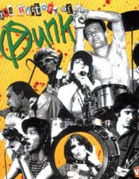

Title: „Ræflarokk? Þetta er tóm helvítis vitleysa!“
Slug: raeflarokk-thetta-er-tom-helvitis-vitleysa
Date: 2007-07-12 15:45:00
UID: 166
Lang: is
Author: Unnur María Bergsveinsdóttir
Author URL: http://unnur.klaki.net
Category: Tónlist, Sagnfræði
Tags: 

Í ágúst 1977 segir _Dagblaðið_ frá því að erlendis séu nú auglýstar á vegum breska hljómplötufyrirtækisins Stiff Records hljómsveitir sem kunni ekki að spila nema einn eða þrjá hljóma. Blaðamaður greinir frá því að ræflarokkið veki æ meiri athygli í Bretlandi og breiðist nú út um heiminn. Meðal annars hafi það borist til Svíþjóðar og áréttar blaðamaður að þetta hafi gerst þrátt fyrir að þær þjóðfélagslegu aðstæður sem breskir pönkarar mótmæli séu þar ekki til staðar. Tískukóngar séu farnir að framleiða rifin og slitin pönkföt sem fína fólkið kaupi. Síðnefndari hópurinn hafi þó alls ekki áhuga á því að umgangast alvöru pönkara. Í fréttinni er pönkið tengt við ofbeldi og skýrt frá því að til pönkarar tengist götubardögum í London og að helstu meðlimir The Sex Pistols hafi þurft að liggja á sjúkrahúsum eftir ótengdar líkamsárásir. Það hafi þó ekki gert nema auka á vinsældir þeirra.[^1]

Samkvæmt _Dagblaðinu_ hefur er fréttin er skrifuð lítið heyrst af ræflarokki hér á landi og veit blaðamaðurinn plötur helstu pönkhljómsveitarinnar, Sex Pistols, ekki verið fluttar inn. Var eina tónlistin pönkkyns sem blaðamaður komst yfir við vinnslu greinarinnar plata með Clash. Hvað ágæti hinnar nýju tónlistarstefnu varðar lætur blaðamaður sér því nægja að hafa eftir yfirlýsingu „ónefnds íslensks tónlistarmanns“, úr hópi meiriháttar spámanna: _„Ræflarokk? Þetta er tóm helvítis vitleysa maður.“_

Tímaritið _Samúel_ fjallar fyrst um pönkið í ársbyrjun 1978 og er greinin skreytt myndum af ófrýnilega pönkklæddum ungmennum. Stúlkurnar á myndunum eru annað hvort berar ofan eða neðan mittis og á greinin augljóslega að vera krassandi.  Samkvæmt _Samúel_ lýsa pönkarar „frati á allt það sem menn hafa í fáfræði sinni talið gott og gilt fram til þessa. Hinsvegar leggja þeir blessun sína yfir eiturlyf og slæpingshátt.“[^2]   Á sömu blaðsíðu, undir fyrirsögninni „Pönk á Íslandi“ er lesendum bent á það að tízkuverslunin Pop-Húsið í Bankastræti hafi nýverið hafið sölu á pönkklæðnaði og hafi hann rokið út. „Megum við kannski búast við ræflasumri á Íslandi í ár?“ spyr _Samúel_ og er spurningin á tvíræðan hátt staðsett undir nöktu glenntu klofi einnar pönkstúlkunnar.[^3]

Þótt ræflasumarið hafi beðið betri tíma kom ein þekktasta pönkhljómsveitin til Íslands í maí 1978 á vegum Listahátíðar og spilaði fyrir íslensk ungmenni. Í opnugrein í _Lesbók Morgunblaðsins_, rúmum mánuði fyrir komu Stranglers, kryfur Gísli Sigurðsson andstæðurnar diskó og pönk og kemst að þeirri niðurstöðu að „Kjarni málsins er ruddaskapur og afkáralegt útlit og venjulegar siðgæðishugmyndir eru fyrir borð bornar. …Punk-rokkarar mega ekki ástunda kurteisi; í þeim herbúðum þykir við hæfi að draga kvenfólk á hárinu, drepa í sígarettunni utan í næsta manni og æla yfir sig. Ekki má sjá merki um hreinlæti; hárið verður að vera klístrað og öllu þessu fylgir bæði eiturlyfjaneysla og harðsoðið klám.“[^4] Í greininni tengir Gísli pönkið margoft  við kölska og hans ára og telur þennan menningarkima „lággróður, sprottinn úr fátækrahverfum“ og markmið pönkara að „hafa allt að engu, sem sjálfsagt hefur þótt að innræta börnum og unglingum… að verða fullkomin andstaða hins siðaða manns.“[^5] Myndirnar sem fylgja greininni sýna leður og gadda, kinnar stungnar öryggisnælum og blóðtauma leka úr munnvikum og í myndatexta segir að það „Að stinga sikkrisnál inn í munninn og út um kinnina“ sé eitt vinsælasta kennimark pönkara.

Fyrsta tölublað hins skammlífa en stóryrta tónlistartímarits _Halló_ kemur út í maí 1978, á sama tíma og Stranglers fylla Laugardalshöllina og er blaðið mettað umfjöllun um pönk. Ein greinanna er er skreytt með efnislýsingunni: „Bölv og ragn og formælingar - Hrækingar - ruddaskapur og klámfengin framkoma - Allt þetta og meira til - Helstu hegðunareinkenni pungrokkara í dag!". Hún hefur það að markmiði að veita yfirlit yfir þróun pönksins, sem Hallómenn vilja kalla pungrokk. Það er mat _Halló_ að sama hvaða nafnið menn kjósi að nefna fyrirbærið þá sé það í grunninn bara gamla góða frumrokkið frá því í kringum 1960 með vænni slettu af ógeði. Æsifréttalegar rangfærslur í umfjöllun um pönkhljómsveitirnar New York Dolls og Sex Pistols eru stórtækar. Sú fyrrnefnda er kölluðtrúðahljómsveit sem ekki kunni að spila á hljóðfærin sín. Forsprakka Sex Pistols, Johnny Rotten er lýst sem geðsjúklingi sem hafi enga stjórn á líkama sínum og njóti þess að kvelja börn og dýr. Frægð pönkhljómsveita almennt er tengd við getu þeirra og vilja til þess að hneyksla. _Halló_ er mikið í mun að tengja Ísland við pönkið og teygir sig í viðleitninni svo langt að fjalla um hljómsveitina Árblik sem hluta af þessari bylgju. Slær blaðið þó þann varnagla að „Bretar myndu kannski skilgreina þá einvern vegin öðruvísi rokkara.“ Athyglisvert er að það sem þyngst virðist vega á metunum hvað endurskilgreiningu Árbliks varðar eru dylgjur um kynvillu[sic] innan hljómsveitarinnar.[^6]

Snemma árs 1979 tengir _Samúel_ pönkið enn við kynlíf og er nú fjallað um pönkara í danska klúbbnum Bonaparte. Aðspurður að því hversvegna hann hafi opnað svo fínan stað fyrir pönkurum segir eigandi staðarins, Þorsteinn Viggósson, að tískan og tíðarandinn sé „alltaf að nálgast pönkið meir og meir“. Tengir blaðamaður þessa ákvörðun og umfjöllun sína um klúbbinn við eðlislægt frjálslyndi Dana sem hafi jú verið upphafsmenn „kynbyltingarinnar frægu.“[^7]

Þau dæmi sem hér fóru á undan eiga það sameiginlegt með öðrum íslenskum fréttum af erlendu pönki frá sama tíma að áherslan er lögð á stóryrtar staðhæfingar um kynferðislegt óeðli, andfélagsleg viðhorf og tónlistarlega vankunnáttu. Íslenskir fjölmiðlar taka hiklaust undir hugmyndir um úrkynjun og er endurómurinn af erlendu siðferðisuppþoti tengdu pönkinu greinilegur.[^8] Þegar kemur að umfjöllun um alíslenskt pönk er raunin þó sú að í fréttaflutning af þeim fáu íslensku pönkhljómsveitum sem störfuðu á sama tíma vantar algerlega fyrstu tvö þemun. Varð þróun mála sú að á sama tíma og Fræbbblarnir höfðu náð að spila nokkra tónleika hverfur æsifréttaleg umfjöllun um erlenda pönkið nær alfarið úr íslenskum fjölmiðlum. Í staðinn kemur yfirvegaðri umfjöllun þar sem annað hvort er fjallað um pönkið sem félagslegt fyrirbæri og tónlistarlegt afturhvarf til fortíðar eða það er afskrifað sem fíflalæti unglinga. Þar að baki liggja einfaldar ástæður; annars vegar smæð samfélagsins og hinsvegar skortur á áberandi stéttskiptinu.  

