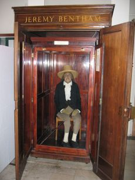

Title: Réttindi dýra í ljósi nytjastefnunnar
Slug: rettindi-dyra-i-ljosi-nytjastefnunnar
Date: 2007-11-06 10:44:00
UID: 192
Lang: is
Author: Baldur Garðarsson
Author URL: 
Category: Heimspeki
Tags: 

Siðfræðingar hafa ekki komið sér saman um hvort dýr eigi að hafa einhver sérstök réttindi. Hér verður fjallað um tvö sjónarhorn, sem bæði styðjast við svonefnda _nytjastefnu_ sem kennd hefur verið við bresku fræðimennina Jeremy Bentham (f. á Englandi 1748, d. 1832) og John Stuart Mill (f. á Englandi 1806, d. 1873). Nytjastefnan tilheyrir svonefndum leikslokakenningum, þ.e. stefnan tekur mið af afleiðingum tiltekinna athafna. Hún er í stuttu máli á þá leið að menn skuli haga gjörðum sínum á þann veg að það skapi sem mesta hamingju eða ánægju fyrir sem flesta, eða a.m.k. sem minnsta óhamingju. Stefnan er undirstaða margs konar lagasetningar, þjóðfélagssáttmála og þ.h., en vissulega hefur hún nokkra veika bletti,  m.a. hvað varðar að fórna einstaklingum fyrir fjöldann. Bentham og Mill voru jafnréttissinnar og töldu því alla menn jafna. Bentham gerðist mjög vinstrisinnaður með aldrinum og er m.a. frægur fyrir það að múmía hans situr enn í glerskáp í háskólanum í London (UCL), reyndar með vaxhöfuð, því upprunalega höfuðið var orðið of illa farið til að hægt væri að hafa það til sýnis. Bentham opnaði á þá hugsun að kenningin um nytjastefnu tæki einnig til dýra. 

Reyndar eru menn ekki á eitt sáttir um hvað orðið ,,réttindi“ dýra merki, auk þess að sumir telja að þau eigi að vera algild en aðrir telja að þau geti verið afstæð. Til samanburðar má skoða skýringu Atla Harðarsonar heimspekings (f. á Íslandi 1960) á hugtakinu mannréttindi: Hann telur þau vera:  

* Rétt hvers manns til að vera ekki misþyrmt, rændur, kúgaður, niðurlægður eða myrtur.

* Þau réttindi sem þarf að tryggja fólki til að þeim réttindum sem nefnd eru í lið (1) sé ekki stefnt í voða.

Almennt hefur fólk lagt þrenns konar skilning í hugtakið: Lagalegan skilning (réttindi sem eru skilgreind í lögum og alþjóðasamþykktum), pólitískan skilning (réttindi sem talið er æskilegt að séu tryggð hvort sem þau eru lögfest eða ekki ) og siðferðilegan skilning (réttindi sem allir hafa óháð staðbundnum aðstæðum). E.t.v. má skoða dýraréttindi í svipuðu ljósi. 

Almennt mætti segja að fólk sé sammála um að það sé rangt að vera vondur við dýr. Ekki er víst að fólk hugleiði það neitt frekar, en sú vonska getur verið af tvennum toga, þ.e. að menn bregðist neikvæðum skyldum sínum (láti dýr ekki í friði, ofsæki þau, meiði eða drepi að óþörfu), eða að menn bregðist jákvæðum skyldum sínum (komi dýrum ekki til hjálpar ef þau eru hjálparþurfi, láti vera að hlúa að þeim o.s.frv.). Vonska getur þannig falist bæði í athöfnum og athafnaleysi, en telja má að viljinn á bak við vonskuna sé aðalatriðið. John Locke (f. á Englandi 1632, d. 1704)  sagði eitt sinn að manneskja væri ill ef hún ylli öðrum kvölum, og hefði af því ánægju. Það er svipað og kalla mætti meðvitaða illsku (sadisma ) og er því miður til hjá mönnum.  Getur hún orsakast af reiði, hefnigirni, geðveiki eða öðrum þeim hvötum, sem við teljum almennt óæskilegar. Dómstólar dæma menn til harðari refsinga ef brotaviljinn hefur verið einbeittur heldur en ef um slysni eða óvitaskap hefur verið að ræða. Oft er þar um að ræða brot gegn fólki. Svipaða hugsun má heimfæra á brot gegn dýrum.

Kenningum um réttindi eða réttindaleysi dýra má annars skipta í 3 flokka, eftir réttindastigi og nytjastefnuhugsun:

#### a) Réttindi og skylduhugsun (ekki í anda nytjastefnu).

Helsti fulltrúi þessa flokks er Tom Regan (f. í USA 1938), sem telur að dýr eigi að hafa réttindi allt að mannréttindum, ekki vegna afleiðinga þess að þau hafi ekki slík réttindi, heldur af grundvallarástæðum. Hann  telur dýr hafi tilfinningar, langanir og þrár, sem okkur sé skylt að virða. Um þennan flokk verður ekki fjallað nánar hér.

#### b) Réttindi og nytjastefnuhugsun.

Hér má frægastan hugsuða nefna Peter Singer (f. í Ástralíu 1946), sem ritað hefur um frelsun dýra. Hann telur einmitt að menn verði að koma fram við dýr með því hugarfari að þau hafi rétt til að lifa hamingjusömu lífi og að afleiðingar gjörða okkar í þerra garð séu helsti mælikvarði á hvað sé rétt eða rangt. Réttindi þeirra eigi að vera tryggð og meðhöndlun þeirra sé þannig að það orsaki mesta mögulega hamingju allra. Singer spyr m.a. þeirrar spurningar hvers vegna menn noti dýr til tilrauna, en ekki menn. Væri það ekki einmitt í anda nytjastefnu að prófa lyf á mönnum? Singer telur það allt að því mismunun að nota eingöngu dýr.

Kenningar Singers tilheyra svonefndum _lífhverfum_ (biocentric) kenningum um náttúruvernd, en hinar eru _mannhverfar_ (anthropocentric) kenningar og _visthverfar_ (ecocentric) kenningar. Kenningar þessar eru afar ólíkar, aðallega varðandi það sjónarhorn sem þær setja á viðfangsefnið.

#### c) Engin réttindi og nytjastefnuhugsun.

Þessi flokkur kann að virðast þversögn í eðli sínu, en hann er þó tekinn með, því einn frægasti hugsuður allra tíma Immanuel Kant (f. í Prússlandi 1724, d. 1804) var fulltrúi þeirra, sem aðhylltust slíka kenningu. Kant var reyndar skyldukenningarmaður og fyrirleit hina ensku nytjastefnu, sem hann taldi allt of mikla hentistefnu. Þrátt fyrir það komst Kant að þeirri niðurstöðu að menn ættu ekki að vera vondir við dýr, vegna þess að það myndi leiða til þess að þeir sömu menn yrðu líklegri en aðrir til að verða vondir við menn. Þetta er einskonar kenning um vana, þ.e. að ef menn temji sér slæma siði, þá bitni þá með tímanum á öðrum mönnum. Þetta sjónarmið er mannhverft, þ.e. maðurinn er þar í öndvegi, ekki dýrin. Kant, sem var sonur aktygjasmiðs, og vanur að sjá dýr vera notuð til vinnu, áleit þau tilfinningalaus. Enn lengra hafði hinn frægi heimspekingur René Descartes (f. í Frakklandi 1596, d. 1650 ) gengið, sem sagði að dýr væru vélar.

Þá er ógetið vangaveltna manna um það hvar hugtakið ,,dýr” byrji og endi. Eru eingöngu æðri dýr (spendýr og þ.h.) þess verð að um þau sé fjallað?  Þurfa þau að hafa heila til að teljast þess verð að hafa einhver réttindi? Þurfa þau að hafa sál, eða hafa yfir höfuð einhver dýr sál?  Á lúsin í höfði manns rétt á að hafa sömu réttindi og kýrin í fjósinu? Á moskítóflugan, sem smitar menn af malaríu, að njóta sömu réttinda og hunangsflugan, sem framleiðir hið gómsæta hunang? Á að telja hin smæstu frumdýr með öðrum dýrum? Er munur á gæludýrum, trúarlega heilögum dýrum, húsdýrum og villidýrum hvað réttindamál varðar?  Á að taka tillit til plantna einnig? Líffræðingar hafa bent á að skil milli plantna og dýra séu óljós, t.d. eru ýmis svifdýr í sjó talin til dýra, en önnur til plantna.

Ýmsum öðrum spurningum er auk þessara ósvarað. Hver er hin eina rétta afstaða manna til dýra? Geta menn verið bæði dýravinir og kjötætur? Geta menn verið dýravinir en á sama tíma notað dýr sem tilraunadýr, eða gengið í fötum, sem gerð eru úr feldum dýra?  Geta veiðimenn verið dýravinir? Þessum spurningum er vandsvarað.

Að lokum langar mig að stilla upp 2 spurningum, sem ég bið lesendur að hugleiða: 

_a)_ Ef þú lesandi kæmir að húsinu þínu í björtu báli og vissir að heimiliskötturinn þinn væri  á neðri hæðinni en að á efri hæðinni væri dauðvona rúmliggjandi gamalmenni (sem þú þekktir lítið). Hvorum myndir þú reyna að bjarga fyrst?  

_b)_ Hugsaðu þér að þú værir bóndi sem ættir mjög dýran og eftirsóttan graðhest. Tekjur af honum væru miklar og verðmæti hans væri talið í tugum ef ekki hundruðum milljóna. Dæmdur glæpamaður myndi brjótast inn í hesthúsið og stela klárnum, en óvart álpast  með hann út í botnlaust kviksyndi. Hvorum myndir þú reyna að bjarga á undan? 

Þessi 2 dæmi falla undir svokallaðar klípusögur, sem m.a. hafa verið notaðar til að gagnrýna nytjastefnuna. Ef Sókrates (f. á Grikklandi 470 f. Krist, d. 399 f. Krist) væri uppi á okkar dögum og heyrði menn svara þessum spurningum, myndi hann ganga á lagið og spyrja menn af hverju þeir svöruðu svo. 

