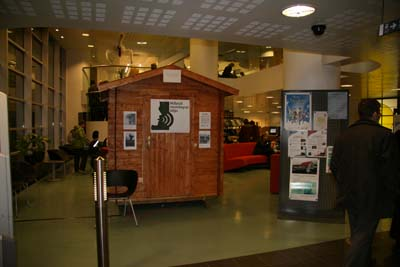

Title: Reykjavíkursögur borgarbarna
Slug: reykjavikursoegur-borgarbarna
Date: 2007-04-17 17:05:00
UID: 148
Lang: is
Author: Unnur María Bergsveinsdóttir
Author URL: http://unnur.klaki.net
Category: Sagnfræði, Munnleg saga
Tags: 

Reykjavík hefur tekið stórkostlegum breytingum á síðustu 80 árum og enn þenst borgin út. Ný hverfi byggjast upp jafnt og þétt og börn hlaupa um malbikaðar götur þar sem áður voru aðeins móar. Á sama tíma byggist útþensla borgarinnar ekki lengur á aðflutningum fólks utan af landi eins og reyndin var í kringum miðja tuttugustu öldina, - í Reykjavík býr nú fjöldi fólks sem getur rakið sögu sína marga ættliði aftur innan borgarmarkanna.  Börn þeirra sveifla sér jafnvel í trjám í görðum þar sem afar þeirra og ömmur léku sér og bera sögur foreldra sinna af uppvaxtarárum í borginni saman við eigin reynslu. 

Reykjavíkursögur er spennandi söfnunarverkefni sem unnið er að á vegum Miðstöðvar munnlegrar sögu. Verkefninu var formlega hrundið af stað á Vetrarhátíð í Reykjavík 22.- 24. febrúar 2007 og fóru upptökur fram í færanlegu upptökuveri sem komið var fyrir á Borgarbókasasafni Reykjavíkur í Tryggvagötu.  Markmiðið er að safna, varðveita og miðla Reykjavíkursögum frá ólíkum tímum. Fyrsti áfangi verkefnisins nefnist _Borgarbörn_ en nú í ár er sérstaklega kallað eftir frásögnum Reykjavíkurbarna af því hvernig það er að alast upp í Reykjavík á ólíkum tímum. Reykjavíkurborg er samstarfsaðili að verkefninu sem standa mun yfir í þrjú ár. Efni verður safnað á borgarhátíðum þegar borgarbúar eru á ferð og flugi. Verkefnið byggir á virkri þátttöku borgarbúa en markmiðið með því að fara með upptökuverið út á meðal fólksins er að ná að ná til sem flestra. 

Efnissöfnun á Vetrarhátíð gekk vonum framar og kom það vel í ljós að borgarbúar eru bæði fúsir til frásagnar og hafa frá mörgu að segja. Upptökurnar fóru fram í litlu vinalegu tréhúsi en til að koma húsinu inn fyrir dyr Borgarbókasafnsins tóku vaskir starfsmenn Orkuveitunnar húsið í sundur fjöl fyrir fjöl, báru þær inn um þröngar dyr og púsluðu húsinu saman aftur á jarðhæð Grófarhússins þar sem það blasti við öllum sem leið sína þangað lögðu. Ikea styrkti verkefnið með því að gefa í húsið húsgögn og ljósmyndasafn Reykjavíkur sá um að prenta út úr safni sínu myndir sem sýna Reykjavíkurbörn á mismunandi tímum. Voru þær nýttar til að skreyta húsið bæði að innan og að utan og urðu tilefni spjalls og spekúlasjóna margra þeirra sem leið áttu fram hjá húsinu. 

Vinalega hljóðverið vakti mikla athygli enda staðsett á besta stað. Hljóðverið var opin í tíu tíma samtals en á þeim tíma komust mun færri að en vildu. Alls söfnuðust rúmlega 6 klukkustundir efnis en viðmælendur voru alls 27. Var sá elsti rúmlega sjötugur karlmaður sem mundi vel eftir því hvernig það var að vera barn á hernámsárunum. Hann skýrði frá minningum um hættuna á loftárásum og frá því hvernig viðmót hermannana hefði breyttst eftir því sem leið á hersetuna og vera hermannanna hætti að vera nýnæmi. Yngsta Reykjavíkurbarnið var brosmild þriggja ára telpa sem heimsótti hljóðverið í fylgd móður sinnar og sagði sögur af leikskólalífi í Lauganeshverfinu. Aðrir gestir sögðu frá leikjum í Öskjuhlíð, ævintýrum í Hólavallagarði, lýsiskönnum í Lauganesskóla og bönnuðum tölvuleikjum. Enn aðrir sögðu frá því hvernig það var að flytja í borgina af sveitabæ þar sem hvorki var rafmagn né vatnssalerni, frá því hvernig það var að alast upp í stórfjölskyldum, frá því hvernig það var að týnast í Reykjavík, frá því þegar kindur voru reknar til slátrunar um götur Reykjavíkur.  

Þáttakendum bauðst að heimsækja hljóðverið tveir og tveir saman en sambærileg verkefni sem unnin hafa verið erlendis  einmitt hafa leitt í ljós að flestum finnst bæði stuðningur í því að rifja upp endurminningar í félagi við vini eða ættingja auk þess sem sú upplifunin veitir yfirleitt ánægju á báða bóga. Með þessum hætti nást fram ólík viðhorf og reynsla og bönd milli einstaklinga styrkjast.  Sú var einnig raunin í Reykjavík og inn í garðhúsið settust saman foreldrar og börn, hjón, vinir, vinkonur og systkini og fóru flestir skælbrosandi út að upptöku lokinni. 

Allir þeir sem sögðu sögu sína fengu upptöku af viðtalinu senda á geisladisk og innan skamms verða fyrstu sýnishorn viðtalanna aðgengileg á sérstakri vefsýningu tileinkaðri þessum fyrsta áfanga Reykjavíkursagna á vefsvæðinu: [munnlegsaga.is](http://www.munnlegsaga.is). 

Reykjavíkursögurnar verða varðveittar í safni Miðstöðvar munnlegrar sögu og er það von aðstandenda að auk þess að vekja athygli á miðstöðinni og gildi munnlegrar sögu muni það heimildasafn sem þær munu mynda nýtast bæði fræðimönnum, kennurum og áhugamönnum um menningu og sögu. Frásögnunum verður auk þess miðlað til almennings á heimasíðu Miðstöðvar munnlegrar sögu jafnóðum og þeim verður safnað. Búin verður til sérstakur frásagnavefur sem nefnist Reykjavíkursögur og verður hann hluti af vefsvæði Miðstöðvar munnlegrar sögu. Þar verður hægt að hlusta á einstök viðtöl í heild sinni og brot úr öðrum. Þá verður á síðunni ýmislegt fræðsluefni sem tengir frásagnirnar við hina almennu sögu um borgina. Markmiðið verður bæði að skemmta fróðleikfúsum og eins má hugsa sér að hægt verði að nota vefinn sem stuðningsefni við sögukennslu í grunnskólum borgarinnar 

Næsti áfangi Reykjavíkursagna verður tileinkaður þeim tómstundum sem mótast hafa af borgarumhverfinu og stefnt er að því að í þeim þriðja verði litið til þess hvernig það sé að eldast í borginni. 

