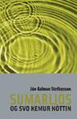

Title: Rómantík hins daglega lífs
Slug: romatik-hins-daglega-lifs
Date: 2006-04-20 13:17:00
UID: 65
Lang: is
Author: Arngrímur Vídalín Stefánsson
Author URL: 
Category: Bókmenntir
Tags: 

Lífið virðist stundum fara í allar áttir en endar svo iðulega í miðri setningu. Þau orð má finna í inngangskafla bókarinnar _Sumarljós og svo kemur nóttin_ eftir Jón Kalman Stefánsson. En hvað merkja þau? Það er ef til vill það sem bókin snýst um.

Sögusvið bókarinnar er ótilgreint smáþorp á vesturlandi. Á yfirborðinu sýnist allt með felldu, en það er sem vænti mátti ekki tilfellið. Bókin hefst á inngangskafla þar sem þorpinu er lítillega lýst, t.a.m. er tilgreint að þar sé enginn kirkjugarður og staðreyndin túlkuð sem forsenda hás meðalaldurs í þorpinu, líkt og það sé ósjálfráð tillitssemi að deyja ekki til að hlífa þarmeð fólki við óþarfa veseni. Mest um vert í inngangsorðunum er að þar kemur fyrst fram annarsvegar það barnslega kæruleysi sem einkenna mun bókina út í gegn, svo og alvitur frumspekitónninn, sem aðeins glymur þegar mest á þarf. Kæruleysið sést á kirkjugarðssögunni. Grunntónn heimspekinnar er sleginn hér: 

> [...] á kvöldin blæðir sólinni yfir [fjörðinn] og þá hugsum við um dauðann ... Hefurðu annars leitt hugann að því hversu margt er tilviljunum háð, jafnvel allt? ... sjaldan vitglóra í hendingum og líf okkar þá lítið annað en stefnulaust ráf, þetta líf sem virðist stundum fara í allar áttir en endar svo iðulega í miðri setningu [...][^1]

Sögumaður er ekki einn heldur allir — segja má að sögumaður sé í raun þorpssálin,[^2] eitthvert við sem allt yfirsér en er engu að síður algjörlega óhlutbundinn og óháður þorpsbúum; ef til vill ímynduð þorpssál, afleiðing þess ef þorpsbúar sameinuðust allir í einn, með alla sína vitneskju, reynslu og trega, svo úr yrði nokkurs konar alvitur meðvitund. Þorpssálin er þó hvorki afgerandi né ráðandi afl í frásögninni. Stærstan hluta bókarinnar heldur hún sig til hlés og hleypir frásögninni óhindrað að. Í raun er bókin tvískipt: Það eru kaflar og millikaflar. Kaflarnir eru frásögnin, en þorpssálin býr í milliköflunum. Án þeirra, leyfi ég mér að segja, væri bókin lítils verð; þeir binda hana saman, gefa henni heildarsvip og heildarhugsun. Án þeirra væri bókin aðeins smásagnasafn.

Ég minntist á trega hér áður, og það af ærinni ástæðu, því við enda forleiksins er hinsta stemningsnótan slegin fyrir symfóníu verksins, og allt sem eftir kemur tekur mið sitt af því:

> [...] hér verður þó örugglega sagt frá girndinni sem hnýtir saman daga og nætur ... Við segjum frá hversdagslegum atburðum, en líka þeim sem eru ofvaxnir skilningi okkar ... og að sjálfsögðu ætlum við að segja þér frá nóttinni sem hangir yfir okkur og sækir afl sitt djúpt út í geiminn, frá dögunum sem koma og fara, frá fuglasöng og síðasta andartakinu, þetta verða áreiðanlega margar sögur ... og nú byrjum við, hérna kemur það, kátína og einsemd, hófsemd og rökleysa, líf og draumur — já, draumar.[^3]

Hér byrjar bókin. Minnst hefur verið á skiptingu bókarinnar í kafla og millikafla. Kaflarnir þjóna tilgangi frásagnarinnar og hver og einn þeirra er sjálfstæð saga úr þorpinu. Ekki tjóar að tíunda efni hvers kafla fyrir sig. Það væri í senn tilgangslaust og óáhugavert. Í bókinni eru engar aðalpersónur, aðeins fólk sem kemur og fer. Sumar persónur koma raunar oftar fyrir en aðrar, en það er ekki til þess gert að veita þeim meira vægi í frásögninni og þaðanafsíður er það gert vegna þess að einhverjar þeirra séu mikilvægari en aðrar. Þetta gerir Jón Kalman til þess að skapa raunverulega tilfinningu fyrir þorpinu. Í raunveruleikanum er það svo að fólki hættir til að bregða misoft fyrir, jafnvel svo langur tími líði milli þess þú hittir það. Tilfinningin sem grípur lesandann er einmitt þessi: Er þetta raunveruleiki? Þorpið er stærra en frásögnin. Glugga frásagnarinnar mætti líkja við stakan ramma uppi á hálendi; hann snýr aðeins í eina átt og jafnvel þannig heldur hann ekki öllu umhverfinu sem við honum blasir. Slíkur er máttur stílbragðsins, það nægði ef aðalpersóna eins kafla sæist kaupa sér pylsu í öðrum, þá væri áhrifunum náð; þorpið er hér og það er til.

Treginn. Lýst hefur verið hvernig Jón Kalman skilur við hið ytra, en hið innra er ekki síður mikilvægt. Í raun er það mikilvægara. Því á yfirborðinu virðist allt með felldu, eins og áður var getið, en i raun fer því fjarri. Ekki einungis lesum við um fólkið í þorpinu, við kynnumst því, komumst að leyndustu hugsunum þeirra, finnum þrár þeirra, vonir, væntingar, ótta, ást þeirra, reiði og gremju. Og það er meira en að segja það, þetta þarf hver og einn að upplifa, til að skilja tregann. Þorpssálin gerir sitt til að skapa þennan trega, en gerir það meðan hún reynir að draga úr honum. Eftir vægast sagt erfiðan kafla um framhjáhald sem endar með pyrrhosarsigri aðalpersónunnar, reynir þorpssálin að beina huga lesandans annað:

> Til hvers hef ég lifað, spurði frænka okkar á dánarbeði, við opnuðum munninn til að svara, án þess þó að vita svarið, en þá dó hún, því dauðinn er ennþá góðu skrefi á undan okkur.Við höfum séð nóttina koma yfir fjöllin og stóðum úti þegar vægur skjálfti fór um loftið, fuglar litu upp og síðan reis eldhnöttur í austri. Til hvers lifum við; er óhætt að svara svona spurningu? Kannski ekki, höfum við eitthvert hlutverk, umfram það að kyssa varir og svo framvegis? En stundum og þá einkum rétt áður en svefninn yfirbugar okkur á kvöldin og dagurinn er liðinn með allan sinn óróleika, við liggjum uppi í rúmi, hlustum á blóðið og myrkrið kemur inn um gluggana, þá vaknar sá djúpi og óþægilegi grunur að þessi nýliðni dagur hafi ekki verið nýttur sem skyldi, það hafi verið eitthvað sem við hefðum átt að gera en vitum bara ekki hvað það var. Hefurðu stundum velt því fyrir þér að aldrei í sögunni höfum við haft það jafn gott, einstaklingurinn aldrei haft meiri möguleika til að hafa áhrif á umhverfi sitt, aldrei verið jafn auðvelt að vera þátttakandi, en sjaldan jafn lítill vilji — hvernig skyldi standa á því? Getur verið að svarið leynist í annarri spurningu: Hverjir græða mest á slíku ástandi?[^4]

Eiginlegt hlutverk þorpssálarinnar er heldur ekki að vera huggandi. Hún er til staðar til að veita okkur innsýn í sálarlíf þorpsbúa, sýna okkur heiminn eins og hann er undir gljábónuðu yfirborðinu. Lífið er ekki auðvelt, það er enginn dans á rósum, það er hér eins og það er þar og það er raunverulegt og það er tregablandið, en það er ekki algjör hörmung, það er fallegt þótt það sé ljúfsárt. Bókin er hreint ekkert þunglyndisraus, heldur undirstrikar einmitt hún fegurð lífsins og ástarinnar og það eilíflega mikilvæga atriði sem fer framhjá svo mörgum, að það er gott að lifa:

> Það er gott að vakna snemma hérna í þorpinu. Þeir sem búa næst sjónum hafa síkvikan hafflötinn í stofuglugganum og geta staðið úti á veröndinni með kaffibolla í hendinni, kannski berfættir, hlutsað á ögn rámt masið í æðarfuglinum, hrjúfar athugasemdir mávsins, grábjört skýjahellan hreyfist ekki í logninu, hafið bærist varla, einungis smáöldur sem færa nokkra steina í kaf, svo koma þeir aftur upp til að anda. Þarflaust að hugsa nokkuð, maður er bara til, hlustar, tekur á móti veröldinni, hljóðum morgninum, heimsveldi verða að dufti á svona stundum.[^5]

_Sumarljós og svo kemur nóttin_ er ekki saga, heldur eftirmynd af lífinu, eins og það raunverulega er, þessu lífi sem virðist stundum fara í allar áttir en endar svo iðulega í miðri setningu. Hún er þó engan veginn raunsæisrit, hún er fullkomlega rómantísk. Og það er hennar helsti styrkur. Hún dregur upp mynd af samfélagi innan samfélags, sem er fjarlægt okkur en við þekkjum þó öll, sýnir persónur eins og fólk en ekki sem persónur, hliðstæður heimur fullkomlega sem þó er hluti af okkar eigin heimi. Þetta er bók sem situr þungt en flýgur létt. Því til sönnunar gæti ég fundið ýmislegt til; fegurstu jafnt sem erfiðustu lýsingarnar eru eftir, en þær læt ég væntanlegum lesendum eftir að upplifa í samhengi bókarinnar.

Bókin kom út hjá Bjarti 2005 og hlaut Jón Kalman Stefánsson Íslensku bókmenntaverðlaunin fyrir. Var það fyllilega verðskuldað. Stíllinn er vopn hans, hugsunin þroskuð, undirtónninn fágaður. _Sumarljós og svo kemur nóttin_ kemur út á tímum póstmódernískrar bókmenntahefðar og tekur vinninginn. Fyllilega er það bók sem vert er að mæla með.

[^1]: Sjá bls. 8-9. 

[^2]: Hugtakið ,,þorpssál" fæ ég lánað héðan úr greininni ,,Jón Kalman Stefánsson: Sumarljós og svo kemur nóttin" eftir Inga Björn Guðnason, sem birtist á Bókmenntavefnum í nóvember 2005. Sjá [hér](http://www.bokmenntir.is/displayer.asp?cat_id=383#J%C3%B3n%20Kalman%20Stef%C3%A1nsson:%20Sumarlj%C3%B3s%20og%20svo%20kemur%20n%C3%B3ttin)

[^3]: Sjá bls. 9.

[^4]: Sjá bls. 121.

[^5]: Sjá bls. 18.

