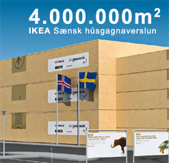
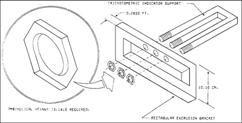
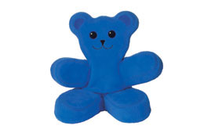

Title: Sænskar kjötbollur og hertur pappamassi: umfang IKEA
Slug: saenskar-kjoetbollur-og-hertur-pappamassi
Date: 2006-10-19 16:15:00
UID: 104
Lang: is
Author: Karl Jóhann Jóhannsson
Author URL: 
Category: Neyslusamfélagið, Í umræðunni
Tags: 

IKEA er ein af vinsælustu verslunum heims, sést það kannski best á því að Ingvar Kamprad, stofnandi og helsti eigandi IKEA, er að minnsta kosti fjórði ríkasti maður í heimi, samkvæmt tímaritinu Forbes.  Ingvar stofnaði IKEA árið 1943, þegar hann var 17 ára, en IKEA er skammstöfun fyrir <b>I</b>ngvar 
<b>K</b>amprad, <b>E</b>lmtaryd (bóndabýlið á Smálandi sem Ingvar ólst upp á) og <b>A</b>gunnaryd (nálægt þorp).  Til að byrja með seldi Ingvar hinar ýmsu smávörur sem hann taldi fólk vilja kaupa og hann gat útvegað á lágu verði. Það var ekki fyrr en 1951 sem verslunin byrjar að einbeita sér sérstaklega að húsgögnum og 1955 sem verslunin byrjaði að hanna eigin húsgögn.[^1]

Ýmislegt hefur þróast og breyst í gegnum árin, 1953 var opnaður fyrsti sýningarsalurinn til að sýna viðskiptavinum vörurnar og hefur það form á verslununum haldist síðan þá. IKEA verslanir í kringum hnöttin taka vel yfir 4.000.000 fermetra, sem er að sjálfssögðu að bílastæðum og vöruhúsum undanskildum.  Vöruhúsin taka reyndar vel yfir 10.000.000 fermetra allt í allt.  Í dag eru starfsmenn IKEA um 100.000, starfandi í 238 verslunum í 34 löndum. Þar á meðal eru 20.600 fermetrar undir nýopnaðri verslun á Íslandi, með rúmlega 800 bílastæði.  

Fyrsta (og eina) verslunin á Íslandi opnaði árið 1981 og var hún þá bara deild í Hagkaupum.  Verslunin varð mjög vinsæl og árið 1985 var flutt í verslunarrými hjá Kringlunni, sama ár og IKEA opnaði sína  fyrstu versluni í Bandaríkjunum.  Þrátt fyrir að ekki var átt von á því að IKEA yrði vinsælt í Bandaríkjunum þá eru Bandaríkin einn stærsti markaður þeirra í dag.  Á Íslandi gekk allt svo vel að flytja þurfti í stærra húsnæði (9.200 fermetra) í Holtagörðum við Sæbraut árið 1994.  Með auknum áhuga íslendinga á 3. heims framleiddum sænskum húsgögnum, innréttingum og smávörum hafði versluninni í Holtagörðum einhvern veginn tekist að sprengja utan um sig og í fyrra var brugðið á það ráð að byggja nýtt verslunarrými í hrauninu á milli Garðabæjar og Hafnafjarðar.

Að segja að IKEA sé vinsæl verslun væri vægt til orða tekið, þeir sem hafa komið í slíka verslun, hvar sem er í heiminum, sjá greinilega að alltaf er nóg að gera þar.  Mörg dæmi eru um að umferðaröngþveiti séu í kringum IKEA verslanir, til dæmis þurfti lögregla í Kaliforníu að stýra umferð í kringum verslun þar í þrjá mánuði eftir að hún opnaði vegna þess að umferðarljósin urðu gagnslaus.  Á fjölmörgum stöðum eru verslanir IKEA með strætóa og jafnvel neðanjarðarlestir á þeirra vegum sem stoppa í verslunum þeirra til að auka aðgengi fólks á þéttbýlari svæðum.  Við íslendingar þurfum þó varla að hafa áhyggjur af slíku sökum þess hve fá við erum.  Eina sem við þurfum að hafa áhyggjur af eru ótímabærar jólaauglýsingar.  Í ár, til dæmis, eru IKEA byrjaðir að auglýsa að "jólin þín byrja í IKEA" og eru því líklega á undan öllum öðrum verslunum í jólaundirbúningi, sem er kannski ekki mikið afrek þar sem enn er langt til jóla um miðjan október.

En umferðaröngþveiti og jólin eru líklega ekki stærsta áhyggjuefni IKEA.  Peningarnir streyma inn og lággjaldavörurnar út, þó ekki hafi þetta alltaf gengið vel.  Árið 2004 dóu til dæmis 3 í troðningi í Sádí-Arabíu þegar IKEA verslun bauð takmarkað magn af gjafabréfum að virði 150 dollara hvert og þegar 8000 manns voru mættir við opnunartíma hóf mannfjöldinn að troða sér inn.[^2]  Ári síðar slösuðust fjölmargir í ruðningnum þegar ný búð var opnuð í norður-hluta London.  Það þurfti að loka búðinni aftur hálftíma síðar vegna skorts á starfsfólki og öryggisvörðum og fjölda viðskiptavina.  Gagnrýnendur höfðu varað við því að hafa tilboð við opnun á svæði sem var í miklu þurfi fyrir lággjaldahúsgögn. [^3]

Fyrirtækið hefur þó sætt gagnrýni fyrir fleira en öngþveiti, allt frá eyðileggingu umhverfis og mannvirkja til að byggja verslanir og bílastæði til þátttöku Ingvars þegar hann var unglingur, í stjórnmálahreyfingu sem studdi nasista, eitthvað sem olli örlítilli ólgu þegar átti að opna fyrstu verslunina í Ísrael.  Helstu gagnrýnirnar hafa þó snúist að hversdagslegri hluti eins og þjónustu í verslununum og erfiðleika við samsetningu húsgagnanna, en leiðbeiningarnar sem fylgja með eru án orða.  Þetta er ein af sparnaðarleiðum IKEA þar sem að þá þarf ekki að huga sérstaklega að því hvaða vörur fara hvert og að þýða og prenta margar ólíkar útgáfur.  Eru því leiðbeiningarnar alþjóðlegar.

En helsta sparnaðarleið IKEA eru flötu pakkarnir sem áttu eftir að bylta húsgagnaheiminum, en þeir voru "uppgötvaðir" óvart þegar starfsmaður IKEA var að reyna koma borði í bílinn sinn.  Þetta var árið 1956 og má segja að verslunin væri ekki það sem hún væri í dag ef maðurinn hefði ekki átt lítinn bíl.  Sparnaðurinn sem fæst af því að hanna húsgögn sem passa í flata pakka sparar ekki einungis flutningskostnað heldur kom það einum stærsta hluta vinnu húsgagnaframleiðandans yfir til viðskiptavinarins: að setja saman húsgögnin.  Þetta skipulag varð til þess að húsgögn urðu svo ódýr að í staðinn fyrir að vera erfðagripir þá eru þau útskiptanleg "einnota" fyrirbæri.  Allt er þetta IKEA að þakka (eða kenna, eftir því hvorum megin við asísk-framleidda-herta-pappamassa-IKEA-hliðið þú stendur) og mun fyrirtækið eflaust halda áfram um ófyrirséða framtíð að framleiða afar ásættanleg husgögn á afar ásættanlegu verði. 

En að bjóða ódýrar og skynsamar vörur á svo lágu verði að sem flestir geti keypt það er einmitt stefna IKEA og er ekki einungis góður viðskiptahættir fyrir þá heldur gott fyrir alla sem vantar eitthvað á heimilið.  IKEA hefur á sínum snærum fjöldann allan af mjög færum hönnuðum sem sjá til þess að í versta falli eru vörurnar ásættanlegar, að minnsta kosti miðað við verð.  Hönnuðir IKEA sjá um að vörurnar séu bæði vel útlítandi og hafi notagildi.

Það er ekki óraunsætt að halda því fram að á vel flestum heimilum á Íslandi séu einhver (ef ekki flest) húsgögn úr IKEA.  Á sumum heimilum er jafnvel fljótlegra að telja upp það sem er ekki úr IKEA.  Það hefur verið reiknað út að um 10% af núlifandi evrópubúum voru getnir á IKEA rúmum.[^4] Almenna skoðunin virðist kannski vera að IKEA er ekki merkilegur pappír (eða pappamassi) en að þeir séu þó skömminni skárri en nokkur annar sem býður vörur á sipuðu verði.  Álit fólks á þessari verslun er að sjálfssögðu misjafnt,  en hvað er það við ódýr húsgögn sem höfðar til svo margra?  Hvers vegna höldum við að Brukbart sófaborð eða Gullig sænguráklæði geri líf okkar betra á einn hátt eða annan?[^5] 

Við skilgreinum okkur með því sem við umkringjum okkur með, eins og kom svo myndrænt fram í bíómyndinni _Fight Club_ þar sem aðal söguhetjan flettir í gegnum vörulista og veltir fyrir sér hvaða leirtau skilgreinir hann sem manneskju.  Það er kannski ekki skrítið í því samhengi að við skulum líta á húsgögn sem hluta af okkur.  "Fólk sem ég þekkti sem sat inn á baðherbergi hjá sér með klám sat nú með IKEA bæklinginn," segir persóna Edward Norton.  Í grunnninn er IKEA að sjálfsögðu kapitalískt fyrirtæki en fyrir mörgum er þetta svo miklu meira.  Fyrirtækinu hefur tekist að skapa sér svo sterka ímynd að nær öll mannsbörn þekkja IKEA.  Til eru á netinu fjöldi aðdáendasíða og spjallsvæða fyrir aðdáendur IKEA vara sem til dæmis innihalda slúður um hvenær IKEA verslanir opna hér og þar og innsendar myndir með IKEA eldhúsi einhvers til dæmis.  Einnig eru til síður með IKEA "hacks" þar sem koma fram ýmsar leiðir til að breyta og bæta IKEA vörur.

En auðvitað eru einnig til þeir sem ekki er jafn vel við IKEA, til dæmis þeir sem halda úti síðunni "fuckikea.com".   Meðal verkefna þeirra er "The Brum Bear Liberation Front" sem er "herskár hópur sem sækir innblástur í rit Karl Marx" og hefur það að markmiði að frelsa alla "BRUM" bangsa úr verslununum IKEA,[^6] en bangsarnir hafa meðal öðlast sér frægð vegna tengsla sinna við UNICEF.  Þannig er málum háttað að IKEA gefur um 200 kr. íslenskar fyrir hvern seldan bangsa. Áður hafði IKEA styrkt UNICEF með sölu heillaóskakorta í verslunum sínum.[^7]  Góðgerðarstarfsemi Ingvars og IKEA eru þó kannski ekki til fyrirmyndar, enda þykir Ingvar eð nískari mönnum.  Hann býr í Sviss, að því er virðist af skattaástæðum og eru höfuðstöðvar í Hollandi af sömu ástæðum.

Af hvaða ástæðum sem IKEA er svona vinsæl þá er það varla að ástæðulausu.  Fólk vill kaupa vörurnar þeirra og þeir vlija bæta heiminn og græða smá pening í leiðinni.  Það er kannski ekki svo langsótt að fyrirbæri eins og IKEA sé í nútímasamfélagi orðið eitthvað meira en bara búð sem selur ódýr húsgögn, enda liggur svo miklu meira á bak við fyrirtækið heldur en bara ódýr húsgögn.  Allt frá andrúmslofti verslunanna til matsins í mötuneytinu til uppsetningu peningakassanna til litavalsins í skiltunum er vel hannað og útpælt.  Þó það sé eflaust að færast í aukanna með meiri vitund um slíka hluti þá er það alls ekki sjálfsagður hlutur að verslanir séu útfærðar þannig að þægilegt er að versla í þeim.

Það er kannski ágætt að enda þennan fróðleik um IKEA með smá visku úr bíómyndinni fyrrnefndu, _Fight Club_.  "Ég var þræll IKEA hreiðurseðlisins" segir þulurinn. "Þú kaupir húsgögn.  Segir þér að þetta sé síðasti sófi sem þú munt þarfnast.  Kaupir sófann og ert sáttur í nokkur ár við að ef eitthvað fer úrkeiðis þá ertu allavega vel settur í sófamálum.  Síðan er það rétta diskastellið, hið fullkomna rúm, gardínurnar, teppið.  Síðan ertu fastur í dásamlega hreiðrinu þínu og hlutirnir sem þú áttir einu sinni eiga nú þig."

----

<abbr>P.S.</abbr> Orðið IKEA kom fyrir 52 sinnum í þessari grein.

<abbr>P.P.S.</abbr> Til frekari fróðleiks má lesa sögu IKEA (á íslensku) á [ikea.is](http://ikea.is/ikea/um_ikea/saga_ikea/)

[^1]: http://www.ikea.is
[^2]: http://news.bbc.co.uk/1/hi/world/middle_east/3618190.stm
[^3]: http://news.bbc.co.uk/1/hi/england/london/4252421.stm
[^4]: The miracle of Älmhult  - http://www.guardian.co.uk/g2/story/0,3604,1240462,00.html
[^5]: Ekki alveg viss um að þessar vörur séu til eða að þetta heyri undir nafnvenjur IKEA, sem er til dæmis norsk vötn fyrir baðherbergi, strákar fyrir eldhús, stelpur fyrir baðherbergi og sænskar borgir fyrir rúm.
[^6]: http://www.fuckikea.com
[^7]: http://www.unicef.org.uk/press/news_detail.asp?news_id=557

