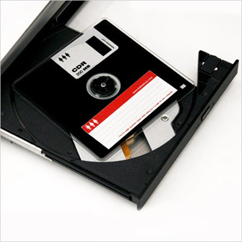

Title: Sagnfræði framtíðarinnar
Slug: sagnfraedi-framtidarinnar
Date: 2008-05-22 20:12:18
UID: 305
Lang: is
Author: Andri Steinn Snæbjörnsson
Author URL: 
Category: Sagnfræði
Tags: Sagnfræði, Fornleifafræði, heimildir, tækni, tölvur, internet, tölvufornleifar, veffornleifafræðingur

Ef til vill gera fæstir sér grein fyrir því út á hvað sagnfræði gengur í raun og veru. Í mínum augum gengur sagnfræðin út á það að nálgast og útskýra fortíðina í gegnum heimildir af ýmsu tagi. Til þess að gera það er yfirleitt nauðsynlegt að einfalda og draga saman þegar nóg er til af heimildum. Í þeim tilfellum þegar lítið er til af heimildum reyna menn að draga ályktanir út frá einstaka smáatriðum. Allt mál er einföldun á veruleikanum þegar allt kemur til alls. Þetta á jafnt við þegar verið er að reyna að útskýra hvað gerðist fyrir þúsund árum eða í gær.

Hvað framtíðin ber í skauti sér getur enginn sagt með vissu en hægt er að álykta um það út frá þeirri þróun sem hefur átt sér stað fram til dagsins í dag. Ef við reynum að álykta út frá því sem við vitum um sagnfræðirannsóknir í dag þá eru nokkrir hlutir sem við gætum mögulega gert ráð fyrir að muni gerast í sagnfræði framtíðarinnar.

Í dag er mikill munur á því hvernig sagnfræðingar nálgast samtímasögu og fornaldarsögu svo dæmi sé tekið. Munurinn felst auðvitað aðallega í framboði heimilda sem fer minnkandi eftir því sem menn líta lengra aftur. Það má því draga þá ályktun að framboð heimilda í framtíðinni verði sífellt meira og meira.

Annað sem hefur verið að breytast í gegnum tíðina er það form sem heimildirnar taka. Frá fornum tímum eigum við yfirleitt einungis þær heimildir sem eru það harðgerar að þær hafa staðist tímans tönn. Á miðöldum hófu menn að prenta og endurprenta heimildir sem þannig gátu lifað lengur. Myndlist varð raunverulegri og nákvæmari og við lok 19. aldar voru ljósmyndir orðnar nokkuð almennar. Á þeim tíma var bókaútgáfa orðin mjög almenn og sáralitlar líkur á því að mikilvægar heimildir glötuðust. Sú bylting sem mun þó breyta mestu fyrir sagnfræðinga framtíðarinnar er aftur á móti sú bylting sem varð um miðbik 20. aldar þegar menn tóku að geyma upplýsingar á stafrænu formi.

Önnur bylting sem er í óða önn að gerast liggur hálfpartinn á sviði fornleifafræðinnar sem er auðvitað auk annars ein af stoðgreinum sagnfræðinnar. Fornleifafræðingar eru sífellt að finna nýjar heimildir sem sagnfræðingar geta nýtt sér og sú tækni sem þeir nýta sér við uppgötvanir sínar verður æ fullkomnari. Þannig getum við gert ráð fyrir að í framtíðinni munum við ráða yfir fleiri stykkjum í því púsluspili sem fortíðin er. En byltingin á sviði tækninýjunga liggur líka í aðgangi sagnfræðinga að slíkum heimildum sem í framtíðinni munu að öllum líkindum undantekningarlaust verða aðgengilegar öllum áhugasömum á vefnum. Einnig munu greinar eftir aðra sagnfræðinga verða í auknum mæli aðgengilegar.

Sjálfur fékk ég einu sinni það verkefni að grafa upp heimildir úr gagnagrunni sem geymdur var á gömlum 3.5 tommu tölvudiskum. Gagnagrunnsforritið sem átti að lesa diskana var ekki lengur aðgengilegt og ekki fýsilegt að verða sér úti um tölvuna sem keyrði forritið upphaflega heldur. Á þessum diskum voru heimildir sem hvergi var hægt að finna annarsstaðar. Til þess að lesa heimildirnar varð ég að opna diskana með sérstöku forriti og sjálfur þurfti ég að skrifa forrit sem gat lesið gögnin sem sótt voru af diskunum. Þetta reyndist ekki auðvelt verk en heppnaðist þó að lokum. Tölvufornleifar af þessu tagi eru í dag að verða mikilvægari en flestir gera sér grein fyrir og í framtíðinni spái ég því að slíkar æfingar muni gerast algengari. Hægt er að ímynda sér vandamálin sem gætu skapast þegar þarf síðan að lesa gögn af gömlum og máðum geisladiskum sem og hörðum diskum úr tölvum nútímans.

Eitt af því sem sagnfræðingar fást við er að koma heimildum í sögulegt samhengi. Heimildir verða ekki til í tómarúmi. Þetta vandamál stigmagnast eftir því sem framboðið á heimildum verður meira ásamt því að hið sögulega samhengi verður víðtækara. Á öldum áður var heimsmynd fólks líkt og í dag byggð á þeim upplýsingum sem það hafði aðgang að um heiminn í kringum sig. Fréttir af mikilvægum atburðum bárust á milli landa mánuðum eða árum eftir að þeir gerðust. Þar af leiðandi var heimurinn sem fólk upplifði einfaldari en það sem við upplifum í dag. Í dag vitum við jafnvel hvað gerðist hinumegin á hnettinum fyrir hálftíma síðan. Þetta gerir sagnfræðingum framtíðarinnar auðvitað erfiðara fyrir að tengja heimildir við atburði. Einnig verður erfiðara að fá einhverja eina mynd af stöðu mála þar sem engin ein heimild mun eiga eins auðvelt með að dómínera umræðuna um einstaka atburði.

Ímyndum okkur sagnfræðing árið 2050 sem er að reyna að púsla saman sögu aldamótaáranna. Væntanlega mun hann hafa aðgang að frumheimildum sem og öðrum í gegnum veraldarvefinn eða arftaka hans. Hann mun geta leitað í heimildum með hjálp öflugra tölva sem væru nægilega þróaðar til þess að gefa til kynna í hvaða samhengi upplýsingarnar eru. Sér til hjálpar hefði hann fólk sem sérhæfir sig í að lesa gögn af gömlum diskum og tölvum. Ef til vill mun hann einnig njóta aðstoðar fólks sem sérhæfir sig í að leita í gömlum heima- og bloggsíðum, eins konar _veffornleifafræðingar_.

Allt bendir til þess tölvubyltingin muni á endanum gerbylta sagnfræðinni sem og öðrum fræðigreinum.

 

